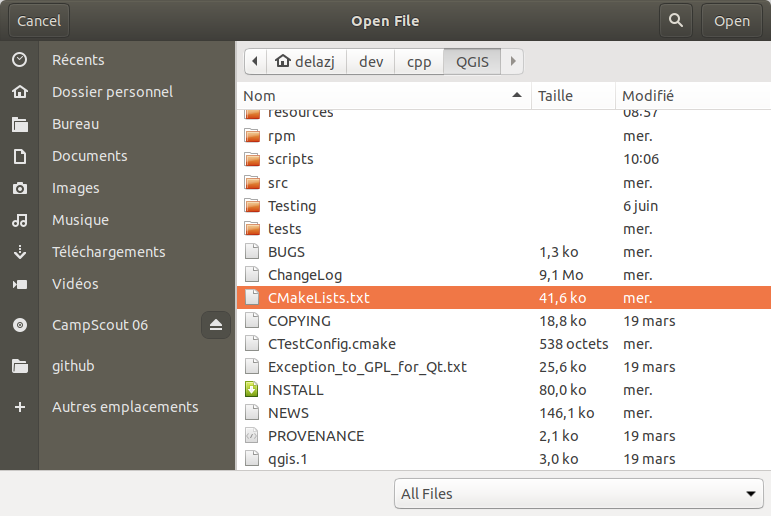
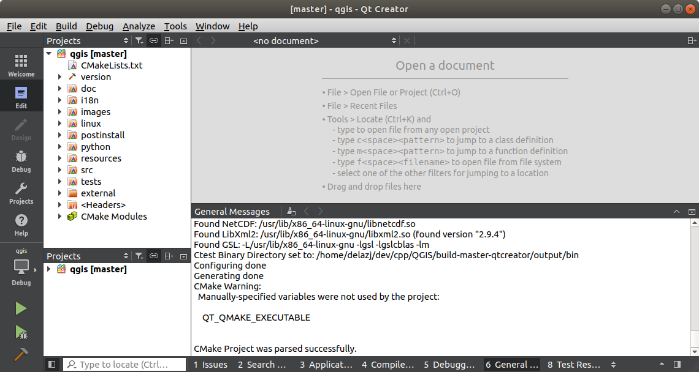
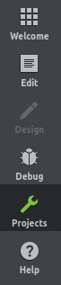
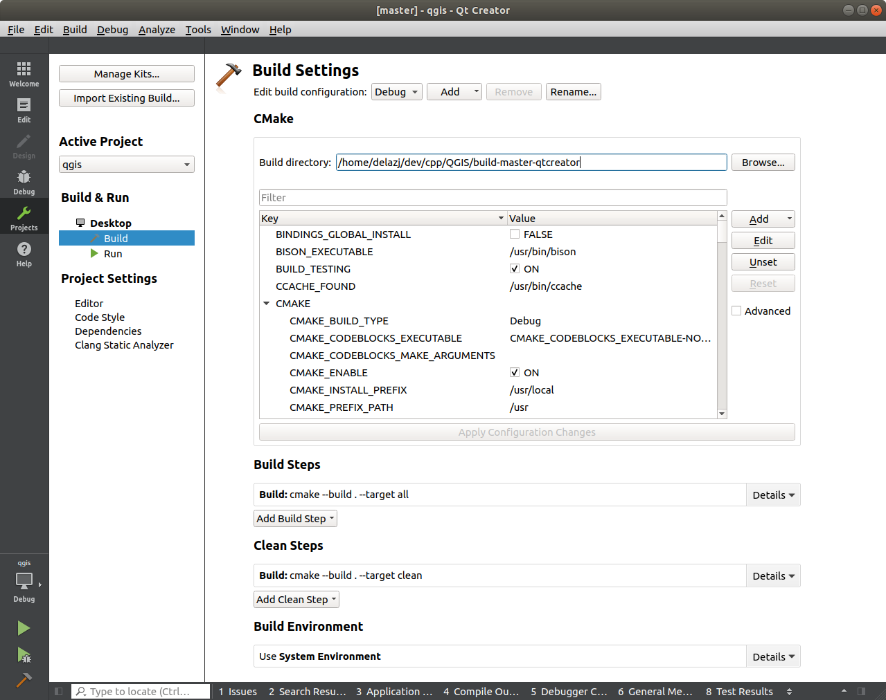

************************************************
 Getting up and running with QtCreator and QGIS
************************************************

.. contents::
   :local:

QtCreator is an IDE from the makers of the `Qt library <https://www.qt.io>`_.
With QtCreator you can build any C++ project, but it's really optimised for
people working on Qt based applications (including mobile apps).

Installing QtCreator
=====================

Qt Creator is available on all major platforms and can be downloaded from
https://www.qt.io/download (Go the open source route).
The installation procedure depends on your platform.

If you are running a Unix-like platform, you can use the command line,
eg on Debian:

.. code-block:: bash

  sudo apt install qtcreator qtcreator-doc

After installing you should find it in your menu.

Setting up your project
========================

We assume you have already got a local QGIS clone containing the
source code, and have installed all needed build dependencies etc. There are
detailed instructions for :ref:`git access <git_access>` and
:source:`dependency requirements <INSTALL.md>`.

On our system we have checked out the code into ``$HOME/dev/cpp/QGIS`` and the
rest of the article is written assuming that. You should update these paths as
appropriate for your local system.

After launching QtCreator do :menuselection:`File --> Open File or Project`

Then use the resulting file selection dialog to browse to and open this file:

.. code-block:: bash

  $HOME/dev/cpp/QGIS/CMakeLists.txt

QtCreator will parse the project and you will be prompted for a build location
and options in the :guilabel:`Configure Project` dialog.

Since we want QGIS to have debugging capabilities we will only enable the
debug entry and fill it with our build location:

#. Check |checkbox| :guilabel:`Select all kits` enabling the :guilabel:`Desktop`
   entry
#. Uncheck all but the |checkbox| :guilabel:`Debug` sub item
#. Fill the path with the build directory. For our purpose, we create a
   specific build dir for QtCreator:

   .. code-block:: bash

    $HOME/dev/cpp/QGIS/build-master-qtcreator

   It's probably a good idea to create separate build directories for different
   branches if you can afford the disk space.

   .. image:: img/configureProject.png
      :width: 100%

That's the basics of it. Press the :guilabel:`Configure Project` button and
QtCreator will start scanning the source tree for autocompletion support and
do some other housekeeping stuff in the background.

We want to tweak a few things before we start to build.

Setting up your build environment
==================================

Click on the :guilabel:`Projects` icon on the left of the QtCreator window.

Select the :guilabel:`Build` settings tab (normally active by default).

The dialog shows the ``Debug`` build configuration and allows you to
edit settings under the :guilabel:`CMake` section. While the default
configuration should be enough for a first pass, depending on your needs,
you may want to enable more features such as:

* **WITH_3D = ON** for 3D rendering
* **WITH_CUSTOM_WIDGETS = ON** to add QGIS custom widgets for interface design

Press :guilabel:`Apply Configuration Changes`.

You are now ready to build. Press the |build| :sup:`Build` button at the left
bottom of the dialog (or :kbd:`Ctrl+B`) to launch the project build! Qt Creator
will begin compiling and this may take some time the first time, depending on your
device.

At the end of the compilation, you can run QGIS by pressing the |runInstall|
:sup:`Run` button.

The compilation of QGIS also generates binaries in the build directory.
Hence you can execute QGIS from the command line using:

.. code-block:: bash

 cd $HOME/dev/cpp/QGIS/build-master-qtcreator
 ./output/bin/qgis

Sometimes you may want to install QGIS as an executable, outside the build
directory.

#. Set the ``CMAKE_INSTALL_PREFIX`` to somewhere you have write access to
   (we use :file:`${HOME}/apps`). This would avoid overwriting an existing QGIS
   installs (by your package manager for example).

   .. image:: img/customInstallPrefix.png

#. Press :guilabel:`Apply Configuration Changes` to update the settings
#. Press the |build| button
#. When the build is complete, you'll find the :file:`qgis` executable in
   the :file:`${HOME}/apps/bin` folder.

.. 
    All this section is commented since it conveys information I could not confirm
    or I'm not sure it's necessary since I get good results without.
    Review for devs are more than welcome to sort this out.

    We now want to add a custom process step. Why? Because QGIS can currently only
    run from an install directory, not its build directory, so we need to ensure
    that it is installed whenever we build it. Under 'Build Steps', click on the
    'Add BuildStep' combo button and choose 'Custom Process Step'.

    Now we set the following details::

    Enable custom process step: [yes]

    Command: make

    Working directory: $HOME/dev/cpp/QGIS/build-master-qtcreator

    Command arguments: install

    .. image:: img/buildSteps.jpeg

    You are almost ready to build. Just one note: QtCreator will need write
    permissions on the install prefix. By default (which I am using here) QGIS is
    going to get installed to ``/usr/local/``. For my purposes on my development
    machine, I just gave myself write permissions to the /usr/local directory.

    To start the build, click that big hammer icon on the bottom left of the
    window.

    .. image:: img/hammer.jpeg

    Setting your run environment
    =============================

    As mentioned above, we cannot run QGIS from directly in the build directly, so
    we need to create a custom run target to tell QtCreator to run QGIS from the
    install dir (in my case ``/usr/local/``). To do that, return to the projects
    configuration screen.

    Now select the 'Run Settings' tab

    .. image:: img/runSettingsTab.jpeg

    We need to update the default run settings from using the 'qgis' run
    configuration to using a custom one.

    .. image:: img/runSettings.jpeg

    To do that, click the :menuselection:`Add` combo button next to the Run configuration
    combo and choose :guilabel:`Custom Executable` from the top of the list.

    Now in the properties area set the following details:

    Executable: /usr/local/bin/qgis

    Arguments :

    Working directory: $HOME

    Run in terminal: [no]

    Debugger: C++ [yes]

    Qml [no]

    Then click the 'Rename' button and give your custom executable a meaningful
    name e.g. 'Installed QGIS'

    .. image:: img/runConfig.jpeg

Running and debugging
======================

Now you are ready to run and debug QGIS. To set a break point, simply open a
source file and click in the left column.

.. image:: img/breakPoint.jpeg

Now launch QGIS under the debugger by clicking the |runDebug| :sup:`Start
Debugging` in the bottom left of the window. 

.. |build| image:: img/build.png

.. |runInstall| image:: img/runInstall.png

.. Substitutions definitions - AVOID EDITING PAST THIS LINE
   This will be automatically updated by the find_set_subst.py script.
   If you need to create a new substitution manually,
   please add it also to the substitutions.txt file in the
   source folder.

.. |checkbox| image:: /static/common/checkbox.png
   :width: 1.3em
