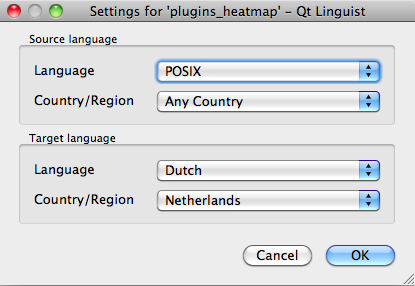
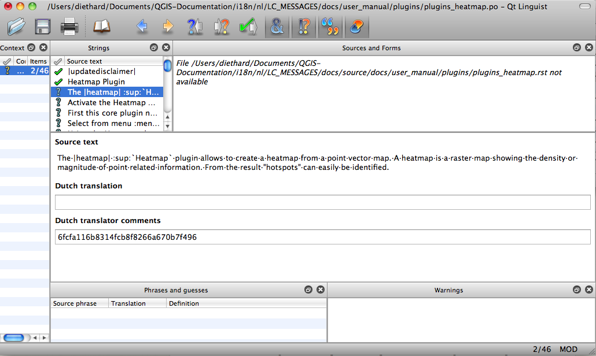

.. _translation_guidelines:

**********************
Translation Guidelines
**********************

.. contents::
   :local:

This manual is aiming to help the translator.
First, it explains how you can join the translation team.
Then the general process of how technically a translation is done is explained.
Later the translation is explained from an actual English :file:`.rst` document that is translated to Dutch.
Finally a summary of :ref:`rules of translation <translation_summary>` is given.

.. note:: Although these guidelines focus on QGIS documentation, the methods and
 the rules described below are also applicable to QGIS applications.

.. _becoming-translator:

Becoming a translator
=====================

The QGIS project is always looking for people who are willing to invest some
more time translating QGIS into a foreign language - even perhaps to
coordinate the translation effort.

We are trying to improve our project management process and spread the load
more evenly between people who each have a specific area of responsibility,
so any contribution you have to make will be greatly appreciated.

If you would like to nominate yourself as a coordinator for a new language
please go ahead.
If more than one person nominate themselves as coordinator for the same
language, please contact each other and resolve how you will manage your
efforts.

Transifex
---------

The web-based translating platform `Transifex <https://app.transifex.com>`_ is used for all QGIS
translations: the desktop application itself (or GUI) and the documentation.
So the first thing you need is an account to login and get started.

Join a Project
--------------

#. Go to https://explore.transifex.com/qgis/
#. You can explore available projects we translate, identify their target languages
   with various statistics:

   * **QGIS Desktop** for all the pieces of text available in QGIS apps
     (QGIS Desktop and QGIS Server),
   * **QGIS Documentation** for the `official LTR documentation <https://docs.qgis.org/latest/>`_
#. Click on the project you would like to help translate
#. Click on :guilabel:`JOIN THIS PROJECT` on the right side.
   You will be prompted to sign up.
#. Create your account or connect using a third-party platform account.
   Verify your account by the link in the email you will receive.
#. Login
#. You then get a popup to select which language you want to help translate to.
   Please, note that we try to make the process as simple as possible and only target languages,
   regardless of the country parameter (e.g. ``French (fr)`` and **NOT** ``French (France) (fr_FR)``).
   Only if there are notable differences in the languages (e.g. portuguese in Portugal vs Brazil)
   we may allow different versions.

   Search your target language, i.e the language you wish to help translate QGIS into,
   NOT necessarily all the languages you can speak:

   * If it is marked as ``already added`` then select it and press :guilabel:`Join Project`.
   * If it is not marked as already added, select it and press :guilabel:`Request language`.
     Keep in mind that translating an entire project will take days of work, if not weeks!
     Again, and sorry to repeat, it is not about selecting ALL the languages you can speak.

#. Now you will need to wait for the language coordinator or the project maintainers
   to process your request. You will be notified by email when your request has been
   accepted. If your request has no answer for about a week, please consider writing
   to your language coordinator in Transifex or the `QGIS Translators mailing list
   <https://lists.osgeo.org/mailman/listinfo/qgis-tr>`_.
#. You can also join any of the other QGIS projects and help everywhere too.


Translate
----------

Once your request is accepted, you are able to translate any text in the project(s) you've chosen.
Simply click on your language, select the chapter you want to
translate and click on Translate. Easy, right?

In order to help you make good translation, some instructions are provided below.
We strongly recommend you to read them.

.. tip:: **Quick access to translatable files in Transifex**

  If you find a wrong or missing translation in the current documentation,
  you can use the ``Translate page`` link in the bottom left drop-down menu of the page
  to reach it sources in Transifex and perform any update you wish to.


.. _translation_process:

Translation process
===================

QGIS Documentation is written in English with :file:`.rst` files.
In order to provide translations:

#. A prebuild script creates translation files named :file:`.po` files for the
   English language in the folder :file:`/QGIS-Documentation/locale/en`.
#. The sentences in the :file:`.po` files are pushed to the Transifex web platform,
   and made available for translators who can begin to translate from English to their
   language with the editor.
#. When a file is translated at 100%, the translated strings are automatically
   pulled back to the documentation repository, under :file:`/QGIS-Documentation/locale/<language>`.
#. At the next build of the documentation (which occurs at least once a day -- see time at the bottom of the page),
   a script reuses the sentences to create translated output.
#. For files not fully translated, a script pulls every two weeks translated strings
   from Transifex to Github and these are as well published at the next build.
#. Whenever an :file:`.rst` file is updated, the English :file:`.po` file is
   updated and the changes are pushed to the corresponding file in Transifex.
   This means that when a new paragraph is added to an :file:`.rst` document that was already translated,
   only the new/updated sentences are added to the translated :file:`.po` file
   and needs to be translated.

.. note:: Translating QGIS Desktop specificities

 The main difference with translating QGIS applications is that instead of :file:`.po` files,
 all the translatable strings in the :file:`.py`, :file:`.cpp`, :file:`.yaml` files
 that shape a particular version of the application are pushed to and pulled from Transifex
 as a single :file:`.ts` file (e.g. ``qgis-application/qgis_en.ts (branch release-3_30)`` ).
 Translations are pulled to Github in development branch (daily),
 and at release time (for every released versions).
 
Two different tools are currently used to do translations in QGIS:

* The `Transifex web platform <https://www.transifex.com/>`_, the **easiest and
  recommended way** to translate QGIS,
  transparently does the process described above and pulls all the translatable
  texts in one place for the translator. Just pick the files you want and translate.
  Translated files are stored in the platform until another release is pushed.
* `Qt Linguist <https://doc.qt.io/qt-5/qtlinguist-index.html>`_, a Qt
  development tool, requires the translator to pull locally
  the :file:`.po` (or :file:`.ts`) files from the source code, translate and
  then push back.

Note that whatever tool you choose, rules of translations are the same.

.. _translate_file:

Translate a file
================

To explain how translation works, we will use the heatmap plugin as an example.
In this example we will translate it from English to Dutch, but it will
be practically the same for other documents in all languages.

The source of the document can be found here:

::

  QGIS-Documentation/source/docs/user_manual/plugins/plugins_heatmap.rst

So why did I choose this document?

#. It includes images, captions, headers, references and replacements.
#. I wrote it so it is easier for me to translate ;-)

The build process has created the English :file:`.po` file which can be found here::

 QGIS-Documentation/locale/en/LC_MESSAGES/docs/user_manual/plugins/plugins_heatmap.po

The equivalent Dutch :file:`.po` file (basically a copy) can be found here::

 QGIS-Documentation/locale/nl/LC_MESSAGES/docs/user_manual/plugins/plugins_heatmap.po

Along this file you will see a tiny :file:`.mo` file which indicates that it
does not hold any translations yet.


.. _translation_transifex:

Translation in Transifex
------------------------

In order to translate using Transifex, you need to:

#. `create an account on Transifex and join the QGIS project
   <https://qgis.org/en/site/getinvolved/translate.html#join-a-project>`_.
#. Once you are part of a language team, click on the corresponding project
   (in this case ``QGIS Documentation``). A list of available languages with
   their ratio of translation is displayed.

   .. _figure_transifex_languages:

   .. figure:: img/transifex_choose_language.png
      :align: center

      Select language for translation in the Transifex menu
   
#. Hover over your language and click either:

   * :guilabel:`View resources`: translatable :file:`.po` files with their ratio
     of translation, number of strings and some more metadata are now displayed.
   * or :guilabel:`Translate`: opens the interface of translation with all the
     available :file:`.po` files
#. Identify the file you'd like to translate (in our case we are looking for the
   ``docs_user-manual_plugins_plugins-heatmap``, the heatmap plugin file)
   or any unfinished file and click on it: strings in the files are loaded
   and you can use the interface to filter, translate, suggest translation... 

   .. tip:: Clicking the ``Translate page`` link in the bottom left drop-down menu
     of a page brings you directly to its corresponding translation page in Transifex.
 
#. All you need to do is select each text and translate following the
   :ref:`guidelines <translate_manual>`.

For further information on the use of Transifex Web Editor, see
https://help.transifex.com/en/articles/6318216-translating-with-the-web-editor.


.. _translation_linguist:

Translation in Qt Linguist
---------------------------

With Qt Linguist, you need to:

#. manually grab the :file:`.po` or :file:`.ts`  file(s). This can be achieved
   by downloading the file(s) either from Transifex platform or from the
   :file:`locale/$language` folder of the source repository (in GitHub),
#. proceed to the translation locally
#. upload the modified files to their sources (Transifex or GitHub).

While downloading and uploading translatable files can be done with Transifex,
it's not advised to use this process. Since there's no
versioning system on Transifex, the file you upload will simply replace the
existing one and potentially overwrite any modification made by others on the
platform in the meantime.

When you open the file in Qt Linguist for the first time you will see the
following dialog:

.. _figure_translation_language:



   Select language for translation in linguist menu


The Target language should be filled correctly. The Source language can be left
as is with language POSIX and Country/Region on Any Country.

When you press the :guilabel:`OK` button Qt Linguist is filled with sentences and
you can start translating, see :numref:`Figure_translation_menu`.


.. _figure_translation_menu:



   Translate using the linguist menu

In the menu you see the following buttons which are convenient to use.

* |linguist_done_next| The Translation Done Next button, is the most important
  button. If the item needs translation, you enter a translation in the text
  field, then hit this button. If the item does not need translation just leave the
  text field for translation empty and also hit this button which indicates the
  item is done and you continue with the next item.
* |linguist_previous| The Goto Previous button, can be used to go to the
  previous translation item.
* |linguist_next| The Goto Next button, can be used to go to the next
  translation item.
* |linguist_next_todo| The Next Todo button, jumps to the first translation
  item that still needs a translation. Handy when the original document has
  changed and only several new/changed sentences need to be translated.
* |linguist_previous_todo| The Previous Todo button, searches backward and
  jumps to the first translation item it finds that still needs a translation.

For further information on the use of Qt Linguist, see
https://doc.qt.io/qt-5/linguist-translators.html

.. warning::

   If you want to download content to translate from the source
   repository, never do this in the ``master`` branch. For translations
   there are always translation branches available, once a document is fully
   updated in English for a certain version. As an example, to translate
   the manual of QGIS 2.8, you have to use the manual_en_v2.8 branch.


.. _translate_manual:

Translate a manual
------------------

Now we start to translate the plugin_heatmap manual!

Translating most of the sentences should be straightforward.
During this translation session I will point out which parts (rst statements)
need special translation.

Below we see an interesting sentence to translate:

.. code-block:: rst

   The |heatmap| :sup:`Heatmap` plugin allows to create a heatmap from a
   point vector map. A heatmap is a raster map showing the density or
   magnitude of point related information. From the result "hotspots" can
   easily be identified.


This sentence contains two rst statements:

#. ``|heatmap|`` words between ``|`` are replacements and these should never
   be translated! This will be replaced by the heatmap plugin icon!
#. ``:sup:`Heatmap```,  the ``:sup:`` statement is a superposition statement
   and prints the following text a bit higher. This is used to show the popup
   texts that appear when you hover above the toolbar item and this may be
   different when it is actually translated in the QGIS application. In the
   Dutch case it is not!

All other plain text in this sentence can be translated!

The next translation item contains the ``:ref:`` statement that is
commonly used to refer to another section somewhere in the manual! The text
following a ``:ref:`` statement should never be changed because it is a unique
identifier!

.. code-block:: rst

   First this core plugin needs to be activated using the Plugin Manager
   (see Section :ref:`load_core_plugin`). After activation the heatmap icon
   |heatmap| can be found in the Raster Toolbar.

In this case ``load_core_plugin`` is a unique reference identifier placed before
an rst item that has a caption. The ref statement will be replaced with the text
of the header and turned into a hyperlink. When the header this reference is
referring to is translated, all references to this header will be automatically
translated as well.

The next item contains the rst-tag ``:menuselection:`` followed by text
actually displayed in a menu in QGIS application, this may be translated in the
application and therefore should be changed when this is the case.

.. code-block:: rst

   Select from menu :menuselection:`View --> Toolbars --> Raster` to activate
   the Raster Toolbar when it is not yet activated.

In above item "View -->" is actually translated to "Beeld -->" because this is
the translation used in the Dutch localized QGIS application.

A bit further we meet the following tricky translation item:

.. code-block:: rst

   The |heatmap| :sup:`Heatmap` tool button starts the Dialog of the Heatmap
   plugin (see :numref:`figure_heatmap_settings`).

It holds a reference to a figure ``figure_heatmap_settings_``, and like a reference
to a section this reference should not be changed!! The reference definition
from the rst-document is not included in the :file:`.po` file and can therefore
not be changed. This means the reference to figures can not be translated. When
HTML is created you will see ``figure_heatmap_settings``. When a PDF document is
created ``figure_heatmap_settings_`` is replaced with a figure number.

The next translation item with rst attributes is the following item:

.. code-block:: rst

    **Input Point dialog**: Provides a selection of loaded point vector maps.

Do not remove the stars in above line. It will print the text it holds in bold.
The text itself is often text included in the dialog itself and may well be
translated in the application.

The following translation item contains the ``:guilabel:`` rst tag.

.. code-block:: rst

    When the |checkbox| :guilabel:`Advanced` checkbox is checked it will
    give access to additional advanced options.

The text ``Advanced`` of the guilabel tag may well be translated in the QGIS
application and probably needs to be changed!

The following translation item contains \``airports\``. The quotes are
used to give the text another text font. In this case it is a literal value and
does not need translation.

.. code-block:: rst

    For the following example, we will use the ``airports`` vector point
    layer from the QGIS sample dataset (see :ref:`label_sampledata`).
    Another excellent QGIS tutorial on making heatmaps can be found on
    `https://www.qgistutorials.com
    <https://www.qgistutorials.com/en/docs/creating_heatmaps.html>`_.


This item also includes a hyperlink with an url and an external presentation.
The url should of course be left intact, you are allowed to change the external
text ``https://www.qgistutorials.com`` which is visible by the reader. Never
remove the underscore at the end of the hyperlink which forms an essential
part of it!!


.. _translation_summary:

Summary Rules for translation
-----------------------------

#. Do not change text between two ``|`` characters like ``|bronze|``, ``|checkbox|``, 
   ``|labels|``, ``|selectString|``, ``|addLayer|`` ... These are special tags
   used to replace images
#. Do not change references that start with roles like ``:ref:``, ``:file:``,
   ``:numref:`` unless they include a title. In that case, you can translate the title
   but keep unchanged the link (i.e., the text between ``<`` and ``>``)

   .. tip:: When a title is provided for a reference, Transifex may display a number
    in the English source text in replacement of the link part. Click on the number
    in the source text to add the reference link next to the title being translated.

#. Do not change references that end with an underscore like ``figure_labels_1_``
#. Do not change the url in hyperlinks, but you may change the external
   description. Leave the underscore at the end of the hyperlink,
   without additional spacing (``>`_``)
#. Change the text inside quotes following ``:index:``,
   ``:sup:``, ``:guilabel:`` and ``:menuselection:`` tags.
   Check if/how it is translated in the QGIS Application. Do not change the tag itself.
#. Text between double stars and double quotes often indicate values or
   fieldnames, sometimes they need translation sometimes not.
#. Be aware to use exactly the same (number of) special characters of the source
   text such as `````, ``````, ``*``, ``**``, ``::``. These contribute to the
   cosmetics of the information provided
#. Do not begin nor end the text hold by special characters or tags with a space
#. Do not end the translated strings with a new paragraph, otherwise the
   text will not be translated during the html generation.

Stick to above presented rules and the translated document will look fine!

For any question, please contact the `QGIS Community Team
<qgis-community-team@lists.osgeo.org>`_ or the
`QGIS Translation Team <qgis-tr@lists.osgeo.org>`_.


.. Substitutions definitions - AVOID EDITING PAST THIS LINE
   This will be automatically updated by the find_set_subst.py script.
   If you need to create a new substitution manually,
   please add it also to the substitutions.txt file in the
   source folder.

.. |addLayer| image:: /static/common/mActionAddLayer.png
   :width: 1.5em
.. |checkbox| image:: /static/common/checkbox.png
   :width: 1.3em
.. |heatmap| image:: /static/common/heatmap.png
   :width: 1.5em

.. |linguist_next| image:: img/linguist_next.png
   :width: 2em
.. |linguist_next_todo| image:: img/linguist_next_todo.png
   :width: 2em
.. |linguist_previous| image:: img/linguist_previous.png
   :width: 2em

.. |selectString| image:: /static/common/selectstring.png
   :width: 2.5em
