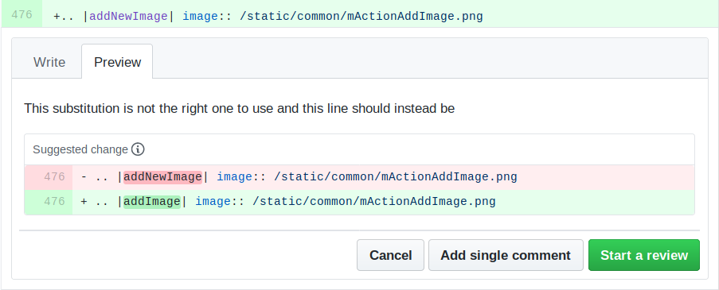

.. _step_by_step:

*****************************
 A Step By Step Contribution
*****************************

.. contents::
   :local:

.. note:: Though QGIS-Documentation is used to demonstrate the process, all
   commands and steps shown below also apply to QGIS-Website.

If you are reading these lines, it is certainly because you are willing
to contribute to writing QGIS documentation and are looking for a how-to.
You have come to the right place! The current document will guide you through
the different ways to achieve this objective, showing you the main steps to
follow, the tricks you can use and the traps you should be aware of.

For any help, do not hesitate to either ask in a comment on the issue report you
are trying to fix or write to the `QGIS-community-team list
<https://lists.osgeo.org/mailman/listinfo/qgis-community-team>`_. More details at
`Get involved in documentation <https://qgis.org/en/site/getinvolved/document.html>`_.

Let's now dive into the process.

Documentation sources are stored using the git version control system and are
available on GitHub at https://github.com/qgis/QGIS-Documentation.
A list of issues to fix and features to explain can be found at
https://github.com/qgis/QGIS-Documentation/issues.

.. tip:: If you are a first-time contributor and do not know where to start from,
  you may be interested in tackling our `welcoming reports
  <https://github.com/qgis/QGIS-Documentation/issues?q=is%3Aissue+is%3Aopen+label%3AEasy>`_.

There are two main ways, not mutually exclusive, to modify the files:

#. :ref:`Using the GitHub web interface <github_interface>`
#. :ref:`Using Git command line tools <git_command_line_tools>`.

.. _github_interface:

Using the GitHub web interface
==============================

The GitHub web interface allows you to do the following:

* edit files
* preview and commit your changes
* make a pull request to have your changes inserted into the main repository
* create, update, or delete branches

If you are not yet familiar with git and GitHub vocabulary, you may want to
read the GitHub `Hello-world <https://guides.github.com/activities/hello-world/>`_
project to learn some basic vocabulary and actions that will be used below.

.. note:: **If you are fixing a reported issue**

    If you are making changes to fix an `issue <https://github.com/qgis/QGIS-
    Documentation/issues>`_, add a comment to the issue report to assign it to
    yourself. This will prevent more than one person from working on the same
    issue.

Fork QGIS-Documentation
--------------------------

Assuming you already have a `GitHub account <https://github.com/join>`_,
you first need to fork the source files of the documentation.

Navigate to the `QGIS-Documentation repository
<https://github.com/qgis/QGIS-Documentation>`_ page and click on the
|githubFork| button in the upper right corner.

In your GitHub account you will find a QGIS-Documentation repository
(``https://github.com/<YourName>/QGIS-Documentation``).
This repository is a copy of the official QGIS-Documentation repository where
you have full write access and you can make changes without affecting the
official documentation.

Make changes
---------------

There are different ways to contribute to QGIS documentation. We show
them separately below, but you can switch from one process to the other
without any harm.

.. _edit_on_github:

Alternative 1: Use the ``Edit on GitHub`` shortcut
..................................................

Pages on the QGIS documentation website can be edited quickly and easily by clicking on the
``Edit on GitHub`` link at the top right of each page.

#. This will open the file in the ``qgis:master`` branch with a message at the
   top of the page telling you that you don't have write access to this repo
   and your changes will be applied to a new branch of your repository.

#. Do your changes. Since the documentation is written using the reStructureText
   syntax, depending on your changes, you may need to rely on the :ref:`writing
   guidelines <QGIS-documentation-guidelines>`.

#. When you finish, make a short comment about your changes and click on
   :guilabel:`Propose changes`. This will generate a
   new `branch <https://help.github.com/articles/about-branches/>`_ (``patch-xxx``) in your repository.

#. After you click on :guilabel:`Propose changes`, github will navigate to
   the :guilabel:`Comparing changes` page.

   * If you're done making changes, skip to :ref:`Compare changes <compare_changes>`
     in the :ref:`Share your changes via Pull Request <sharing_changes>` section below.
   * If there are additional changes that you want to make before submitting
     them to QGIS, follow these steps:

     #. Navigate to your fork of QGIS-Documentation (``https://github.com/<YourName>/QGIS-Documentation``)
     #. Click on |githubBranch| and search for the ``patch-xxx`` branch. Select
        this patch branch. The |githubBranch| button will now say
        :guilabel:`Branch: patch-xxx`
     #. Jump down to :ref:`Modify files <modify_files>` below.

.. note:: The ``Edit on GitHub`` shortcut is also available in the drop-down
  menu at the bottom of the left sidebar.

Alternative 2: Create an ad hoc branch in your documentation repository
.......................................................................

You can edit files directly from your fork of the QGIS Documentation.

First, make sure that your ``master`` branch is up to date with ``qgis:master`` branch.
To do so:

#. Go to the main page of your repository, i.e. ``https://github.com/<YourName>/QGIS-Documentation``.
   The ``master`` branch should be active with a mention whether it is up to date
   with ``qgis/QGIS-Documentation:master`` or not.

   If it has commits ahead the upstream branch, you better use the previous
   :ref:`shortcut button alternative <edit_on_github>` until you align your ``master`` branch.

   If it only has commits behind:

   #. Expand the :guilabel:`Fetch Upstream` drop-down menu on the right. You can

      * :guilabel:`Compare` the branches and see new changes in the main repository
      * :guilabel:`Fetch and merge`: takes changes from the upstream branch to yours.
   #. Let's click :guilabel:`Fetch and merge`: after the process, your branch is
      mentioned as up to date with ``qgis/QGIS-Documentation:master``.

#. Click on |githubBranch| in the upper left corner of your forked
   QGIS-Documentation repository and enter a unique name in the text field to create a
   new `branch <https://help.github.com/articles/about-branches/>`_ .
   The name of the new branch should relate to the problem you intend to fix. The
   |githubBranch| button should now say :guilabel:`Branch: branch_name`
#. You are ready to start new changes on top of it.

.. attention:: **Do your changes in an ad hoc branch, never in the** ``master`` **branch**

   By convention, avoid making changes in your ``master`` branch except when
   you merge the modifications from the ``master`` branch of ``qgis/QGIS-Documentation``
   into your copy of the QGIS-Documentation repository.
   Separate branches allow you to work on multiple problems at the same time
   without interfering with other branches. If you make a mistake you can
   always delete a branch and start over by creating a new one from the master
   branch.

.. _modify_files:

Modify files
---------------

#. Browse the source files of your fork of QGIS-Documentation to the file that
   needs to be modified
#. Make your modifications following the :ref:`writing guidelines
   <QGIS-documentation-guidelines>`
#. When you finish, navigate to the **Commit Changes** frame at the bottom of
   the page, make a short comment about your changes, and click on
   :guilabel:`Commit Changes` to commit the changes directly to your branch.
   Make sure :guilabel:`Commit directly to the branch_name branch.` is selected.
#. Repeat the previous steps for any other file that needs to be updated to
   fix the issue

.. _sharing_changes:

Share your changes via Pull Request
--------------------------------------

You need to make a pull request to integrate your changes into the official documentation.

.. note:: **If you used an** ``Edit on GitHub`` **link**

  After you commit your changes GitHub will automatically open a new page
  comparing the changes you made in your ``patch-xxx`` branch to the ``qgis/QGIS-Documentation``
  master branch.

  Skip to :ref:`Step 2 <compare_changes>` below.

Start a new pull request
...........................

Navigate to the main page of the `QGIS-Documentation <https://github.com/qgis/QGIS-Documentation>`_
repository and click on :guilabel:`New pull request`.

.. _compare_changes:

Compare changes
..................

If you see two dialog boxes, one that says ``base:master`` and the other
``compare:branch_name`` (see figure), this will only merge your changes from
one of your branches to your master branch. To fix this click on the
:guilabel:`compare across forks` link.

.. figure:: img/githubCompareAcrossForks.png
    :align: Center

    If your :guilabel:`Comparing changes` page looks like this, click on the
    :guilabel:`compare across forks` link.

You should see four drop-down menus. These will allow you to compare the
changes that you have made in your branch with the master branch that you want
to merge into. They are:

* **base fork**: the fork that you want to merge your changes into
* **base**: the branch of the base fork that you want to merge your changes into
* **head fork**: the fork that has changes that you want to incorporate into the base fork
* **compare**: the branch with those changes

Select ``qgis/QGIS-Documentation`` as the base fork with ``master`` as base,
set the head fork to your repository ``<YourName>/QGIS-Documentation``,
and set compare to your modified branch.

.. figure:: img/githubCreatePullRequestComparison.png
    :align: Center

    Comparing changes between ``qgis/QGIS-Documentation`` and your repository

A green check with the words **Able to merge** shows that your changes can
be merged into the official documentation without conflicts.

Click the :guilabel:`Create pull request` button.

.. warning:: **If you see** |githubCantMerge|

    This means that there are `conflicts <https://help.github.com/articles/addressing-merge-conflicts/>`_.
    The files that you are modifying are not up to date with the branch you are
    targeting because someone else has made a commit that conflicts with your
    changes. You can still create the pull request but you'll need to fix any
    :ref:`conflicts <fix_conflicts>` to complete the merge.

.. tip:: Though being translated, the `latest version <https://docs.qgis.org/latest>`_
      of QGIS documentation is still maintained and existing issues are fixed. If you are
      fixing issues for a different release, change **base** from ``master``
      to the appropriate ``release_...`` branch in the steps above.

Describe your pull request
.............................

A text box will open: fill in any relevant comments for the issue you are
addressing.

If this relates to a particular `issue <https://github.com/qgis/QGIS-Documentation/issues>`_,
add the issue number to your comments. This is done by entering # and the issue
number (*e.g.* ``#1234``). If preceded by terms like ``fix`` or ``close``, the
concerned issue will be closed as soon as the pull request is merged.

Add links to any documentation pages that you are changing.

Click on :guilabel:`Create pull request`.

Review and comment pull request
..................................

As seen above, anyone can submit modifications to the documentation through pull
requests. Likewise anyone can review pull requests with questions and `comments
<https://help.github.com/articles/commenting-on-a-pull-request/>`_. Perhaps the
writing style doesn't match the project guidelines, the change is missing some major
details or screenshots, or maybe everything looks great and is in order.
Reviewing helps to improve the quality of the contribution, both in form and
substance.

To review a pull request:

#. Navigate to the `pull requests page <https://github.com/qgis/QGIS-Documentation/pulls>`_
   and click on the pull request that you want to comment on.
#. At the bottom of the page you will find a text box where you can leave general
   comments about the pull request.
#. To add comments about specific lines,

   #. Click on |githubFilesChanged| and find the file you want to comment on.
      You may have to click on :guilabel:`Display the source diff` to see the
      changes.
   #. Scroll to the line you want to comment on and click on the |githubBluePlus|.
      That will open a text box allowing you to leave a comment.

Specific line comments can be published either:

* as single comments, using the :guilabel:`Add single comment` button. They are
  published as you go. Use this only if you have few comments to add or when
  replying to another comment.
* or as part of a review, pressing the :guilabel:`Start a review` button.
  Your comments are not automatically sent after validation, allowing you to
  edit or cancel them afterwards, to add a summary of the main points of the
  review or global instructions regarding the pull request and whether you
  approve it or not. This is the convenient way since it's more flexible and
  allows you to structure your review, edit the comments, publish when you are
  ready and send a single notification to the repository followers and not one
  notification for each comment. Get `more details
  <https://help.github.com/en/articles/reviewing-proposed-changes-in-a-pull-request>`_.

    Commenting a line with a change suggestion

Line comments can embed suggestions that the pull request
writer can apply to the pull request. To add a suggestion,
click the |githubSuggestions| :sup:`Insert a suggestion` button on top of the
comment text box and modify the text within the suggestion block.

.. tip:: **Prefer committing suggestions to your pull request as a batch**

 As a pull request author, when directly incorporating reviewers' feedback
 in your pull request, avoid using the :guilabel:`Commit suggestion` button
 at the bottom of the comment when you have many suggestions to address and
 prefer adding them as a batch commit, that is:

 #. Switch to the |githubFilesChanged| tab
 #. Press :guilabel:`Add suggestion to batch` for each rewording you'd like to
    include. You will see a counter increasing as you go.
 #. Press any of the :guilabel:`Commit suggestions` button when you are ready to
    apply the suggestions to your pull request, and enter a message describing
    the changes.

 This will add all the modifications to your branch as a single commit, resulting in a
 more legible history of changes and less notifications for the repository
 followers. Incidentally, proceeding as this will also save you many clicks.

Make corrections
...................

A new pull request will automatically be added to the `Pull requests list
<https://github.com/qgis/QGIS-Documentation/pulls>`_.
Other editors and administrators will review your pull request and they may make
suggestions or ask for corrections.

A pull request will also trigger automated build checks (eg, for rst formatting,
python code syntaxes), and reports are displayed at the bottom of the page.
If an error is found, a red cross will appear next to your commit.
Click on the red cross or on ``Details`` in the summary section at the bottom
of the pull request page to see the details of the error. You'll have to fix
any reported errors or warnings before your changes are committed to the
``qgis/QGIS-Documentation`` repository.

You can make modifications to your pull request until it is merged with the
main repository, either to improve your request, to address requested
modifications, or to fix a build error.

To make changes click on the |githubFilesChanged| tab in your pull request
page and click the pencil button |githubEditPencil| next to the filename that
you want to modify.

Any additional changes will be automatically added to your pull request if you
make those changes to the same branch that you submitted in your pull request.
For this reason, you should only make additional changes if those changes
relate to the issue that you intend to fix with that pull request.

If you want to fix another issue, create a new branch for
those changes and repeat the steps above.

An administrator will merge your contribution after any build errors are
corrected, and after you and the administrators are satisfied with your changes.

Delete your merged branch
----------------------------

You can delete the branch after your changes have been merged.
Deleting old branches saves you from having unused and outdated branches in
your repository.

#. Navigate to your fork of the QGIS-Documentation repository
   (``https://github.com/<YourName>/QGIS-Documentation``).
#. Click on the :guilabel:`Branches` tab. Below :guilabel:`Your branches` you'll
   see a list of your branches.
#. Click on the |deleteSelected| :sup:`Delete this branch` icon to delete any
   unwanted branches.

.. _git_command_line_tools:

Using Git command line tools
=============================

The GitHub web interface is an easy way to update the QGIS-documentation
repo with your contributions, but it doesn't offer tools to:

* group your commits and clean your change history
* fix possible conflicts with the main repo
* build the documentation to test your changes

You need to `install git <https://git-scm.com/downloads>`_ on your hard
drive in order to get access to more advanced and powerful tools and have a
local copy of the repository. Some basics you may often need are exposed below.
You'll also find rules to care about even if you opt for the web interface.

In the code samples below, lines beginning with ``$`` show commands you should
type while ``#`` are comments.

.. _local_repository:

Local repository
----------------

Now you are ready to get a local clone of **your** QGIS-Documentation repository.

You can clone  your QGIS repository using the web URL as follows:

.. code-block:: bash

  # move to the folder in which you intend to store the local repository
  $ cd ~/Documents/Development/QGIS/
  $ git clone https://github.com/<YourName>/QGIS-Documentation.git

The former command line is simply an example.
You should adapt both the path and the repository URL, replacing ``<YourName>``
with your github user name.

Check the following:

.. code-block:: bash

  # Enter the local repository
  $ cd ./QGIS-Documentation
  $ git remote -v
  origin  https://github.com/<YourName>/QGIS-Documentation.git (fetch)
  origin  https://github.com/<YourName>/QGIS-Documentation.git (push)
  $ git branch
  * master

* *origin* is the name of the remote repository of your QGIS-Documentation
  repository.
* *master* is the default main branch. You should never use it to contribute!
  **Never!**

Alternatively you can clone your QGIS repository using the SSH protocol:

.. code-block:: bash

  # move to the folder in which you intend to store the local repository
  $ cd ~/Documents/Development/QGIS/
  $ git clone git@github.com:<YourName>/QGIS-Documentation.git

.. tip:: **Permission denied (publickey) error?**

   If you get a Permission denied (publickey) error with the former command,
   there may be a problem with your SSH key. See `GitHub help 
   <https://help.github.com/articles/error-permission-denied-publickey/>`_ for details.

Check the following if you used the SSH protocol:

.. code-block:: bash

  # Enter the local repository
  $ cd ./QGIS-Documentation
  $ git remote -v
  origin  git@github.com:<YourName>/QGIS-Documentation.git (fetch)
  origin  git@github.com:<YourName>/QGIS-Documentation.git (push)
  $ git branch
  * master

You can start to work here but in the long term process you will get a lot of
issues when you will push your contribution (called Pull Request in github
process) as the master branch of the qgis/QGIS-Documentation repository will diverge
from your local/remote repository.
You then need to keep track of the main remote repository and work with branches.

Add another remote repository
------------------------------

To be able to follow the work in the main project, add a new remote repository
in your local repository. This new remote repository is the QGIS-Documentation
repository from QGIS project:

.. code-block:: bash

  $ git remote add upstream https://github.com/qgis/QGIS-Documentation.git
  $ git remote -v
  origin  https://github.com/<YourName>/QGIS-Documentation.git (fetch)
  origin  https://github.com/<YourName>/QGIS-Documentation.git (push)
  upstream        https://github.com/qgis/QGIS-Documentation.git (fetch)
  upstream        https://github.com/qgis/QGIS-Documentation.git (push)

Similarly, you can use the SSH protocol to add a remote repository in your local
repository:

.. code-block:: bash

  $ git remote add upstream git@github.com:qgis/QGIS-Documentation.git
  $ git remote -v
  origin  git@github.com:<YourName>/QGIS-Documentation.git (fetch)
  origin  git@github.com:<YourName>/QGIS-Documentation.git (push)
  upstream        git@github.com:qgis/QGIS-Documentation.git (fetch)
  upstream        git@github.com:qgis/QGIS-Documentation.git (push)

So now you have the choice between two remote repository:

* *origin* to push your local branch in **your** remote repository
* *upstream* to merge (if you have right to do so) your contribution to the
  official one OR to update your master branch of local repository from the
  master branch of the official repository.

.. note:: *upstream* is just a label, a kind of standard name but you can call
   it as you want.

Update your base branch
-----------------------

Before working on a new contribution, you should always update your
master branch in your local repository. Assuming you are willing to push changes
to the testing documentation, run the following command lines:

.. code-block:: bash

  # switch to master branch (it is easy to forget this step!)
  $ git checkout master
  # get "information" from the master branch in the upstream repository
  # (aka qgis/QGIS-Documentation's repository)
  $ git fetch upstream master
  # merge update from upstream/master to the current local branch
  # (which should be master, see step 1)
  $ git merge upstream/master
  # update **your** remote repository (aka <YourName>/QGIS-Documentation)
  $ git push origin master

Now you have your local and remote repositories which both have their ``master``
branch up to date with the official ``master`` branch of QGIS-Documentation.
You can start to work on your contribution.

.. note:: Switch the branch if you wish to contribute to released doc

  Along with the testing documentation, we continue to fix issues in the
  `latest release <https://docs.qgis.org/latest>`_, meaning
  that you can also contribute to it. Follow the previous section sample code,
  replacing ``master`` with the corresponding branch of the latest documentation.

.. _contribute:

Contribute to your production branch
-------------------------------------

Now that your base branch is updated, you need to create a dedicated branch
in which you add your contribution. Always work on a branch other than the
base branch! Always!

.. code-block:: bash

   # Create a new branch
   $ git checkout -b myNewBranch
   # checkout means go to the branch
   # and -b flag creates a new branch if needed, based on current branch
   # Let's check the list of existing branches (* indicates the current branch)
   $ git branch
   master
   release_2.18
   ...
   * myNewBranch
   # You can now add your contribution, by editing the concerned file(s)
   # with any application (in this case, vim is used)
   $ vim myFile
   # once done
   $ git add myFile
   $ git commit

Few words about commit/push commands:

* try to commit only one contribution (atomic change) i.e. address only one issue
* try to explain carefully what you change in the title of your commit and in
  the description. The first line is a title and should start by an upper case
  letter and have 80 characters length, don't end with a ``.``. Be concise.
  Your description can be longer, end with a ``.`` and you can give much more details.
* use a ``#`` with a number to refer to an issue. Prefix with ``Fix`` if you fix the
  ticket: your commit will close the ticket.

Now that your changes are saved and committed in your local branch,
you need to send them to your remote repository in order to create pull request:

.. code-block:: bash

   $ git push origin myNewBranch

Share your Changes
------------------

Now you can go to your github repository and :ref:`create a Pull Request
<sharing_changes>` as exposed in a previous section.
Ensure you create a PR from your branch to the remote branch you are targetting
in the official QGIS-Documentation repository.

.. _clean_up:

Clean-up your local and remote repository
------------------------------------------

After your PR has been merged into the official QGIS-Documentation, you can
delete your branch. If you work a lot this way, in few weeks you will get a lot
of unuseful branches. So keep your repository clean this way:

.. code-block:: bash

  # delete local branch
  $ git branch -d myNewBranch
  # Remove your remote myNewBranch by pushing nothing to it
  $ git push origin :myNewBranch

And do not forget to update the ``master`` branch in your local repository!

Further reading
===============

* Other than the Github web interface and the git command line tools exposed
  above, there are also `GUI applications <https://git-scm.com/downloads/guis>`_
  you can use to create and manage your contributions to the documentation.

.. _fix_conflicts:

* When the changes in the pull request are conflicting with recent changes
  pushed to the target branch, the conflicts need to be resolved before a
  merge is possible:

  * if the conflict relates to few competing lines, a :guilabel:`Resolve conflicts`
    button is available in the Github pull request page. Press the button
    and resolve the issue as explained at
    https://help.github.com/articles/resolving-a-merge-conflict-on-github/
  * if the conflict involves files renaming or removal, then you'd need to
    resolve the conflict using git command lines. Typically, you have to first
    rebase your branch over the target branch using ``git rebase targetBranch``
    call and fix the conflicts that are reported. Read more at
    https://help.github.com/articles/resolving-a-merge-conflict-using-the-command-line/
* Sometimes, at the end of the proofreading process, you may end up with changes
  split into multiple commits that are not necessarily worth it. Git command
  lines help you squash these commits to a smaller number and more meaningful
  commit messages. Some details at
  https://help.github.com/articles/using-git-rebase-on-the-command-line/

.. Substitutions definitions - AVOID EDITING PAST THIS LINE
   This will be automatically updated by the find_set_subst.py script.
   If you need to create a new substitution manually,
   please add it also to the substitutions.txt file in the
   source folder.

.. |deleteSelected| image:: /static/common/mActionDeleteSelected.png
   :width: 1.5em
.. |githubBluePlus| image:: /static/common/githubBluePlus.png
   :width: 1.5em
.. |githubBranch| image:: /static/common/githubBranch.png
   :width: 8em
.. |githubCantMerge| image:: /static/common/githubCantMerge.png
   :width: 12em
.. |githubEditPencil| image:: /static/common/githubEditPencil.png
   :width: 2em
.. |githubFilesChanged| image:: /static/common/githubFilesChanged.png
   :width: 8em
.. |githubFork| image:: /static/common/githubFork.png
   :width: 4em
.. |githubSuggestions| image:: /static/common/githubSuggestions.png
   :width: 1.5em
