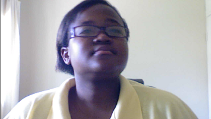
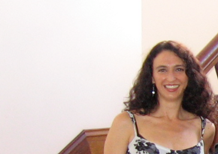
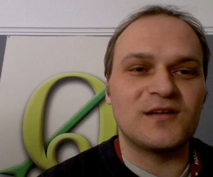
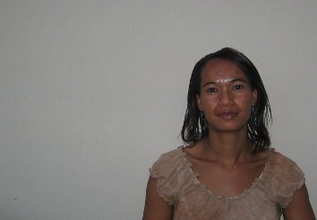
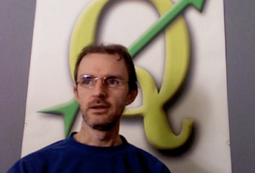

********************************
About the authors & contributors
********************************

+----------------+----------------------------------------------------------------------+
| |tim|          | Tim Sutton --- Editor & Lead Author. Tim Sutton is a developer and   |
|                | project steering committee member of the QGIS project. He is         |
|                | passionate about seeing GIS being Freely available to everyone. Tim  |
|                | is also a founding member of Linfiniti Consulting CC. --- a small    |
|                | business set up with the goal of helping people to learn and use     |
|                | opensource GIS software.                                             |
|                | **Web**: https://kartoza.com **Email**: tim@kartoza.com              |
+----------------+----------------------------------------------------------------------+
| |otto|         | Otto Dassau --- Assistant Author. Otto Dassau is the documentation   |
|                | maintainer and project steering committee member of the QGIS         |
|                | project. Otto has considerable experience in using and training      |
|                | people to use Free and Open Source GIS software.                     |
|                | **Web**: http://www.nature-consult.de **Email**: otto.dassau@gmx.de  |
+----------------+----------------------------------------------------------------------+
| |marcelle|     | Marcelle Sutton --- Project Manager. Marcelle Sutton studied English |
|                | and drama and is a qualified teacher. Marcelle is also a founding    |
|                | member of Linfiniti Consulting CC. --- a small business set up with  |
|                | the goal of helping people to learn and use opensource GIS software. |
|                | **Web**: https://kartoza.com **Email**: marcelle@kartoza.com         |
+----------------+----------------------------------------------------------------------+
| |lerato|       | Lerato Nsibande –-- Video Presenter. Lerato is a grade 12 scholar    |
|                | living in Pretoria. Lerato learns Geography at school and has        |
|                | enjoyed learning GIS with us!                                        |
+----------------+----------------------------------------------------------------------+
| |sibongile|    | Sibongile Mthombeni –-- Video Presenter. Sibongile lives near        |
|                | Johannesburg with her young daughter. Her goal is to continue her    |
|                | studies and become a nurse. Working on this project was the first    |
|                | time Sibongile used a computer.                                      |
+----------------+----------------------------------------------------------------------+

.. Substitutions definitions - AVOID EDITING PAST THIS LINE
   This will be automatically updated by the find_set_subst.py script.
   If you need to create a new substitution manually,
   please add it also to the substitutions.txt file in the
   source folder.

