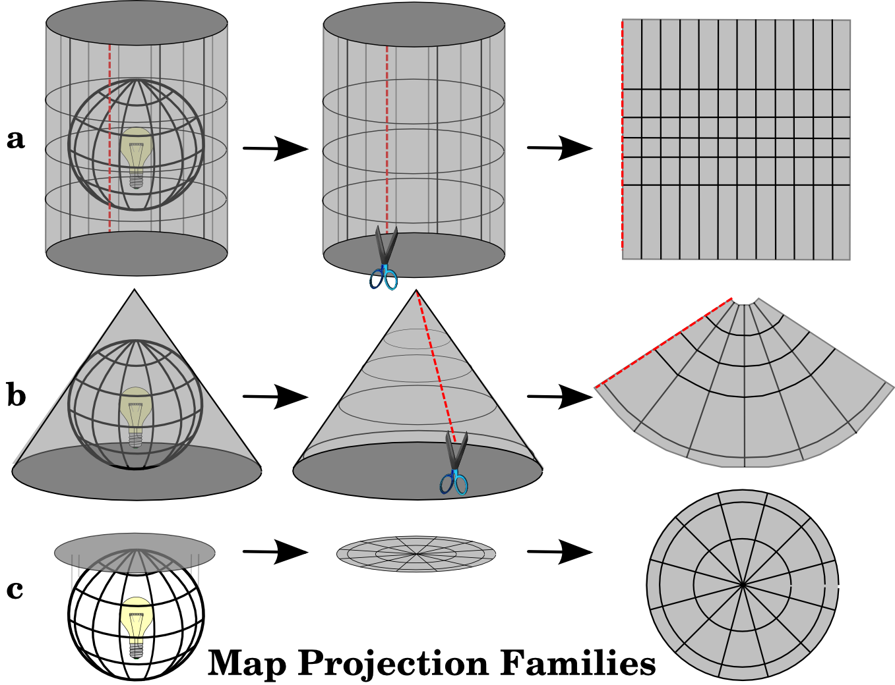
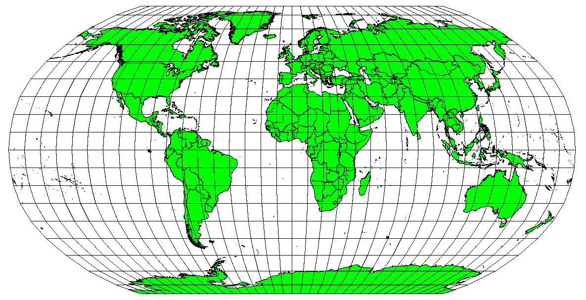
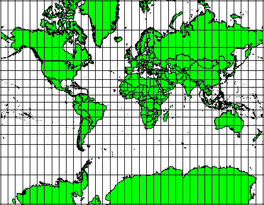
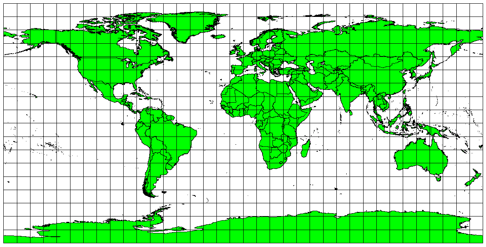
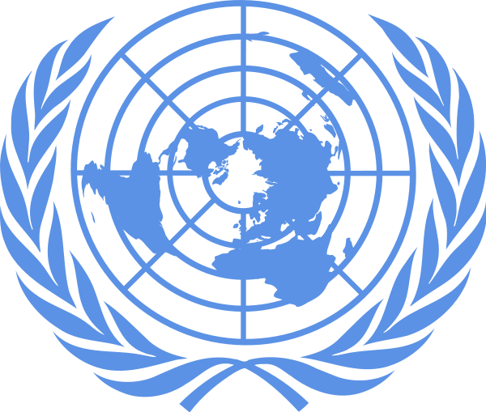
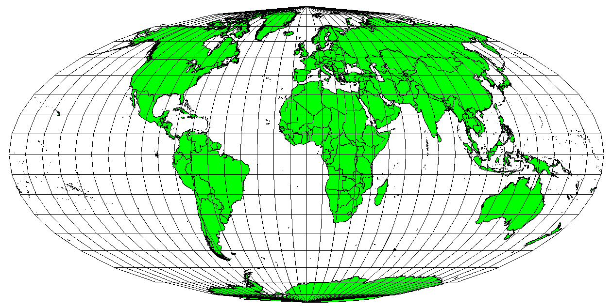
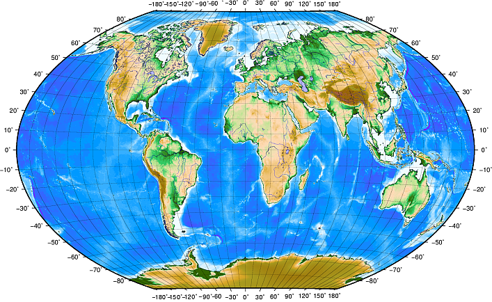
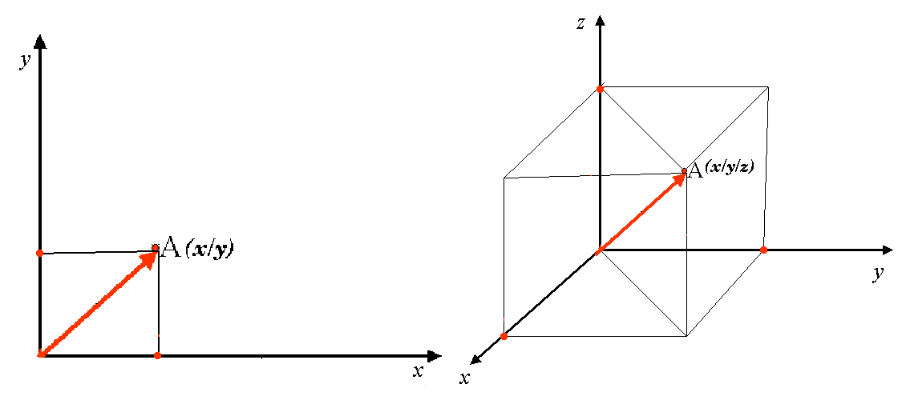
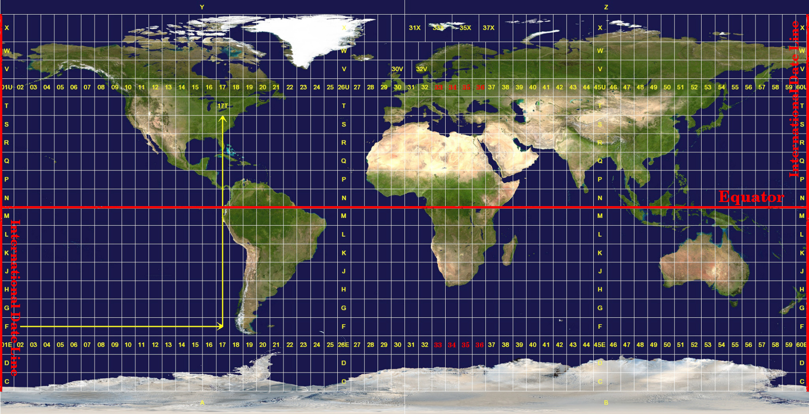
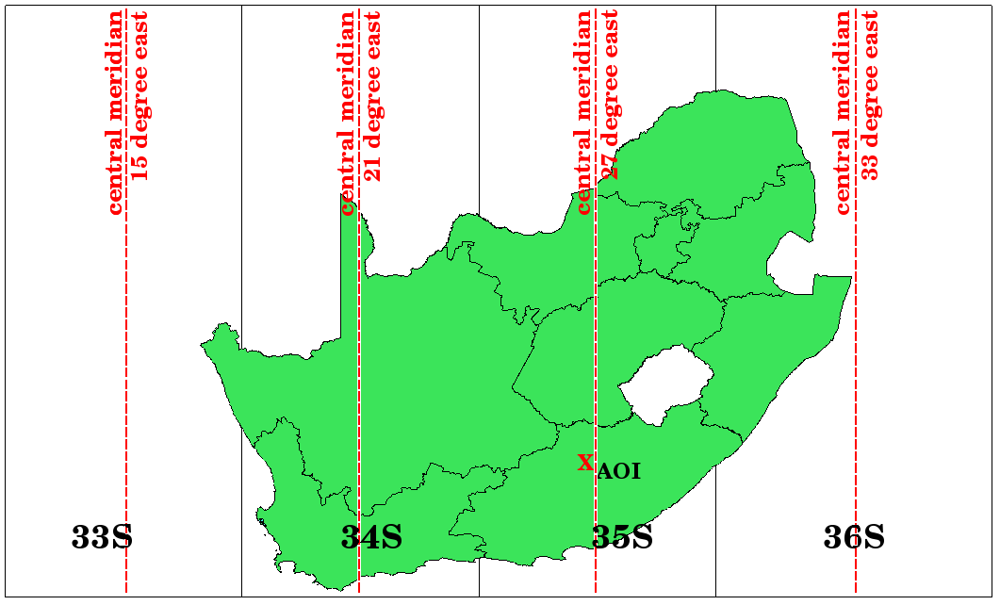

.. _gis_coord_ref_system:

****************************
Coordinate Reference Systems
****************************

+-------------------+-------------+------------------------------------------------------------------------------------------------------------------+
| |gentleLogo|      | Objectives: | Understanding of Coordinate Reference Systems.                                                                   |
+                   +-------------+------------------------------------------------------------------------------------------------------------------+
|                   | Keywords:   | Coordinate Reference System (CRS), Map Projection, On the Fly Projection, Latitude, Longitude, Northing, Easting |
+-------------------+-------------+------------------------------------------------------------------------------------------------------------------+

Overview
========

**Map projections** try to portray the surface of the earth, or a portion of the
earth, on a flat piece of paper or computer screen. In layman's term, map projections
try to transform the earth from its spherical shape (3D) to a planar shape (2D).

A **coordinate reference system** (CRS) then defines how the two-dimensional, 
projected map in your GIS relates to real places on the earth. 
The decision of which map projection and CRS to use depends on
the regional extent of the area you want to work in, on the analysis you want to
do, and often on the availability of data.

Map Projection in detail
========================

A traditional method of representing the earth's shape is the use of globes.
There is, however, a problem with this approach. Although globes preserve the
majority of the earth's shape and illustrate the spatial configuration of
continent-sized features, they are very difficult to carry in one's pocket. They
are also only convenient to use at extremely small scales (e.g. 1:100 million).

Most of the thematic map data commonly used in GIS applications are of
considerably larger scale. Typical GIS datasets have scales of 1:250 000 or
greater, depending on the level of detail. A globe of this size would be difficult
and expensive to produce and even more difficult to carry around. As a result,
cartographers have developed a set of techniques called **map projections**
designed to show, with reasonable accuracy, the spherical earth in two-dimensions.

When viewed at close range the earth appears to be relatively flat. However when
viewed from space, we can see that the earth is relatively spherical. Maps, as
we will see in the upcoming map production topic, are representations of reality.
They are designed to not only represent features, but also their shape and spatial
arrangement. Each map projection has **advantages** and **disadvantages**. The
best projection for a map depends on the **scale** of the map, and on the purposes
for which it will be used. For example, a projection may have unacceptable
distortions if used to map the entire African continent, but may be an excellent
choice for a **large-scale (detailed) map** of your country. The properties of a
map projection may also influence some of the design features of the map. Some
projections are good for small areas, some are good for mapping areas with a large
East-West extent, and some are better for mapping areas with a large North-South
extent.

The three families of map projections
=====================================

The process of creating map projections is best illustrated by positioning a light
source inside a transparent globe on which opaque earth features are placed. Then
project the feature outlines onto a two-dimensional flat piece of paper.
Different ways of projecting can be produced by surrounding the globe in a
**cylindrical** fashion, as a **cone**, or even as a **flat surface**. Each of
these methods produces what is called a **map projection family**. Therefore,
there is a family of **planar projections**, a family of **cylindrical
projections**, and another called **conical projections** (see
:numref:`figure_projection_families`)

.. _figure_projection_families:

   The three families of map projections. They can be represented by a)
   cylindrical projections, b) conical projections or c) planar projections.

Today, of course, the process of projecting the spherical earth onto a flat piece
of paper is done using the mathematical principles of geometry and trigonometry.
This recreates the physical projection of light through the globe.

Accuracy of map projections
===========================

Map projections are never absolutely accurate representations of the spherical
earth. As a result of the map projection process, every map shows **distortions
of angular conformity, distance and area**. A map projection may combine several
of these characteristics, or may be a compromise that distorts all the properties
of area, distance and angular conformity, within some acceptable limit. Examples
of compromise projections are the **Winkel Tripel projection** and the **Robinson
projection** (see :numref:`figure_robinson_projection`), which are often used for producing
and visualizing world maps.

.. _figure_robinson_projection:

   The Robinson projection is a compromise where distortions of area, angular
   conformity and distance are acceptable.

It is usually impossible to preserve all characteristics at the same time in a
map projection. This means that when you want to carry out accurate analytical
operations, you need to use a map projection that provides the best
characteristics for your analyses. For example, if you need to measure distances
on your map, you should try to use a map projection for your data that provides
high accuracy for distances.

Map projections with angular conformity
---------------------------------------

When working with a globe, the main directions of the compass rose (North, East,
South and West) will always occur at 90 degrees to one another. In other words,
East will always occur at a 90 degree angle to North. Maintaining correct **angular
properties** can be preserved on a map projection as well. A map projection that
retains this property of angular conformity is called a **conformal** or
**orthomorphic projection**.

These projections are used when the **preservation of angular relationships** is
important. They are commonly used for navigational or meteorological tasks. It
is important to remember that maintaining true angles on a map is difficult for
large areas and should be attempted only for small portions of the earth. The
conformal type of projection results in distortions of areas, meaning that if
area measurements are made on the map, they will be incorrect. The larger the
area the less accurate the area measurements will be. Examples are the **Mercator
projection** (as shown in :numref:`figure_mercator_projection`) and the **Lambert Conformal
Conic projection**. The U.S. Geological Survey uses a conformal projection for
many of its topographic maps.

.. _figure_mercator_projection:

   The Mercator projection, for example, is used where angular relationships are
   important, but the relationship of areas are distorted.

Map projections with equal distance
-----------------------------------

If your goal in projecting a map is to accurately measure distances, you should
select a projection that is designed to preserve distances well. Such projections,
called **equidistant projections**, require that the **scale** of the map is
**kept constant**. A map is equidistant when it correctly represents distances
from the centre of the projection to any other place on the map. **Equidistant
projections** maintain accurate distances from the centre of the projection or
along given lines. These projections are used for radio and seismic mapping, and
for navigation. The **Plate Carree Equidistant Cylindrical** (see
:numref:`figure_plate_caree_projection`) and the **Equirectangular projection** are two
good examples of equidistant projections. The **Azimuthal Equidistant projection**
is the projection used for the emblem of the United Nations (see
:numref:`figure_azimuthal_equidistant_projection`).

.. _figure_plate_caree_projection:

   The Plate Carree Equidistant Cylindrical projection, for example, is used when
   accurate distance measurement is important.

.. _figure_azimuthal_equidistant_projection:

   The United Nations Logo uses the Azimuthal Equidistant projection.

Projections with equal areas
----------------------------

When a map portrays areas over the entire map, so that all mapped areas have the
same proportional relationship to the areas on the Earth that they represent, the
map is an **equal area map**. In practice, general reference and educational maps
most often require the use of **equal area projections**. As the name implies,
these maps are best used when calculations of area are the dominant calculations
you will perform. If, for example, you are trying to analyse a particular area
in your town to find out whether it is large enough for a new shopping mall,
equal area projections are the best choice. On the one hand, the larger the area
you are analysing, the more precise your area measures will be, if you use an
equal area projection rather than another type. On the other hand, an equal area
projection results in **distortions of angular conformity** when dealing with
large areas. Small areas will be far less prone to having their angles distorted
when you use an equal area projection. **Alber's equal area**, **Lambert's equal
area** and **Mollweide Equal Area Cylindrical projections** (shown in
:numref:`figure_mollweide_equal_area_projection`) are types of equal area projections that
are often encountered in GIS work.

.. _figure_mollweide_equal_area_projection:

   The Mollweide Equal Area Cylindrical projection, for example, ensures that all
   mapped areas have the same proportional relationship to the areas on the Earth.

Keep in mind that map projection is a very complex topic. There are hundreds of
different projections available world wide each trying to portray a certain
portion of the earth's surface as faithfully as possible on a flat piece of paper.
In reality, the choice of which projection to use, will often be made for you.
Most countries have commonly used projections and when data is exchanged people
will follow the **national trend**.

Coordinate Reference System (CRS) in detail
===========================================

With the help of coordinate reference systems (CRS) every place on the earth can
be specified by a set of three numbers, called coordinates. In general CRS can be
divided into **projected coordinate reference systems** (also called Cartesian
or rectangular coordinate reference systems) and **geographic coordinate reference
systems**.

Geographic Coordinate Systems
-----------------------------

The use of Geographic Coordinate Reference Systems is very common. They use
degrees of latitude and longitude and sometimes also a height value to describe
a location on the earth’s surface. The most popular is called **WGS 84**.

**Lines of latitude** run parallel to the equator and divide the earth into 180
equally spaced sections from North to South (or South to North). The reference
line for latitude is the equator and each **hemisphere** is divided into ninety
sections, each representing one degree of latitude. In the northern hemisphere,
degrees of latitude are measured from zero at the equator to ninety at the north
pole. In the southern hemisphere, degrees of latitude are measured from zero at
the equator to ninety degrees at the south pole. To simplify the digitisation of
maps, degrees of latitude in the southern hemisphere are often assigned negative
values (0 to -90°). Wherever you are on the earth’s surface, the distance between
the lines of latitude is the same (60 nautical miles). See :numref:`figure_geographic_crs`
for a pictorial view.

.. _figure_geographic_crs:

   Geographic coordinate system with lines of latitude parallel to the equator
   and lines of longitude with the prime meridian through Greenwich.

**Lines of longitude**, on the other hand, do not stand up so well to the
standard of uniformity. Lines of longitude run perpendicular to the equator and
converge at the poles. The reference line for longitude (the prime meridian) runs
from the North pole to the South pole through Greenwich, England. Subsequent
lines of longitude are measured from zero to 180 degrees East or West of the prime
meridian. Note that values West of the prime meridian are assigned negative values
for use in digital mapping applications. See :numref:`figure_geographic_crs` for a pictorial
\view.

At the equator, and only at the equator, the distance represented by one line of
longitude is equal to the distance represented by one degree of latitude. As you
move towards the poles, the distance between lines of longitude becomes
progressively less, until, at the exact location of the pole, all 360° of
longitude are represented by a single point that you could put your finger on
(you probably would want to wear gloves though). Using the geographic coordinate
system, we have a grid of lines dividing the earth into squares that cover
approximately 12363.365 square kilometres at the equator --- a good start, but
not very useful for determining the location of anything within that square.

To be truly useful, a map grid must be divided into small enough sections so that
they can be used to describe (with an acceptable level of accuracy) the location
of a point on the map. To accomplish this, degrees are divided into **minutes**
(``'``) and **seconds** (``"``). There are sixty minutes in a degree, and sixty
seconds in a minute (3600 seconds in a degree). So, at the equator, one second
of latitude or longitude = 30.87624 meters.

Projected coordinate reference systems
--------------------------------------

A two-dimensional coordinate reference system is commonly defined by two axes.
At right angles to each other, they form a so called **XY-plane** (see
:numref:`figure_projected_crs` on the left side). The horizontal axis is normally labelled
**X**, and the vertical axis is normally labelled **Y**. In a three-dimensional
coordinate reference system, another axis, normally labelled **Z**, is added. It
is also at right angles to the **X** and **Y** axes. The **Z** axis provides the
third dimension of space (see :numref:`figure_projected_crs` on the right side). Every
point that is expressed in spherical coordinates can be expressed as an **X Y Z**
coordinate.

.. _figure_projected_crs:

   Two and three dimensional coordinate reference systems.

A projected coordinate reference system in the southern hemisphere (south of the
equator) normally has its origin on the equator at a specific **Longitude**. This
means that the Y-values increase southwards and the X-values increase to the West.
In the northern hemisphere (north of the equator) the origin is also the equator
at a specific **Longitude**. However, now the Y-values increase northwards and
the X-values increase to the East. In the following section, we describe a
projected coordinate reference system, called Universal Transverse Mercator (UTM)
often used for South Africa.

Universal Transverse Mercator (UTM) CRS in detail
=================================================

The Universal Transverse Mercator (UTM) coordinate reference system has its origin
on the **equator** at a specific **Longitude**. Now the Y-values increase
southwards and the X-values increase to the West. The UTM CRS is a global map
projection. This means, it is generally used all over the world. But as already
described in the section 'accuracy of map projections' above, the larger the area
(for example South Africa) the more distortion of angular conformity, distance
and area occur. To avoid too much distortion, the world is divided into **60 equal
zones** that are all **6 degrees** wide in longitude from East to West. The **UTM
zones** are numbered **1 to 60**, starting at the **antimeridian**
(**zone 1** at 180 degrees West longitude) and progressing East back to the
**antemeridian** (**zone 60** at 180 degrees East longitude) as shown
in :numref:`figure_utm_zones`.

.. _figure_utm_zones:

   The Universal Transverse Mercator zones. For South Africa UTM zones 33S, 34S,
   35S, and 36S are used.

As you can see in :numref:`figure_utm_zones` and :numref:`figure_utm_for_sa`, South Africa is
covered by four **UTM zones** to minimize distortion. The **zones** are called
**UTM 33S**, **UTM 34S**, **UTM 35S** and **UTM 36S**. The **S** after the zone
means that the UTM zones are located **south of the equator**.

.. _figure_utm_for_sa:

   UTM zones 33S, 34S, 35S, and 36S with their central longitudes (meridians)
   used to project South Africa with high accuracy. The red cross shows an Area
   of Interest (AOI).

Say, for example, that we want to define a two-dimensional coordinate within the
**Area of Interest (AOI)** marked with a red cross in :numref:`figure_utm_for_sa`. You can
see, that the area is located within the **UTM zone 35S**. This means, to minimize
distortion and to get accurate analysis results, we should use **UTM zone 35S**
as the coordinate reference system.

The position of a coordinate in UTM south of the equator must be indicated with
the **zone number** (35) and with its **northing (Y) value** and **easting (X)
value** in meters. The **northing value** is the distance of the position from
the **equator** in meters. The **easting value** is the distance from the
**central meridian** (longitude) of the used UTM zone. For UTM zone 35S it is
**27 degrees** **East** as shown in :numref:`figure_utm_for_sa`. Furthermore, because we
are south of the equator and negative values are not allowed in the UTM coordinate
reference system, we have to add a so called **false northing value** of
10,000,000 m to the northing (Y) value and a false easting value of 500,000 m to
the easting (X) value. This sounds difficult, so, we will do an example that
shows you how to find the correct **UTM 35S** coordinate for the **Area of
Interest**.

The northing (Y) value
----------------------

The place we are looking for is 3,550,000 meters south of the equator, so the
northing (Y) value gets a **negative sign** and is -3,550,000 m. According to
the UTM definitions we have to add a **false northing value** of 10,000,000 m.
This means the northing (Y) value of our coordinate is 6,450,000 m (-3,550,000 m
+ 10,000,000 m).

The easting (X) value
---------------------

First we have to find the **central meridian** (longitude) for the **UTM zone
35S**. As we can see in :numref:`figure_utm_for_sa` it is **27 degrees East**. The place
we are looking for is **85,000 meters West** from the central meridian. Just like
the northing value, the easting (X) value gets a negative sign, giving a result
of **-85,000 m**. According to the UTM definitions we have to add a **false
easting value** of 500,000 m. This means the easting (X) value of our coordinate
is 415,000 m (-85,000 m + 500,000 m). Finally, we have to add the **zone number**
to the easting value to get the correct value.

As a result, the coordinate for our **Point of Interest**, projected in **UTM zone
35S** would be written as: **35 415,000 m E / 6,450,000 m N**. In some GIS, when
the correct UTM zone 35S is defined and the units are set to meters within the
system, the coordinate could also simply appear as **415,000 6,450,000**.

On-The-Fly Projection
=====================

As you can probably imagine, there might be a situation where the data you want
to use in a GIS are projected in different coordinate reference systems. For
example, you might get a vector layer showing the boundaries of South Africa
projected in UTM 35S and another vector layer with point information about
rainfall provided in the geographic coordinate system WGS 84. In GIS these two
vector layers are placed in totally different areas of the map window, because
they have different projections.

To solve this problem, many GIS include a functionality called **on-the-fly**
projection. It means, that you can **define** a certain projection when you start
the GIS and all layers that you then load, no matter what coordinate reference
system they have, will be automatically displayed in the projection you defined.
This functionality allows you to overlay layers within the map window of your
GIS, even though they may be in **different** reference systems.
In QGIS, this functionality is applied by default.

Common problems / things to be aware of
=======================================

The topic **map projection** is very complex and even professionals who have
studied geography, geodetics or any other GIS related science, often have problems
with the correct definition of map projections and coordinate reference systems.
Usually when you work with GIS, you already have projected data to start with.
In most cases these data will be projected in a certain CRS, so you don't have
to create a new CRS or even re project the data from one CRS to another. That
said, it is always useful to have an idea about what map projection and CRS means.

What have we learned?
=====================

Let's wrap up what we covered in this worksheet:

* **Map projections** portray the surface of the earth on a two-dimensional,
  flat piece of paper or computer screen.
* There are global map projections, but most map projections are created and
  **optimized to project smaller areas** of the earth's surface.
* Map projections are never absolutely accurate representations of the spherical
  earth. They show **distortions of angular conformity, distance and area.** It
  is impossible to preserve all these characteristics at the same time in a map
  projection.
* A **Coordinate reference system** (CRS) defines, with the help of coordinates,
  how the two-dimensional, projected map is related to real locations on the
  earth.
* There are two different types of coordinate reference systems: **Geographic
  Coordinate Systems** and **Projected Coordinate Systems**.
* **On the Fly** projection is a functionality in GIS that allows us to overlay
  layers, even if they are projected in different coordinate reference systems.

Now you try!
============

Here are some ideas for you to try with your learners:

#. Start QGIS
#. In :menuselection:`Project --> Properties... --> CRS` check :guilabel:`No
   projection (or unknown/non-Earth projection)`
#. Load two layers of the same area but with different projections
#. Let your pupils find the coordinates of several places on the two layers.
   You can show them that it is not possible to overlay the two layers.
#. Then define the coordinate reference system as Geographic/WGS 84 inside the
   :guilabel:`Project Properties` dialog
#. Load the two layers of the same area again and let your pupils see how
   setting a CRS for the project (hence, enabling "on-the-fly" projection)
   works.
#. You can open the :guilabel:`Project Properties` dialog in QGIS and show your
   pupils the many different Coordinate Reference Systems so they get an idea of
   the complexity of this topic. You can select different CRSs to display the
   same layer in different projections.

Something to think about
========================

If you don't have a computer available, you can show your pupils the principles
of the three map projection families. Get a globe and paper and demonstrate how
cylindrical, conical and planar projections work in general. With the help of a
transparency sheet you can draw a two-dimensional coordinate reference system
showing X axes and Y axes. Then, let your pupils define coordinates (X and Y
values) for different places.

Further reading
===============

**Books**:

* Chang, Kang-Tsung (2006). Introduction to Geographic Information Systems. 3rd
  Edition. McGraw Hill. ISBN: 0070658986
* DeMers, Michael N. (2005). Fundamentals of Geographic Information Systems. 3rd
  Edition. Wiley. ISBN: 9814126195
* Galati, Stephen R. (2006): Geographic Information Systems Demystified. Artech
  House Inc. ISBN: 158053533X

**Websites**:

* https://foote.geography.uconn.edu/gcraft/notes/mapproj/mapproj_f.html
* http://geology.isu.edu/wapi/geostac/Field_Exercise/topomaps/index.htm

The QGIS User Guide also has more detailed information on working with map
projections in QGIS.

What's next?
============

In the section that follows we will take a closer look at **Map Production**.

.. Substitutions definitions - AVOID EDITING PAST THIS LINE
   This will be automatically updated by the find_set_subst.py script.
   If you need to create a new substitution manually,
   please add it also to the substitutions.txt file in the
   source folder.

.. |gentleLogo| image:: img/gentlelogo.png
   :width: 3em
