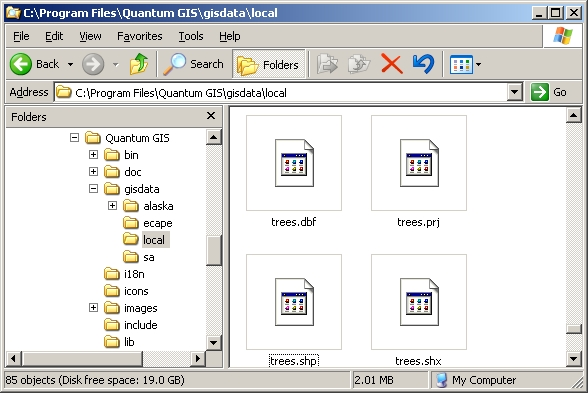
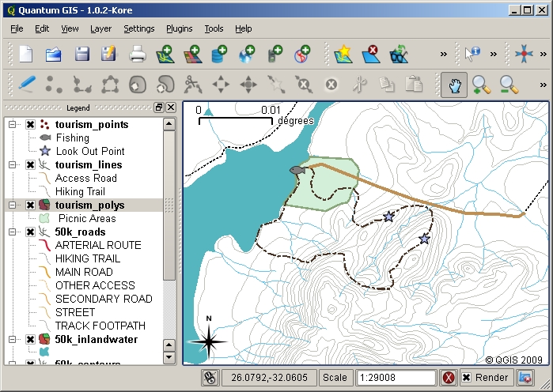
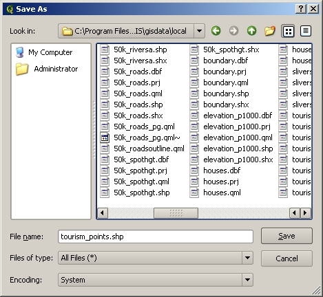
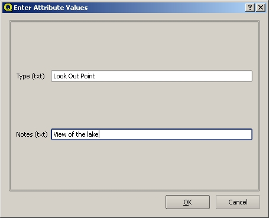
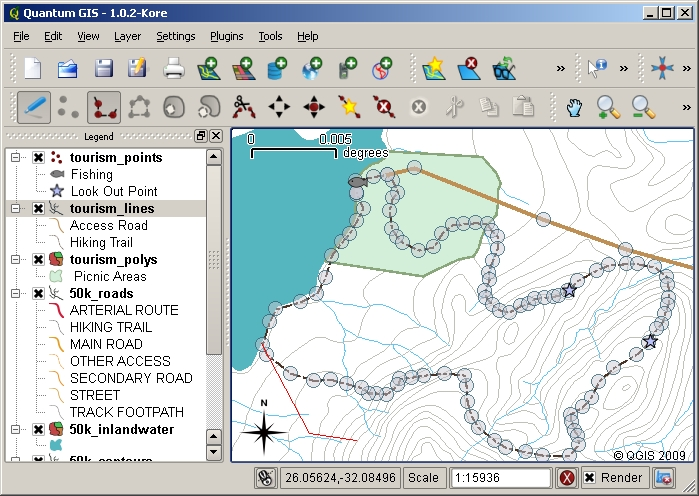
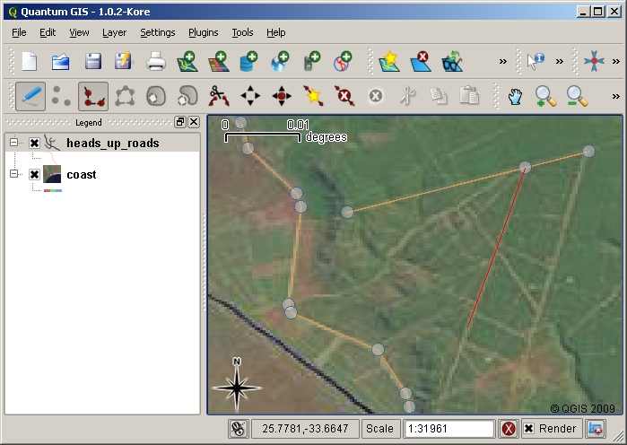
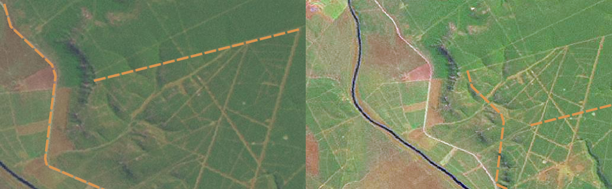

************
Data Capture
************

+-------------------+-------------+---------------------------------------------------------+
| |gentleLogo|      | Objectives: | Learn how to create and edit vector and attribute data. |
+                   +-------------+---------------------------------------------------------+
|                   | Keywords:   | Editing, data capture, heads-up, table, database.       |
+-------------------+-------------+---------------------------------------------------------+

Overview
========

In the previous two topics we looked at vector data. We saw that there are two
key concepts to vector data, namely: **geometry** and **attributes**. The geometry
of a vector feature describes its **shape** and **position**, while the
**attributes** of a vector feature describe its **properties** (colour, size, age
etc.).

In this section we will look more closely at the process of creating and editing
vector data --– both the geometry and attributes of vector features.

How does GIS digital data get stored?
=====================================

Word processors, spreadsheets and graphics packages are all programs that let you
create and edit digital data. Each type of application saves its data into a
particular file format. For example, a graphics program will let you save your
drawing as a :file:`.jpg` JPEG image, word processors let you save your document
as an :file:`.odt` OpenDocument or :file:`.doc` Word Document, and so on.

Just like these other applications, GIS Applications can store their data in files
on the computer hard disk. There are a number of different file formats for GIS
data, but the most common one is probably the 'shape file'. The name is a little
odd in that although we call it a shape file (singular), it actually consists of
at least three different files that work together to store your digital vector
data, as shown in table_shapefile_.

.. _table_shapefile:

+--------------+-------------------------------------------------------------------------------------+
| Extension    | Description                                                                         |
+==============+=====================================================================================+
| :file:`.shp` | The geometry of vector features are stored in this file                             |
+--------------+-------------------------------------------------------------------------------------+
| :file:`.dbf` | The attributes of vector features are stored in this file                           |
+--------------+-------------------------------------------------------------------------------------+
| :file:`.shx` | This file is an index that helps the GIS Application to find features more quickly. |
+--------------+-------------------------------------------------------------------------------------+

Table Shapefile 1: The basic files that together make up a 'shapefile'.

When you look at the files that make up a shapefile on the computer hard disk,
you will see something like :numref:`figure_shapefile`. If you want to share vector data
stored in shapefiles with another person, it is important to give them all of
the files for that layer. So in the case of the trees layer shown in :numref:`figure_shapefile`,
you would need to give the person :file:`trees.shp`, :file:`trees.shx`,
:file:`trees.dbf`, :file:`trees.prj` and :file:`trees.qml`.

.. _figure_shapefile:

   The files that make up a ’trees’ shapefile as seen in the computer’s file
   manager.

Many GIS Applications are also able to store digital data inside a **database**.
In general storing GIS data in a database is a good solution because the database
can store **large amounts** of data **efficiently** and can provide data to the
GIS Application quickly. Using a database also allows many people to work with
the same vector data layers at the same time. Setting up a database to store GIS
data is more complicated than using shapefiles, so for this topic we will focus
on creating and editing shapefiles.

Planning before you begin
=========================

Before you can create a new vector layer (which will be stored in a shapefile),
you need know what the geometry of that layer will be (point, polyline or
polygon), and you need to know what the attributes of that layer will be. Let's
look at a few examples and it will become clearer how to go about doing this.

Example 1: Creating a tourism map
-------------------------------------

Imagine that you want to create a nice tourism map for your local area. Your
vision of the final map is a 1:50 000 toposheet with markers overlaid for sites
of interest to tourists. First, let's think about the geometry. We know that we
can represent a vector layer using point, polyline or polygon features. Which one
makes the most sense for our tourism map? We could use points if we wanted to
mark specific locations such as look out points, memorials, battle sites and so
on. If we wanted to take tourists along a route, such as a scenic route through
a mountain pass, it might make sense to use polylines. If we have whole areas
that are of tourism interest, such as a nature reserve or a cultural village,
polygons might make a good choice.

As you can see it's often not easy to know what type of geometry you will need.
One common approach to this problem is to make one layer for each geometry type
you need. So, for example, if you look at digital data provided by the Chief
Directorate: Surveys and Mapping, South Africa, they provide a river areas
(polygons) layer and a rivers polyline layer. They use the river areas (polygons)
to represent river stretches that are wide, and they use river polylines to
represent narrow stretches of river. In :numref:`figure_tourism` we can see how our tourism
layers might look on a map if we used all three geometry types.

.. _figure_tourism:

   A map with tourism layers. We have used three different geometry types for
   tourism data so that we can properly represent the different kinds of features
   needed for our visitors, giving them all the information they need.

Example 2: Creating a map of pollution levels along a river
-----------------------------------------------------------

If you wanted to measure pollution levels along the course of a river you would
typically travel along the river in a boat or walk along its banks. At regular
intervals you would stop and take various measurements such as Dissolved Oxygen
(DO) levels, Coliform Bacteria (CB) counts, Turbidity levels and pH. You would
also need to make a map reading of your position or obtain your position using
a GPS receiver.

To store the data collected from an exercise like this in a GIS Application, you
would probably create a GIS layer with a point geometry. Using point geometry
makes sense here because each sample taken represents the conditions at a very
specific place.

For the attributes we would want a **field** for each thing that describes the
sample site. So we may end up with an attribute table that looks something like
table_river_attributes_.

.. _table_river_attributes:

+----------+-----+----+----+-----------+-----------+------------+
| SampleNo | pH  | DO | CB | Turbidity | Collector | Date       |
+==========+=====+====+====+===========+===========+============+
| 1        | 7   | 6  | N  | Low       | Patience  | 12/01/2009 |
+----------+-----+----+----+-----------+-----------+------------+
| 2        | 6.8 | 5  | Y  | Medium    | Thabo     | 12/01/2009 |
+----------+-----+----+----+-----------+-----------+------------+
| 3        | 6.9 | 6  | Y  | High      | Victor    | 12/01/2009 |
+----------+-----+----+----+-----------+-----------+------------+

Table River Attributes 1: Drawing a table like this before you create your vector
layer will let you decide what attribute fields (columns) you will need. Note
that the geometry (positions where samples were taken) is not shown in the
attribute table --– the GIS Application stores it separately!

Creating an empty shapefile
===========================

Once you have planned what features you want to capture into the GIS, and the
geometry type and attributes that each feature should have, you can move on to
the next step of creating an empty shapefile.

The process usually starts with choosing the 'new vector layer' option in your
GIS Application and then selecting a geometry type (see :numref:`figure_new_shapefile`).
As we covered in an earlier topic, this means choosing either point, polyline or
polygon for the geometry.

.. _figure_new_shapefile:

.. figure:: img/new_shapefile.png
   :align: center
   :width: 30em

   Creating a new vector layer is as simple as filling in a few details in a form.
   First you choose the geometry type, and then you add the attribute fields.

Next you will add fields to the attribute table. Normally we give field names that
are short, have no spaces and indicate what type of information is being stored
in that field. Example field names may be 'pH', 'RoofColour', 'RoadType' and so
on. As well as choosing a name for each field, you need to indicate how the
information should be stored in that field –-- i.e. is it a number, a word or a
sentence, or a date?

Computer programs usually call information that is made up of words or sentences
'**strings**', so if you need to store something like a street name or the name
of a river, you should use 'String' for the field type.

The shapefile format allows you to store the numeric field information as either
a whole number (**integer**) or a decimal number (**floating point**) –-- so you
need to think before hand whether the numeric data you are going to capture will
have decimal places or not.

The final step (as shown in :numref:`figure_save_shapefile`) for creating a shapefile is
to give it a name and a place on the computer hard disk where it should be
created. Once again it is a good idea to give the shapefile a short and meaningful
name. Good examples are 'rivers', 'watersamples' and so on.

.. _figure_save_shapefile:

   After defining our new layer’s geometry and attributes, we need to save it to
   disk. It is important to give a short but meaningful name to your shapefile.

Let's recap the process again quickly. To create a shapefile you first say what
kind of geometry it will hold, then you create one or more fields for the
attribute table, and then you save the shapefile to the hard disk using an easy
to recognise name. Easy as 1-2-3!

Adding data to your shapefile
=============================

So far we have only created an empty shapefile. Now we need to enable editing in
the shapefile using the 'enable editing' menu option or tool bar icon in the GIS
Application. Shapefiles are not enabled for editing by default to prevent
accidentally changing or deleting the data they contain. Next we need to start
adding data. There are two steps we need to complete for each record we add to
the shapefile:

#. Capturing geometry
#. Entering attributes

The process of capturing geometry is different for points, polylines and polygons.

To **capture a point**, you first use the map pan and zoom tools to get to the
correct geographical area that you are going to be recording data for. Next you
will need to enable the point capture tool. Having done that, the next place you
click with the **left mouse button** in the map view, is where you want your new
point **geometry** to appear. After you click on the map, a window will appear
and you can enter all of the **attribute data** for that point (see :numref:`figure_attribute_dialog`).
If you are unsure of the data for a given field you can usually leave it blank,
but be aware that if you leave a lot of fields blank it will be hard to make a
useful map from your data!

.. _figure_attribute_dialog:

   After you have captured the point geometry, you will be asked to describe its
   attributes. The attribute form is based on the fields you specified when you
   created the vector layer.

To **capture a polyline** the process is similar to that of a point, in that you
need to first use the pan and zoom tools to move the map in the map view to the
correct geographical area. You should be zoomed in enough so that your new vector
polyline feature will have an appropriate scale (see :ref:`gentle_gis_vector_data`
for more details on scale issues). When you are ready, you can click the polyline
capture icon in the tool bar and then start drawing your line by clicking on the
map. After you make your first click, you will notice that the line stretches
like an elastic band to follow the mouse cursor around as you move it. Each time
you click with the **left mouse button**, a new vertex will be added to the map.
This process is shown in :numref:`figure_capture_polyline`.

.. _figure_capture_polyline:

   Capturing lines for a tourism map. When editing a line layer, the vertices are
   shown with circular markers which you can move about with the mouse to adjust
   the line's geometry. When adding a new line (shown in red), each click of the
   mouse will add a new vertex.

When you have finished defining your line, use the **right mouse button** to tell
the GIS Application that you have completed your edits. As with the procedure for
capturing a point feature, you will then be asked to enter in the attribute data
for your new polyline feature.

The process for **capturing a polygon** is almost the same as capturing a polyline
except that you need to use the polygon capture tool in the toolbar. Also, you
will notice that when you draw your geometry on the screen, the GIS Application
always creates an enclosed area.

To add a new feature after you have created your first one, you can simply click
again on the map with the point, polyline or polygon capture tool active and start
to draw your next feature.

When you have no more features to add, always be sure to click the 'allow editing'
icon to toggle it off. The GIS Application will then save your newly created layer
to the hard disk.

Heads-up digitising
===================

As you have probably discovered by now if you followed the steps above, it is
pretty hard to draw the features so that they are **spatially correct** if you
do not have other features that you can use as a point of reference. One common
solution to this problem is to use a raster layer (such as an aerial photograph
or a satellite image) as a backdrop layer. You can then use this layer as a
reference map, or even trace the features off the raster layer into your vector
layer if they are visible. This process is known as 'heads-up digitising' and is
shown in :numref:`figure_headsup_digitizing`.

.. _figure_headsup_digitizing:

   Heads-up digitising using a satellite image as a backdrop. The image is used
   as a reference for capturing polyline features by tracing over them.

Digitising using a digitising table
===================================

Another method of capturing vector data is to use a digitising table. This
approach is less commonly used except by GIS professionals, and it requires
expensive equipment. The process of using a digitising table, is to place a paper
map on the table. The paper map is held securely in place using clips. Then a
special device called a 'puck' is used to trace features from the map. Tiny
cross-hairs in the puck are used to ensure that lines and points are drawn
accurately. The puck is connected to a computer and each feature that is captured
using the puck gets stored in the computer's memory. You can see what a digitising
puck looks like in :numref:`figure_digitizing_table`.

.. _figure_digitizing_table:

.. figure:: img/digitizing_table.jpg
   :align: center
   :width: 30em

   A digitising table and puck are used by GIS professionals when they want to
   digitise features from existing maps.

After your features are digitised...
====================================

Once your features are digitised, you can use the techniques you learned in the
previous topic to set the symbology for your layer. Choosing an appropriate
symbology will allow you to better understand the data you have captured when
you look at the map.

Common problems / things to be aware of
=======================================

If you are digitising using a backdrop raster layer such as an aerial photograph
or satellite image, it is very important that the raster layer is properly
georeferenced. A layer that is georeferenced properly displays in the correct
position in the map view based on the GIS Application's internal model of the
Earth. We can see the effect of a poorly georeferenced image in
:numref:`figure_georeference_issue`.

.. _figure_georeference_issue:

   The importance of using properly georeferenced raster images for heads-up
   digitising. On the left we can see the image is properly georegistered and the
   road features (in orange) overlap perfectly. If the image is poorly
   georeferenced (as shown on the right) the features will not be well aligned.
   Worse still, if the image on the right is used as a reference when capturing
   new features, the newly captured data will be inaccurate!

Also remember that it is important that you are zoomed in to an appropriate scale
so that the vector features you create are useful. As we saw in the previous topic
on vector geometry, it is a bad idea to digitise your data when you are zoomed
out to a scale of 1:1000 000 if you intend to use the data you capture at a scale
of 1:50 000 later.

What have we learned?
=====================

Let's wrap up what we covered in this worksheet:

* **Digitising** is the process of capturing knowledge of a feature's **geometry**
  and **attributes** into a **digital format** stored on the computer's disk.
* GIS Data can be stored in a **database** or as **files**.
* One commonly used file format is the **shapefile** which is actually a group
  of three or more files (:file:`.shp`, :file:`.dbf` and :file:`.shx`).
* Before you create a new vector layer you need to plan both what **geometry**
  type and **attribute** fields it will contain.
* Geometry can be point, polyline or polygon.
* Attributes can be **integers** (whole numbers), **floating points** (decimal
  numbers), **strings** (words) or **dates**.
* The digitising process consists of **drawing** the geometry in the map view
  and then entering its attributes. This is repeated for each feature.
* **Heads-up digitising** is often used to provide orientation during digitising
  by using a raster image in the background.
* Professional GIS users sometimes use a **digitising table** to capture
  information from paper maps.

Now you try!
============

Here are some ideas for you to try with your learners:

* Draw up a list of features in and around your school that you think would be
  interesting to capture. For example: the school boundary, the position of fire
  assembly points, the layout of each class room, and so on. Try to use a mix of
  different geometry types. Now split your learners into groups and assign each
  group a few features to capture. Have them symbolise their layers so that they
  are more meaningful to look at. Combine the layers from all the groups to create
  a nice map of your school and its surroundings!
* Find a local river and take water samples along its length. Make a careful note
  of the position of each sample using a GPS or by marking it on a toposheet. For
  each sample take measurements such as pH, dissolved oxygen etc. Capture the data
  using the GIS application and make maps that show the samples with a suitable
  symbology. Could you identify any areas of concern? Was the GIS Application able
  to help you to identify these areas?

Something to think about
========================

If you don't have a computer available, you can follow the same process by using
transparency sheets and a notebook. Use an aerial photo, orthosheet or satellite
image printout as your background layer. Draw columns down the page in your
notebook and write in the column headings for each attribute field you want to
store information about. Now trace the geometry of features onto the transparency
sheet, writing a number next to each feature so that it can be identified. Now
write the same number in the first column in your table in your notebook, and
then fill in all the additional information you want to record.

Further reading
===============

The QGIS User Guide has more detailed information on :ref:`digitising vector data
<editingvector>` in QGIS.

What's next?
============

In the section that follows we will take a closer look at **raster data** to learn
all about how image data can be used in a GIS.

.. Substitutions definitions - AVOID EDITING PAST THIS LINE
   This will be automatically updated by the find_set_subst.py script.
   If you need to create a new substitution manually,
   please add it also to the substitutions.txt file in the
   source folder.

.. |gentleLogo| image:: img/gentlelogo.png
   :width: 3em
