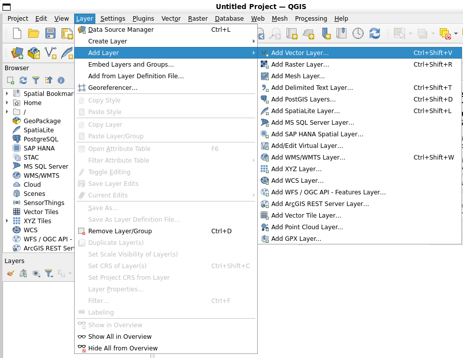

***************
Introducing GIS
***************

+-------------------+-------------+------------------------------------------------------------------+
| |gentleLogo|      | Objectives: | Understanding what GIS is and what it can be used for.           |
+                   +-------------+------------------------------------------------------------------+
|                   | Keywords:   | GIS, Computer, Maps, Data, Information System, Spatial, Analysis |
+-------------------+-------------+------------------------------------------------------------------+

Overview
========

Just as we use a word processor to write documents and deal with words on a
computer, we can use a **GIS application** to deal with **spatial information**
on a computer. GIS stands for **'Geographical Information System'**.

A GIS consists of:

* **Digital Data** –-- the geographical information that you will view and
  analyse using computer hardware and software.
* **Computer Hardware** –-- computers used for storing data, displaying graphics
  and processing data.
* **Computer Software** –-- computer programs that run on the computer hardware
  and allow you to work with digital data. A software program that forms part of
  the GIS is called a GIS Application.

With a GIS application you can open digital maps on your computer, create new
spatial information to add to a map, create printed maps customised to your needs
and perform spatial analysis.

Let's look at a little example of how GIS can be useful. Imagine you are a health
worker and you make a note of the date and place of residence of every patient
you treat.

+-----------+-------------+-------------+------------+
| Longitude | Latitude    | Disease     | Date       |
+===========+=============+=============+============+
| 26.870436 | -31.909519  | Mumps       | 13/12/2008 |
+-----------+-------------+-------------+------------+
| 26.868682 | -31.909259  | Mumps       | 24/12/2008 |
+-----------+-------------+-------------+------------+
| 26.867707 | -31.910494  | Mumps       | 22/01/2009 |
+-----------+-------------+-------------+------------+
| 26.854908 | -31.920759  | Measles     | 11/01/2009 |
+-----------+-------------+-------------+------------+
| 26.855817 | -31.921929  | Measles     | 26/01/2009 |
+-----------+-------------+-------------+------------+
| 26.852764 | -31.921929  | Measles     | 10/02/2009 |
+-----------+-------------+-------------+------------+
| 26.854778 | -31.925112  | Measles     | 22/02/2009 |
+-----------+-------------+-------------+------------+
| 26.869072 | -31.911988  | Mumps       | 02/02/2009 |
+-----------+-------------+-------------+------------+
| 26.863354 | -31.916406  | Chicken Pox | 26/02/2009 |
+-----------+-------------+-------------+------------+

If you look at the table above you will quickly see that there were a lot of
measles cases in January and February. Our health worker recorded the location
of each patient's house by noting its latitude and longitude in the table. Using
this data in a GIS Application, we can quickly understand a lot more about the
patterns of illness:

.. _figure_gis_application:

.. figure:: img/patterns_of_illness.png
   :align: center
   :width: 30em

   Example showing disease records in a GIS application. It is easy to see that
   the mumps patients all live close to each other.

More about GIS
==============

GIS is a relatively new field --- it started in the 1970's. It used to be that
computerised GIS was only available to companies and universities that had
expensive computer equipment. These days, anyone with a personal computer or
laptop can use GIS software. Over time GIS Applications have also become easier
to use --– it used to require a lot of training to use a GIS Application, but now
it is much easier to get started in GIS even for amateurs and casual users. As we
described above, GIS is more than just software, it refers to all aspects of
managing and using digital geographical data. In the tutorials that follow we
will be focusing on GIS Software.

What is GIS Software / a GIS Application?
=========================================

You can see an example of what a **GIS Application** looks like :numref:`figure_gis_application`.
GIS Applications are normally programs with a graphical user interface that can
be manipulated using the mouse and keyboard. The application provides **menus**
near to the top of the window (File, Edit etc.) which, when clicked using the
mouse, show a panel of **actions**. These actions provide a way for you to tell
the GIS Application what you want to do. For example you may use the menus to tell
the GIS Application to add a new layer to the display output.

   Application menus, when clicked with the mouse, expand to show a list of
   actions that can be carried out.

**Toolbars** (rows of small pictures that can be clicked with the mouse) normally
sit just below the menus and provide a quicker way to use frequently needed
actions.

.. figure:: img/toolbars.png
   :align: center

   Toolbars provide quick access to commonly used functions. Holding your mouse
   over a picture will usually tell you what will happen when you click on it.

A common function of GIS Applications is to display **map layers**. Map layers
are stored as files on a disk or as records in a database. Normally each map
layer will represent something in the real world –-- a roads layer for example
will have data about the street network.

When you open a layer in the GIS Application it will appear in the **map view**.
The map view shows a graphic representing your layer. When you add more than one
layer to a map view, the layers are overlaid on top of each other. Look at
figures :numref:`figure_map_view_towns`, :numref:`figure_map_view_schools`,
:numref:`figure_map_view_railways` and :numref:`figure_map_view_rivers`
to see a map view that has several layers being added to it.
An important function of the map view is to allow you to zoom in to magnify,
zoom out to see a greater area and move around (panning) in the map.

.. _figure_map_view_towns:

.. figure:: img/map_view_towns.png
   :align: center
   :width: 30em

   A map view with several layers being added to it. A towns layer added to the
   map view.

.. _figure_map_view_schools:

.. figure:: img/map_view_schools.png
   :align: center
   :width: 30em

   A map view with several layers being added to it. A schools layer added to
   the map view

.. _figure_map_view_railways:

.. figure:: img/map_view_railways.png
   :align: center
   :width: 30em

   A map view with several layers being added to it. A railways layer added to
   the map view

.. _figure_map_view_rivers:

.. figure:: img/map_view_rivers.png
   :align: center
   :width: 30em

   A map view with several layers being added to it. A rivers layer added to the
   map view

Another common feature of GIS Applications is the **map legend**. The map legend
provides a list of layers that have been loaded in the GIS Application. Unlike a
paper map legend, the map legend or 'layers list' in the GIS Application provides
a way to re-order, hide, show and group layers. Changing the layer order is done
by clicking on a layer in the legend, holding the mouse button down and then
dragging the layer to a new position. In figures :numref:`figure_map_legend_before` and
:numref:`figure_map_legend_after` the map legend is shown as the area to the left of the GIS
Application window. By changing the layer order, the way that layers are drawn
can be adjusted –-- in this case so that rivers are drawn below the roads instead
of over them.

.. _figure_map_symbology:

.. figure:: img/symbology.png
   :align: center
   :width: 30em

   GIS Software let you easily change symbology --- the way information is displayed.

.. _figure_map_legend_before:

.. figure:: img/map_legend_before.png
   :align: center
   :width: 30em

   Changing the layer order allows to adjust the way that layers are drawn. Before
   changing the layer order, rivers are drawn on top of roads

.. _figure_map_legend_after:

.. figure:: img/map_legend_after.png
   :align: center
   :width: 30em

   Changing the layer order allows to adjust the way that layers are drawn. After
   changing the layer order, rivers are drawn underneath roads

Getting a GIS Application for your own computer(s)
==================================================

There are many different GIS Applications available. Some have many sophisticated
features and cost tens of thousands of Rands for each copy. In other cases, you
can obtain a GIS Application for free. Deciding which GIS Application to use is
a question of how much money you can afford and personal preference. For these
tutorials, we will be using the QGIS Application. QGIS is completely free and you 
can copy it and share it with your friends as much as you like. If you received 
this tutorial in printed form, you should have received a copy of QGIS with it. 
If not, you can always visit https://www.qgis.org/ to download your free copy
if you have access to the internet.

GIS Data
========

Now that we know what a GIS is and what a GIS Application can do, let's talk about
**GIS data**. Data is another word for **information**. The information we use
in a GIS normally has a geographical aspect to it. Think of our example above,
about the health care worker. She created a table to record diseases that looked
like this:

+-----------+-------------+---------+------------+
| Longitude | Latitude    | Disease | Date       |
+===========+=============+=========+============+
| 26.870436 | -31.909519  | Mumps   | 13/12/2008 |
+-----------+-------------+---------+------------+

The longitude and latitude columns hold **geographical data**. The disease and
date columns hold **non-geographical data**.

A common feature of GIS is that they allow you to associate information
(non-geographical data) with places (geographical data). In fact, the GIS
Application can store many pieces of information which are associated with each
place --– something that paper maps are not very good at. For example, our health
care worker could store the person's age and gender on her table. When the GIS
Application draws the layer, you can tell it to draw the layer based on gender,
or based on disease type, and so on. So, with a GIS Application we have a way to
easily change the appearance of the maps we created based on the non-geographical
data associated with places.

GIS Systems work with many different types of data. **Vector data** is stored as
a series of ``X, Y`` coordinate pairs inside the computer's memory. Vector data
is used to represent points, lines and areas. Illustration :numref:`figure_vector_data`
shows different types of vector data being viewed in a GIS application. In the
tutorials that follow we will be exploring vector data in more detail.

.. _figure_vector_data:

.. figure:: img/vector_data.png
   :align: center
   :width: 30em

   Vector data is used to represent points (e.g. towns), lines (e.g. rivers) and
   polygons (e.g. municipal boundaries).

**Raster data** are stored as a grid of values. There are many satellites circling
the earth and the photographs they take are a kind of raster data that can be
viewed in a GIS. One important difference between raster and vector data is that
if you zoom in too much on a raster image, it will start to appear 'blocky' (see
illustrations :numref:`figure_raster_data` and :numref:`figure_raster_data_zoom`). In fact these
blocks are the individual cells of the data grid that makes up the raster image.
We will be looking at raster data in greater detail in later tutorials.

.. _figure_raster_data:

.. figure:: img/raster_data.png
   :align: center
   :width: 30em

   Raster data are often images taken by satellites. Here we can see mountains
   in the Eastern Cape.

.. _figure_raster_data_zoom:

.. figure:: img/raster_data_zoomed.png
   :align: center
   :width: 30em

   The same raster data, but this time zoomed in. The grid nature of the data can
   be seen.

What have we learned?
=====================

Let's wrap up what we covered in this worksheet:

* A **GIS** is a system of computer hardware, computer software and geographical
  data.
* A **GIS Application** allows you to view geographical data and is an important
  part of the GIS.
* A GIS Application normally consists of a **menu bar**, **toolbars**, a **map
  view** and a **legend**.
* **Vector** and **raster** data are geographical data used in a GIS application.
* **Geographical** data can have associated **non-geographical** data.

Now you try!
============

Here are some ideas for you to try with your learners:

* **Geography:** Describe the concept of GIS to your learners as outlined in this
  tutorial. Ask them to try to think of 3 reasons why it might be handy to use a
  GIS instead of paper maps. Here are some that we could think of:

  - GIS Applications allow you to create many different types of maps from the
    same data.
  - GIS is a great visualisation tool that can show you things about your data
    and how they are related in space (e.g. those disease outbreaks we saw
    earlier).
  - Paper maps need to be filed and are time consuming to view.
    The GIS can hold a very large amount of map data and make it quick and easy
    to find a place you are interested in.

* **Geography:** Can you and your learners think of how raster data from
  satellites could be useful? Here are some ideas we had:

  - During natural disasters, raster data can be useful to show where the impacted
    areas are.
    For example a recent satellite image taken during a flood can help to show
    where people may need rescuing.
  - Sometimes people do bad things to the the environment, like dumping dangerous
    chemicals that kill plants and animals. Using raster data from satellites can
    help us to monitor for these type of problems.
  - Town planners can use raster data from satellites to see where informal
    settlements are and to help in planning infrastructure.

Something to think about
========================

If you don't have a computer available, many of the topics we cover in this
tutorial can be reproduced using an overhead and transparency as it uses the
same technique of layering information. However, to properly understand GIS it
is always better to learn it using a computer.

Further reading
===============

**Book:** Desktop GIS: Mapping the Planet with Open Source Tools. **Author:** Gary
Sherman. **ISBN:** 9781934356067

The QGIS User Guide also has more detailed information on working with QGIS.

What's next?
============

In the sections that follow we are going to go into more detail, showing you how
to use a GIS Application. All of the tutorials will be done using QGIS. Next up,
let's look at vectors!

.. Substitutions definitions - AVOID EDITING PAST THIS LINE
   This will be automatically updated by the find_set_subst.py script.
   If you need to create a new substitution manually,
   please add it also to the substitutions.txt file in the
   source folder.

.. |gentleLogo| image:: img/gentlelogo.png
   :width: 3em
