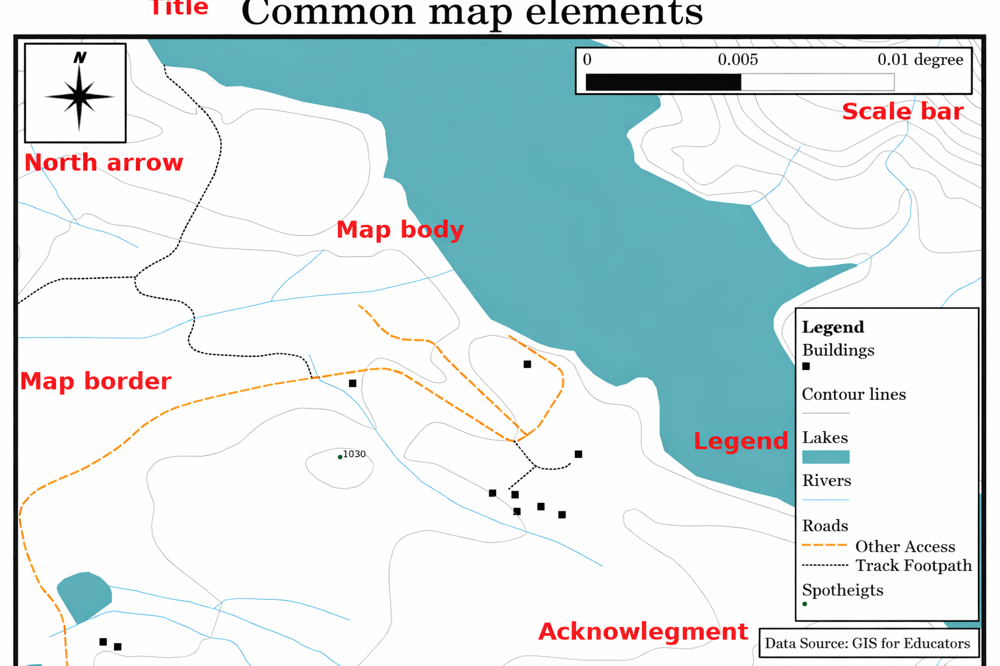
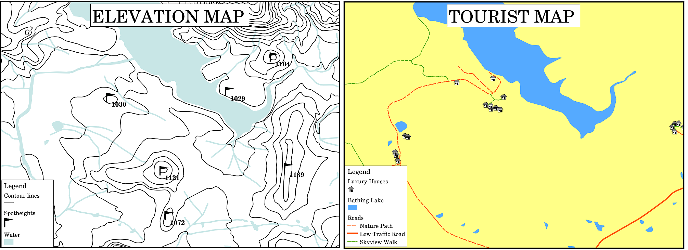
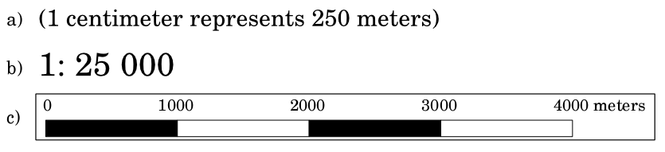
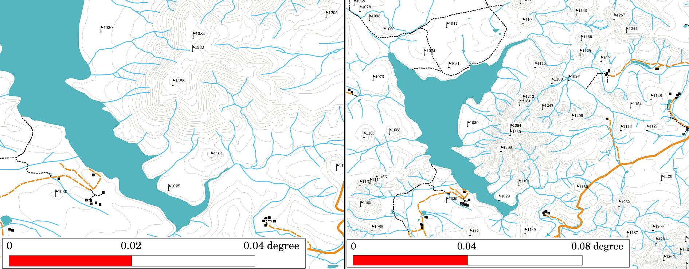
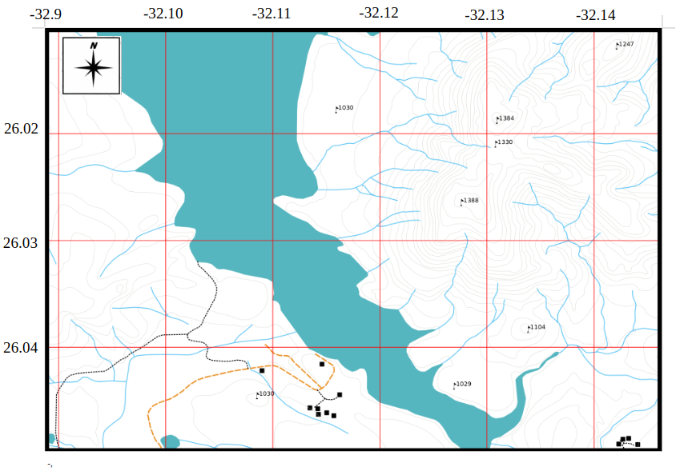
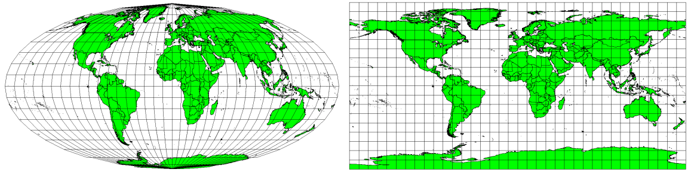
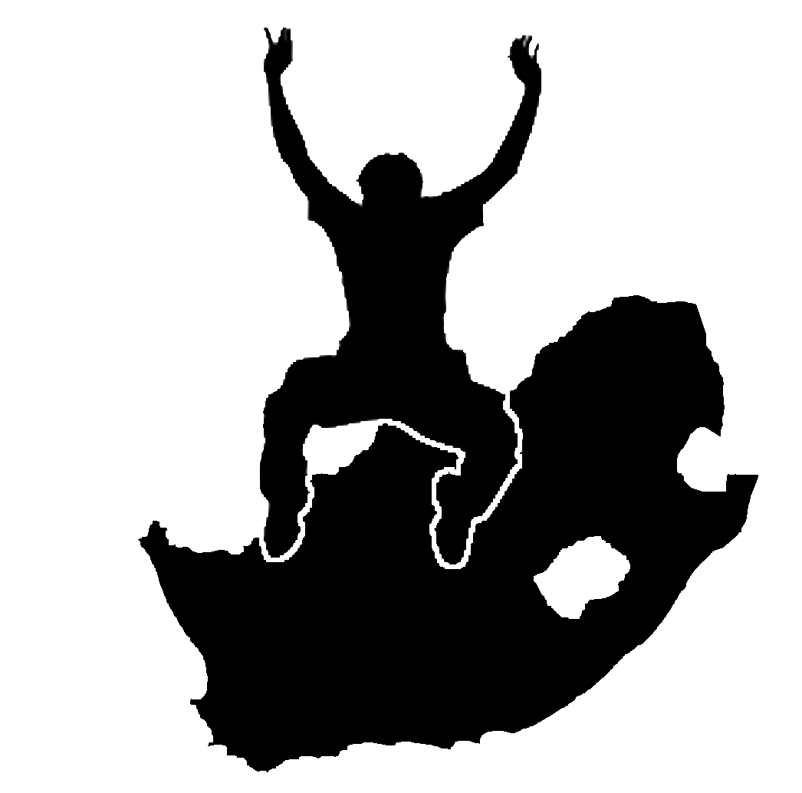

**************
Map Production
**************

+-------------------+-------------+---------------------------------------------------------------------------------+
| |gentleLogo|      | Objectives: | Understanding of map production for spatial data                                |
+                   +-------------+---------------------------------------------------------------------------------+
|                   | Keywords:   | Map production, map layout, scale bar, north arrow, legend, map body, map unit  |
+-------------------+-------------+---------------------------------------------------------------------------------+

Overview
========

Map production is the process of arranging map elements on a sheet of paper in a
way that, even without many words, the average person can understand what it is
all about. Maps are usually produced for presentations and reports where the
audience or reader is a politician, citizen or a learner with no professional
background in GIS. Because of this, a map has to be effective in communicating
spatial information. Common elements of a map are the title, map body, legend,
north arrow, scale bar, acknowledgement, and map border (see :numref:`figure_map_elements`).

.. _figure_map_elements:

   Common map elements (labelled in red) are the title, map body, legend, north
   arrow, scale bar, acknowledgement and map border.

Other elements that might be added are e.g. a **graticule**, or **name of the map
projection** (CRS). Together, these elements help the map reader to interpret the
information shown on the map. The map body is, of course, the most important part
of the map because it contains the map information. The other elements support
the communication process and help the map reader to orientate himself and
understand the map topic. For example, the title describes the subject matter and
the legend relates map symbols to the mapped data.

Title in detail
===============

The map title is very important because it is usually the first thing a reader
will look at on a map. It can be compared with a title in a newspaper. It should
be short but give the reader a first idea of what the map is about.

Map Border in detail
====================

The map border is a line that defines exactly the edges of the area shown on the
map. When printing a map with a graticule (which we describe further down), you
often find the coordinate information of the graticule lines along the border
lines, as you can see in :numref:`figure_map_legend`.

Map Legend in detail
====================

A map is a simplified representation of the real world and **map symbols** are
used to represent real objects. Without symbols, we wouldn't understand maps.
To ensure that a person can correctly read a map, a map legend is used to provide
a key to all the symbols used on the map. It is like a dictionary that allows you
to understand the meaning of what the map shows. A map legend is usually shown a
a little box in a corner of the map. It contains icons, each of which will
represent a type of feature. For example, a *house* icon will show you how to
identify houses on the map (see :numref:`figure_map_legend`).

.. _figure_map_legend:

   Two maps from the same area, both with a water body in the background but with
   different themes, map symbols and colours in the legend.

You can also use different symbols and icons in your legend to show different
themes. In :numref:`figure_map_legend` you can see a map with a lake in light blue overlaid
with contour lines and spot heights to show information about the terrain in that
area. On the right side you see the same area with the lake in the background but
this map is designed to show tourists the location of houses they can rent for
their holidays. It uses brighter colours, a house icon and more descriptive and
inviting words in the legend.

North arrow in detail
=====================

A north arrow (sometimes also called a compass rose) is a figure displaying the
main directions, **North**, **South**, **East** and **West**. On a map it is used
to indicate the direction of North.

For example, in GIS this means that a house that is located north from a lake can
be found on top of the lake on a map. The road in the east will then be to the
right of the water body on the map, a river in the south will be below the water
body and if you are searching for a train station to the west of the lake you will
find it on the left side on the map.

Scale in detail
===============

The scale of a map, is the value of a single unit of distance on the map,
representing distance in the real world. The values are shown in map units
(meters, feet or degrees). The scale can be expressed in several ways, for
example, in words, as a ratio or as a graphical scale bar (see :numref:`figure_map_scale`).

**Expressing a scale in words** is a commonly used method and has the advantage
of being easily understood by most map users. You can see an example of a word
based scale in a :numref:`figure_map_scale` (a). Another option is the **representative
fraction (RF)** method, where both the map distance and the ground distance in
the real world are given in the same map units, as a ratio. For example, a RF
value 1:25,000 means that any distance on the map is 1/25,000 *th* of the real
distance on the ground (see :numref:`figure_map_scale` (b)). The value 25,000 in the ratio
is called the **scale denominator**. More experienced users often prefer the
representative fraction method, because it reduces confusion.

When a representative fraction expresses a very small ratio, for example 1:1000
000, it is called a **small scale map**. On the other hand if the ratio is very
large, for example a 1:50 000 map, it is called a **large scale map**. It is
handy to remember that a small scale map covers a **large area**, and a large
scale map covers a **small area**!

A **scale expression as a graphic or bar scale** is another basic method of
expressing a scale. A bar scale shows measured distances on the map. The equivalent
distance in the real world is placed above as you can see in :numref:`figure_map_scale` (c).

.. _figure_map_scale:

   A map scale can be expressed in words (a), as a ratio (b), or as graphic or
   bar scale (c)

Maps are usually produced at standard scales of, for example, 1:10 000, 1:25 000,
1:50 000, 1:100 000, 1:250 000, 1:500 000. What does this mean to the map reader?
It means that if you *multiply* the distance measured on the **map** by the
**scale denominator**, you will know the distance in the **real world**.

For example, if we want to measure a distance of 100mm on a map with a scale of
1:25,000 we calculate the real world distance like this:

::

   100 mm x 25,000 = 2,500,000 mm

This means that 100 mm on the map is equivalent to 2,500,000 mm (2500 m) in the
real word.

Another interesting aspect of a map scale, is that the lower the map scale, the
more detailed the feature information in the map will be. In
:numref:`figure_map_scale_compare`, you can see an example of this. Both maps are the same
size but have a different scale. The image on the left side shows more details,
for example the houses south-west of the water body can be clearly identified as
separate squares. In the image on the right you can only see a black clump of
rectangles and you are not able to see each house clearly.

.. _figure_map_scale_compare:

   Maps showing an area in two different scales. The map scale on the left is
   1:25,000. The map scale on the right is 1:50,000.

Acknowledgment in detail
========================

In the acknowledgment area of a map it is possible to add text with important
information. For example information about the quality of the used data can be
useful to give the reader an idea about details such as how, by whom and when a
map was created. If you look at a topographical map of your town, it would be
useful to know when the map was created and who did it. If the map is already 50
years old, you will probably find a lot of houses and roads that no longer exist
or maybe never even existed. If you know that the map was created by an official
institution, you could contact them and ask if they have a more current version
of that map with updated information.

Graticule in detail
===================

A graticule is a network of lines overlain on a map to make spatial orientation
easier for the reader. The lines can be used as a reference. As an example, the
lines of a graticule can represent the earth's parallels of latitude and meridians
of longitude. When you want to refer to a special area on a map during your
presentation or in a report you could say: 'the houses close to latitude 26.04 /
longitude -32.11 are often exposed to flooding during January and February' (see
:numref:`figure_map_graticule`).

.. _figure_map_graticule:

   Graticules (red lines) representing the Earth’s parallels of latitude and
   meridians of longitude. The latitude and longitude values on the map border
   can be used for better orientation on the map.

Name of the map projection in detail
====================================

A map projection tries to represent the 3-dimensional Earth with all its features
like houses, roads or lakes on a flat sheet of paper. This is very difficult as
you can imagine, and even after hundreds of years there is no single projection
that is able to represent the Earth perfectly for any area in the world. Every
projection has advantages and disadvantages.

To be able to create maps as precisely as possible, people have studied, modified,
and produced many different kinds of projections. In the end almost every country
has developed its own map projection with the goal of improving the map accuracy
for their territorial area (see :numref:`figure_map_projection`).

.. _figure_map_projection:

   The world in different projections. A Mollweide Equal Area projection left,
   a Plate Carree Equidistant Cylindrical projection on the right.

With this in mind, we can now understand why it makes sense to add the name of
the projection on a map. It allows the reader to see quickly, if one map can be
compared with another. For example, features on a map in a so-called Equal Area
projection appear very different to features projected in a Cylindrical
Equidistant projection (see :numref:`figure_map_projection`).

Map projection is a very complex topic and we cannot cover it completely here.
You may want to take a look at our previous topic: Coordinate Reference Systems
if you want to know more about it.

Common problems / things to be aware of
=======================================

It is sometimes difficult to create a map that is easy to understand and well
laid out whilst still showing and explaining all the information that the reader
needs to know. To achieve this, you need to create an ideal arrangement and
composition of all the map elements. You should concentrate on what story you
want to tell with your map and how the elements, such as the legend, scale bar
and acknowledgements should be ordered. By doing this, you will have a well
designed and educational map, that people would like to look at and be able to
understand.

What have we learned?
=====================

Let's wrap up what we covered in this worksheet:

* **Map production** means arranging **map elements** on a sheet of paper.
* **Map elements** are the title, map body, map border, legend, scale, north
  arrow and the acknowledgement.
* **Scale** represents the ratio of a distance on the map to the actual distance
  in the real world.
* Scale is displayed in **map units** (meters, feet or degrees)
* A **legend** explains all the symbols on a map.
* A map should **explain complex information as simply as possible**.
* Maps are usually always displayed '**North up**'.

Now you try!
============

Here are some ideas for you to try with your learners:

* Load some vector layers in your GIS for your local area. See if your learners
  can identify examples of different types of legend elements such as road types
  or buildings. Create a list of legend elements and define what the icons should
  look like, so a reader can most easily figure out their meaning in the map.
* Create a map layout with your learners on a sheet of paper. Decide on the title
  of the map, what GIS layers you want to show and what colors and icons to have
  on the map. Use the techniques you learned in Topics :ref:`gentle_gis_vector_data`
  and :ref:`gentle_gis_attributes` to adjust the symbology accordingly. When you
  have a template, open the QGIS print layout and try to arrange a map layout as
  planned.

Something to think about
========================

If you don't have a computer available, you can use any topographical map and
discuss the map design with your learners. Figure out if they understand what the
map wants to tell. What can be improved? How accurately does the map represent
the history of the area? How would a map from 100 years ago differ from the same
map today?

Further reading
===============

**Books**:

* Chang, Kang-Tsung (2006). Introduction to Geographic Information Systems. 3rd
  Edition. McGraw Hill. ISBN: 0070658986
* DeMers, Michael N. (2005). Fundamentals of Geographic Information Systems. 3rd
  Edition. Wiley. ISBN: 9814126195

**Website**: `Scale (map) <https://en.wikipedia.org/wiki/Scale_(map)>`_

The QGIS User Guide also has more detailed information on map production provided
in QGIS.

What's next?
============

In the section that follows we will take a closer look at **vector analysis** to
see how we can use a GIS for more than just making good looking maps!

.. Substitutions definitions - AVOID EDITING PAST THIS LINE
   This will be automatically updated by the find_set_subst.py script.
   If you need to create a new substitution manually,
   please add it also to the substitutions.txt file in the
   source folder.

