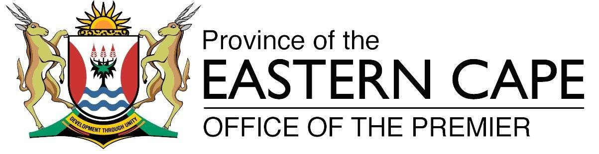

.. _A-Gentle-Introduction-To-GIS-reference:

********
Preamble
********

A Gentle Introduction to GIS

Brought to you with QGIS, a Free and Open Source Software GIS Application
for everyone.

T. Sutton, O. Dassau, M. Sutton

Sponsored by: Chief Directorate: Spatial Planning & Information, Department of
Land Affairs, Eastern Cape, South Africa.

In partnership with: Spatial Information Management Unit, Office of the Premier,
Eastern Cape, South Africa.

Copyright (c) 2009 Chief Directorate: Spatial Planning & Information, Department
of Land Affairs, Eastern Cape.

Permission is granted to copy, distribute and/or modify this document under the
terms of the GNU Free Documentation License, Version 1.2 or any later version
published by the Free Software Foundation; with no Invariant Sections, no
Front-Cover Texts, and no Back-Cover Texts.

A copy of the license is included in the section :ref:`gnu_fdl`.

The above copyright notice excludes the QGIS User Manual which may be appended
to this document. Consult the QGIS Manuals for further copyright and licensing
information.

A word from the editor
======================

This project was sponsored by the Chief Directorate: Spatial Planning & Information,
Department of Land Affairs (DLA), Eastern Cape, in conjunction with the Spatial
Information Management Unit, Office of the Premier, Eastern Cape, South Africa.

GIS is becoming an increasingly important tool in environmental management,
retail, military, police, tourism and many other spheres of our daily lives. If
you use a computer or a cell phone, you have probably already used a GIS in some
form without even realising it. Maybe it was a map on a web site, Google Earth,
an information booth or your cell phone telling you where you are. Proprietary
GIS software (software that cannot be freely shared or modified) is available
that will let you do everything we describe in these worksheets and a lot more.
However this software is usually very expensive or otherwise limits your freedom
to copy, share and modify the software. GIS vendors sometimes make an exception
for educational activities, providing cheaper or free copies of their software.
They do this knowing that if teachers and learners get to know their software,
they will be reluctant to learn other packages. When learners leave school they
will go into the workplace and buy the commercial software, never knowing that
there are free alternatives that they could be using.

With QGIS, we offer an alternative --- software that is free of cost and
free in a social sense. You can make as many copies as you like. When learners
leave school one day they can use this software to build their skills, solve
problems at work and make the world a better place.

When you buy commercial software, you limit your options for the future. By
learning, using and sharing Free and Open Source Software, you are building your
own skills, freeing money to be spent on important things like food and shelter
and boosting our own economy.

By sponsoring the creation of this resource, the DLA has created a foundation to
which young minds can be exposed. Exciting possibilities lie ahead when principles
of free sharing of knowledge and data are embraced. For this we give our
heartfelt thanks to the DLA!

We hope you enjoy using and learning QGIS in the spirit of Ubuntu!

Tim Sutton, April 2009
