.. _gentle_gis_attributes:

*********************
Vector Attribute Data
*********************

+-------------------+-------------+---------------------------------------------------------------------------------------------------------------------+
| |gentleLogo|      | Objectives: | In this topic we describe how attribute data are associated with vector features and can be used to symbolise data. |
+                   +-------------+---------------------------------------------------------------------------------------------------------------------+
|                   | Keywords:   | Attribute, database, fields, data, vector, symbology                                                                |
+-------------------+-------------+---------------------------------------------------------------------------------------------------------------------+

Overview
========

If every line on a map was the same colour, width, thickness, and had the same
label, it would be very hard to make out what was going on. The map would also
give us very little information. Take a look at :numref:`figure_map_attributes` for example.

.. _figure_map_attributes:

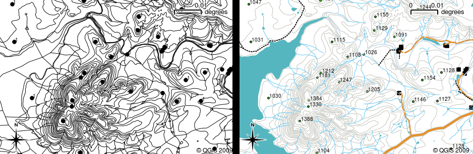

   Maps come to life when colour and different symbols are used to help you to
   tell one type of feature from the next. Can you tell the difference between
   rivers, roads and contours using the map on the left? Using the map on the
   right it is much easier to see the different features.

In this topic we will look at how attribute data can help us to make interesting
and informative maps. In the previous topic on vector data, we briefly explained
that **attribute data** are used to **describe vector features**. Take a look at
the house pictures in :numref:`figure_house`.

.. _figure_house:

.. figure:: img/house_picture.png
   :align: center
   :width: 30em

   Every feature has characteristics that we can describe. These can be visible
   things, or things we know about the feature (e.g. year built).

The geometry of these house features is a polygon (based on the floor plan of the
house), the attributes we have recorded are roof colour, whether there is a
balcony, and the year the house was built. Note that attributes don't have to be
visible things --– they can describe things we know about the feature such as the
year it was built. In a GIS Application, we can represent this feature type in a
houses polygon layer, and the attributes in an attribute table (see :numref:`figure_house_gis`).

.. _figure_house_gis:

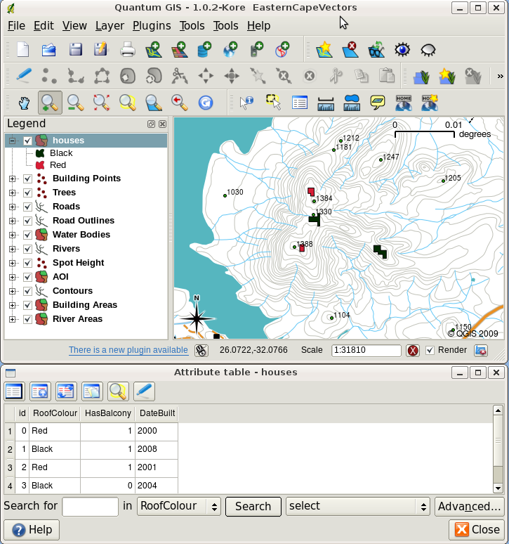

   A houses layer. House features have attributes that describe the houses’ roof
   colour and other properties. The attribute table (lower image) lists the
   attributes for the house areas shown on the map. When a feature is highlighted
   in the table, it will appear as a yellow polygon on the map.

The fact that features have attributes as well geometry in a GIS Application opens
up many possibilities. For example we can use the attribute values to tell the
GIS what colours and style to use when drawing features (see :numref:`figure_style_by_attribute`).
The process of setting colours and drawing styles is often referred to as setting
feature **symbology**.

.. _figure_style_by_attribute:

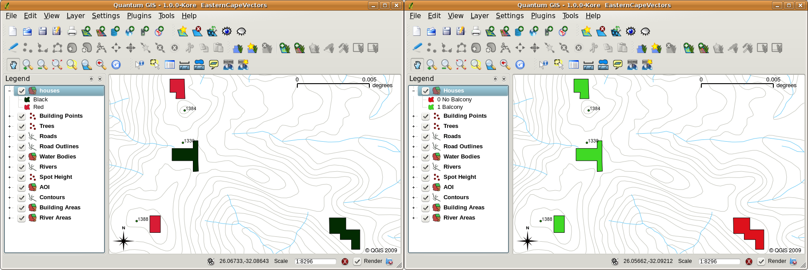

   In a GIS Application, we can draw features differently depending on their
   attributes. On the left we have drawn house polygons with the same colour as
   the roof attribute. On the right we colour coded houses according to whether
   they have a balcony or not.

Attribute data can also be useful when creating **map labels**. Most GIS
Applications will have a facility to select an attribute that should be used to
label each feature.

If you have ever **searched a map** for a place name or a specific feature, you
will know how time consuming it can be. Having attribute data can make searching
for a specific feature quick and easy. In :numref:`figure_search_by_attribute` you can see
an example of an attribute search in a GIS.

.. _figure_search_by_attribute:

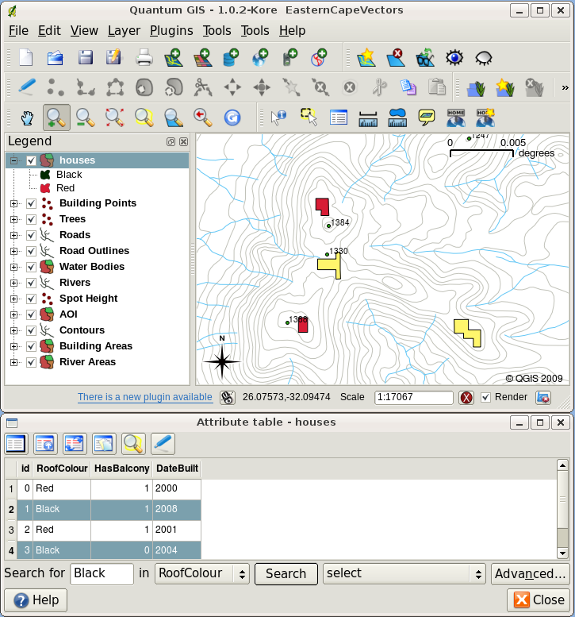

   In a GIS Application, we can also search for features based on their
   attributes. Here we see a search for houses with black roofs. Results are shown
   in yellow in the map, turquoise on the table.

Finally, attribute data can be very useful in carrying out **spatial analysis**.
Spatial analysis combines the spatial information stored in the geometry of
features with their attribute information. This allows us to study features and
how they relate to each other. There are many types of spatial analysis that can
be carried out, for example, you could use GIS to find out how many red roofed
houses occur in a particular area. If you have tree features, you could use GIS
to try to find out which species might be affected if a piece of land is developed.
We can use the attributes stored for water samples along a river course to
understand where pollution is entering into the stream. The possibilities are
endless! In a later topic we will be exploring spatial analysis in more detail.

Before we move on to attribute data in more detail, let's take a quick recap.

Features are real world things such as roads, property boundaries, electrical
substation sites and so on. A **feature** has a **geometry** (which determines
if it is a **point**, **polyline** or **polygon**) and **attributes** (which
describe the feature). This is shown in :numref:`figure_features_at_glance`.

.. _figure_features_at_glance:

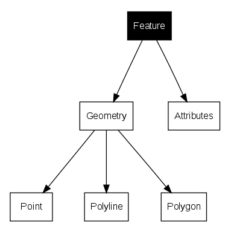

   Vector features at a glance.

Attributes in detail
====================

Attributes for a vector feature are stored in a **table**. A table is like a
spreadsheet. Each column in the table is called a **field**. Each row in the table
is a **record**. Table table_house_attributes_ shows a simple example of how an
attribute table looks in a GIS. The records in the attribute table in a GIS each
correspond to one feature. Usually the information in the attribute table is
stored in some kind of database. The GIS application links the attribute records
with the feature geometry so that you can find records in the table by selecting
features on the map, and find features on the map by selecting features in the
table.

.. _table_house_attributes:

+-----------------+---------------------+---------------------+------------------+
| Attribute Table | Field 1 : YearBuilt | Field 2: RoofColour | Field 3: Balcony |
+=================+=====================+=====================+==================+
| Record 1        | 1998                | Red                 | Yes              |
+-----------------+---------------------+---------------------+------------------+
| Record 2        | 2000                | Black               | No               |
+-----------------+---------------------+---------------------+------------------+
| Record 3        | 2001                | Silver              | Yes              |
+-----------------+---------------------+---------------------+------------------+

Table House Attributes: An attribute table has fields (columns) and records (in
rows).

Each field in the attribute table contains a specific type of data –--
text, numeric or date. Deciding what attributes to use for a feature requires some
thought and planning. In our house example earlier on in this topic, we chose roof
colour, presence of a balcony and month of construction as attributes of interest.
We could just as easily have chosen other aspects of a house such as:

* number of levels
* number of rooms
* number of occupants
* type of dwelling (RDP House, block of flats, shack, brick house, etc)
* year the house was built
* area of floor space in the house
* and so on....

With so many options, how do we make a good choice as to what attributes are
needed for a feature? It usually boils down to what you plan to do with the data.
If you want to produce a colour coded map showing houses by age, it will make
sense to have a 'Year Built' attribute for your feature. If you know for sure you
will never use this type of map, it is better to not store the information.
Collecting and storing unneeded information is a bad idea because of the cost
and time required to research and capture the information. Very often we obtain
vector data from companies, friends or the government. In these cases it is
usually not possible to request specific attributes and we have to make do with
what we get.

Single Symbols
==============

If a feature is symbolised without using any attribute table data, it can only
be drawn in a simple way. For example with point features you can set the colour
and **marker** (circle, square, star etc.) but that is all. You cannot tell the
GIS to draw the features based on one of its properties in the attribute table.
In order to do that, you need to use either a **graduated**, **continuous** or
**unique value** symbol. These are described in detail in the sections that
follow.

A GIS application will normally allow you to set the symbology of a layer using
a **dialog box** such as the one shown in in :numref:`figure_single_symbol`. In this
dialog box you can choose colours and symbol styles. Depending on the geometry
type of a layer, different options may be shown. For example with point layers
you can choose a **marker style**. With line and polygon layers there is no marker
style option, but instead you can select a **line style** and **colour** such as
dashed orange for gravel roads, solid orange for minor roads, and so on (as shown
in :numref:`figure_single_symbol_poly`). With polygon layers you also have the option of
setting a **fill style** and color.

.. _figure_single_symbol:

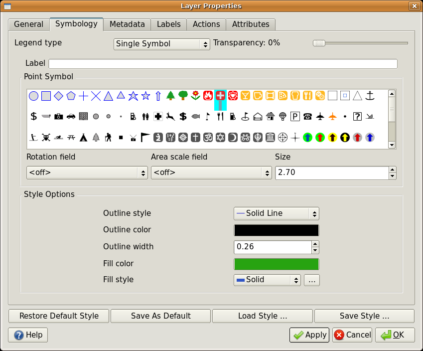

   When using simple symbols, the feature is drawn without using an attribute to
   control how it looks. This is the dialog for point features.

.. _figure_single_symbol_poly:

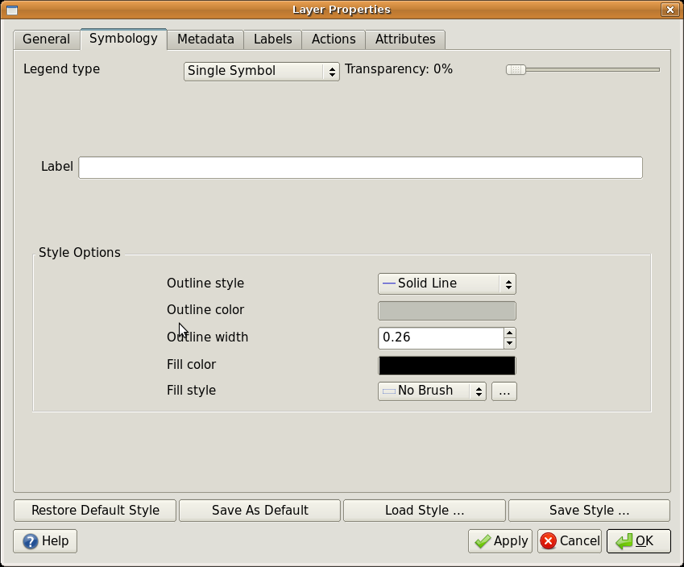

   There are different options when defining simple symbols for polyline and
   polygon features.

Graduated Symbols
=================

Sometimes vector features represent things with a changing numerical value.
Contour lines are a good example of this. Each contour usually has an attribute
value called 'height' that contains information about what height that contour
represents. In  earlier in this topic we showed contours all drawn with the same
colour. Adding colour to the contours can help us to interpret the meanings of
contours. For example we can draw low lying areas with one colour, mid-altitude
areas with another and high-altitude areas with a third.

.. _figure_graduated_symbol:

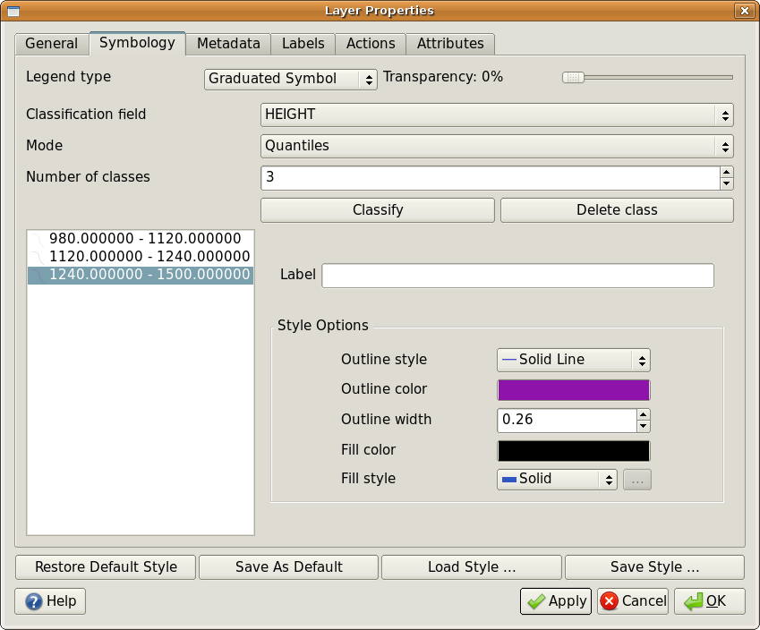

   The height attribute of contours can be used to separate the contours into 3
   classes. Contours between 980 m and 1120 m will be drawn in brown, those
   between 1120 m and 1240 m in green and those between 1240 m and 1500 m in
   purple.

.. _figure_graduated_symbol_map:

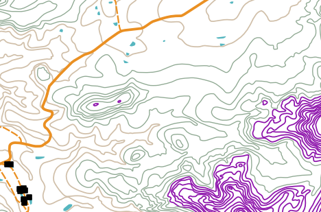

   Our map after setting graduated colours for our contours.

Setting colours based on discrete groups of attribute values is called Graduated
Symbology in QGIS. The process is shown in Illustrations :numref:`figure_graduated_symbol`
and :numref:`figure_graduated_symbol_map`. **Graduated symbols** are most useful when you
want to show clear differences between features with attribute values in different
value ranges. The GIS Application will analyse the attribute data (e.g. height)
and, based on the number of classes you request, create groupings for you. This
process is illustrated in table_graduated_.

.. _table_graduated:

+-----------------+------------------+
| Attribute Value | Class and Colour |
+=================+==================+
| 1               | Class 1          |
+-----------------+------------------+
| 2               | Class 1          |
+-----------------+------------------+
| 3               | Class 1          |
+-----------------+------------------+
| 4               | Class 2          |
+-----------------+------------------+
| 5               | Class 2          |
+-----------------+------------------+
| 6               | Class 2          |
+-----------------+------------------+
| 7               | Class 3          |
+-----------------+------------------+
| 8               | Class 3          |
+-----------------+------------------+
| 9               | Class 3          |
+-----------------+------------------+

Table Graduated: Graduated colour breaks up the attribute value ranges into the
number of classes you select. Each class is represented by a different colour.

Continuous Colour Symbols
=========================

In the previous section on Graduated Colour symbols we saw that we can draw
features in discrete groups or classes. Sometimes it is useful to draw features
in a **colour range** from one colour to another. The GIS Application will use a
numerical attribute value from a feature (e.g. contour heights or pollution levels
in a stream) to decide which colour to use. Table table_continuous_ shows how
the attribute value is used to define a continuous range of colours.

.. _table_continuous:

+-----------------+---------------------------------+
| Attribute Value | Colour (no classes or grouping) |
+=================+=================================+
| 1               |                                 |
+-----------------+---------------------------------+
| 2               |                                 |
+-----------------+---------------------------------+
| 3               |                                 |
+-----------------+---------------------------------+
| 4               |                                 |
+-----------------+---------------------------------+
| 5               |                                 |
+-----------------+---------------------------------+
| 6               |                                 |
+-----------------+---------------------------------+
| 7               |                                 |
+-----------------+---------------------------------+
| 8               |                                 |
+-----------------+---------------------------------+
| 9               |                                 |
+-----------------+---------------------------------+

Table Continuous: Continuous colour symbology uses a start colour (e.g. light
orange shown here) and an end colour (e.g. dark brown shown here) and creates a
series of shades between those colours.

Using the same contours example we used in the previous section, let's see how a
map with continuous colour symbology is defined and looks. The process starts by
setting the layers properties to continuous colour using a dialog like the one
shown in :numref:`figure_continuous_symbol`.

.. _figure_continuous_symbol:

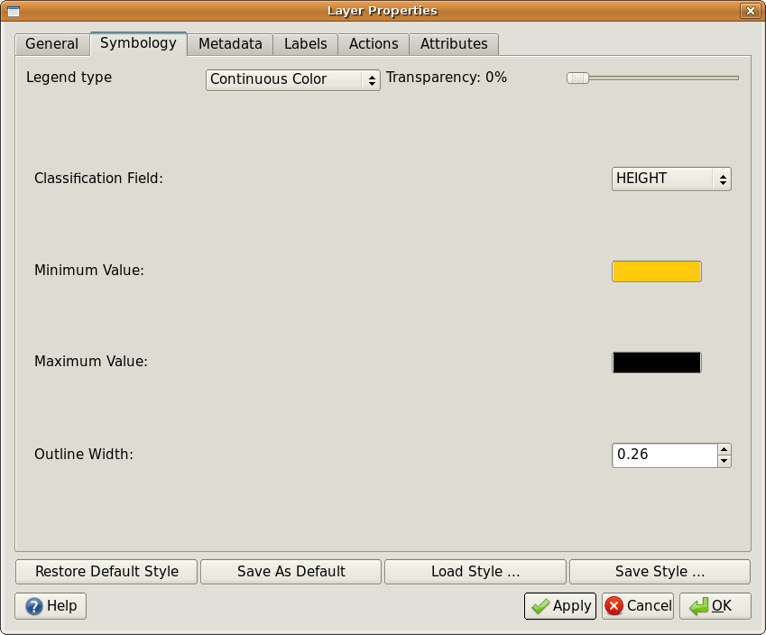

   Setting up continuous colour symbology. The contour height attribute is used
   to determine colour values. Colours are defined for the minimum and maximum
   values. The GIS Application will then create a gradient of colours for drawing
   the features based on their heights.

After defining the minimum and maximum colours in the colour range, the colour
features are drawn in will depend on where the attribute lies in the range between
minimum and maximum. For example if you have contour features with values starting
at 1000 m and ending at 1400 m, the value range is 1000 to 1400. If the colour
set for the minimum value is set to orange and the colour for the maximum value
is black, contours with a value of close to 1400 m will be drawn close to black.
On the other hand contours with a value near to 1000 m will be drawn close to
orange (see :numref:`figure_continuous_symbol_map`).

.. _figure_continuous_symbol_map:

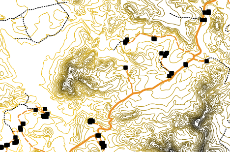

   A contour map drawn using continuous colour symbology

Unique Value Symbols
====================

Sometimes the attributes of features are not numeric, but instead **strings** are
used. 'String' is a computer term meaning a group of letters, numbers and other
writing symbols. Strings attributes are often used to classify things by name.
We can tell the GIS Application to give each unique string or number its own
colour and symbol. Road features may have different classes (e.g. 'street',
'secondary road', 'main road' etc.), each drawn in the map view of the GIS with
different colours or symbols. This is illustrated in table_unique_.

.. _table_unique:

+-----------------+-------------------------+
| Attribute Value | Colour class and symbol |
+=================+=========================+
| Arterial route  |                         |
+-----------------+-------------------------+
| Main road       |                         |
+-----------------+-------------------------+
| Secondary road  |                         |
+-----------------+-------------------------+
| Street          |                         |
+-----------------+-------------------------+

Table Unique: Unique attribute values for a feature type (e.g. roads) can each
have their own symbol.

Within the GIS Application we can open/choose to use Unique Value symbology for
a layer. The GIS will scan through all the different string values in the
attribute field and build a list of unique strings or numbers. Each unique value
can then be assigned a colour and style. This is shown in :numref:`figure_unique_symbol`.

.. _figure_unique_symbol:

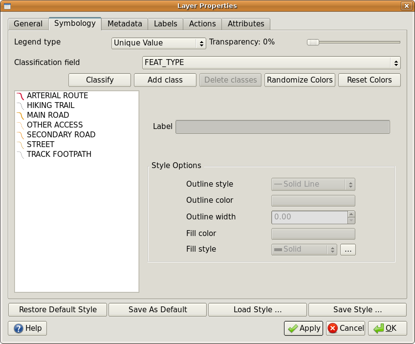

   Defining unique value symbology for roads based on the road type.

When the GIS draws the layer, it will look at the attributes of each feature
before drawing it to the screen. Based on the value in the chosen field in the
attribute table, the road line will be drawn with suitable colour and line style
(and fill style if its a polygon feature). This is shown in :numref:`figure_unique_symbol_map`.

.. _figure_unique_symbol_map:

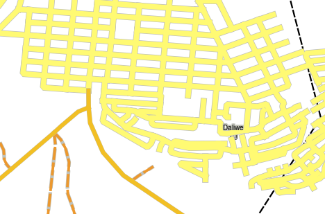

   A roads vector layer symbolised using a unique value per road type.

Things to be aware of
=====================

Deciding which attributes and symbology to use requires some planning. Before you
start collecting any **GeoSpatial** data, you should ensure you know what
attributes are needed and how it will be symbolised. It is very difficult to go
back and re-collect data if you plan poorly the first time around. Remember also
that the goal of collecting attribute data is to allow you to analyse and
interpret spatial information. How you do this depends on the questions you are
trying to answer. Symbology is a visual language that allows people to see and
understand your attribute data based on the colours and symbols you use. Because
of this you should put a lot of thought into how you symbolise your maps in order
to make them easy to understand.

What have we learned?
=====================

Let's wrap up what we covered in this worksheet:

* Vector features have **attributes**
* Attributes **describe** the **properties** of the feature
* The attributes are stored in a **table**
* Rows in the table are called **records**
* There is **one record per feature** in the vector layer
* Columns in the table are called **fields**
* Fields represent **properties** of the feature e.g. height, roof colour etc.
* Fields can contain **numerical**, **string** (any text) and **date** information
* The attribute data for a feature can be used to determine how it is **symbolised**
* **Graduated colour** symbology groups the data into discrete classes
* **Continuous colour** symbology assigns colours from a colour range to the
  features based on their attributes
* **Unique value** symbology associates each different value in the chosen
  attribute column with a different symbol (colour and style)
* If the attribute of a vector layer is not used to determine its symbology, it
  is drawn using a **single symbol** only

Now you try!
============

Here are some ideas for you to try with your learners:

* Using the table that you created in the last topic, add a new column for the
  symbology type you would use for each feature type and have the learners
  identify which symbology type they would use (see table_example_symbols_ for
  an example).
* Try to identify which symbology types you would use for the following types of
  vector features:

  - points showing pH level of soil samples taken around your school
  - lines showing a road network in a city
  - polygons for houses with an attribute that shows whether it is made of brick,
    wood or 'other' material.

.. _table_example_symbols:

+----------------------------------------+---------------+-----------------------------------------------------------------------------------------------------------------------------------------------------------------------------------------------------------------------------------------+
| Real world feature                     | Geometry Type | Symbology Type                                                                                                                                                                                                                          |
+========================================+===============+=========================================================================================================================================================================================================================================+
| The school flagpole                    | Point         | Single Symbol                                                                                                                                                                                                                           |
+----------------------------------------+---------------+-----------------------------------------------------------------------------------------------------------------------------------------------------------------------------------------------------------------------------------------+
| The soccer field                       | Polygon       | Single Symbol                                                                                                                                                                                                                           |
+----------------------------------------+---------------+-----------------------------------------------------------------------------------------------------------------------------------------------------------------------------------------------------------------------------------------+
| The footpaths in and around the school | Polyline      | Have your learners count the number of learners using each footpath in the hour before school and then use **graduated symbols** to show the popularity of each footpath                                                                |
+----------------------------------------+---------------+-----------------------------------------------------------------------------------------------------------------------------------------------------------------------------------------------------------------------------------------+
| Places where taps are located          | Point         | Single symbol                                                                                                                                                                                                                           |
+----------------------------------------+---------------+-----------------------------------------------------------------------------------------------------------------------------------------------------------------------------------------------------------------------------------------+
| Classrooms                             | Polygon       | **Unique value** based on the grade of the learners in the classroom                                                                                                                                                                    |
+----------------------------------------+---------------+-----------------------------------------------------------------------------------------------------------------------------------------------------------------------------------------------------------------------------------------+
| Fence                                  | Polyline      | Have your learners rate the condition of the fence around your school by separating it into sections and grading each section on a scale of 1\-9 based on its condition. Use **graduated symbols** to classify the condition attribute. |
+----------------------------------------+---------------+-----------------------------------------------------------------------------------------------------------------------------------------------------------------------------------------------------------------------------------------+
| Classrooms                             | Polygon       | Count the number of learners in each classroom and use a **continuous colour symbol** to define a range of colours from red to blue.                                                                                                    |
+----------------------------------------+---------------+-----------------------------------------------------------------------------------------------------------------------------------------------------------------------------------------------------------------------------------------+

Table Example Symbols: An example of a table that defines the feature types and
the kind of symbology you would use for each.

Something to think about
========================

If you don't have a computer available, you can use transparency sheets and a
1:50 000 map sheet to experiment with different symbology types. For example place
a transparency sheet over the map and using different coloured koki pens, draw
in red all contour lines below 900 m (or similar) and in green all lines above
or equal to 900 m. Can you think of how to reproduce other symbology types using
the same technique?

Further reading
===============

**Website:** https://en.wikipedia.org/wiki/Cartography

The QGIS User Guide also has more detailed information on working with attribute
data and symbology in QGIS.

What's next?
============

In the section that follows we will take a closer look at **data capture.** We
will put the things we have learned about vector data and attributes into practice
by creating new data.

.. Substitutions definitions - AVOID EDITING PAST THIS LINE
   This will be automatically updated by the find_set_subst.py script.
   If you need to create a new substitution manually,
   please add it also to the substitutions.txt file in the
   source folder.

.. |gentleLogo| image:: img/gentlelogo.png
   :width: 3em
