.. _gentle_gis_vector_data:

***********
Vector Data
***********

+-------------------+-------------+--------------------------------------------------------------------------------------------------+
| |gentleLogo|      | Objectives: | Understanding of vector data models as used in GIS.                                              |
+                   +-------------+--------------------------------------------------------------------------------------------------+
|                   | Keywords:   | Vector, Point, Polyline, Polygon, Vertex, Geometry, Scale, Data Quality, Symbology, Data Sources |
+-------------------+-------------+--------------------------------------------------------------------------------------------------+

Overview
========

**Vector** data provide a way to represent real world **features** within the GIS
environment. A feature is anything you can see on the landscape. Imagine you are
standing on the top of a hill. Looking down you can see houses, roads, trees,
rivers, and so on (see :numref:`figure_vector_landscape`). Each one of these things would be a
**feature** when we represent them in a GIS Application. Vector features have
**attributes**, which consist of text or numerical information that **describe**
the features.

.. _figure_vector_landscape:

.. figure:: img/landscape.jpg
   :align: center
   :width: 30em

   Looking over a landscape you can see the main features, such as roads, houses
   and trees.

A vector feature has its shape represented using **geometry**. The geometry is
made up of one or more interconnected **vertices**. A vertex describes a position
in space using an **X**, **Y** and optionally **Z** axis. Geometries which have
vertices with a ``Z`` axis are often referred to as **2.5D** since they describe
height or depth at each vertex, but not both.

When a feature's geometry consists of only a single vertex, it is referred to as
a **point** feature (see illustration :numref:`figure_geometry_point`). Where the geometry
consists of two or more vertices and the first and last vertex are not equal, a
**polyline** feature is formed (see illustration :numref:`figure_geometry_polyline`). Where
three or more vertices are present, and the last vertex is equal to the first, an
enclosed **polygon** feature is formed (see illustration :numref:`figure_geometry_polygon`).

.. _figure_geometry_point:

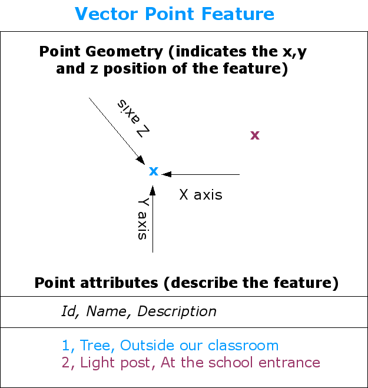

   A point feature is described by its X, Y and optionally Z coordinate. The point
   attributes describe the point e.g. if it is a tree or a lamp post.

.. _figure_geometry_polyline:

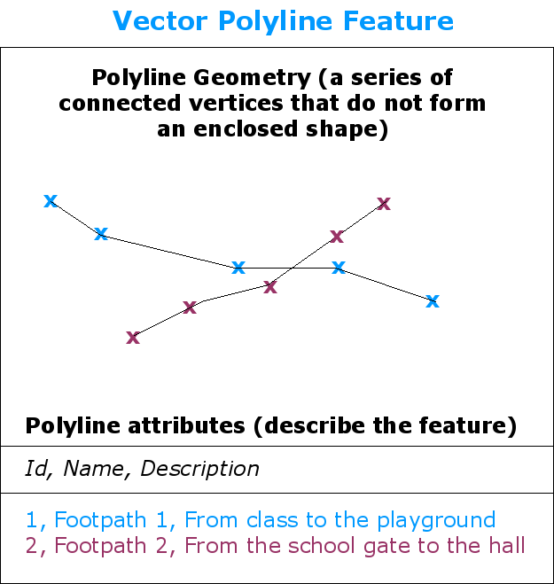

   A polyline is a sequence of joined vertices. Each vertex has an X, Y (and
   optionally Z) coordinate. Attributes describe the polyline.

.. _figure_geometry_polygon:

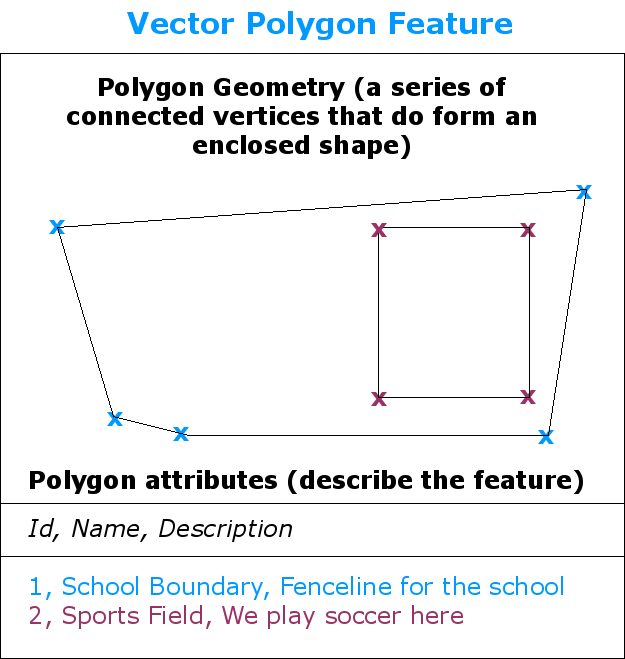

   A polygon, like a polyline, is a sequence of vertices. However in a polygon,
   the first and last vertices are always at the same position.

Looking back at the picture of a landscape we showed you further up, you should
be able to see the different types of features in the way that a GIS represents
them now (see illustration :numref:`figure_geometry_landscape`).

.. _figure_geometry_landscape:

.. figure:: img/landscape_geometry.jpg
   :align: center
   :width: 30em

   Landscape features as we would present them in a GIS. Rivers (blue) and roads
   (green) can be represented as lines, trees as points (red) and houses as
   polygons (white).

Point features in detail
========================

The first thing we need to realise when talking about point features is that what
we describe as a point in GIS is a matter of opinion, and often dependent on
scale. let's look at cities for example. If you have a small scale map (which
covers a large area), it may make sense to represent a city using a point feature.
However as you zoom in to the map, moving towards a larger scale, it makes more
sense to show the city limits as a polygon.

When you choose to use points to represent a feature is mostly a matter of scale
(how far away are you from the feature), convenience (it takes less time and
effort to create point features than polygon features), and the type of feature
(some things like telephone poles just don't make sense to be stored as polygons).

As we show in illustration :numref:`figure_geometry_point`, a point feature has an X, Y
and optionally, Z value. The X and Y values will depend on the **Coordinate
Reference System** (CRS) being used. We are going to go into more detail about
Coordinate Reference Systems in a later tutorial. For now let's simply say that
a CRS is a way to accurately describe where a particular place is on the earth's
surface. One of the most common reference systems is **Longitude and Latitude**.
Lines of Longitude run from the North Pole to the South Pole. Lines of Latitude
run from the East to West. You can describe precisely where you are at any place
on the earth by giving someone your Longitude (X) and Latitude (Y). If you make
a similar measurement for a tree or a telephone pole and marked it on a map, you
will have created a point feature.

Since we know the earth is not flat, it is often useful to add a Z value to a
point feature. This describes how high above sea level you are.

Polyline features in detail
===========================

Where a point feature is a single vertex, **a polyline has two or more vertices**.
The polyline is a continuous path drawn through each vertex, as shown in
:numref:`figure_geometry_polyline`. When two vertices are joined, a line is created. When
more than two are joined, they form a 'line of lines', or **polyline**.

A polyline is used to show the geometry of **linear features** such as roads,
rivers, contours, footpaths, flight paths and so on. Sometimes we have special
rules for polylines in addition to their basic geometry. For example contour
lines may touch (e.g. at a cliff face) but should never cross over each other.
Similarly, polylines used to store a road network should be connected at
intersections. In some GIS applications you can set these special rules for a
feature type (e.g. roads) and the GIS will ensure that these polylines always
comply to these rules.

If a curved polyline has very large distances between vertices, it may appear
**angular** or jagged, depending on the scale at which it is viewed (see
:numref:`figure_polyline_jagged`). Because of this it is important that polylines are
digitised (captured into the computer) with distances between vertices that are
small enough for the scale at which you want to use the data.

.. _figure_polyline_jagged:

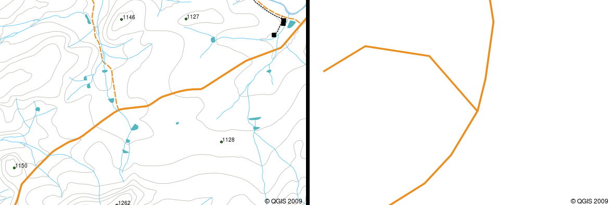

   Polylines viewed at a smaller scale (1:20 000 to the left) may appear smooth
   and curved. When zoomed in to a larger scale (1:500 to the right) polylines
   may look very angular.

The **attributes** of a polyline describe its properties or characteristics. For
example a road polyline may have attributes that describe whether it is surfaced
with gravel or tar, how many lanes it has, whether it is a one way street, and
so on. The GIS can use these attributes to symbolise the polyline feature with a
suitable colour or line style.

Polygon features in detail
==========================

Polygon features are **enclosed areas** like dams, islands, country boundaries
and so on. Like polyline features, polygons are created from a series of vertices
that are connected with a continuous line. However because a polygon always
describes an enclosed area, the first and last vertices should always be at the
same place! Polygons often have **shared geometry** –-- boundaries that are in
common with a neighbouring polygon. Many GIS applications have the capability to
ensure that the boundaries of neighbouring polygons exactly coincide. We will
explore this in the :ref:`gentle_gis_topology` topic later in this tutorial.

As with points and polylines, polygons have **attributes**. The attributes
describe each polygon. For example a dam may have attributes for depth and water
quality.

Vector data in layers
=====================

Now that we have described what vector data is, let's look at how vector data is
managed and used in a GIS environment. Most GIS applications group vector features
into **layers**. Features in a layer have the same geometry type (e.g. they
will all be points) and the same kinds of attributes (e.g. information about what
species a tree is for a trees layer). For example if you have recorded the
positions of all the footpaths in your school, they will usually be stored
together on the computer hard disk and shown in the GIS as a single layer. This
is convenient because it allows you to hide or show all of the features for that
layer in your GIS application with a single mouse click.

Editing vector data
===================

The GIS application will allow you to create and modify the geometry data in a
layer --– a process called **digitising** –-- which we will look at more closely
in a later tutorial. If a layer contains polygons (e.g. farm dams), the GIS
application will only allow you to create new polygons in that layer. Similarly
if you want to change the shape of a feature, the application will only allow you
to do it if the changed shape is correct. For example it won't allow you to edit
a line in such a way that it has only one vertex –-- remember in our discussion
of lines above that all lines must have at least two vertices.

Creating and editing vector data is an important function of a GIS since it is
one of the main ways in which you can create personal data for things you are
interested in. Say for example you are monitoring pollution in a river. You could
use the GIS to digitise all outfalls for storm water drains (as point features).
You could also digitise the river itself (as a polyline feature). Finally you
could take readings of pH levels along the course of the river and digitise the
places where you made these readings (as a point layer).

As well as creating your own data, there is a lot of free vector data that you
can obtain and use. For example, you can obtain vector data that appears on the
1:50 000 map sheets from the Chief Directorate: Surveys and Mapping.

Scale and vector data
=====================

Map **scale** is an important issue to consider when working with vector data in
a GIS. When data is captured, it is usually digitised from existing maps, or by
taking information from surveyor records and global positioning system devices.
Maps have different scales, so if you import vector data from a map into a GIS
environment (for example by digitising paper maps), the digital vector data will
have the same scale issues as the original map. This effect can be seen in
illustrations :numref:`figure_vector_small_scale` and :numref:`figure_vector_large_scale`. Many
issues can arise from making a poor choice of map scale. For example using the
vector data in illustration :numref:`figure_vector_small_scale` to plan a wetland
conservation area could result in important parts of the wetland being left out
of the reserve! On the other hand if you are trying to create a regional map,
using data captured at 1:1000 000 might be just fine and will save you a lot of
time and effort capturing the data.

.. _figure_vector_small_scale:

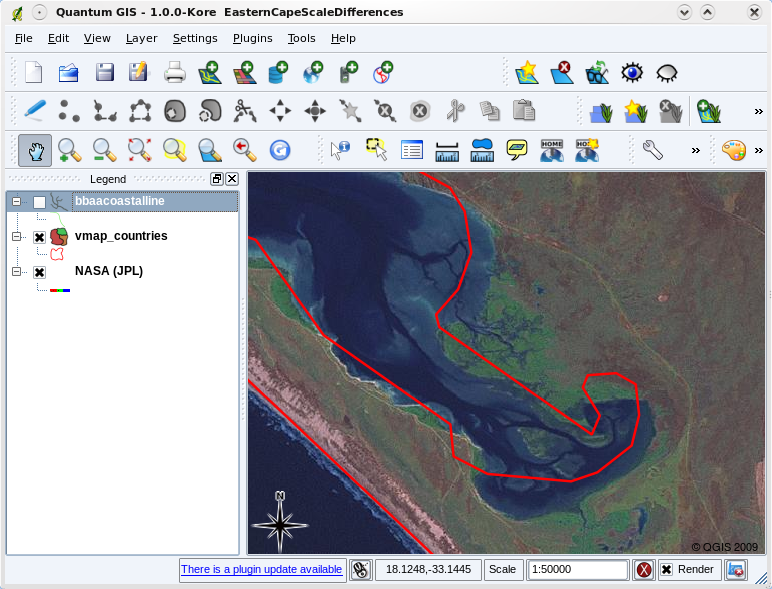

   Vector data (red lines) that was digitised from a small scale (1:1000 000) map.

.. _figure_vector_large_scale:

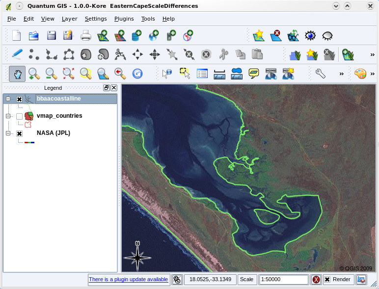

   Vector data (green lines) that was digitised from a large scale (1:50 000) map.

Symbology
=========

When you add vector layers to the map view in a GIS application, they will be
drawn with random colours and basic symbols. One of the great advantages of using
a GIS is that you can create personalised maps very easily. The GIS program will
let you choose colours to suite the feature type (e.g. you can tell it to draw a
water bodies vector layer in blue). The GIS will also let you adjust the symbol
used. So if you have a trees point layer, you can show each tree position with a
small picture of a tree, rather than the basic circle marker that the GIS uses
when you first load the layer (see illustrations :numref:`figure_vector_symbology`,
:numref:`figure_generic_symbology` and :numref:`figure_custom_symbology`).

.. _figure_vector_symbology:

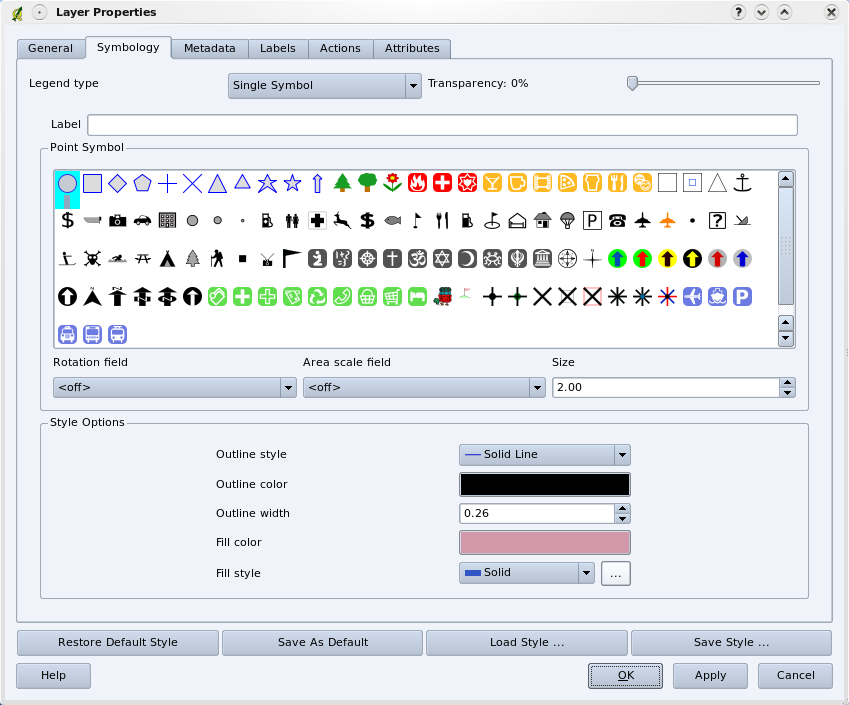

   In the GIS, you can use a panel (like the one above) to adjust how features
   in your layer should be drawn.

.. _figure_generic_symbology:

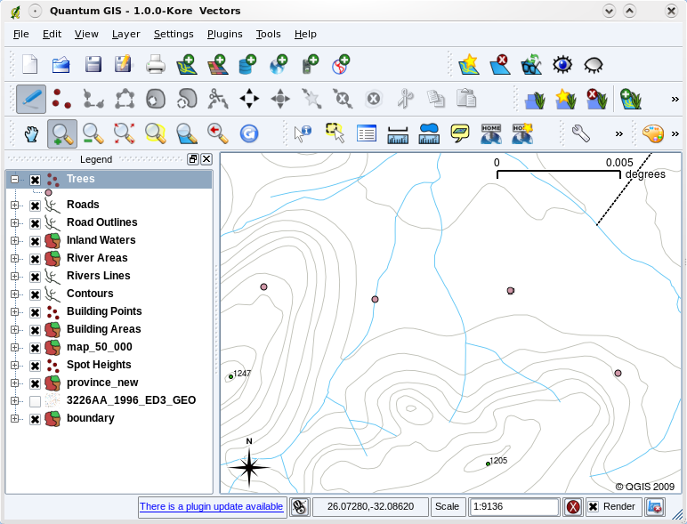

   When a layer (for example the trees layer above) is first loaded, a GIS
   application will give it a generic symbol.

.. _figure_custom_symbology:

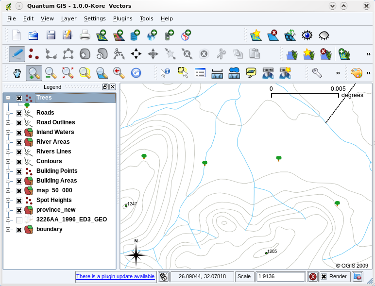

   After making our adjustments it is much easier to see that our points represent
   trees.

Symbology is a powerful feature, making maps come to life and the data in your
GIS easier to understand. In the topic that follows (:ref:`gentle_gis_attributes`)
we will explore more deeply how symbology can help the user to understand vector
data.

What can we do with vector data in a GIS?
=========================================

At the simplest level we can use vector data in a GIS Application in much the
same way you would use a normal topographic map. The real power of GIS starts to
show itself when you start to ask questions like 'which houses are within the 100
year flood level of a river?'; 'where is the best place to put a hospital so that
it is easily accessible to as many people as possible?'; 'which learners live in
a particular suburb?'. A GIS is a great tool for answering these types of
questions with the help of vector data. Generally we refer to the process of
answering these types of questions as **spatial analysis**. In later topics of
this tutorial we will look at spatial analysis in more detail.

Common problems with vector data
================================

Working with vector data does have some problems. We already mentioned the issues
that can arise with vectors captured at different scales. Vector data also needs
a lot of work and maintenance to ensure that it is accurate and reliable.
Inaccurate vector data can occur when the instruments used to capture the data
are not properly set up, when the people capturing the data aren't being careful,
when time or money don't allow for enough detail in the collection process, and
so on.

If you have poor quality vector data, you can often detect this when viewing the
data in a GIS. For example **slivers** can occur when the edges of two polygon
areas don't meet properly (see :numref:`figure_vector_slivers`).

.. _figure_vector_slivers:

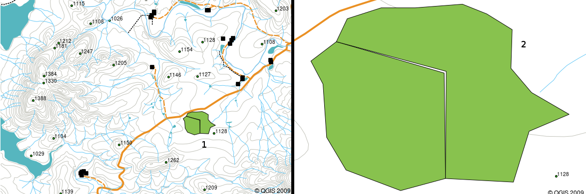

   Slivers occur when the vertices of two polygons do not match up on their
   borders. At a small scale (e.g. 1 on left) you may not be able to see these
   errors. At a large scale they are visible as thin strips between two polygons
   (2 on right).

**Overshoots** can occur when a line feature such as a road does not meet another
road exactly at an intersection. **Undershoots** can occur when a line feature
(e.g. a river) does not exactly meet another feature to which it should be
connected. Figure :numref:`figure_vector_shoots` demonstrates what undershoots and
overshoots look like.

.. _figure_vector_shoots:

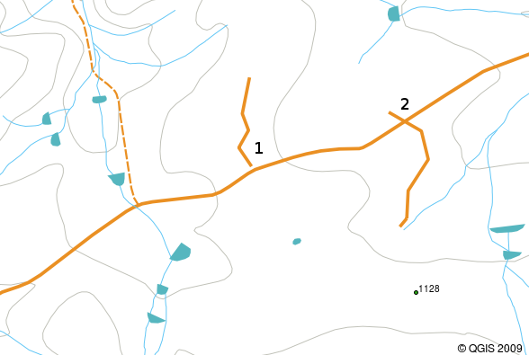

   Undershoots (1) occur when digitised vector lines that should connect to each
   other don’t quite touch. Overshoots (2) happen if a line ends beyond the line
   it should connect to.

Because of these types of errors, it is very important to digitise data carefully
and accurately. In the upcoming topic on **topology**, we will examine some of
these types of errors in more detail.

What have we learned?
=====================

Let's wrap up what we covered in this worksheet:

* **Vector data** is used to represent real world **features** in a GIS.
* A vector feature can have a **geometry** type of **point**, **line** or a
  **polygon**.
* Each vector feature has **attribute data** that describes it.
* Feature geometry is described in terms of **vertices.**
* Point geometries are made up of a **single vertex** (X,Y and optionally Z).
* Polyline geometries are made up of **two or more** vertices forming a connected
  line.
* Polygon geometries are made up of **at least four vertices** forming an enclosed
  area. The first and last vertices are always in the same place.
* Choosing which geometry type to use depends on scale, convenience and what you
  want to do with the data in the GIS.
* Most GIS applications do not allow you to mix more than one geometry type in a
  single layer.
* Digitising is the process of creating digital vector data by drawing it in a
  GIS application.
* Vector data can have quality issues such as **undershoots**, **overshoots** and
  **slivers** which you need to be aware of.
* Vector data can be used for **spatial analysis** in a GIS application, for
  example to find the nearest hospital to a school.

We have summarised the GIS Vector Data concept in Figure :numref:`figure_vector_summary`.

.. _figure_vector_summary:

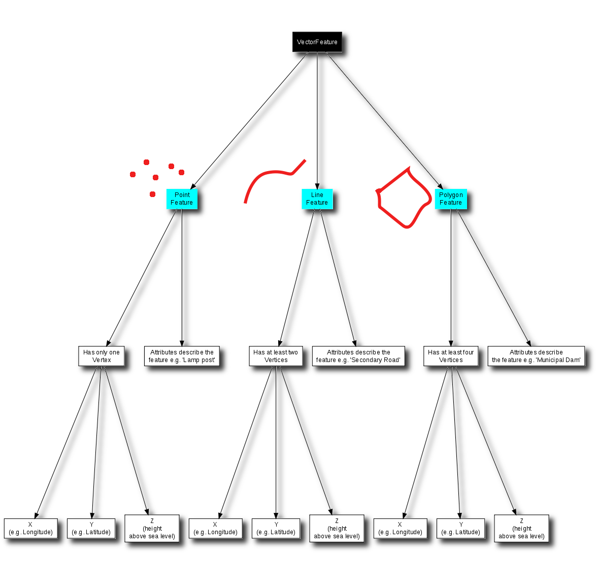

   This diagram shows how GIS applications deal with vector data.

Now you try!
============

Here are some ideas for you to try with your learners:

* Using a copy of a toposheet map for your local area (like the one shown in
  :numref:`figure_sample_map`), see if your learners can identify examples of the different
  types of vector data by highlighting them on the map.
* Think of how you would create vector features in a GIS to represent real world
  features on your school grounds. Create a table of different features in and
  around your school and then task your learners to decide whether they would be
  best represented in the GIS as a point, line or polygon. See table_vector_1_
  for an example.

.. _figure_sample_map:

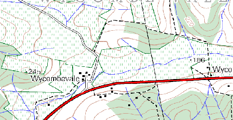

   Can you identify two point features and one polygon feature on this map?

.. _table_vector_1:

+----------------------------------------+------------------------+
| Real world feature                     | Suitable Geometry Type |
+========================================+========================+
| The school flagpole                    |                        |
+----------------------------------------+------------------------+
| The soccer field                       |                        |
+----------------------------------------+------------------------+
| The footpaths in and around the school |                        |
+----------------------------------------+------------------------+
| Places where taps are located          |                        |
+----------------------------------------+------------------------+
| Etc.                                   |                        |
+----------------------------------------+------------------------+

Table Vector 1: Create a table like this (leaving the geometry type column empty)
and ask your learners to decide on suitable geometry types.

Something to think about
========================

If you don't have a computer available, you can use a toposheet and transparency
sheets to show your learners about vector data.

Further reading
===============

The QGIS User Guide also has more detailed information on working with vector
data in QGIS.

What's next?
============

In the section that follows we will take a closer look at **attribute data** to
see how it can be used to describe vector features.

.. Substitutions definitions - AVOID EDITING PAST THIS LINE
   This will be automatically updated by the find_set_subst.py script.
   If you need to create a new substitution manually,
   please add it also to the substitutions.txt file in the
   source folder.

.. |gentleLogo| image:: img/gentlelogo.png
   :width: 3em
