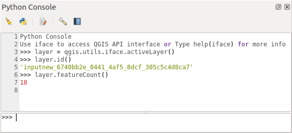

.. highlight:: python
   :linenothreshold: 5

.. _introduction:

************
Introduction
************

This document is intended to be both a tutorial and a reference
guide. While it does not list all possible use cases, it should
give a good overview of the principal functionality.

Permission is granted to copy, distribute and/or modify this document under the
terms of the GNU Free Documentation License, Version 1.3 or any later version
published by the Free Software Foundation; with no Invariant Sections, no
Front-Cover Texts, and no Back-Cover Texts.

A copy of the license is included in the section :ref:`gnu_fdl`.

This license also applies to all code snippets in this document.

.. only:: html

   .. contents::
      :local:

Python support was first introduced in QGIS 0.9.
There are several ways to use Python in QGIS Desktop
(covered in the following sections):

* Issue commands in the Python console within QGIS
* Create and use plugins
* Automatically run Python code when QGIS starts
* Create processing algorithms
* Create functions for expressions in QGIS
* Create custom applications based on the QGIS API

Python bindings are also available for QGIS Server, including
Python plugins (see :ref:`server_plugins`)
and Python bindings that can be used to embed QGIS Server into a
Python application.

.. index:: API

There is a :api:`complete QGIS C++ API <>` reference that
documents the classes from the QGIS libraries. :pyqgis:`The Pythonic QGIS API
(pyqgis) <>` is nearly identical to the C++ API.

Another good resource for learning how to perform common tasks is to
download existing plugins from the
`plugin repository <https://plugins.qgis.org/>`_ and examine their
code.

.. index::
  pair: Python; Console

.. _pythonconsole:

Scripting in the Python Console
===============================

QGIS provides an integrated :ref:`Python console <console>` for scripting.
It can be opened from the :menuselection:`Plugins --> Python Console` menu:

   QGIS Python console

The screenshot above illustrates how to get the layer currently
selected in the layer list, show its ID and optionally, if it is a
vector layer, show the feature count.
For interaction with the QGIS environment, there is an :data:`iface`
variable, which is an instance of
:class:`QgisInterface <qgis.gui.QgisInterface>`.
This interface allows access to the map canvas, menus, toolbars and
other parts of the QGIS application.

For user convenience, the following statements are executed
when the console is started (in the future it will be possible to set
further initial commands)

::

  from qgis.core import *
  import qgis.utils

For those which use the console often, it may be useful to set a
shortcut for triggering the console (within
:menuselection:`Settings --> Keyboard shortcuts...`)

.. index:: Python; Plugins

Python Plugins
==============

The functionality of QGIS can be extended using plugins.
Plugins can be written in Python.
The main advantage over C++ plugins is simplicity of
distribution (no compiling for each platform) and easier
development.

Many plugins covering various functionality have been written since
the introduction of Python support. The plugin installer allows users
to easily fetch, upgrade and remove Python plugins.
See the `Python Plugins <https://plugins.qgis.org/>`_ page for more
information about plugins and plugin development.

Creating plugins in Python is simple, see :ref:`developing_plugins`
for detailed instructions.

.. note::

    Python plugins are also available for QGIS server.
    See :ref:`server_plugins` for further details.

Processing Plugins
------------------

Processing Plugins can be used to process data. They are easier to develop,
more specific and more lightweight than Python Plugins. :ref:`processing_plugin`
explains when the use of Processing algorithms is appropiate and how to develop
them.

.. index::
  pair: Python; Startup

Running Python code when QGIS starts
====================================

There are different methods to run Python code every time QGIS
starts.

1. Creating a startup.py script

2. Setting the ``PYQGIS_STARTUP`` environment variable to an
   existing Python file
   
3. Specifying a startup script using the ``--code init_qgis.py``
   parameter.

The :file:`startup.py` file
----------------------------

Every time QGIS starts, the user's Python home directory and a list
of system paths are searched for a file named :file:`startup.py`. If that file exists, it
is executed by the embedded Python interpreter.

The path in the user's home directory usually is found under:

* Linux: :file:`.local/share/QGIS/QGIS3`
* Windows: :file:`AppData\\Roaming\\QGIS\\QGIS3`
* macOS: :file:`Library/Application Support/QGIS/QGIS3`

The default system paths depend on the operating system. To find the
paths that work for you, open the Python Console and run
``QStandardPaths.standardLocations(QStandardPaths.AppDataLocation)``
to see the list of default directories.

The ``startup.py`` script is executed immediately upon initializing
python in QGIS, early on in the start of the application.

.. index::
  pair: Environment; PYQGIS_STARTUP

The PYQGIS_STARTUP environment variable
---------------------------------------

You can run Python code just before QGIS initialization completes by
setting the ``PYQGIS_STARTUP`` environment variable to the path of an
existing Python file.

This code will run before QGIS initialization is complete.
This method is very useful for cleaning
sys.path, which may have undesireable paths, or for isolating/loading
the initial environment without requiring a virtual environment, e.g.
homebrew or MacPorts installs on Mac.

.. index::
  pair: Python; Custom applications
  pair: Python; Standalone scripts

The ``--code`` parameter
------------------------

You can provide custom code to execute as startup parameter
to QGIS. To do so, create a python file, for example ``qgis_init.py``, to execute and
start QGIS from the command line using ``qgis --code qgis_init.py``.

Code provided via ``--code`` is executed late in the QGIS initialization
phase, after the application components have been loaded.

Additional arguments for Python
-------------------------------

To provide additional arguments for your ``--code`` script or for
other python code that is executed, you can use the ``--py-args``
argument. Any argument coming after ``--py-args`` and before a
``--`` arg (if present) will be passed to Python but ignored by
the QGIS application itself.

In the following example, ``myfile.tif`` will be available via
``sys.argv`` in Python but will not be loaded by QGIS. Whereas
``otherfile.tif`` will be loaded by QGIS but is not present in
``sys.argv``.

.. code-block:: bash

  qgis --code qgis_init.py --py-args myfile.tif -- otherfile.tif
  
If you want access to every command line parameter from within
Python, you can use ``QCoreApplication.arguments()``

.. code-block:: python

  QgsApplication.instance().arguments()

.. _pythonapplications:

Python Applications
===================

It is often handy to create  scripts for automating processes.
With PyQGIS, this is perfectly possible --- import
the :pyqgis:`qgis.core <core>` module, initialize it and you are ready for the
processing.

Or you may want to create an interactive application that uses
GIS functionality --- perform measurements, export a map as PDF, ...
The :pyqgis:`qgis.gui <gui>` module provides various GUI
components, most notably the map canvas widget that can be
incorporated into the application with support for zooming, panning
and/or any further custom map tools.

PyQGIS custom applications or standalone scripts must be configured to
locate the QGIS resources, such as projection information and providers
for reading vector and raster layers. QGIS Resources are
initialized by adding a few lines to the beginning of your application
or script. The code to initialize QGIS for custom applications and
standalone scripts is similar. Examples of each are provided
below.

.. note::

     Do *not* use :file:`qgis.py` as a name for your script.
     Python will not be able to import the bindings as the script's
     name will shadow them.

.. _standalonescript:

Using PyQGIS in standalone scripts
----------------------------------

To start a standalone script, initialize the QGIS resources at the
beginning of the script:

.. code-block:: python

  from qgis.core import *

  # Supply path to qgis install location
  QgsApplication.setPrefixPath("/path/to/qgis/installation", True)

  # Create a reference to the QgsApplication.  Setting the
  # second argument to False disables the GUI.
  qgs = QgsApplication([], False)

  # Load providers
  qgs.initQgis()

  # Write your code here to load some layers, use processing
  # algorithms, etc.

  # Finally, exitQgis() is called to remove the
  # provider and layer registries from memory
  qgs.exitQgis()

First we import the :pyqgis:`qgis.core <core>` module and configure
the prefix path. The prefix path is the location where QGIS is
installed on your system. It is configured in the script by calling
the :meth:`setPrefixPath() <qgis.core.QgsApplication.setPrefixPath>` method.
The second argument of
:meth:`setPrefixPath() <qgis.core.QgsApplication.setPrefixPath>`
is set to :const:`True`, specifying that default paths are to be
used.

The QGIS install path varies by platform; the easiest way to find it
for your system is to use the :ref:`pythonconsole` from within
QGIS and look at the output from running:

.. code-block:: python

  QgsApplication.prefixPath()

After the prefix path is configured, we save a reference to
:class:`QgsApplication <qgis.core.QgsApplication>` in the variable ``qgs``.
The second argument is set to :const:`False`, specifying that we do not plan
to use the GUI since we are writing a standalone script. With ``QgsApplication``
configured, we load the QGIS data providers and layer registry by
calling the :meth:`initQgis() <qgis.core.QgsApplication.initQgis>` method.

.. code-block:: python

  qgs.initQgis()

With QGIS initialized, we are ready to write the rest of the script.
Finally, we wrap up by calling :meth:`exitQgis() <qgis.core.QgsApplication.exitQgis>`
to remove the data providers and layer registry from memory.

.. code-block:: python

  qgs.exitQgis()

Using PyQGIS in custom applications
-----------------------------------

The only difference between :ref:`standalonescript` and a custom PyQGIS
application is the second argument when instantiating the
:class:`QgsApplication <qgis.core.QgsApplication>`.
Pass :const:`True` instead of :const:`False` to indicate that we plan to
use a GUI.

.. code-block:: python

  from qgis.core import *

  # Supply the path to the qgis install location
  QgsApplication.setPrefixPath("/path/to/qgis/installation", True)

  # Create a reference to the QgsApplication.
  # Setting the second argument to True enables the GUI.  We need
  # this since this is a custom application.

  qgs = QgsApplication([], True)

  # load providers
  qgs.initQgis()

  # Write your code here to load some layers, use processing
  # algorithms, etc.

  # Finally, exitQgis() is called to remove the
  # provider and layer registries from memory
  qgs.exitQgis()

Now you can work with the QGIS API - load layers and do some processing or fire
up a GUI with a map canvas. The possibilities are endless :-)

.. index::
  pair: Custom applications; Running

Running Custom Applications
---------------------------

You need to tell your system where to search for QGIS libraries and
appropriate Python modules if they are not in a well-known location -
otherwise Python will complain::

  >>> import qgis.core
  ImportError: No module named qgis.core

This can be fixed by setting the ``PYTHONPATH`` environment variable. In
the following commands, ``<qgispath>`` should be replaced with your actual
QGIS installation path:

* on Linux: :command:`export PYTHONPATH=/<qgispath>/share/qgis/python`
* on Windows: :command:`set PYTHONPATH=c:\\<qgispath>\\python`
* on macOS: :command:`export PYTHONPATH=/<qgispath>/Contents/Resources/python`

Now, the path to the PyQGIS modules is known, but they depend on
the ``qgis_core`` and ``qgis_gui`` libraries (the Python modules serve
only as wrappers). The path to these libraries may be unknown to the
operating system, and then you will get an import error again (the message
might vary depending on the system)::

  >>> import qgis.core
  ImportError: libqgis_core.so.3.2.0: cannot open shared object file:
    No such file or directory

Fix this by adding the directories where the QGIS libraries reside to
the search path of the dynamic linker:

* on Linux: :command:`export LD_LIBRARY_PATH=/<qgispath>/lib`
* on Windows: :command:`set PATH=C:\\<qgispath>\\bin;C:\\<qgispath>\\apps\\<qgisrelease>\\bin;%PATH%`
  where ``<qgisrelease>`` should be replaced with the type of release
  you are targeting (eg, ``qgis-ltr``, ``qgis``, ``qgis-dev``)

These commands can be put into a bootstrap script that will take care of
the startup. When deploying custom applications using PyQGIS, there are
usually two possibilities:

* require the user to install QGIS prior to installing your
  application. The application installer should look for default locations
  of QGIS libraries and allow the user to set the path if not found. This
  approach has the advantage of being simpler, however it requires the user
  to do more steps.

* package QGIS together with your application. Releasing the application
  may be more challenging and the package will be larger, but the user will
  be saved from the burden of downloading and installing additional pieces
  of software.

The two deployment models can be mixed.  You can provide a standalone
applications on Windows and macOS, but for Linux leave the installation of
GIS up to the user and his package manager.

Technical notes on PyQt and SIP
===============================

We've decided for Python as it's one of the most favoured languages for
scripting. PyQGIS bindings in QGIS 3 depend on SIP and PyQt5.
The reason for using SIP instead of the more widely used SWIG is that the
QGIS code depends on Qt libraries. Python bindings for Qt (PyQt) are
done using SIP and this allows seamless integration of PyQGIS with
PyQt.
