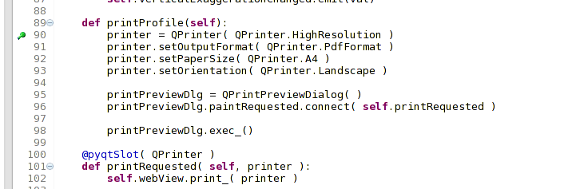
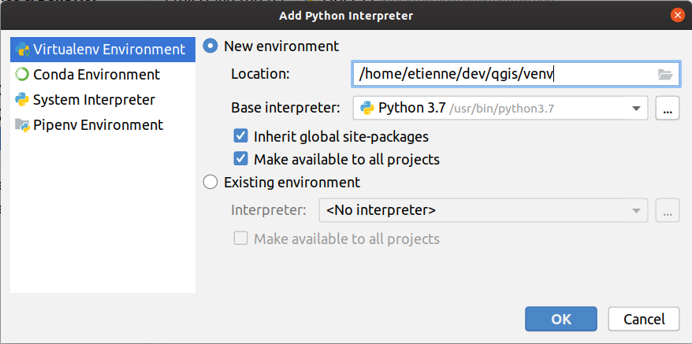
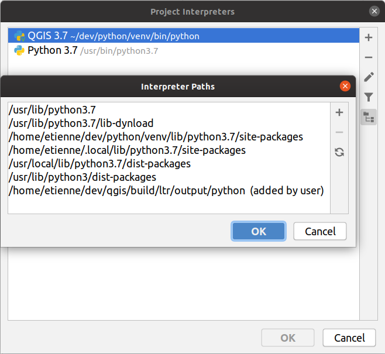

.. index:: Plugins; Debugging

**********************************************
IDE settings for writing and debugging plugins
**********************************************

.. only:: html

   .. contents::
      :local:

Although each programmer has his preferred IDE/Text editor, here are some
recommendations for setting up popular IDE's for writing and debugging QGIS
Python plugins.

Useful plugins for writing Python plugins
=========================================

Some plugins are convenient when writing Python plugins.
From :menuselection:`Plugins --> Manage and Install plugins…`, install:

* *Plugin reloader*: This will let you reload a plugin and pull new
  changes without restarting QGIS.
* *First Aid*: This will add a Python console and local debugger
  to inspect variables when an exception is raised from a plugin.

.. warning:: Despite our constant efforts, information beyond this line may not be updated for QGIS 3.

A note on configuring your IDE on Linux and Windows
====================================================

**On Linux**, all that usually needs to be done is to add the QGIS library locations
to the user's ``PYTHONPATH`` environment variable. Under most distributions,
this can be done by editing :file:`~/.bashrc` or :file:`~/.bash-profile` with
the following line (tested on OpenSUSE Tumbleweed):

.. code-block:: bash

  export PYTHONPATH="$PYTHONPATH:/usr/share/qgis/python/plugins:/usr/share/qgis/python"

Save the file and implement the environment settings by using the following
shell command:

.. code-block:: bash

  source ~/.bashrc

**On Windows**, you need to make sure that you have the same environment
settings and use the same libraries and interpreter as QGIS. The fastest
way to do this is to modify the startup batch file of QGIS.

If you used the OSGeo4W Installer, you can find this under the ``bin`` folder
of your OSGeo4W install. Look for something like
:file:`C:\\OSGeo4W\\bin\\qgis-unstable.bat`.

Debugging using Pyscripter IDE (Windows)
========================================

For using `Pyscripter IDE <https://github.com/pyscripter/pyscripter>`_,
here's what you have to do:

#. Make a copy of :file:`qgis-unstable.bat` and rename it ``pyscripter.bat``.
#. Open it in an editor. And remove the last line, the one that starts QGIS.
#. Add a line that points to your Pyscripter executable and add the
   command line argument that sets the version of Python to be used
#. Also add the argument that points to the folder where Pyscripter can
   find the Python dll used by QGIS, you can find this under the bin folder
   of your OSGeoW install

   .. code-block:: bat

     @echo off
     SET OSGEO4W_ROOT=C:\OSGeo4W
     call "%OSGEO4W_ROOT%"\bin\o4w_env.bat
     call "%OSGEO4W_ROOT%"\bin\gdal16.bat
     @echo off
     path %PATH%;%GISBASE%\bin
     Start C:\pyscripter\pyscripter.exe --python25 --pythondllpath=C:\OSGeo4W\bin

#. Now when you double click this batch file it will start Pyscripter, with the
   correct path.

More popular than Pyscripter, Eclipse is a common choice among developers. In
the following section, we will be explaining how to configure it for
developing and testing plugins. 

Debugging using Eclipse and PyDev
=================================

Installation
------------

To use Eclipse, make sure you have installed the following

* `Eclipse <https://www.eclipse.org>`_
* `Aptana Studio 3 Plugin <http://www.aptana.com>`_ or `PyDev <https://www.pydev.org>`_
* QGIS 2.x
* You may also want to install **Remote Debug**, a QGIS plugin. At the moment
  it's still experimental so enable |checkbox| :guilabel:`Experimental plugins`
  under :menuselection:`Plugins --> Manage and Install plugins... --> Options`
  beforehand.

To prepare your environment for using Eclipse in Windows,
you should also create a batch file and use it to start Eclipse:

#. Locate the folder where :file:`qgis_core.dll` resides in. Normally this is
   :file:`C:\\OSGeo4W\\apps\\qgis\\bin`, but if you compiled your own QGIS
   application this is in your build folder in :file:`output/bin/RelWithDebInfo`
#. Locate your :file:`eclipse.exe` executable.
#. Create the following script and use this to start eclipse when developing
   QGIS plugins.

   .. code-block:: bat

     call "C:\OSGeo4W\bin\o4w_env.bat"
     set PATH=%PATH%;C:\path\to\your\qgis_core.dll\parent\folder
     start /B C:\path\to\your\eclipse.exe

Setting up Eclipse
------------------

#. In Eclipse, create a new project. You can select *General Project* and link
   your real sources later on, so it does not really matter where you place
   this project.

   .. figure:: img/eclipsenewproject.png
      :align: center

      Eclipse project

#. Right-click your new project and choose :menuselection:`New --> Folder`.
#. Click :guilabel:`Advanced` and choose :guilabel:`Link to alternate location
   (Linked Folder)`. In case you already have sources you want to debug, choose
   these. In case you don't, create a folder as it was already explained.

Now in the view :guilabel:`Project Explorer`, your source tree pops up and you
can start working with the code. You already have syntax highlighting and all
the other powerful IDE tools available.

Configuring the debugger
------------------------

To get the debugger working:

#. Switch to the Debug perspective in Eclipse
   (:menuselection:`Window --> Open Perspective --> Other --> Debug`).
#. start the PyDev debug server by choosing :menuselection:`PyDev --> Start
   Debug Server`.
#. Eclipse is now waiting for a connection from QGIS to its debug server and
   when QGIS connects to the debug server it will allow it to control the python
   scripts. That's exactly what we installed the *Remote Debug* plugin for. So
   start QGIS in case you did not already and click the bug symbol.

Now you can set a breakpoint and as soon as the code hits it, execution will
stop and you can inspect the current state of your plugin. (The breakpoint is
the green dot in the image below, set one by double clicking in the white space
left to the line you want the breakpoint to be set).

   Breakpoint

A very interesting thing you can make use of now is the debug console. Make
sure that the execution is currently stopped at a break point, before you
proceed.

#. Open the Console view (:menuselection:`Window --> Show view`).
   It will show the :guilabel:`Debug Server` console which is not very
   interesting. But there is a button :guilabel:`Open Console` which lets you
   change to a more interesting PyDev Debug Console.
#. Click the arrow next to the :guilabel:`Open Console` button and choose
   *PyDev Console*. A window opens up to ask you which console you want to start.
#. Choose *PyDev Debug Console*. In case its greyed out and tells you to Start
   the debugger and select the valid frame, make sure that you've got the remote
   debugger attached and are currently on a breakpoint.

   .. figure:: img/console-buttons.png
      :align: center

      PyDev Debug Console

You have now an interactive console which lets you test any commands from
within the current context. You can manipulate variables or make API calls or
whatever you like.

.. tip:: A little bit annoying is, that every time you enter a command, the
  console switches back to the Debug Server. To stop this behavior, you can
  click the *Pin Console* button when on the Debug Server page and it should
  remember this decision at least for the current debug session.

Making eclipse understand the API
---------------------------------

A very handy feature is to have Eclipse actually know about the QGIS API. This
enables it to check your code for typos. But not only this, it also enables
Eclipse to help you with autocompletion from the imports to API calls.

To do this, Eclipse parses the QGIS library files and gets all the information
out there. The only thing you have to do is to tell Eclipse where to find the
libraries.

#. Click :menuselection:`Window --> Preferences --> PyDev --> Interpreter -->
   Python`.

   You will see your configured python interpreter in the upper part of the
   window (at the moment python2.7 for QGIS) and some tabs in the lower part.
   The interesting tabs for us are *Libraries* and *Forced Builtins*.

   .. figure:: img/interpreter-libraries.png
      :align: center

      PyDev Debug Console

#. First open the Libraries tab.
#. Add a New Folder and choose the python folder of your QGIS installation.
   If you do not know where this folder is (it's not the plugins folder):
   
   #. Open QGIS
   #. Start a python console
   #. Enter ``qgis``
   #. and press Enter. It will show you which QGIS module it uses and its path.
   #. Strip the trailing ``/qgis/__init__.pyc`` from this path and you've got
      the path you are looking for.

#. You should also add your plugins folder here (it is in :file:`python/plugins`
   under the :ref:`user profile <user_profiles>` folder).
#. Next jump to the *Forced Builtins* tab, click on *New...* and enter ``qgis``.
   This will make Eclipse parse the QGIS API. You probably also want Eclipse to
   know about the PyQt API. Therefore also add PyQt as forced builtin. That
   should probably already be present in your libraries tab.
#. Click :guilabel:`OK` and you're done.

.. note::
   Every time the QGIS API changes (e.g. if you're compiling QGIS master and
   the SIP file changed), you should go back to this page and simply click
   :guilabel:`Apply`. This will let Eclipse parse all the libraries again.

Debugging with PyCharm on Ubuntu with a compiled QGIS
=====================================================

.. note to updaters: this section has been written for 3.10

PyCharm is an IDE for Python developed by JetBrains. There is a free version
called Community Edition and a paid one called Professional. You can download
PyCharm on the website: https://www.jetbrains.com/pycharm/download

We are assuming that you have compiled QGIS on Ubuntu with the given
build directory :file:`~/dev/qgis/build/master`. It's not compulsory to have
a self compiled QGIS, but only this has been tested. Paths must be adapted.

#. In PyCharm, in your :guilabel:`Project Properties`, :guilabel:`Project Interpreter`,
   we are going to create a Python Virtual environment called ``QGIS``.
#. Click the small gear and then :guilabel:`Add`.
#. Select :guilabel:`Virtualenv environment`.
#. Select a generic location for all your Python projects such as
   :file:`~/dev/qgis/venv` because we will use this Python interpreter for all our plugins.
#. Choose a Python 3 base interpreter available on your system and check
   the next two options :guilabel:`Inherit global site-packages`
   and :guilabel:`Make available to all projects`.

#. Click :guilabel:`OK`, come back on the small gear and click :guilabel:`Show all`.
#. In the new window, select your new interpreter ``QGIS`` and click the last icon in
   the vertical menu :guilabel:`Show paths for the selected interpreter.`
#. Finally, add the following absolute path to the list
   :file:`~/dev/qgis/build/master/output/python`.

#. Restart PyCharm and you can start using this new Python virtual environment
   for all your plugins.

PyCharm will be aware of the QGIS API and also of the PyQt API if you use Qt
provided by QGIS like ``from qgis.PyQt.QtCore import QDir``.
The autocompletion should work and PyCharm can inspect your code.

In the professional version of PyCharm, remote debugging is working well.
For the Community edition, remote debugging is not available. You can only have
access to a local debugger, meaning that the code must run *inside* PyCharm
(as script or unittest), not in QGIS itself. For Python code running *in* QGIS,
you might use the *First Aid* plugin mentioned above.

Debugging using PDB
===================

If you do not use an IDE such as Eclipse or PyCharm, you can debug using PDB,
following these steps.

#. First add this code in the spot where you would like to debug

   ::

    # Use pdb for debugging
    import pdb
    # also import pyqtRemoveInputHook
    from qgis.PyQt.QtCore import pyqtRemoveInputHook
    # These lines allow you to set a breakpoint in the app
    pyqtRemoveInputHook()
    pdb.set_trace()

#. Then run QGIS from the command line.

   On Linux do:

   .. code-block:: bash

    $ ./Qgis

   On macOS do:

   .. code-block:: bash

    $ /Applications/Qgis.app/Contents/MacOS/Qgis

#. And when the application hits your breakpoint you can type in the console!

.. index:: plugins; testing

**TODO:**
    Add testing information

.. Substitutions definitions - AVOID EDITING PAST THIS LINE
   This will be automatically updated by the find_set_subst.py script.
   If you need to create a new substitution manually,
   please add it also to the substitutions.txt file in the
   source folder.

.. |checkbox| image:: /static/common/checkbox.png
   :width: 1.3em
