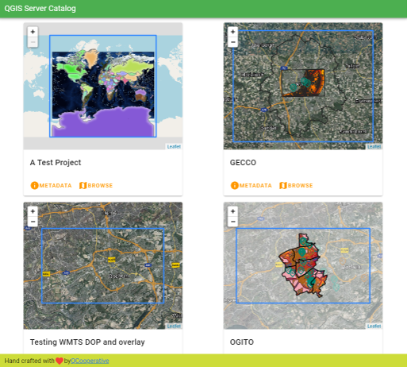
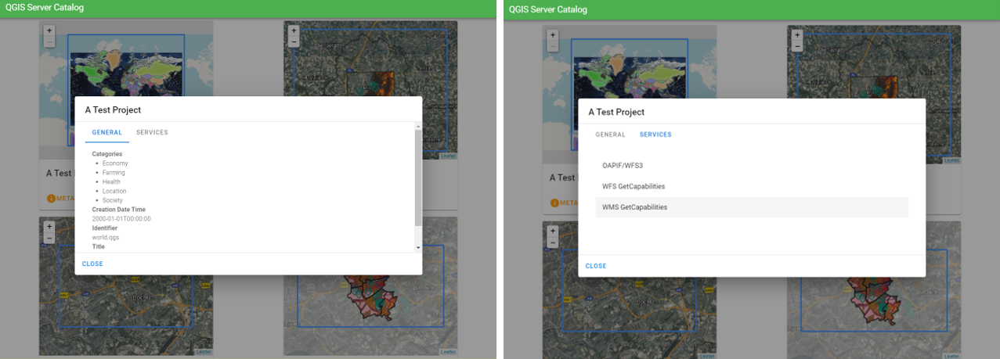
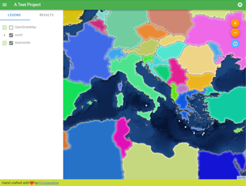
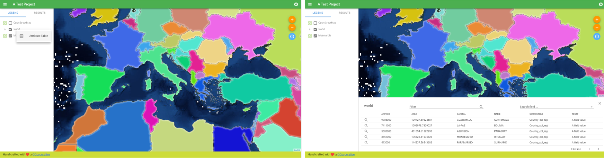
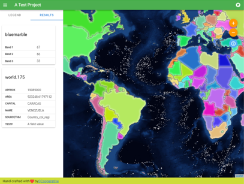

Catalog
=======

The QGIS Server Catalog is a simple catalog that shows the list of QGIS projects
served by the QGIS Server. It provides a user-friendly fully
browsable website with basic mapping capabilities to quickly browse the
datasets exposed through those QGIS projects.

The QGIS Server catalog uses the variables QGIS_SERVER_LANDING_PAGE_PROJECTS_DIRECTORIES
and  QGIS_SERVER_LANDING_PAGE_PROJECTS_PG_CONNECTIONS (see :ref:`qgis-server-envvar`)

.. _figure_server_project_list:

   Server Catalog project list page

You can consult the metadata associated to a project and the services that it
provides. Links to those services are also given.

.. _figure_server_project_metadata_services:

   Server Catalog, metadata associated to a project and services (links to) that it provides.

By browsing a project, it is listed the dataset that it serves.

.. _figure_server_browse_dataset:

   Browsing a dataset served by a project in the Server Catalog

Use Right click on a layer to display the attribute table associated to it.

.. _figure_server_attribute_table:

   Attribute table associated to a layer

It is possible to consult information of the elements in the map as shown in the image below:

.. _figure_server_info_results:

   Consulting information of a map element
