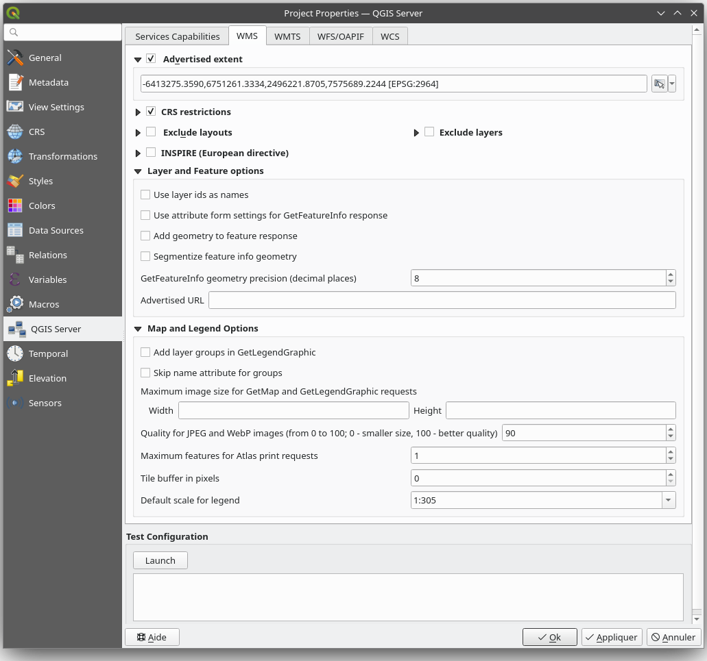

***************
Getting Started
***************

.. only:: html

   .. contents::
      :local:
      :depth: 3

Installation on Debian-based systems
====================================

.. index:: Debian, Ubuntu

We will give a short and simple installation how-to for
a minimal working configuration on Debian based systems (including Ubuntu and derivatives). However, many other
distributions and OSs provide packages for QGIS Server.

.. note:: In Ubuntu you can use your regular user, prepending ``sudo`` to
  commands requiring admin permissions. In Debian you can work as admin (``root``),
  without using ``sudo``.

Requirements and steps to add official QGIS repositories to install QGIS Server on a Debian based system are
provided in `QGIS installers page <https://qgis.org/en/site/forusers/alldownloads.html>`_.
You may want to install at least the latest Long Term Release.

Once the target version repository is configured and QGIS Server installed,
you can test the installation with:

.. code-block:: bash

    /usr/lib/cgi-bin/qgis_mapserv.fcgi

If you get the following output, the server is correctly installed.

.. note:: Depending on the version of QGIS, you might see slightly different output
 reported when you run ``qgis_mapserv.fcgi``.

.. code-block::

    QFSFileEngine::open: No file name specified
    Warning 1: Unable to find driver ECW to unload from GDAL_SKIP environment variable.
    Warning 1: Unable to find driver ECW to unload from GDAL_SKIP environment variable.
    Warning 1: Unable to find driver JP2ECW to unload from GDAL_SKIP environment variable.
    Warning 1: Unable to find driver ECW to unload from GDAL_SKIP environment variable.
    Warning 1: Unable to find driver JP2ECW to unload from GDAL_SKIP environment variable.
    Content-Length: 206
    Content-Type: text/xml; charset=utf-8

    <ServiceExceptionReport version="1.3.0" xmlns="https://www.opengis.net/ogc">
     <ServiceException code="Service configuration error">Service unknown or unsupported</ServiceException>
    </ServiceExceptionReport>

.. note:: As seen below, QGIS reports a Status 400 code, which correctly
  identifies the request has failed because there is no active http session.
  This is not a bug and indicates the server is functioning properly.

.. code-block::

    Application path not initialized
    Application path not initialized
    Warning 1: Unable to find driver ECW to unload from GDAL_SKIP environment variable.
    Warning 1: Unable to find driver ECW to unload from GDAL_SKIP environment variable.
    Warning 1: Unable to find driver JP2ECW to unload from GDAL_SKIP environment variable.
    "Loading native module /usr/lib/qgis/server/libdummy.so"
    "Loading native module /usr/lib/qgis/server/liblandingpage.so"
    "Loading native module /usr/lib/qgis/server/libwcs.so"
    "Loading native module /usr/lib/qgis/server/libwfs.so"
    "Loading native module /usr/lib/qgis/server/libwfs3.so"
    "Loading native module /usr/lib/qgis/server/libwms.so"
    "Loading native module /usr/lib/qgis/server/libwmts.so"
    QFSFileEngine::open: No file name specified
    Content-Length: 102
    Content-Type: application/json
    Server:  QGIS FCGI server - QGIS version 3.22.6-Białowieża
    Status:  400
    [{"code":"Bad request error","description":"Requested URI does not match any registered API handler"}]

Let's add a sample project. You can use your own, or one from
`Training demo data <https://github.com/qgis/QGIS-Training-Data/>`_:

.. code-block:: bash

    mkdir /home/qgis/projects/
    cd /home/qgis/projects/
    wget https://github.com/qgis/QGIS-Training-Data/archive/release_3.22.zip
    unzip release_3.22.zip
    mv QGIS-Training-Data-release_3.22/exercise_data/qgis-server-tutorial-data/world.qgs .
    mv QGIS-Training-Data-release_3.22/exercise_data/qgis-server-tutorial-data/naturalearth.sqlite .

Of course, you can use your favorite GIS software to open this file and
take a look at the configuration and available layers.

To properly deploy QGIS server you need a HTTP server. Recommended choices are
`Apache <https://httpd.apache.org/docs/>`_ or `NGINX <https://nginx.org/en/docs/>`__.

.. index:: Apache, mod_fcgid

.. _`httpserver`:

Apache HTTP Server
------------------

.. note:: In the following, please replace ``qgis.demo`` with the name or IP address of your server.

#. Install Apache and `mod_fcgid <https://httpd.apache.org/mod_fcgid/mod/mod_fcgid.html>`_:

   .. code-block:: bash

    apt install apache2 libapache2-mod-fcgid

#. You can run QGIS Server on your default website, but let's configure a `virtualhost
   <https://httpd.apache.org/docs/2.4/vhosts>`_ specifically for this, as follows.

   #. In the :file:`/etc/apache2/sites-available` directory, create a file
      called :file:`qgis.demo.conf`, with this content:

      .. code-block:: apacheconf

       <VirtualHost *:80>
         ServerAdmin webmaster@localhost
         ServerName qgis.demo

         DocumentRoot /var/www/html

         # Apache logs (different than QGIS Server log)
         ErrorLog ${APACHE_LOG_DIR}/qgis.demo.error.log
         CustomLog ${APACHE_LOG_DIR}/qgis.demo.access.log combined

         # Longer timeout for WPS... default = 40
         FcgidIOTimeout 120

         FcgidInitialEnv LC_ALL "en_US.UTF-8"
         FcgidInitialEnv PYTHONIOENCODING UTF-8
         FcgidInitialEnv LANG "en_US.UTF-8"

         # QGIS log
         FcgidInitialEnv QGIS_SERVER_LOG_STDERR 1
         FcgidInitialEnv QGIS_SERVER_LOG_LEVEL 0

         # default QGIS project
         SetEnv QGIS_PROJECT_FILE /home/qgis/projects/world.qgs

         # QGIS_AUTH_DB_DIR_PATH must lead to a directory writeable by the Server's FCGI process user
         FcgidInitialEnv QGIS_AUTH_DB_DIR_PATH "/home/qgis/qgisserverdb/"
         FcgidInitialEnv QGIS_AUTH_PASSWORD_FILE "/home/qgis/qgisserverdb/qgis-auth.db"

         # Set pg access via pg_service file
         SetEnv PGSERVICEFILE /home/qgis/.pg_service.conf
         FcgidInitialEnv PGPASSFILE "/home/qgis/.pgpass"

         # if qgis-server is installed from packages in debian based distros this is usually /usr/lib/cgi-bin/
         # run "locate qgis_mapserv.fcgi" if you don't know where qgis_mapserv.fcgi is
         ScriptAlias /cgi-bin/ /usr/lib/cgi-bin/
         <Directory "/usr/lib/cgi-bin/">
           AllowOverride None
           Options +ExecCGI -MultiViews -SymLinksIfOwnerMatch
           Require all granted
         </Directory>

         <IfModule mod_fcgid.c>
         FcgidMaxRequestLen 26214400
         FcgidConnectTimeout 60
         </IfModule>

       </VirtualHost>

      .. note:: Some of the above configuration options are explained in the Server
       :ref:`environment variables <server_env_variables>` and
       :ref:`pg_service file <pg-service-file>` sections.

   #. Let's now create the directories that will store the QGIS Server logs and
      the authentication database:

      .. code-block:: bash

       mkdir -p /var/log/qgis/
       chown www-data:www-data /var/log/qgis
       mkdir -p /home/qgis/qgisserverdb
       chown www-data:www-data /home/qgis/qgisserverdb

      .. note::

       ``www-data`` is the Apache user on Debian based systems and we need Apache
       to have access to those locations or files.
       The ``chown www-data...`` commands change the owner of the respective directories
       and files to ``www-data``.

#. We can now enable the virtual host and the ``fcgid`` mod if it's not already done:

   .. code-block:: bash

    a2enmod fcgid
    a2ensite qgis.demo

#. Now restart Apache for the new configuration to be taken into account:

   .. code-block:: bash

    systemctl restart apache2

#. Now that Apache knows that he should answer requests to http://qgis.demo
   we also need to setup the client system so that it knows who ``qgis.demo``
   is. We do that by adding ``127.0.0.1 qgis.demo`` in the
   `hosts <https://en.wikipedia.org/wiki/Hosts_%28file%29>`_ file.

   .. code-block:: bash

     # Replace 127.0.0.1 with the IP of your server.
     sh -c "echo '127.0.0.1 qgis.demo' >> /etc/hosts"

.. important::

   Remember that both the :file:`qgis.demo.conf` and :file:`/etc/hosts` files should
   be configured for your setup to work.
   You can also test the access to your QGIS Server from other clients on the
   network (e.g. Windows or macos machines) by going to their :file:`/etc/hosts`
   file and point the ``qgis.demo`` name to whatever IP the server machine has on the
   network (not ``127.0.0.1`` as it is the local IP, only accessible from the
   local machine).  On ``*nix`` machines the
   :file:`hosts` file is located in :file:`/etc`, while on Windows it's under
   the :file:`C:\\Windows\\System32\\drivers\\etc` directory. Under Windows you
   need to start your text editor with administrator privileges before opening
   the hosts file.

QGIS Server is now available at http://qgis.demo. To check, type in a browser, as in the simple case:

::

 http://qgis.demo/cgi-bin/qgis_mapserv.fcgi?SERVICE=WMS&VERSION=1.3.0&REQUEST=GetCapabilities

.. index:: nginx, spawn-fcgi, fcgiwrap

NGINX HTTP Server
-----------------

.. note:: In the following, please replace ``qgis.demo`` with the name or IP address of your server.

You can also use QGIS Server with `NGINX <https://nginx.org/en/docs/>`__. Unlike Apache,
NGINX does not automatically spawn FastCGI processes. The FastCGI processes are
to be started by something else.

Install NGINX:

.. code-block:: bash

 apt install nginx

* As a first option, you can use **spawn-fcgi** or **fcgiwrap** to start and manage the
  QGIS Server processes.
  Official Debian packages exist for both.
  When you have no X server running and you need, for example,
  printing, you can use :ref:`xvfb <xvfb>`.

* Another option is to rely on **Systemd**, the init system for GNU/Linux that most
  Linux distributions use today.
  One of the advantages of this method is that it requires no other components or
  processes.
  It’s meant to be simple, yet robust and efficient for production deployments.

NGINX Configuration
...................

The **include fastcgi_params;** used in the previous configuration is important,
as it adds the parameters from :file:`/etc/nginx/fastcgi_params`:

.. code-block:: nginx

 fastcgi_param  QUERY_STRING       $query_string;
 fastcgi_param  REQUEST_METHOD     $request_method;
 fastcgi_param  CONTENT_TYPE       $content_type;
 fastcgi_param  CONTENT_LENGTH     $content_length;

 fastcgi_param  SCRIPT_NAME        $fastcgi_script_name;
 fastcgi_param  REQUEST_URI        $request_uri;
 fastcgi_param  DOCUMENT_URI       $document_uri;
 fastcgi_param  DOCUMENT_ROOT      $document_root;
 fastcgi_param  SERVER_PROTOCOL    $server_protocol;
 fastcgi_param  REQUEST_SCHEME     $scheme;
 fastcgi_param  HTTPS              $https if_not_empty;

 fastcgi_param  GATEWAY_INTERFACE  CGI/1.1;
 fastcgi_param  SERVER_SOFTWARE    nginx/$nginx_version;

 fastcgi_param  REMOTE_ADDR        $remote_addr;
 fastcgi_param  REMOTE_PORT        $remote_port;
 fastcgi_param  SERVER_ADDR        $server_addr;
 fastcgi_param  SERVER_PORT        $server_port;
 fastcgi_param  SERVER_NAME        $server_name;

 # PHP only, required if PHP was built with --enable-force-cgi-redirect
 fastcgi_param  REDIRECT_STATUS    200;

Moreover, you can use some :ref:`qgis-server-envvar` to configure QGIS Server.
In the NGINX configuration file, :file:`/etc/nginx/nginx.conf`, you have to use
``fastcgi_param`` instruction to define these variables as shown below:

.. code-block:: nginx

    location /qgisserver {
         gzip           off;
         include        fastcgi_params;
         fastcgi_param  QGIS_SERVER_LOG_STDERR  1;
         fastcgi_param  QGIS_SERVER_LOG_LEVEL   0;
         fastcgi_pass   unix:/var/run/qgisserver.socket;
     }

FastCGI wrappers
................

.. warning::

  **fcgiwrap** is easier to set up than **spawn-fcgi**, because it's already wrapped
  in a Systemd service. But it also leads to a solution that is much slower
  than using spawn-fcgi. With fcgiwrap, a new QGIS Server process is created
  on each request, meaning that the QGIS Server initialization process, which
  includes reading and parsing the QGIS project file, is done on each request.
  With spawn-fcgi, the QGIS Server process remains alive between requests,
  resulting in much better performance. For that reason, spawn-fcgi
  is recommended for production use.

spawn-fcgi
^^^^^^^^^^

If you want to use `spawn-fcgi <https://redmine.lighttpd.net/projects/spawn-fcgi/wiki>`_:

#. The first step is to install the package:

   .. code-block:: bash

     apt install spawn-fcgi

#. Then, introduce the following block in your NGINX server configuration:

   .. code-block:: nginx

     location /qgisserver {
         gzip           off;
         include        fastcgi_params;
         fastcgi_pass   unix:/var/run/qgisserver.socket;
     }

#. And restart NGINX to take into account the new configuration:

   .. code-block:: bash

     systemctl restart nginx

#. Finally, considering that there is no default service file for spawn-fcgi,
   you have to manually start QGIS Server in your terminal:

   .. code-block:: bash

    spawn-fcgi -s /var/run/qgisserver.socket \
                    -U www-data -G www-data -n \
                    /usr/lib/cgi-bin/qgis_mapserv.fcgi

QGIS Server is now available at http://qgis.demo/qgisserver.

.. note::

    When using spawn-fcgi, you may directly define environment variables
    before running the server. For example:
    ``export QGIS_SERVER_LOG_STDERR=1``

Of course, you can add an init script to start QGIS Server at boot time or whenever you want.
For example with **systemd**:

#. Edit the file :file:`/etc/systemd/system/qgis-server.service` with this content:

   .. code-block:: ini

    [Unit]
    Description=QGIS server
    After=network.target

    [Service]
    ;; set env var as needed
    ;Environment="LANG=en_EN.UTF-8"
    ;Environment="QGIS_SERVER_PARALLEL_RENDERING=1"
    ;Environment="QGIS_SERVER_MAX_THREADS=12"
    ;Environment="QGIS_SERVER_LOG_LEVEL=0"
    ;Environment="QGIS_SERVER_LOG_STDERR=1"
    ;; or use a file:
    ;EnvironmentFile=/etc/qgis-server/env

    ExecStart=spawn-fcgi -s /var/run/qgisserver.socket -U www-data -G www-data -n /usr/lib/cgi-bin/qgis_mapserv.fcgi

    [Install]
    WantedBy=multi-user.target

#. Then enable and start the service:

   .. code-block:: bash

    systemctl enable --now qgis-server

.. warning::

  With the above commands spawn-fcgi spawns only one QGIS Server process.

fcgiwrap
^^^^^^^^

Using `fcgiwrap <https://www.nginx.com/resources/wiki/start/topics/examples/fcgiwrap/>`_
is much easier to setup than **spawn-fcgi** but it's much slower.

#. You first have to install the corresponding package:

   .. code-block:: bash

    apt install fcgiwrap

#. Then, introduce the following block in your NGINX server configuration:

   .. code-block:: nginx
      :linenos:

       location /qgisserver {
           gzip           off;
           include        fastcgi_params;
           fastcgi_pass   unix:/var/run/fcgiwrap.socket;
           fastcgi_param  SCRIPT_FILENAME /usr/lib/cgi-bin/qgis_mapserv.fcgi;
       }

#. Finally, restart NGINX and **fcgiwrap** to take into account the new configuration:

   .. code-block:: bash

    systemctl restart nginx
    systemctl restart fcgiwrap

QGIS Server is now available at http://qgis.demo/qgisserver.

Systemd
.......

QGIS Server needs a running X Server to be fully usable, in particular for printing.
In the case you already have a running X Server, you can use systemd services.

This method, to deploy QGIS Server, relies on two Systemd units to configure:
a `Socket unit <https://www.freedesktop.org/software/systemd/man/systemd.socket.html>`_
and a `Service unit <https://www.freedesktop.org/software/systemd/man/systemd.service.html>`_.

#. The **QGIS Server Socket unit** defines and creates a file system socket,
   used by NGINX to start and communicate with QGIS Server.
   The Socket unit has to be configured with ``Accept=false``, meaning that the
   calls to the ``accept()`` system call are delegated to the process created by
   the Service unit.
   It is located in :file:`/etc/systemd/system/qgis-server@.socket`, which is actually
   a template:

   .. code-block:: ini

    [Unit]
    Description=QGIS Server Listen Socket (instance %i)

    [Socket]
    Accept=false
    ListenStream=/var/run/qgis-server-%i.sock
    SocketUser=www-data
    SocketGroup=www-data
    SocketMode=0600

    [Install]
    WantedBy=sockets.target

#. Now enable and start sockets:

   .. code-block:: bash

    for i in 1 2 3 4; do systemctl enable --now qgis-server@$i.socket; done

#. The **QGIS Server Service unit** defines and starts the QGIS Server process.
   The important part is that the Service process’ standard input is connected to
   the socket defined by the Socket unit.
   This has to be configured using ``StandardInput=socket`` in the Service unit
   configuration located in :file:`/etc/systemd/system/qgis-server@.service`:

   .. code-block:: ini

    [Unit]
    Description=QGIS Server Service (instance %i)

    [Service]
    User=www-data
    Group=www-data
    StandardOutput=null
    StandardError=journal
    StandardInput=socket
    ExecStart=/usr/lib/cgi-bin/qgis_mapserv.fcgi
    EnvironmentFile=/etc/qgis-server/env

    [Install]
    WantedBy=multi-user.target

   .. note::
    The QGIS Server :ref:`environment variables <qgis-server-envvar>`
    are defined in a separate file, :file:`/etc/qgis-server/env`.
    It could look like this:

    .. code-block:: make

      QGIS_PROJECT_FILE=/etc/qgis/myproject.qgs
      QGIS_SERVER_LOG_STDERR=1
      QGIS_SERVER_LOG_LEVEL=3

#. Now start socket service:

   .. code-block:: bash

    for i in 1 2 3 4; do systemctl enable --now qgis-server@$i.service; done

#. Finally, for the NGINX HTTP server, let's introduce the configuration for this setup:

   .. code-block:: nginx

    upstream qgis-server_backend {
       server unix:/var/run/qgis-server-1.sock;
       server unix:/var/run/qgis-server-2.sock;
       server unix:/var/run/qgis-server-3.sock;
       server unix:/var/run/qgis-server-4.sock;
    }

    server {
       …

       location /qgis-server {
           gzip off;
           include fastcgi_params;
           fastcgi_pass qgis-server_backend;
       }
    }

#. Now restart NGINX for the new configuration to be taken into account:

   .. code-block:: bash

    systemctl restart nginx

Thanks to Oslandia for sharing `their tutorial <https://oslandia.com/en/2018/11/23/deploying-qgis-server-with-systemd/>`_.

.. _xvfb:

Xvfb
----
QGIS Server needs a running X Server to be fully usable, in particular for printing.
On servers it is usually recommended not to install it, so you may use ``xvfb``
to have a virtual X environment.

If you're running the Server in graphic/X11 environment then there is no need to install xvfb.
More info at https://www.itopen.it/qgis-server-setup-notes/.

#. To install the package:

   .. code-block:: bash

    apt install xvfb

#. Create the service file, :file:`/etc/systemd/system/xvfb.service`, with this content:

   .. code-block:: ini

     [Unit]
     Description=X Virtual Frame Buffer Service
     After=network.target

     [Service]
     ExecStart=/usr/bin/Xvfb :99 -screen 0 1024x768x24 -ac +extension GLX +render -noreset

     [Install]
     WantedBy=multi-user.target

#. Enable, start and check the status of the ``xvfb.service``:

   .. code-block:: bash

      systemctl enable --now xvfb.service
      systemctl status xvfb.service

#. Then, according to your HTTP server, you should configure the **DISPLAY**
   parameter or directly use **xvfb-run**.

   * Using Apache:

     #. Add to your *Fcgid* configuration (see :ref:`httpserver`):

        .. code-block:: apache

          FcgidInitialEnv DISPLAY       ":99"

     #. Restart Apache for the new configuration to be taken into account:

        .. code-block:: bash

          systemctl restart apache2

   * Using NGINX

     * With spawn-fcgi using ``xvfb-run``:

       .. code-block:: bash

        xvfb-run /usr/bin/spawn-fcgi -f /usr/lib/cgi-bin/qgis_mapserv.fcgi \
                                     -s /tmp/qgisserver.socket \
                                     -G www-data -U www-data -n

     * With the **DISPLAY** environment variable in the HTTP server configuration.

       .. code-block:: nginx

        fastcgi_param  DISPLAY       ":99";

Installation on Windows
=======================

.. index:: Windows

QGIS Server can also be installed on Windows systems using the 64 bit version
of the OSGeo4W network installer (https://qgis.org/en/site/forusers/download.html).

A simple procedure is the following:

#. Download and run the OSGeo4W installer
#. Follow the "Advanced Install" and install the **QGIS Desktop**, **QGIS Server**
   **apache** and **mod_fcgid** packages.

   .. figure:: img/qgis_server_windows2.png
     :align: center

#. Apache is not directly installed as a service on Windows. You need to:

   #. Right-click the :file:`OSGeo4W.bat` file at the root of the :file:`C:\\OSGeo4W\\`
      folder (if the default installation paths have been used) and select
      :guilabel:`Run as administrator`
   #. In the console, run ``apache-install.bat``, which will output

      .. code-block:: bash

        > apache-install.bat
        Installing the 'Apache OSGeo4W Web Server' service
        The 'Apache OSGeo4W Web Server' service is successfully installed.
        Testing httpd.conf....
        Errors reported here must be corrected before the service can be started.
        ...

      The service is started as you can notice in the report.
      But the server may fail to run due to missing custom configuration.
#. Edit the :file:`C:\\OSGeo4w\\apps\\apache\\conf\\httpd.conf` file
   with the following changes (various other combinations are possible):

   .. list-table::
      :header-rows: 1

      * - Purpose
        - Existing config
        - Replacement
      * - (Optional) Customize the address to listen to using an IP and/or port,
          You can and add as many entries as you wish.

        - .. code-block:: apache

            Listen ${SRVPORT}

        - .. code-block:: apache

            Listen localhost:8080

      * - Indicate where to find the script files
        - .. code-block:: apache

            ScriptAlias /cgi-bin/ "${SRVROOT}/cgi-bin/"

        - .. code-block:: apache

            ScriptAlias /cgi-bin/ "C:/OSGeo4W/apps/qgis/bin/"

      * - Provide permissions on the script folder
        - .. code-block:: apache

            <Directory "${SRVROOT}/cgi-bin">
                AllowOverride None
                Options None
                Require all granted
            </Directory>

        - .. code-block:: apache

            <Directory "C:/OSGeo4W/apps/qgis/bin">
                SetHandler cgi-script
                AllowOverride None
                Options ExecCGI
                Require all granted
            </Directory>
      * - Enable file extensions to use for script files. Uncomment and complete
        - .. code-block:: apache

            #AddHandler cgi-script .cgi

        - .. code-block:: apache

            AddHandler cgi-script .cgi .exe
      * - Add more OSGeo4W custom configuration variables
        - .. code-block:: apache

            # parse OSGeo4W apache conf files
            IncludeOptional "C:/OSGeo4W/httpd.d/httpd_*.conf"

        - .. code-block:: apache

            # parse OSGeo4W apache conf files
            IncludeOptional "C:/OSGeo4W/httpd.d/httpd_*.conf"
            SetEnv GDAL_DATA "C:/OSGeo4W/share/gdal"
            SetEnv QGIS_AUTH_DB_DIR_PATH "C:/OSGeo4W/apps/qgis/resources"

#. Restart the Apache web server

   ::

     > apache-restart.bat

#. Open browser window to testing a GetCapabilities request to QGIS Server.
   Replace ``localhost:8080`` with the IP and port you set to listen.

   ::

    http://localhost:8080/cgi-bin/qgis_mapserv.fcgi.exe?SERVICE=WMS&VERSION=1.3.0&REQUEST=GetCapabilities

   A :file:`XML` file with the capabilities should be returned.
   Your server is ready to use.

.. Todo: Document how to configure the server so that people could run
 it as http://qgis.demo/qgisserver? (which is the kind of syntax most used in this file)

Serve a project
===============

Now that QGIS Server is installed and running, we just have to use it.

Obviously, we need a QGIS project to work on. Of course, you can fully
customize your project by defining contact information, precise some
restrictions on CRS or even exclude some layers. Everything you need to know
about that is described later in :ref:`Creatingwmsfromproject`.

But for now, we are going to use a simple project already configured and
previously downloaded in :file:`/home/qgis/projects/world.qgs`, as described above.

By opening the project and taking a quick look on layers, we know that 4
layers are currently available:

- airports
- places
- countries
- countries_shapeburst

You don't have to understand the full request for now but you may retrieve
a map with some of the previous layers thanks to QGIS Server by doing something
like this in your web browser to retrieve the *countries* layer:

* If you followed the above instructions to install an Apache HTTP Server:

  .. code-block:: bash

    http://qgis.demo/cgi-bin/qgis_mapserv.fcgi?
      MAP=/home/qgis/projects/world.qgs&
      LAYERS=countries&
      SERVICE=WMS&
      VERSION=1.3.0&
      REQUEST=GetMap&
      CRS=EPSG:4326&
      WIDTH=400&
      HEIGHT=200&
      BBOX=-90,-180,90,180

* If you followed the above instructions to install an NGINX HTTP Server:

  .. code-block:: bash

    http://qgis.demo/qgisserver?
      MAP=/home/qgis/projects/world.qgs&
      LAYERS=countries&
      SERVICE=WMS&
      VERSION=1.3.0&
      REQUEST=GetMap&
      CRS=EPSG:4326&
      WIDTH=400&
      HEIGHT=200&
      BBOX=-90,-180,90,180

If you obtain the next image, then QGIS Server is running correctly:

.. figure:: img/server_basic_getmap.png
  :align: center

  Server response to a basic GetMap request

Note that you may define **QGIS_PROJECT_FILE** environment variable to use a project
by default instead of giving a **MAP** parameter (see :ref:`qgis-server-envvar`).

For example with spawn-fcgi:

.. code-block:: bash

 export QGIS_PROJECT_FILE=/home/qgis/projects/world.qgs
 spawn-fcgi -f /usr/lib/bin/cgi-bin/qgis_mapserv.fcgi \
            -s /var/run/qgisserver.socket \
            -U www-data -G www-data -n

.. _`Creatingwmsfromproject`:

Configure your project
======================

To provide a new QGIS Server WMS, WFS, OAPIF or WCS, you have to create a QGIS project
file with some data or use one of your current project. Define the colors and
styles of the layers in QGIS and the project CRS, if not already defined.
Then, go to the :guilabel:`QGIS Server` menu of the
:menuselection:`Project --> Properties...` dialog and provide
some information about the OWS in the :guilabel:`Service Capabilities` tab.

.. _figure_server_definitions:

   Definitions for a QGIS Server WMS/WFS/WCS project

You have to :guilabel:`Enable Service Capabilities` first, if it is deactivated. 
This will appear in the GetCapabilities response of the WMS, WFS or WCS.
If you don't check |checkbox| :guilabel:`Enable Service capabilities`,
QGIS Server will use the information given in the :file:`wms_metadata.xml` file
located in the :file:`cgi-bin` folder.

WMS capabilities
----------------

.. _figure_wms_definitions:

   Definitions in the WMS tab

In the :guilabel:`WMS capabilities` tab, check :guilabel:`Advertised extent`
to define the extent advertised in the WMS GetCapabilities response.
The :ref:`spatial extent selector <extent_selector>` widget helps you enter the extent
as a ``xmin, xmax, ymin, ymax`` text or pick it from the map canvas, layers, bookmarks...

By checking |checkbox| :guilabel:`CRS restrictions`, you can restrict
in which coordinate reference systems (CRS) QGIS Server will offer
to render maps. It is recommended that you restrict the offered CRS as this
reduces the size of the WMS GetCapabilities response.
Use the |symbologyAdd| button below to select those CRSs
from the Coordinate Reference System Selector, or click :guilabel:`Used`
to add the CRSs used in the QGIS project to the list.

If you have print layouts defined in your project, they will be listed in the
``GetProjectSettings`` response, and they can be used by the GetPrint request to
create prints, using one of the print layouts as a template.
This is a QGIS-specific extension to the WMS 1.3.0 specification.
If you want to exclude any print layout from being published by the WMS,
check |checkbox| :guilabel:`Exclude layouts` and click the
|symbologyAdd| button below.
Then, select a print layout from the :guilabel:`Select print layout` dialog
in order to add it to the excluded layouts list.

If you want to exclude any layer or layer group from being published by the
WMS, check |checkbox| :guilabel:`Exclude Layers` and click the
|symbologyAdd| button below.
This opens the :guilabel:`Select restricted layers and groups` dialog, which
allows you to choose the layers and groups that you don't want to be published.
Use the :kbd:`Shift` or :kbd:`Ctrl` key if you want to select multiple entries.
It is recommended that you exclude from publishing the layers that you don't
need as this reduces the size of the WMS GetCapabilities response which leads
to faster loading times on the client side.

If you check |checkbox| :guilabel:`Use layer ids as name`, layer ids will be
used to reference layers in the ``GetCapabilities`` response or ``GetMap LAYERS``
parameter. If not, layer name or short name if defined (see :ref:`vectorservermenu`)
is used.

You can receive requested GetFeatureInfo as plain text, XML and GML. The default is XML.

.. _`addGeometryToFeatureResponse` :

If you wish, you can check |checkbox| :guilabel:`Add geometry to feature response`.
This will include the bounding box for each feature in the GetFeatureInfo response.
See also the :ref:`WITH_GEOMETRY <wms_getfeatureinfo>` parameter.

As many web clients can’t display circular arcs in geometries you have the option
to segmentize the geometry before sending it to the client in a GetFeatureInfo
response. This allows such clients to still display a feature’s geometry
(e.g. for highlighting the feature). You need to check the
|checkbox| :guilabel:`Segmentize feature info geometry` to activate the option.

When a layer group is passed to ``GetLegendGraphic`` request,
all of its leaf layers are added to the legend picture (however without the groups' labels).
Check the |checkbox| :guilabel:`Add layer groups in GetLegendGraphic` option
if you want to also insert the layer groups (and subgroups) names
into the layer tree, just like in QGIS Desktop legend.

When QGIS project contains layer groups, they are listed in WMS capabilities document alongside with layers.
If a group (its name as listed in capabilities) is included in WMS GetMap ``LAYERS`` parameter
alongside with names of layers in that group, QGIS would duplicate the layers:
once for the group and once for specific layer.
If you check the |checkbox| :guilabel:`Skip name attribute for groups` option,
GetCapabilities will only return title attribute for the group but not its name attribute,
making it impossible to include groups in list of layers of GetMap request.

You can also use the :guilabel:`GetFeatureInfo geometry precision` option to
set the precision of the GetFeatureInfo geometry. This enables you to save
bandwidth when you don't need the full precision.

If you want QGIS Server to advertise specific request URLs
in the WMS GetCapabilities response, enter the corresponding URL in the
:guilabel:`Advertised URL` field.

Furthermore, you can restrict the maximum size of the maps returned by the
GetMap request by entering the maximum width and height into the respective
fields under :guilabel:`Maximums for GetMap request`.

You can change the :guilabel:`Quality for JPEG images` factor. The quality factor must be
in the range 0 to 100. Specify 0 for maximum compression, 100 for no compression.

You can change the limit for atlas features to be printed in one request by setting the
:guilabel:`Maximum features for Atlas print requests` field.

When QGIS Server is used in tiled mode (see :ref:`TILED parameter <wms_tiled>`), you can set the
:guilabel:`Tile buffer in pixels`. The recommended value is the size of the largest
symbol or line width in your QGIS project.

If one of your layers uses the :ref:`Map Tip display <maptips>` (i.e. to show text using
expressions) this will be listed inside the GetFeatureInfo output. If the
layer uses a Value Map for one of its attributes, this information will also
be shown in the GetFeatureInfo output.

WMTS capabilities
-----------------

In the :guilabel:`WMTS capabilities` tab you can select the layers you
want to publish as WMTS and specify if you want to publish as PNG or JPEG.

.. _figure_wmts_definitions:

.. figure:: img/ows_server_wmts.png
   :align: center

   Definitions in the WMTS tab

If you enter a URL in the :guilabel:`Advertised URL` field of the
:guilabel:`WMTS capabilities` section, QGIS Server will advertise this specific
URL in the WMTS GetCapabilities response.

WFS/OAPIF capabilities
----------------------

In the :guilabel:`WFS/OAPIF capabilities` tab, you can select the layers you
want to publish as WFS or OAPIF, and specify if they will allow update, insert and
delete operations.

.. _figure_wfs_definitions:

.. figure:: img/ows_server_wfs.png
   :align: center

   Definitions in the WFS/OAPIF tab

If you enter a URL in the :guilabel:`Advertised URL` field of the
:guilabel:`WFS capabilities` section, QGIS Server will advertise this specific
URL in the WFS GetCapabilities response.

WCS capabilities
----------------

In the :guilabel:`WCS capabilities` tab, you can select the layers that you
want to publish as WCS.

.. _figure_wcs_definitions:

.. figure:: img/ows_server_wcs.png
   :align: center

   Definitions in the WCS tab

If you enter a URL in the :guilabel:`Advertised URL`
field of the :guilabel:`WCS capabilities` section, QGIS Server will advertise
this specific URL in the WCS GetCapabilities response.

Fine tuning your OWS
----------------------

For vector layers, the :guilabel:`Fields` menu of the :menuselection:`Layer -->
Layer Properties` dialog allows you to define for each
attribute if it will be published or not.
By default, all the attributes are published by your WMS and WFS.
If you don't want a specific attribute to be published, uncheck the corresponding
checkbox in the :guilabel:`WMS` or :guilabel:`WFS` column.

You can overlay watermarks over the maps produced by your WMS by adding text
annotations or SVG annotations to the project file.
See the :ref:`sec_annotations` section for instructions on
creating annotations. For annotations to be displayed as watermarks on the WMS
output, the :guilabel:`Fixed map position` checkbox in the
:guilabel:`Annotation text` dialog must be unchecked.
This can be accessed by double clicking the annotation while one of the
annotation tools is active.
For SVG annotations, you will need either to set the project to save absolute
paths (in the :guilabel:`General` menu of the
:menuselection:`Project --> Properties...` dialog) or to manually modify
the path to the SVG image so that it represents a valid relative path.

Integration with third parties
==============================

QGIS Server provides standard OGC web services like `WMS, WFS, etc. <https://www.ogc.org/docs/is>`_
thus it can be used by a wide variety of end user tools.

Integration with QGIS Desktop
-----------------------------

QGIS Desktop is the map designer where QGIS Server is the map server. The maps or
QGIS projects will be served by the QGIS Server to provide OGC standards. These QGIS
projects can either be files or entries in a database (by using
:menuselection:`Project --> Save to --> PostgreSQL` in QGIS Desktop).

Furthermore, dedicated update workflow must be established to refresh a project used
by a QGIS Server (ie. copy project files into server location and restart QGIS
Server). For now, automated processes (as server reloading over message queue
service) are not implemented yet.

Integration with MapProxy
-------------------------

`MapProxy <https://mapproxy.org/>`_ is a tile cache server and as it can read and
serve any WMS/WMTS map server, it can be directly connected to QGIS server web
services and improve end user experience.

Integration with QWC2
---------------------

`QWC2 <https://github.com/qgis/qwc2>`_ is a responsive web application dedicated to
QGIS Server. It helps you to build a highly customized map viewer with layer
selection, feature info, etc.. Also many plugins are available like authentication or
print service, the full list is available in this `repository
<https://github.com/qwc-services>`_.

.. Substitutions definitions - AVOID EDITING PAST THIS LINE
   This will be automatically updated by the find_set_subst.py script.
   If you need to create a new substitution manually,
   please add it also to the substitutions.txt file in the
   source folder.

.. |checkbox| image:: /static/common/checkbox.png
   :width: 1.3em
.. |symbologyAdd| image:: /static/common/symbologyAdd.png
   :width: 1.5em
