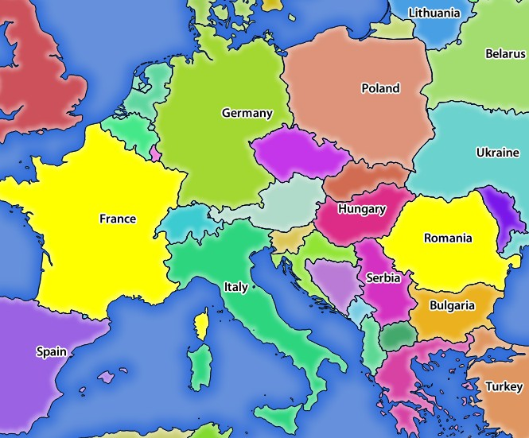
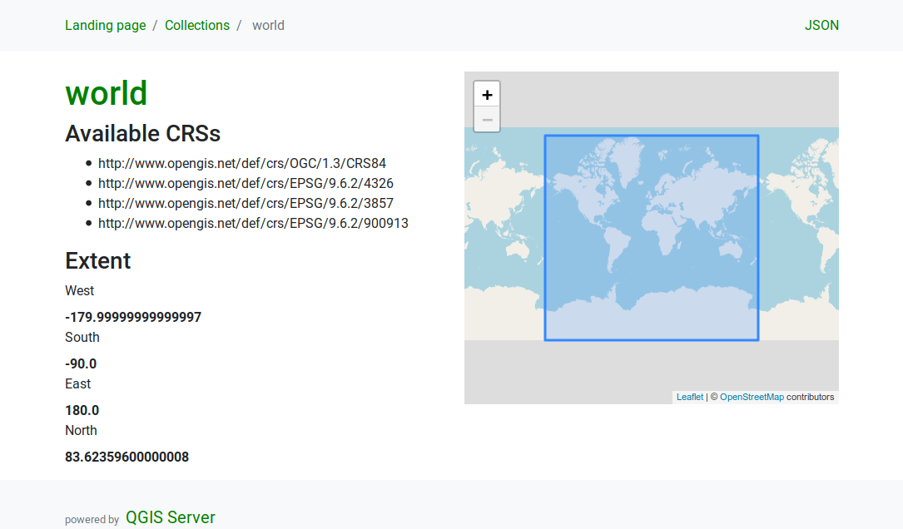
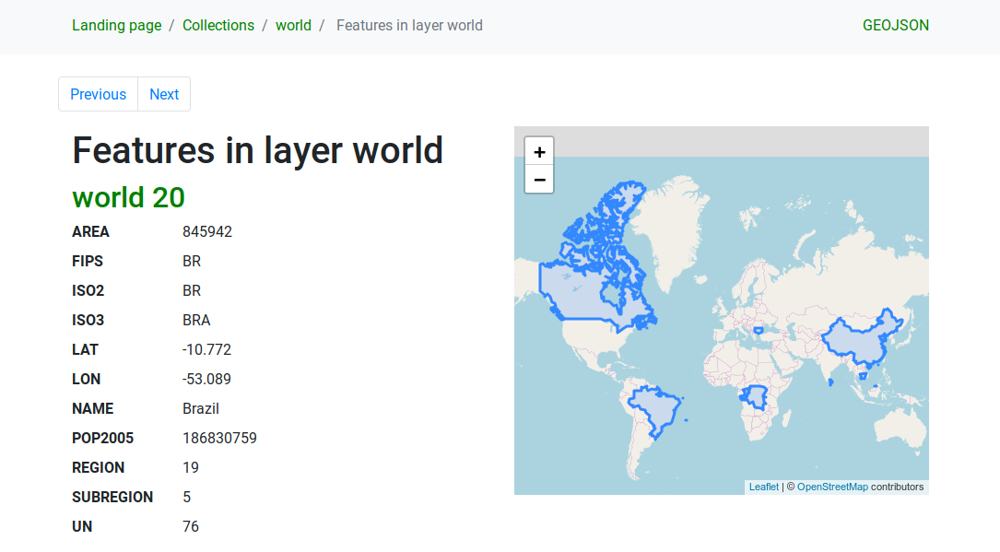

********
Services
********

.. only:: html

  .. contents::
    :local:
    :depth: 2

QGIS Server is able to serve data according to standard protocols as described
by the **Open Geospatial Consortium (OGC)**:

- WMS 1.1.0 and 1.3.0
- WFS 1.0.0, 1.1.0, 2.0
- OGC API - Features (WFS3)
- WCS 1.1.1
- WMTS 1.0.0

Extra vendor parameters and requests are supported in addition to the
original standard that greatly enhance the possibilities of customizing its
behavior thanks to the QGIS rendering engine.

Web Map Service (WMS)
=====================

The **1.1.0** and **1.3.0** WMS standards implemented in QGIS Server provide
a HTTP interface to request map or legend images generated from a QGIS project.
A typical WMS request defines the QGIS project to use, the layers to render as
well as the image format to generate. Basic support is also available for the
**Styled Layer Descriptor (SLD)** standard.

Specifications document according to the version number of the service:

- `WMS 1.1.0 <https://portal.opengeospatial.org/files/?artifact_id=1081&version=1&format=pdf>`_
- `WMS 1.3.0 <https://portal.opengeospatial.org/files/?artifact_id=14416>`_

Standard requests provided by QGIS Server:

.. csv-table::
   :header: "Request", "Description"
   :widths: auto

   "GetCapabilities", "Returns XML metadata with information about the server"
   "GetMap", "Returns a map"
   "GetFeatureInfo", "Retrieves data (geometry and values) for a pixel location"
   "GetLegendGraphics", "Returns legend symbols"

Vendor requests provided by QGIS Server:

.. csv-table::
   :header: "Request", "Description"
   :widths: auto

   "GetPrint", "Returns a QGIS composition"
   "GetProjectSettings", "Returns specific information about QGIS Server"

.. _`qgisserver-wms-getmap`:

GetMap
------

Standard parameters for the **GetMap** request according to the OGC
WMS 1.1.0 and 1.3.0 specifications:

.. csv-table::
   :header: "Parameter", "Required", "Description"
   :widths: auto

   "SERVICE", "Yes", "Name of the service (WMS)"
   "VERSION", "No", "Version of the service"
   "REQUEST", "Yes", "Name of the request (GetMap)"
   "LAYERS", "No", "Layers to display"
   "STYLES", "No", "Layers' style"
   "SRS / CRS", "Yes", "Coordinate reference system"
   "BBOX", "No", "Map extent"
   "WIDTH", "Yes", "Width of the image in pixels"
   "HEIGHT", "Yes", "Height of the image in pixels"
   "FORMAT", "No", "Image format"
   "TRANSPARENT", "No", "Transparent background"

In addition to the standard ones, QGIS Server supports the following
extra parameters:

.. csv-table::
   :header: "Parameter", "Required", "Description"
   :widths: 20, 10, 65

   "MAP", "Yes", "Specify the QGIS project file"
   "BGCOLOR", "No", "Specify the background color"
   "DPI", "No", "Specify the output resolution"
   "IMAGE_QUALITY", "No", "JPEG compression"
   "OPACITIES", "No", "Opacity for layer or group"
   "FILTER", "No", "Subset of features"
   "SELECTION", "No", "Highlight features"
   "FILE_NAME", "No", "Only for ``FORMAT=application/dxf``

   File name of the downloaded file"
   "FORMAT_OPTIONS", "No", "Only for ``FORMAT=application/dxf``
   key:value pairs separated by semicolon.

   * SCALE: to be used for symbology rules, filters and styles (not
     actual scaling of the data - data remains in the original scale).
   * MODE: corresponds to the export options offered in the QGIS
     Desktop DXF export dialog. Possible values are ``NOSYMBOLOGY``,
     ``FEATURESYMBOLOGY`` and ``SYMBOLLAYERSYMBOLOGY``.
   * LAYERSATTRIBUTES: specify a field that contains values for DXF
     layer names - if not specified, the original QGIS layer names are used.
   * USE_TITLE_AS_LAYERNAME: if enabled, the title of the layer will
     be used as layer name.
   * CODEC: specify a codec to be used for encoding. Default is ``ISO-8859-1``
     check the QGIS desktop DXF export dialog for valid values.
   * NO_MTEXT: Use TEXT instead of MTEXT for labels.
   * FORCE_2D: Force 2D output. This is required for polyline width.
   "
   "TILED", "No", "Working in *tiled mode*"

URL example:

.. code-block:: none

  http://localhost/qgis_server?
  SERVICE=WMS
  &VERSION=1.3.0
  &REQUEST=GetMap
  &MAP=/home/qgis/projects/world.qgs
  &LAYERS=mylayer1,mylayer2,mylayer3
  &STYLES=style1,default,style3
  &OPACITIES=125,200,125
  &CRS=EPSG:4326
  &WIDTH=400
  &HEIGHT=400
  &FORMAT=image/png
  &TRANSPARENT=TRUE
  &DPI=300
  &TILED=TRUE

SERVICE
^^^^^^^

This parameter has to be ``WMS`` in case of the **GetMap** request.

VERSION
^^^^^^^

This parameter allows to specify the version of the service to use.
Available values for the ``VERSION`` parameter are:

- ``1.1.0``
- ``1.3.0``

If no version is indicated in the request, then ``1.3.0`` is used by
default.

According to the version number, slight differences have to be expected
as explained later for the next parameters:

- ``CRS`` / ``SRS``
- ``BBOX``

REQUEST
^^^^^^^

This parameter is ``GetMap`` in case of the **GetMap** request.

.. _server_layers_param:

LAYERS
^^^^^^

This parameter allows to specify the layers to display on the map.
Names have to be separated by a comma.

In addition, QGIS Server introduced some options to select layers by:

* a short name
* the layer id

The short name of a layer may be configured through
:menuselection:`Properties --> Metadata` in layer menu.
If the short name is defined, then it's used by default instead of the
layer's name:

.. code-block:: none

  http://localhost/qgisserver?
  SERVICE=WMS
  &REQUEST=GetMap
  &LAYERS=mynickname1,mynickname2
  &...

Moreover, there's a project option allowing to select layers by their
id in :menuselection:`OWS Server --> WMS capabilities` menu of the
:menuselection:`Project --> Properties...` dialog.
To activate this option, the checkbox
:guilabel:`Use layer ids as names` has to be selected.

.. code-block:: none

  http://localhost/qgisserver?
  SERVICE=WMS
  &REQUEST=GetMap
  &LAYERS=mylayerid1,mylayerid2
  &...

STYLES
^^^^^^

This parameter can be used to specify a layer's style for the
rendering step.
Styles have to be separated by a comma. The name of the default style
is ``default``.

SRS / CRS
^^^^^^^^^

This parameter allows to indicate the map output Spatial Reference
System in WMS **1.1.0** and has to be formed like ``EPSG:XXXX``.
Note that ``CRS`` is also supported if current version is **1.1.0**.

For WMS **1.3.0**, ``CRS`` parameter is preferable but ``SRS`` is also
supported.

Note that if both ``CRS`` and ``SRS`` parameters are indicated in the
request, then it's the current version indicated in ``VERSION``
parameter which is decisive.

In the next case, the ``SRS`` parameter is kept whatever the
``VERSION`` parameter because ``CRS`` is not indicated:

.. code-block:: none

  http://localhost/qgisserver?
  SERVICE=WMS
  &REQUEST=GetMap
  &VERSION=1.3.0
  &SRS=EPSG:2854
  &...

In the next case, the ``SRS`` parameter is kept instead of ``CRS``
because of the ``VERSION`` parameter:

.. code-block:: none

  http://localhost/qgisserver?
  SERVICE=WMS
  &REQUEST=GetMap
  &VERSION=1.1.0
  &CRS=EPSG:4326
  &SRS=EPSG:2854
  &...

In the next case, the ``CRS`` parameter is kept instead of ``SRS``
because of the ``VERSION`` parameter:

.. code-block:: none

  http://localhost/qgisserver?
  SERVICE=WMS
  &REQUEST=GetMap
  &VERSION=1.3.0
  &CRS=EPSG:4326
  &SRS=EPSG:2854
  &...

BBOX
^^^^

This parameter allows to specify the map extent with units according
to the current CRS.
Coordinates have to be separated by a comma.

However, a slight difference has to be noticed according to the
current ``VERSION`` parameter.
In WMS **1.1.0**, coordinates are formed like
``minx,miny,maxx,maxy`` or ``minlong,minlat,maxlong,maxlat``.
For example:

.. code-block:: none

  http://localhost/qgisserver?
  SERVICE=WMS
  &REQUEST=GetMap
  &VERSION=1.1.0
  &SRS=epsg:4326
  &BBOX=-180,-90,180,90
  &...

But the axis is reversed in WMS **1.3.0**, so coordinates are formed
like:
``miny,minx,maxy,maxx`` or ``minlat,minlong,maxlat,maxlong``.
For example:

.. code-block:: none

  http://localhost/qgisserver?
  SERVICE=WMS
  &REQUEST=GetMap
  &VERSION=1.3.0
  &CRS=epsg:4326
  &BBOX=-90,-180,90,180
  &...

WIDTH
^^^^^

This parameter allows to specify the width in pixels of the output
image.

HEIGHT
^^^^^^

This parameter allows to specify the height in pixels of the output
image.

FORMAT
^^^^^^

This parameter may be used to specify the format of map image.
Available values are:

* ``jpg``
* ``jpeg``
* ``image/jpeg``
* ``image/png``
* ``image/png; mode=1bit``
* ``image/png; mode=8bit``
* ``image/png; mode=16bit``
* ``application/dxf``
  Only layers that have read access in the WFS service are exported in
  the DXF format.

  URL example:

  .. code-block:: none

   http://localhost/qgisserver?
   SERVICE=WMS&VERSION=1.3.0
   &REQUEST=GetMap
   &FORMAT=application/dxf
   &LAYERS=Haltungen,Normschacht,Spezialbauwerke
   &STYLES=
   &CRS=EPSG%3A21781&BBOX=696136.28844801,245797.12108743,696318.91114315,245939.25832905
   &WIDTH=1042
   &HEIGHT=811
   &FORMAT_OPTIONS=MODE:SYMBOLLAYERSYMBOLOGY;SCALE:250&FILE_NAME=plan.dxf

TRANSPARENT
^^^^^^^^^^^

This boolean parameter can be used to specify the background
transparency.
Available values are (not case sensitive):

- ``TRUE``
- ``FALSE``

However, this parameter is ignored if the format of the map image
indicated with ``FORMAT`` is different from PNG.

MAP
^^^

This parameter allows to define the QGIS project file to use.

As mentioned in :ref:`GetMap parameters table <qgisserver-wms-getmap>`,
``MAP`` is mandatory because a request needs a QGIS project to
actually work.
However, the ``QGIS_PROJECT_FILE`` environment variable may be used to
define a default QGIS project.
In this specific case, ``MAP`` is not longer a required parameter.
For further information you may refer to :ref:`server_env_variables`.

BGCOLOR
^^^^^^^

This parameter allows to indicate a background color for the map image.
However it cannot be combined with ``TRANSPARENT`` parameter in case of
PNG images (transparency takes priority). The colour may be literal or
in hexadecimal notation.

URL example with the literal notation:

.. code-block:: none

  http://localhost/qgisserver?
  SERVICE=WMS
  &REQUEST=GetMap
  &VERSION=1.3.0
  &BGCOLOR=green
  &...

URL example with the hexadecimal notation:

.. code-block:: none

  http://localhost/qgisserver?
  SERVICE=WMS
  &REQUEST=GetMap
  &VERSION=1.3.0
  &BGCOLOR=0x00FF00
  &...

DPI
^^^

This parameter can be used to specify the requested output resolution.

IMAGE_QUALITY
^^^^^^^^^^^^^

This parameter is only used for JPEG images. By default, the JPEG
compression is ``-1``.

You can change the default per QGIS project in the
:menuselection:`OWS Server --> WMS capabilities` menu of the
:menuselection:`Project --> Properties...` dialog.
If you want to override it in a ``GetMap`` request you can do it using
the ``IMAGE_QUALITY`` parameter.

OPACITIES
^^^^^^^^^

Opacity can be set on layer or group level. Allowed values range from
0 (fully transparent) to 255 (fully opaque).

FILTER
^^^^^^

A subset of layers can be selected with the ``FILTER`` parameter.
The syntax is basically the same as for the QGIS subset string.
However, there are some restrictions to avoid SQL injections into
databases via QGIS Server.
If a dangerous string is found in the parameter, QGIS Server will
return the next error:

.. code-block:: none

  Indeed, text strings need to be enclosed with quotes (single quotes
  for strings, double quotes for attributes). A space between each
  word / special character is mandatory. Allowed Keywords and special
  characters are 'AND','OR','IN','=','<','>=','>','>=','!=*,'(',')'.
  Semicolons in string expressions are not allowed.

URL example:

.. code-block:: none

  http://localhost/qgisserver?
  SERVICE=WMS
  &REQUEST=GetMap
  &LAYERS=mylayer1,mylayer2,mylayer3
  &FILTER=mylayer1:"col1";mylayer1,mylayer2:"col2" = 'blabla'
  &...

In this example, the same filter (field ``col2`` equals the string
``blabla``) is applied to layers ``mylayer1`` and ``mylayer2``, while
the filter on ``col1`` is only applied to ``mylayer1``.

.. note::

  It is possible to make attribute searches via GetFeatureInfo and omit
  the X/Y parameter if a FILTER is there. QGIS Server then returns info
  about the matching features and generates a combined bounding box in
  the XML output.

SELECTION
^^^^^^^^^

The ``SELECTION`` parameter can highlight features from one or more
layers.
Vector features can be selected by passing comma separated lists with
feature ids.

.. code-block:: none

  http://localhost/qgisserver?
  SERVICE=WMS
  &REQUEST=GetMap
  &LAYERS=mylayer1,mylayer2
  &SELECTION=mylayer1:3,6,9;mylayer2:1,5,6
  &...

The following image presents the response from a GetMap request using
the ``SELECTION`` option e.g.
``http://myserver.com/...&SELECTION=countries:171,65``.

As those features id's correspond in the source dataset to **France**
and **Romania** they're highlighted in yellow.

.. _figure_server_selection:

  Server response to a GetMap request with SELECTION parameter

.. _server_wms_tiled:

TILED
^^^^^

For performance reasons, QGIS Server can be used in tiled mode. In this
mode, client requests several small fixed size tiles in order to assemble
them and form the whole map. Doing this, some symbols who live at the
boundary between two tiles may appeared cut, because they live in one tile,
not the other.

Set the ``TILED`` parameter to ``TRUE`` to tell QGIS Server to work in
*tiled* mode, and to apply the *Tile buffer* configured in the QGIS
project (see :ref:`Creatingwmsfromproject`).

When ``TILED`` is ``TRUE`` and when a non-zero Tile buffer is
configured in the QGIS project, features outside the tile extent are
drawn to avoid cut symbols at tile boundaries.

``TILED`` defaults to ``FALSE``.

.. _server_wms_getfeatureinfo:

GetFeatureInfo
--------------

Standard parameters for the **GetFeatureInfo** request according to
the OGC WMS 1.1.0 and 1.3.0 specifications:

.. csv-table::
   :header: "Parameter", "Required", "Description"
   :widths: auto

   "SERVICE", "Yes", "Name of the service (WMS)"
   "VERSION", "No", ":ref:`See GetMap <qgisserver-wms-getmap>`"
   "REQUEST", "Yes", ":ref:`See GetMap <qgisserver-wms-getmap>`"
   "LAYERS", "No", ":ref:`See GetMap <qgisserver-wms-getmap>`"
   "STYLES", "No", ":ref:`See GetMap <qgisserver-wms-getmap>`"
   "SRS / CRS", "Yes", ":ref:`See GetMap <qgisserver-wms-getmap>`"
   "BBOX", "No", ":ref:`See GetMap <qgisserver-wms-getmap>`"
   "WIDTH", "Yes", ":ref:`See GetMap <qgisserver-wms-getmap>`"
   "HEIGHT", "Yes", ":ref:`See GetMap <qgisserver-wms-getmap>`"
   "TRANSPARENT", "No", ":ref:`See GetMap <qgisserver-wms-getmap>`"
   "INFO_FORMAT", "No", "Output format"
   "QUERY_LAYERS", "Yes", "Layers to query"
   "FEATURE_COUNT", "No", "Maximum number of features to return"
   "I", "No", "Pixel column of the point to query"
   "X", "No", "Same as `I` parameter, but in WMS 1.1.0"
   "J", "No", "Pixel row of the point to query"
   "Y", "No", "Same as `J` parameter, but in WMS 1.1.0"

In addition to the standard ones, QGIS Server supports the following
extra parameters:

.. csv-table::
   :header: "Parameter", "Required", "Description"
   :widths: auto

   "MAP", "Yes", ":ref:`See GetMap <qgisserver-wms-getmap>`"
   "FILTER", "No", ":ref:`See GetMap <qgisserver-wms-getmap>`"
   "FI_POINT_TOLERANCE", "No", "Tolerance in pixels for point layers"
   "FI_LINE_TOLERANCE", "No", "Tolerance in pixels for line layers"
   "FI_POLYGON_TOLERANCE", "No", "Tolerance in pixels for polygon layers"
   "FILTER_GEOM", "No", "Geometry filtering"
   "WITH_MAPTIP", "No", "Add map tips to the output"
   "WITH_GEOMETRY", "No", "Add geometry to the output"

URL example:

.. code-block:: none

  http://localhost/qgisserver?
  SERVICE=WMS
  &VERSION=1.3.0
  &REQUEST=GetMap
  &MAP=/home/qgis/projects/world.qgs
  &LAYERS=mylayer1,mylayer2,mylayer3
  &CRS=EPSG:4326
  &WIDTH=400
  &HEIGHT=400
  &INFO_FORMAT=text/xml
  &TRANSPARENT=TRUE
  &QUERY_LAYERS=mylayer1
  &FEATURE_COUNT=3
  &I=250
  &J=250

INFO_FORMAT
^^^^^^^^^^^

This parameter may be used to specify the format of the result.
Available values are:

- ``text/xml``
- ``text/html``
- ``text/plain``
- ``application/vnd.ogc.gml``
- ``application/json``

QUERY_LAYERS
^^^^^^^^^^^^

This parameter specifies the layers to display on the map.
Names are separated by a comma.

In addition, QGIS Server introduces options to select layers by:

* short name
* layer id

See the ``LAYERS`` parameter defined in
:ref:`See GetMap <qgisserver-wms-getmap>` for more information.

FEATURE_COUNT
^^^^^^^^^^^^^

This parameter specifies the maximum number of features per layer to
return.
For example if ``QUERY_LAYERS`` is set to ``layer1,layer2`` and
``FEATURE_COUNT`` is set to ``3`` then a maximum of 3 features from
layer1 will be returned.
Likewise a maximun of 3 features from layer2 will be returned.

By default, only 1 feature per layer is returned.

I
^

This parameter, defined in WMS 1.3.0, allows you to specify the pixel
column of the query point.

X
^

Same parameter as ``I``, but defined in WMS 1.1.0.

J
^

This parameter, defined in WMS 1.3.0, allows you to specify the pixel
row of the query point.

Y
^

Same parameter as ``J``, but defined in WMS 1.1.0.

FI_POINT_TOLERANCE
^^^^^^^^^^^^^^^^^^

This parameter specifies the tolerance in pixels for point layers.

FI_LINE_TOLERANCE
^^^^^^^^^^^^^^^^^

This parameter specifies the tolerance in pixels for line layers.

FI_POLYGON_TOLERANCE
^^^^^^^^^^^^^^^^^^^^

This parameter specifies the tolerance in pixels for polygon layers.

FILTER_GEOM
^^^^^^^^^^^

This parameter specifies a WKT geometry with which features have to
intersect.

WITH_MAPTIP
^^^^^^^^^^^

This parameter specifies whether to add map tips to the output.

Available values are (not case sensitive):

- ``TRUE``
- ``FALSE``

WITH_GEOMETRY
^^^^^^^^^^^^^

This parameter specifies whether to add geometries to the output. To use
this feature you must first enable the :guilabel:`Add geometry to feature response`
option in the QGIS project. See :ref:`Configure your project <Creatingwmsfromproject>`.

Available values are (not case sensitive):

- ``TRUE``
- ``FALSE``

.. _server_getprint:

GetPrint
--------

QGIS Server has the capability to create print layout output in pdf or
pixel format.
Print layout windows in the published project are used as templates.
In the **GetPrint** request, the client has the possibility to specify
parameters of the contained layout maps and labels.

Parameters for the **GetPrint** request:

.. csv-table::
   :header: "Parameter", "Required", "Description"
   :widths: auto

   "MAP", "Yes", "Specify the QGIS project file"
   "SERVICE", "Yes", "Name of the service (WMS)"
   "VERSION", "No", ":ref:`See GetMap <qgisserver-wms-getmap>`"
   "REQUEST", "Yes", "Name of the request (GetPrint)"
   "LAYERS", "No", ":ref:`See GetMap <qgisserver-wms-getmap>`"
   "TEMPLATE", "Yes", "Layout template to use"
   "SRS / CRS", "Yes", ":ref:`See GetMap <qgisserver-wms-getmap>`"
   "FORMAT", "Yes", "Output format"
   "ATLAS_PK", "No", "Atlas features"
   "STYLES", "No", ":ref:`See GetMap <qgisserver-wms-getmap>`"
   "TRANSPARENT", "No", ":ref:`See GetMap <qgisserver-wms-getmap>`"
   "OPACITIES", "No", ":ref:`See GetMap <qgisserver-wms-getmap>`"
   "SELECTION", "No", ":ref:`See GetMap <qgisserver-wms-getmap>`"
   "mapX:EXTENT", "No", "Extent of the map 'X'"
   "mapX:LAYERS", "No", "Layers of the map 'X'"
   "mapX:STYLES", "No", "Layers' style of the map 'X'"
   "mapX:SCALE", "No", "Layers' scale of the map 'X'"
   "mapX:ROTATION", "No", "Rotation  of the map 'X'"
   "mapX:GRID_INTERVAL_X", "No", "Grid interval on x axis of the map 'X'"
   "mapX:GRID_INTERVAL_Y", "No", "Grid interval on y axis of the map 'X'"

URL example:

.. code-block:: none

  http://localhost/qgisserver?
  SERVICE=WMS
  &VERSION=1.3.0
  &REQUEST=GetPrint
  &MAP=/home/qgis/projects/world.qgs
  &CRS=EPSG:4326
  &FORMAT=png
  &map0:EXTENT=-180,-90,180,90
  &map0:LAYERS=mylayer1,mylayer2,mylayer3
  &map0:OPACITIES=125,200,125
  &map0:ROTATION=45

Note that the layout template may contain more than one map.
In this way, if you want to configure a specific map, you have to use
``mapX:`` parameters where ``X`` is a positive number that you can
retrieve thanks to the **GetProjectSettings** request.

For example:

.. code-block:: xml

    <WMS_Capabilities>
    ...
    <ComposerTemplates xsi:type="wms:_ExtendedCapabilities">
    <ComposerTemplate width="297" height="210" name="Druckzusammenstellung 1">
    <ComposerMap width="171" height="133" name="map0"/>
    <ComposerMap width="49" height="46" name="map1"/></ComposerTemplate>
    </ComposerTemplates>
    ...
    </WMS_Capabilities>

SERVICE
^^^^^^^

This parameter has to be ``WMS``.

REQUEST
^^^^^^^

This parameter has to be ``GetPrint`` for the **GetPrint** request.

TEMPLATE
^^^^^^^^

This parameter can be used to specify the name of a layout template
to use for printing.

FORMAT
^^^^^^

This parameter specifies the format of map image. Available values are:

- ``jpg``
- ``jpeg``
- ``image/jpeg``
- ``png``
- ``image/png``
- ``svg``
- ``image/svg``
- ``image/svg+xml``
- ``pdf``
- ``application/pdf``

If the ``FORMAT`` parameter is different from one of these values,
then an exception is returned.

ATLAS_PK
^^^^^^^^

This parameter allows activation of Atlas rendering by indicating
which features we want to print.
In order to retrieve an atlas with all features, the ``*`` symbol may
be used (according to the maximum number of features allowed in the
project configuration).

When ``FORMAT`` is ``pdf``, a single PDF document combining the feature
pages is returned.
For all other formats, a single page is returned.

mapX:EXTENT
^^^^^^^^^^^

This parameter specifies the extent for a layout map item as
xmin,ymin,xmax,ymax.

mapX:ROTATION
^^^^^^^^^^^^^

This parameter specifies the map rotation in degrees.

mapX:GRID_INTERVAL_X
^^^^^^^^^^^^^^^^^^^^

This parameter specifies the grid line density in the X direction.

mapX:GRID_INTERVAL_Y
^^^^^^^^^^^^^^^^^^^^

This parameter specifies the grid line density in the Y direction.

mapX:SCALE
^^^^^^^^^^

This parameter specifies the map scale for a layout map item.
This is useful to ensure scale based visibility of layers and
labels even if client and server may have different algorithms to
calculate the scale denominator.

mapX:LAYERS
^^^^^^^^^^^

This parameter specifies the layers for a layout map item. See
:ref:`See GetMap <qgisserver-wms-getmap>` for more information on
this parameter.

mapX:STYLES
^^^^^^^^^^^

This parameter specifies the layers' styles defined in a specific
layout map item.
See :ref:`See GetMap <qgisserver-wms-getmap>` for more information on
this parameter.

GetLegendGraphics
-----------------

Several additional parameters are available to change the size of the
legend elements:

* **BOXSPACE** space between legend frame and content (mm)
* **LAYERSPACE** vertical space between layers (mm)
* **LAYERTITLESPACE** vertical space between layer title and items
  following (mm)
* **SYMBOLSPACE** vertical space between symbol and item following
  (mm)
* **ICONLABELSPACE** horizontal space between symbol and label text
  (mm)
* **SYMBOLWIDTH** width of the symbol preview (mm)
* **SYMBOLHEIGHT** height of the symbol preview (mm)

These parameters change the font properties for layer titles and item
labels:

* **LAYERFONTFAMILY / ITEMFONTFAMILY** font family for layer
  title / item text
* **LAYERFONTBOLD / ITEMFONTBOLD** ``TRUE`` to use a bold font
* **LAYERFONTSIZE / ITEMFONTSIZE** Font size in point
* **LAYERFONTITALIC / ITEMFONTITALIC** ``TRUE`` to use italic font
* **LAYERFONTCOLOR / ITEMFONTCOLOR** Hex color code (e.g. ``#FF0000``
  for red)
* **LAYERTITLE** ``FALSE`` to get only the legend graphics without layer title
* **RULELABEL**:

    * ``FALSE`` legend graphics without item labels
    * ``AUTO`` hide item label for layers with :guilabel:`Single symbol` rendering

Content based legend. These parameters let the client request a legend
showing only the symbols for the features falling into the requested
area:

* **BBOX** the geographical area for which the legend should be built
* **CRS / SRS** the coordinate reference system adopted to define the
  BBOX coordinates
* **WIDTH / HEIGHT** if set these should match those defined for the
  GetMap request, to let QGIS Server scale symbols according to the
  map view image size.

Content based legend features are based on the `UMN MapServer
implementation:
<https://www.mapserver.org/development/rfc/ms-rfc-101.html>`_

* **SHOWFEATURECOUNT** if set to ``TRUE`` adds in the legend the
  feature count of the features like in the following image:

  .. figure:: img/getfeaturecount_legend.png
    :align: center

GetProjectSettings
------------------

This request type works similar to **GetCapabilities**, but it is more
specific to QGIS Server and allows a client to read additional
information which is not available in the GetCapabilities output:

* initial visibility of layers
* information about vector attributes and their edit types
* information about layer order and drawing order
* list of layers published in WFS

Web Feature Service (WFS)
=========================

The **1.0.0** and **1.1.0** WFS standards implemented in QGIS Server
provide a HTTP interface to query geographic features from a QGIS
project.
A typical WFS request defines the QGIS project to use and the layer to
query.

Specifications document according to the version number of the service:

- `WFS 1.0.0 <http://portal.opengeospatial.org/files/?artifact_id=7176>`_
- `WFS 1.1.0 <http://portal.opengeospatial.org/files/?artifact_id=8339>`_

Standard requests provided by QGIS Server:

.. csv-table::
   :header: "Request", "Description"
   :widths: auto

   "GetCapabilities", "Returns XML metadata with information about the server"
   "GetFeature", "Returns a selection of features"
   "DescribeFeatureType", "Returns a description of feature types and properties"
   "Transaction", "Allows features to be inserted, updated or deleted"

.. _`qgisserver-wfs-getfeature`:

GetFeature
----------

Standard parameters for the **GetFeature** request according to the
OGC WFS 1.0.0 and 1.1.0 specifications:

.. csv-table::
   :header: "Parameter", "Required", "Description"
   :widths: auto

   "SERVICE", "Yes", "Name of the service"
   "VERSION", "No", "Version of the service"
   "REQUEST", "Yes", "Name of the request"
   "TYPENAME", "No", "Name of layers"
   "OUTPUTFORMAT", "No", "Output Format"
   "RESULTTYPE", "No", "Type of the result"
   "PROPERTYNAME", "No", "Name of properties to return"
   "MAXFEATURES", "No", "Maximum number of features to return"
   "SRSNAME", "No", "Coordinate reference system"
   "FEATUREID", "No", "Filter the features by ids"
   "FILTER", "No", "OGC Filter Encoding"
   "BBOX", "No", "Map Extent"
   "SORTBY", "No", "Sort the results"

In addition to the standard ones, QGIS Server supports the following
extra parameters:

.. csv-table::
   :header: "Parameter", "Required", "Description"
   :widths: auto

   "MAP", "Yes", "Specify the QGIS project file"
   "STARTINDEX", "No", "Paging"
   "GEOMETRYNAME", "No", "Type of geometry to return"
   "EXP_FILTER", "No", "Expression filtering"

SERVICE
^^^^^^^

This parameter has to be ``WFS`` in case of the **GetFeature**
request.

For example:

.. code-block:: none

  http://localhost/qgisserver?
  SERVICE=WFS
  &...

VERSION
^^^^^^^

This parameter allows to specify the version of the service to use.
Available values for the ``VERSION`` parameter are:

- ``1.0.0``
- ``1.1.0``

If no version is indicated in the request, then ``1.1.0`` is used by
default.

URL example:

.. code-block:: none

  http://localhost/qgisserver?
  SERVICE=WFS
  &VERSION=1.1.0
  &...

REQUEST
^^^^^^^

This parameter is ``GetFeature`` in case of the **GetFeature**
request.

URL example:

.. code-block:: none

  http://localhost/qgisserver?
  SERVICE=WFS
  &VERSION=1.1.0
  &REQUEST=GetFeature
  &...

RESULTTYPE
^^^^^^^^^^

This parameter may be used to specify the kind of result to return.
Available values are:

- ``results``: the default behavior
- ``hits``: returns only a feature count

URL example:

.. code-block:: none

  http://localhost/qgisserver?
  SERVICE=WFS
  &VERSION=1.1.0
  &REQUEST=GetFeature
  &RESULTTYPE=hits
  &...

GEOMETRYNAME
^^^^^^^^^^^^

This parameter can be used to specify the kind of geometry to return
for features. Available values are:

- ``extent``
- ``centroid``
- ``none``

URL example:

.. code-block:: none

  http://localhost/qgisserver?
  SERVICE=WFS
  &VERSION=1.1.0
  &REQUEST=GetFeature
  &GEOMETRYNAME=centroid
  &...

STARTINDEX
^^^^^^^^^^

This parameter is standard in WFS 2.0, but it's an extension for WFS
1.0.0.
Actually, it can be used to skip some features in the result set and
in combination with ``MAXFEATURES``, it provides the ability to page
through results.

URL example:

.. code-block:: none

  http://localhost/qgisserver?
  SERVICE=WFS
  &VERSION=1.1.0
  &REQUEST=GetFeature
  &STARTINDEX=2
  &...

Web Map Tile Service (WMTS)
===========================

The **1.0.0** WMTS standard implemented in QGIS Server provides a HTTP
interface to request tiled map images generated from a QGIS project.
A typical WMTS request defined the QGIS project to use, some WMS
parameters like layers to render, as well as tile parameters.

Specifications document of the service:

- `WMTS 1.0.0 <http://portal.opengeospatial.org/files/?artifact_id=35326>`_

Standard requests provided by QGIS Server:

.. csv-table::
   :header: "Request", "Description"
   :widths: auto

   "GetCapabilities", "Returns XML metadata with information about the server"
   "GetTile", "Returns a tile"
   "GetFeatureInfo", "Retrieves data (geometry and values) for a pixel location"

.. _`qgisserver-wmts-getcapabilities`:

GetCapabilities
---------------

Standard parameters for the **GetCapabilities** request according to
the OGC WMTS 1.0.0 specifications:

.. csv-table::
   :header: "Parameter", "Required", "Description"
   :widths: auto

   "SERVICE", "Yes", "Name of the service (WMTS)"
   "REQUEST", "Yes", "Name of the request (GetCapabilities)"

In addition to the standard ones, QGIS Server supports the following extra
parameters:

.. csv-table::
   :header: "Parameter", "Required", "Description"
   :widths: auto

   "MAP", "Yes", "Specify the QGIS project file"

URL example:

.. code-block:: none

  http://localhost/qgisserver?
  SERVICE=WMTS
  &REQUEST=GetCapabilities
  &MAP=/home/qgis/projects/world.qgs

SERVICE
^^^^^^^

This parameter has to be ``WMTS`` in case of the **GetCapabilities**
request.

REQUEST
^^^^^^^

This parameter is ``GetCapabilities`` in case of the
**GetCapabilities** request.

MAP
^^^

This parameter allows to define the QGIS project file to use.

.. _`qgisserver-wmts-gettile`:

GetTile
-------

Standard parameters for the **GetTile** request according to the
OGC WMTS 1.0.0 specifications:

.. csv-table::
   :header: "Parameter", "Required", "Description"
   :widths: auto

   "SERVICE", "Yes", "Name of the service (WMTS)"
   "REQUEST", "Yes", "Name of the request (GetTile)"
   "LAYER", "Yes", "Layer identifier"
   "FORMAT", "Yes", "Output format of the tile"
   "TILEMATRIXSET", "Yes", "Name of the pyramid"
   "TILEMATRIX", "Yes", "Meshing"
   "TILEROW", "Yes", "Row coordinate in the mesh"
   "TILECOL", "Yes", "Column coordinate in the mesh"

In addition to the standard ones, QGIS Server supports the following
extra parameters:

.. csv-table::
   :header: "Parameter", "Required", "Description"
   :widths: auto

   "MAP", "Yes", "Specify the QGIS project file"

URL example:

.. code-block:: none

  http://localhost/qgisserver?
  SERVICE=WMTS
  &REQUEST=GetTile
  &MAP=/home/qgis/projects/world.qgs
  &LAYER=mylayer
  &FORMAT=image/png
  &TILEMATRIXSET=EPSG:4326
  &TILEROW=0
  &TILECOL=0

SERVICE
^^^^^^^

This parameter has to be ``WMTS`` in case of the **GetTile** request.

REQUEST
^^^^^^^

This parameter is ``GetTile`` in case of the **GetTile** request.

LAYER
^^^^^

This parameter allows to specify the layer to display on the tile.

In addition, QGIS Server introduced some options to select a layer
by:

* a short name
* the layer id

The short name of a layer may be configured through
:menuselection:`Properties --> Metadata` in layer menu. If the short
name is defined, then it's used by default instead of the layer's name:

.. code-block:: none

  http://localhost/qgisserver?
  SERVICE=WMTS
  &REQUEST=GetTile
  &LAYER=mynickname
  &...

Moreover, there's a project option allowing to select layers by their
id in :menuselection:`OWS Server --> WMS capabilities` menu of the
:menuselection:`Project --> Project Properties` dialog. To activate
this option, the checkbox :guilabel:`Use layer ids as names` has to be
selected.

.. code-block:: none

  http://localhost/qgisserver?
  SERVICE=WMTS
  &REQUEST=GetTile
  &LAYER=mylayerid1
  &...

FORMAT
^^^^^^

This parameter may be used to specify the format of tile image.
Available values are:

- ``jpg``
- ``jpeg``
- ``image/jpeg``
- ``image/png``

If the ``FORMAT`` parameter is different from one of these values, then
the default format PNG is used instead.

TILEMATRIXSET
^^^^^^^^^^^^^

This parameter defines the CRS to use when computing the underlying
pyramid. Format: ``EPSG:XXXX``.

TILEMATRIX
^^^^^^^^^^

This parameter allows to define the matrix to use for the output tile.

TILEROW
^^^^^^^

This parameter allows to select the row of the tile to get within the
matrix.

TILECOL
^^^^^^^

This parameter allows to select the column of the tile to get within
the matrix.

MAP
^^^

This parameter allows to define the QGIS project file to use.

As mentioned in :ref:`GetMap parameters table <qgisserver-wms-getmap>`,
``MAP`` is mandatory because a request needs a QGIS project to
actually work.
However, the ``QGIS_PROJECT_FILE`` environment variable may be used to
define a default QGIS project.
In this specific case, ``MAP`` is not longer a required parameter.
For further information you may refer to :ref:`server_env_variables`.

.. _`qgisserver-wmts-getfeatureinfo`:

GetFeatureInfo
--------------

Standard parameters for the **GetFeatureInfo** request according to
the OGC WMTS 1.0.0 specifications:

- `WMS 1.1.0 <https://portal.opengeospatial.org/files/?artifact_id=1081&version=1&format=pdf>`_

.. csv-table::
   :header: "Parameter", "Required", "Description"
   :widths: auto

   "SERVICE", "Yes", "Name of the service (WMTS)"
   "REQUEST", "Yes", "Name of the request (GetFeatureInfo)"
   "LAYER", "Yes", "Layer identifier"
   "INFOFORMAT", "No", "Output format"
   "I", "No", "X coordinate of a pixel"
   "J", "No", "Y coordinate of a pixel"
   "TILEMATRIXSET", "Yes", ":ref:`See GetTile <qgisserver-wmts-gettile>`"
   "TILEMATRIX", "Yes", ":ref:`See GetTile <qgisserver-wmts-gettile>`"
   "TILEROW", "Yes", ":ref:`See GetTile <qgisserver-wmts-gettile>`"
   "TILECOL", "Yes", ":ref:`See GetTile <qgisserver-wmts-gettile>`"

In addition to the standard ones, QGIS Server supports the following
extra parameters:

.. csv-table::
   :header: "Parameter", "Required", "Description"
   :widths: auto

   "MAP", "Yes", "Specify the QGIS project file"

URL example:

.. code-block:: none

  http://localhost/qgisserver?
  SERVICE=WMTS
  &REQUEST=GetFeatureInfo
  &MAP=/home/qgis/projects/world.qgs
  &LAYER=mylayer
  &INFOFORMAT=image/html
  &I=10
  &J=5

SERVICE
^^^^^^^

This parameter has to be ``WMTS`` in case of the **GetFeatureInfo**
request.

REQUEST
^^^^^^^

This parameter is ``GetFeatureInfo`` in case of the
**GetFeatureInfo** request.

MAP
^^^

This parameter allows to define the QGIS project file to use.

As mentioned in :ref:`GetMap parameters table <qgisserver-wms-getmap>`,
``MAP`` is mandatory because a request needs a QGIS project to
actually work.
However, the ``QGIS_PROJECT_FILE`` environment variable may be used to
define a default QGIS project.
In this specific case, ``MAP`` is not longer a required parameter.
For further information you may refer to :ref:`server_env_variables`.

LAYER
^^^^^

This parameter allows to specify the layer to display on the tile.

In addition, QGIS Server introduced some options to select a layer by:

* a short name
* the layer id

The short name of a layer may be configured through
:menuselection:`Properties --> Metadata` in layer menu. If the short
name is defined, then it's used by default instead of the layer's
name:

.. code-block:: none

  http://localhost/qgisserver?
  SERVICE=WMTS
  &REQUEST=GetFeatureInfo
  &LAYER=mynickname
  &...

Moreover, there's a project option allowing to select layers by their
id in :menuselection:`OWS Server --> WMS capabilities` menu of the
:menuselection:`Project --> Project Properties` dialog. To activate
this option, the checkbox :guilabel:`Use layer ids as names` has to be
selected.

.. code-block:: none

  http://localhost/qgisserver?
  SERVICE=WMTS
  &REQUEST=GetFeatureInfo
  &LAYER=mylayerid1
  &...

INFOFORMAT
^^^^^^^^^^

This parameter allows to define the output format of the result.
Available values are:

- ``text/xml``
- ``text/html``
- ``text/plain``
- ``application/vnd.ogc.gml``

The default value is ``text/plain``.

I
^

This parameter allows to define the X coordinate of the pixel for
which we want to retrieve underlying information.

J
^

This parameter allows to define the Y coordinate of the pixel for
which we want to retrieve underlying information.

.. _`ogc_api_features`:

WFS3 (OGC API Features)
==============================================

WFS3 is the first implementation of the new generation of OGC
protocols.
It is described by the `OGC API - Features - Part 1: Core
<http://docs.opengeospatial.org/is/17-069r3/17-069r3.html>`_ document.

Here is a quick informal summary of the most important differences
between the well known WFS protocol and WFS3:

- WFS3 is based on a
  `REST <https://en.wikipedia.org/wiki/Representational_state_transfer>`_
  API
- WFS3 API must follow the
  `OPENAPI <https://en.wikipedia.org/wiki/OpenAPI_Specification>`_
  specifications
- WFS3 supports multiple output formats but it does not dictate any
  (only GeoJSON and HTML are currently available in QGIS WFS3) and it
  uses `content negotiation
  <https://en.wikipedia.org/wiki/Content_negotiation>`_ to determine
  which format is to be served to the client
- JSON and HTML are first class citizens in WFS3
- WFS3 is self-documenting (through the ``/api`` endpoint)
- WFS3 is fully navigable (through links) and browsable

.. important::

    While the WFS3 implementation in QGIS can make use of the ``MAP``
    parameter to specify the project file, no extra query parameters
    are allowed by the OPENAPI specification.
    For this reason it is strongly recommended that ``MAP`` is not
    exposed in the URL and the project file is specified in the
    environment by other means (i.e. setting ``QGIS_PROJECT_FILE``
    in the environment through a web server rewrite rule).

.. note::

    The **API** endpoint provides comprehensive documentation of all
    supported parameters and output formats of your service.
    The following paragraphs will only describe the most important ones.

Resource representation
-----------------------

The QGIS Server WFS3 implementation currently supports the following
resource representation (output) formats:

- HTML
- JSON

The format that is actually served will depend on content negotiation,
but a specific format can be explicitly requested by appending a format
specifier to the endpoints.

Supported format specifier extensions are:

- ``.json``
- ``.html``

Additional format specifier aliases may be defined by specific
endpoints:

- ``.openapi``: alias for ``.json`` supported by the **API** endpoint
- ``.geojson``: alias for ``.json`` supported by the **Features** and
  **Feature** endpoints

.. _wfs3_endpoints:

Endpoints
--------------------

The API provides a list of endpoints that the clients can retrieve.
The system is designed in such a way that every response provides a set
of links to navigate through all the provided resources.

Endpoints points provided by the QGIS implementation are:

.. csv-table::
   :header: "Name", "Path", "Description"
   :widths: auto

   "Landing Page", "``/``", "General information about the service and
   provides links to all available endpoints"
   "Conformance", "``/conformance``", "Information about the
   conformance of the service to the standards"
   "API", "``/api``", "Full description of the endpoints provided by
   the service and the returned documents structure"
   "Collections", "``/collections``", "List of all collections (i.e.
   'vector layers') provided by the service"
   "Collection", "``/collections/{collectionId}``", "Information about a
   collection (name, metadata, extent etc.)"
   "Features", "``/collections/{collectionId}/items``", "List of the
   features provided by the collection"
   "Feature", "``/collections/{collectionId}/items/{featureId}``", "Information
   about a single feature"

Landing Page
^^^^^^^^^^^^^^^^^^^^

The main endpoint is the **Landing Page**. From that page it is
possible to navigate to all the available service endpoints.
The **Landing Page** must provide links to

- the API definition (path ``/api`` link relations ``service-desc``
  and ``service-doc``),
- the Conformance declaration (path ``/conformance``, link relation
  ``conformance``), and
- the Collections (path ``/collections``, link relation ``data``).

.. _figure_server_wfs3_landing_page:

.. figure:: img/server_wfs3_landing_page.png
   :align: center

   Server WFS3 landing page

.. _`ogc_api_features_api_definition`:

API Definition
^^^^^^^^^^^^^^^^^^^^

The **API Definition** is an OPENAPI-compliant description of the
API provided by the service.
In its HTML representation it is a browsable page where all the
endpoints and their response formats are accurately listed and
documented.
The path of this endpoint is ``/api``.

The API definition provides a comprehensive and authoritative
documentation of the service, including all supported parameters and
returned formats.

.. note::

    This endpoint is analogue to WFS's ``GetCapabilities``

Collections list
^^^^^^^^^^^^^^^^^^^^

The collections endpoint provides a list of all the collections
available in the service.
Since the service "serves" a single QGIS project the collections are
the vector layers from the current project (if they were published as
WFS in the project properties).
The path of this endpoint is ``/collections/``.

.. _figure_server_wfs3_collections:

.. figure:: img/server_wfs3_collections.png
   :align: center

   Server WFS3 collections list page

Collection detail
^^^^^^^^^^^^^^^^^^^^^

While the collections endpoint does not provide detailed information
about each available collection, that information is available in the
``/collections/{collectionId}`` endpoints.
Typical information includes the extent, a description, CRSs and other
metadata.

The HTML representation also provides a browsable map with the
available features.

.. _figure_server_wfs3_collection:

   Server WFS3 collection detail page

.. _`ogc_api_features_features_list`:

Features list
^^^^^^^^^^^^^^^^^^^^^

This endpoint provides a list of all features in a collection knowing
the collection ID.
The path of this endpoint is ``/collections/{collectionId}/items``.

The HTML representation also provides a browsable map with the
available features.

.. note::

    This endpoint is analogue to ``GetFeature`` in  WFS 1 and WFS 2.

.. _figure_server_wfs3_features:

   Server WFS3 features list page

Feature detail
^^^^^^^^^^^^^^^^^^^^^^^

This endpoint provides all the available information about a
single feature, including the feature attributes and its geometry.
The path of this endpoint is
``/collections/{collectionId}/items/{itemId}``.

The HTML representation also provides a browsable map with the
feature geometry.

.. _figure_server_wfs3_feature:

.. figure:: img/server_wfs3_feature.png
   :align: center

   Server WFS3 feature detail page

Pagination
--------------------

Pagination of a long list of features is implemented in the OGC API
through ``next`` and ``prev`` links, QGIS server constructs these
links by appending ``limit`` and ``offset`` as query string
parameters.

URL example:

.. code-block:: none

    http://localhost/qgisserver/wfs3/collection_one/items.json?offset=10&limit=10

.. note::

    The maximum acceptable value for ``limit`` can be configured with
    the ``QGIS_SERVER_API_WFS3_MAX_LIMIT`` server configuration setting
    (see: :ref:`qgis-server-envvar`).

Feature filtering
--------------------

The features available in a collection can be filtered/searched by
specifying one or more filters.

Date and time filter
^^^^^^^^^^^^^^^^^^^^
Collections with date and/or datetime attributes can be filtered by
specifying a ``datetime`` argument in the query string.
By default the first date/datetime field is used for filtering.
This behavior can be configured by setting a "Date" or "Time"
dimension in the :menuselection:`QGIS Server --> Dimension` section of
the layer properties dialog.

The date and time filtering syntax is fully described in the
:ref:`ogc_api_features_api_definition` and also supports ranges (begin
and end values are included) in addition to single values.

URL examples:

Returns only the features with date dimension matching ``2019-01-01``

.. code-block:: none

    http://localhost/qgisserver/wfs3/collection_one/items.json?datetime=2019-01-01

Returns only the features with datetime dimension matching
``2019-01-01T01:01:01``

.. code-block:: none

    http://localhost/qgisserver/wfs3/collection_one/items.json?datetime=2019-01-01T01:01:01

Returns only the features with datetime dimension in the range
``2019-01-01T01:01:01`` - ``2019-01-01T12:00:00``

.. code-block:: none

    http://localhost/qgisserver/wfs3/collection_one/items.json?datetime=2019-01-01T01:01:01/2019-01-01T12:00:00

Bounding box filter
^^^^^^^^^^^^^^^^^^^^

A bounding box spatial filter can be specified with the ``bbox`` parameter:

The order of the comma separated elements is:

- Lower left corner, WGS 84 longitude
- Lower left corner, WGS 84 latitude
- Upper right corner, WGS 84 longitude
- Upper right corner, WGS 84 latitude

.. note::
    The OGC specifications also allow a 6 item bbox specifier where the
    third and sixth items are the Z components, this is not yet
    supported by QGIS server.

URL example:

.. code-block:: none

    http://localhost/qgisserver/wfs3/collection_one/items.json?bbox=-180,-90,180,90

If the *CRS* of the bounding box is not WGS84
(*http://www.opengis.net/def/crs/OGC/1.3/CRS84*), a different CRS can
be specified by using the optional parameter ``bbox-crs``.
The CRS format identifier must be in the
`OGC URI <http://www.opengis.net/def/crs/>`_ format:

URL example:

.. code-block:: none

    http://localhost/qgisserver/wfs3/collection_one/items.json?bbox=913191,5606014,913234,5606029&bbox-crs=http://www.opengis.net/def/crs/EPSG/9.6.2/3857

Attribute filters
^^^^^^^^^^^^^^^^^^^^

Attribute filters can be combined with the bounding box filter and they
are in the general form: ``<attribute name>=<attribute value>``.
Multiple filters can be combined using the ``AND`` operator.

URL example:

filters all features where attribute ``name`` equals "my value"

.. code-block:: none

    http://localhost/qgisserver/wfs3/collection_one/items.json?attribute_one=my%20value

Partial matches are also supported by using a ``*`` ("star") operator:

URL example:

filters all features where attribute ``name`` ends with "value"

.. code-block:: none

    http://localhost/qgisserver/wfs3/collection_one/items.json?attribute_one=*value

Feature sorting |316|
---------------------

It is possible to order the result set by field value using the ``sortby``
query parameter.

The results are sorted in ascending order by default.
To sort the results in descending order, a boolean flag (``sortdesc``) can be set:

.. code-block:: none

  http://localhost/qgisserver/wfs3/collection_one/items.json?sortby=name&sortdesc=1

Attribute selection
-------------------

The feature attributes returned by a :ref:`ogc_api_features_features_list`
call can be limited by adding a comma separated list of attribute names
in the optional ``properties`` query string argument.

URL example:

returns only the ``name`` attribute

.. code-block:: none

    http://localhost/qgisserver/wfs3/collection_one/items.json?properties=name

The HTML template language
--------------------------

The HTML representation uses a set of HTML templates to generate the
response.
The template is parsed by a template engine called
`inja <https://github.com/pantor/inja#tutorial>`_.
The templates can be customized by overriding them (see:
:ref:`server_wfs3_template_override`).
The template has access to the same data that are available to the
``JSON`` representation and a few additional functions are available to
the template:

Custom template functions
^^^^^^^^^^^^^^^^^^^^^^^^^^^^^

- ``path_append( path )``: appends a directory path to the current url
- ``path_chomp( n )``: removes the specified number "n" of directory
  components from the current url path
- ``json_dump( )``: prints the JSON data passed to the template
- ``static( path )``: returns the full URL to the specified static path.
  For example: "static( "/style/black.css" )" with a root path
  "http://localhost/qgisserver/wfs3" will return
  "http://localhost/qgisserver/wfs3/static/style/black.css".
- ``links_filter( links, key, value )``: Returns filtered links from a
  link list
- ``content_type_name( content_type )``: Returns a short name from a
  content type, for example "text/html" will return "HTML"

.. _`server_wfs3_template_override`:

Template overrides
^^^^^^^^^^^^^^^^^^^^^^^^^^

Templates and static assets are stored in subdirectories of the QGIS
server default API resource directory
(:file:`/usr/share/qgis/resources/server/api/` on a Linux system), the
base directory can be customized by changing the environment variable
``QGIS_SERVER_API_RESOURCES_DIRECTORY``.

A typical Linux installation will have the following directory tree:

.. code-block:: bash

    /usr/share/qgis/resources/server/api/
    └── ogc
        ├── schema.json
        ├── static
        │   ├── jsonFormatter.min.css
        │   ├── jsonFormatter.min.js
        │   └── style.css
        └── templates
            └── wfs3
                ├── describeCollection.html
                ├── describeCollections.html
                ├── footer.html
                ├── getApiDescription.html
                ├── getFeature.html
                ├── getFeatures.html
                ├── getLandingPage.html
                ├── getRequirementClasses.html
                ├── header.html
                ├── leaflet_map.html
                └── links.html

To override the templates you can copy the whole tree to another location
and point ``QGIS_SERVER_API_RESOURCES_DIRECTORY`` to the new location.

.. _`extra-getmap-parameters`:

Extra parameters supported by all request types
===============================================

The following extra parameters are supported by all protocols.

* **FILE_NAME**: if set, the server response will be sent to the
  client as a file attachment with the specified file name.

.. note::

    Not available for WFS3.

* **MAP**: Similar to MapServer, the ``MAP`` parameter can be used to
  specify the path to the QGIS project file. You can specify an absolute
  path or a path relative to the location of the server executable
  (:file:`qgis_mapserv.fcgi`).
  If not specified, QGIS Server searches for .qgs files in the directory
  where the server executable is located.

  Example::

    http://localhost/cgi-bin/qgis_mapserv.fcgi?\
      REQUEST=GetMap&MAP=/home/qgis/projects/world.qgs&...

..  note::

    You can define a **QGIS_PROJECT_FILE** as an environment variable
    to tell the server executable where to find the QGIS project file.
    This variable will be the location where QGIS will look for the
    project file.
    If not defined it will use the MAP parameter in the request and
    finally look at the server executable directory.

.. _`qgisserver-redlining`:

REDLINING
=========

This feature is available and can be used with ``GetMap`` and
``GetPrint`` requests.

The redlining feature can be used to pass geometries and labels in the
request which are overlapped by the server over the standard returned
image (map).
This permits the user to put emphasis or maybe add some comments (labels)
to some areas, locations etc. that are not in the standard map.

The request is in the format::

 http://qgisplatform.demo/cgi-bin/qgis_mapserv.fcgi?map=/world.qgs&SERVICE=WMS&VERSION=1.3.0&
 REQUEST=GetMap
 ...
 &HIGHLIGHT_GEOM=POLYGON((590000 5647000, 590000 6110620, 2500000 6110620, 2500000 5647000, 590000 5647000))
 &HIGHLIGHT_SYMBOL=<StyledLayerDescriptor><UserStyle><Name>Highlight</Name><FeatureTypeStyle><Rule><Name>Symbol</Name><LineSymbolizer><Stroke><SvgParameter name="stroke">%23ea1173</SvgParameter><SvgParameter name="stroke-opacity">1</SvgParameter><SvgParameter name="stroke-width">1.6</SvgParameter></Stroke></LineSymbolizer></Rule></FeatureTypeStyle></UserStyle></StyledLayerDescriptor>
 &HIGHLIGHT_LABELSTRING=Write label here
 &HIGHLIGHT_LABELSIZE=16
 &HIGHLIGHT_LABELCOLOR=%23000000
 &HIGHLIGHT_LABELBUFFERCOLOR=%23FFFFFF
 &HIGHLIGHT_LABELBUFFERSIZE=1.5

Here is the image outputed by the above request in which a polygon and
a label are drawn on top of the normal map:

.. _figure_server_redlining:

.. figure:: img/server_redlining.png
   :align: center

   Server response to a GetMap request with redlining parameters

You can see there are several parameters in this request:

* **HIGHLIGHT_GEOM**: You can add POINT, MULTILINESTRING, POLYGON etc.
  It supports multipart geometries. Here is an example:
  ``HIGHLIGHT_GEOM=MULTILINESTRING((0 0, 0 1, 1 1))``.
  The coordinates should be in the CRS of the GetMap/GetPrint request.

* **HIGHLIGHT_SYMBOL**: This controls how the geometry is outlined and
  you can change the stroke width, color and opacity.

* **HIGHLIGHT_LABELSTRING**: You can pass your labeling text to this
  parameter.

* **HIGHLIGHT_LABELSIZE**: This parameter controls the size of the
  label.

* **HIGHLIGHT_LABELCOLOR**: This parameter controls the label color.

* **HIGHLIGHT_LABELBUFFERCOLOR**: This parameter controls the label
  buffer color.

* **HIGHLIGHT_LABELBUFFERSIZE**: This parameter controls the label
  buffer size.

External WMS layers
===================

QGIS Server allows including layers from external WMS servers in WMS GetMap
and WMS GetPrint requests. This is especially useful if a web client uses an
external background layer in the web map.
For performance reasons, such layers should be directly requested by the web
client (not cascaded via QGIS server). For printing however, these layers
should be cascaded via QGIS server in order to appear in the printed map.

External layers can be added to the LAYERS parameter as
EXTERNAL_WMS:<layername>.
The parameters for the external WMS layers (e.g. url, format,
dpiMode, crs, layers, styles) can later be given as service
parameters <layername>:<parameter>.
In a GetMap request, this might look like this:

.. code-block:: none

   http://localhost/qgisserver?
   SERVICE=WMS&REQUEST=GetMap
   ...
   &LAYERS=EXTERNAL_WMS:basemap,layer1,layer2
   &STYLES=,,
   &basemap:url=http://externalserver.com/wms.fcgi
   &basemap:format=image/jpeg
   &basemap:dpiMode=7
   &basemap:crs=EPSG:2056
   &basemap:layers=orthofoto
   &basemap:styles=default

Similarly, external layers can be used in GetPrint requests:

.. code-block:: none

   http://localhost/qgisserver?
   SERVICE=WMS
   ...
   &REQUEST=GetPrint&TEMPLATE=A4
   &map0:layers=EXTERNAL_WMS:basemap,layer1,layer2
   &map0:EXTENT=<minx,miny,maxx,maxy>
   &basemap:url=http://externalserver.com/wms.fcgi
   &basemap:format=image/jpeg
   &basemap:dpiMode=7
   &basemap:crs=EPSG:2056
   &basemap:layers=orthofoto
   &basemap:styles=default

.. Substitutions definitions - AVOID EDITING PAST THIS LINE
   This will be automatically updated by the find_set_subst.py script.
   If you need to create a new substitution manually,
   please add it also to the substitutions.txt file in the
   source folder.

.. |316| replace:: ``NEW in 3.16``
