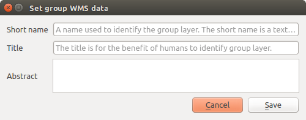

.. _services_basics:

Basics
======

This section describes concepts and parameters mutually shared by services.
Some of these are standard and defined in OGC specifications while others are
very specific to QGIS Server.

Standard concepts:

.. csv-table::
   :header: "Concept", "Description"
   :widths: auto

   ":ref:`SERVICE <services_basics_service>`", "Name of the service"
   ":ref:`REQUEST <services_basics_request>`", "Name of the request"

Vendor concepts:

.. csv-table::
   :header: "Concept", "Description"
   :widths: auto

   ":ref:`MAP <services_basics_map>`", "QGIS project file"
   ":ref:`FILE_NAME <services_basics_file_name>`", "File name of the downloaded file"
   ":ref:`Short name <services_basics_short_name>`", "Short name definition"

.. _services_basics_service:

SERVICE
-------

This standard parameter allows to specify the name of the service to use
for a specific :ref:`request <services_basics_request>` and has to be formed like
``SERVICE=NAME``.

URL example for the **WMS** service:

.. code-block:: bash

  http://localhost/qgisserver?
  SERVICE=WMS
  &...

.. note::

  Not available for REST based services like :ref:`WFS3 (OGC API Features)
  <ogc_api_features>`.

.. _services_basics_request:

REQUEST
-------

This standard parameter allows to specify the name of the request to execute
for a specific :ref:`service <services_basics_service>` and has to be formed like
``REQUEST=RequestName``.

URL example for the **GetCapabilities** request:

.. code-block:: bash

  http://localhost/qgisserver?
  REQUEST=GetCapabilities
  &...

.. note::

  Not available for REST based services like :ref:`WFS3 (OGC API Features)
  <ogc_api_features>`.

.. _services_basics_map:

MAP
---

This vendor parameter allows to define the QGIS project file to use. It may be
an absolute path or a path relative to the location of the server executable
:file:`qgis_mapserv.fcgi`. ``MAP`` is mandatory by default because a request
needs a QGIS project to actually work. However, the **QGIS_PROJECT_FILE**
environment variable may be used to define a default QGIS project. In this
specific case, ``MAP`` is no longer a required parameter. For further
information you may refer to the :ref:`server_env_variables` chapter.

URL example:

.. code-block:: bash

  http://localhost/qgisserver?
  MAP=/tmp/QGIS-Training-Data/exercise_data/qgis-server-tutorial-data/world.qgs
  &...

.. _services_basics_file_name:

FILE_NAME
---------

If this vendor parameter is set, the server response will be sent to the client
as a file attachment with the specified file name.

URL example to save an XML **GetCapabilities** document:

.. code-block:: bash

  http://localhost/qgisserver?
  SERVICE=WMS
  &REQUEST=GetCapabilities
  &FILE_NAME=wms_capabilities.xml
  &...

.. note::

  Not available for REST based services like :ref:`WFS3 (OGC API Features)
  <ogc_api_features>`.

.. _services_basics_short_name:

Short name
----------

A number of elements have both a **short name** and a **title**. The short name
is a text string used for machine-to-machine communication while the title is
for the benefit of humans. For example, a dataset might have the descriptive
title *“Maximum Atmospheric Temperature”* and be requested using the
abbreviated short name *“ATMAX”*. You can set title, short name and abstract
for:

* **Layers**: right-click on a layer and choose
  :menuselection:`Properties... --> QGIS Server --> Description`.

* **Groups**: right-click on a group and select :guilabel:`Set Group WMS data`

* **Project**: go to :menuselection:`Project --> Properties... --> QGIS Server -->
  Service Capabilities`.

.. _figure_group_wms_data:

   Set group WMS data dialog

Thus, the short name may be used to identify these items when interacting with
QGIS Server. For example with the standard ``LAYERS`` parameter:

.. code-block:: bash

  http://localhost/qgisserver?
  SERVICE=WMS
  &REQUEST=GetMap
  &LAYERS=shortname1,shortname2
  &...
