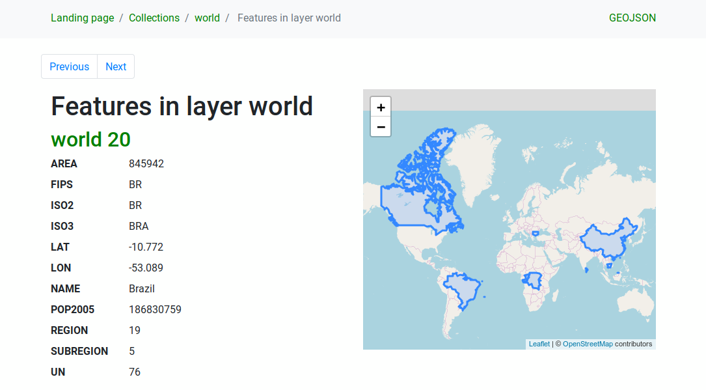

.. _`ogc_api_features`:

OGC API Features
==============================================

OGC API Features (OAPIF) is the first implementation of the new generation of OGC
protocols.
It is described by the `OGC API - Features - Part 1: Core
<http://docs.ogc.org/is/17-069r3/17-069r3.html>`_ document. 

The API can be reached on typical installations via `http://localhost/qgisserver/wfs3`

Here is a quick informal summary of the most important differences
between the well known WFS protocol and OAPIF:

- OAPIF is based on a
  `REST <https://en.wikipedia.org/wiki/Representational_state_transfer>`_
  API
- OAPIF must follow the
  `OPENAPI <https://en.wikipedia.org/wiki/OpenAPI_Specification>`_
  specifications
- OAPIF supports multiple output formats but it does not dictate any
  (only GeoJSON and HTML are currently available in QGIS OAPIF) and it
  uses `content negotiation
  <https://en.wikipedia.org/wiki/Content_negotiation>`_ to determine
  which format is to be served to the client
- JSON and HTML are first class citizens in OAPIF
- OAPIF is self-documenting (through the ``/api`` endpoint)
- OAPIF is fully navigable (through links) and browsable

.. important::

    While the OGC API Features implementation in QGIS can make use of the ``MAP``
    parameter to specify the project file, no extra query parameters
    are allowed by the OPENAPI specification.
    For this reason it is strongly recommended that ``MAP`` is not
    exposed in the URL and the project file is specified in the
    environment by other means (i.e. setting ``QGIS_PROJECT_FILE``
    in the environment through a web server rewrite rule).

.. note::

    The **API** endpoint provides comprehensive documentation of all
    supported parameters and output formats of your service.
    The following paragraphs will only describe the most important ones.

Resource representation
-----------------------

The implementation of OGC API Features in QGIS Server currently supports
the following resource representation (output) formats:

- HTML
- JSON

The format that is actually served will depend on content negotiation,
but a specific format can be explicitly requested by appending a format
specifier to the endpoints.

Supported format specifier extensions are:

- ``.json``
- ``.html``

Additional format specifier aliases may be defined by specific
endpoints:

- ``.openapi``: alias for ``.json`` supported by the **API** endpoint
- ``.geojson``: alias for ``.json`` supported by the **Features** and
  **Feature** endpoints

.. _oapif_endpoints:

Endpoints
--------------------

The API provides a list of endpoints that the clients can retrieve.
The system is designed in such a way that every response provides a set
of links to navigate through all the provided resources.

Endpoints points provided by the QGIS implementation are:

.. csv-table::
   :header: "Name", "Path", "Description"
   :widths: auto

   "Landing Page", "``/``", "General information about the service and
   provides links to all available endpoints"
   "Conformance", "``/conformance``", "Information about the
   conformance of the service to the standards"
   "API", "``/api``", "Full description of the endpoints provided by
   the service and the returned documents structure"
   "Collections", "``/collections``", "List of all collections (i.e.
   'vector layers') provided by the service"
   "Collection", "``/collections/{collectionId}``", "Information about a
   collection (name, metadata, extent etc.)"
   "Features", "``/collections/{collectionId}/items``", "List of the
   features provided by the collection"
   "Feature", "``/collections/{collectionId}/items/{featureId}``", "Information
   about a single feature"

Similar to WFS-T (transactional Web Feature Service), it is possible to add, update and delete features (CRUD). The respective requests are described on "``/api``".

Landing Page
^^^^^^^^^^^^^^^^^^^^

The main endpoint is the **Landing Page**. From that page it is
possible to navigate to all the available service endpoints.
The **Landing Page** must provide links to

- the API definition (path ``/api`` link relations ``service-desc``
  and ``service-doc``),
- the Conformance declaration (path ``/conformance``, link relation
  ``conformance``), and
- the Collections (path ``/collections``, link relation ``data``).

.. _figure_server_oapif_landing_page:

.. figure:: img/server_wfs3_landing_page.png
   :align: center

   Server OAPIF landing page

.. _`ogc_api_features_api_definition`:

API Definition
^^^^^^^^^^^^^^^^^^^^

The **API Definition** is an OPENAPI-compliant description of the
API provided by the service.
In its HTML representation it is a browsable page where all the
endpoints and their response formats are accurately listed and
documented.
The path of this endpoint is ``/api``.

The API definition provides a comprehensive and authoritative
documentation of the service, including all supported parameters and
returned formats.

.. note::

    This endpoint is analogue to WFS's ``GetCapabilities``

Collections list
^^^^^^^^^^^^^^^^^^^^

The collections endpoint provides a list of all the collections
available in the service.
Since the service "serves" a single QGIS project the collections are
the vector layers from the current project (if they were published as
WFS in the project properties).
The path of this endpoint is ``/collections/``.

.. _figure_server_oapif_collections:

   Server OAPIF collections list page

Collection detail
^^^^^^^^^^^^^^^^^^^^^

While the collections endpoint does not provide detailed information
about each available collection, that information is available in the
``/collections/{collectionId}`` endpoints.
Typical information includes the extent, a description, CRSs and other
metadata.

The HTML representation also provides a browsable map with the
available features.

.. _figure_server_oapif_collection:

.. figure:: img/server_wfs3_collection.png
   :align: center

   Server OAPIF collection detail page

.. _`ogc_api_features_features_list`:

Features list
^^^^^^^^^^^^^^^^^^^^^

This endpoint provides a list of all features in a collection knowing
the collection ID.
The path of this endpoint is ``/collections/{collectionId}/items``.

The HTML representation also provides a browsable map with the
available features.

.. note::

    This endpoint is analogue to ``GetFeature`` in  WFS 1 and WFS 2.

.. _figure_server_oapif_features:

   Server OAPIF features list page

Feature detail
^^^^^^^^^^^^^^^^^^^^^^^

This endpoint provides all the available information about a
single feature, including the feature attributes and its geometry.
The path of this endpoint is
``/collections/{collectionId}/items/{itemId}``.

The HTML representation also provides a browsable map with the
feature geometry.

.. _figure_server_oapif_feature:

.. figure:: img/server_wfs3_feature.png
   :align: center

   Server OAPIF feature detail page

Pagination
--------------------

Pagination of a long list of features is implemented in the OGC API
through ``next`` and ``prev`` links, QGIS server constructs these
links by appending ``limit`` and ``offset`` as query string
parameters.

URL example:

.. code-block:: bash

    http://localhost/qgisserver/wfs3/collection_one/items.json?offset=10&limit=10

.. note::

    The maximum acceptable value for ``limit`` can be configured with
    the ``QGIS_SERVER_API_WFS3_MAX_LIMIT`` server configuration setting
    (see: :ref:`qgis-server-envvar`).

Feature filtering
--------------------

The features available in a collection can be filtered/searched by
specifying one or more filters.

Date and time filter
^^^^^^^^^^^^^^^^^^^^
Collections with date and/or datetime attributes can be filtered by
specifying a ``datetime`` argument in the query string.
By default the first date/datetime field is used for filtering.
This behavior can be configured by setting a "Date" or "Time"
dimension in the :menuselection:`QGIS Server --> Dimension` section of
the layer properties dialog.

The date and time filtering syntax is fully described in the
:ref:`ogc_api_features_api_definition` and also supports ranges (begin
and end values are included) in addition to single values.

URL examples:

Returns only the features with date dimension matching ``2019-01-01``

.. code-block:: bash

    http://localhost/qgisserver/wfs3/collection_one/items.json?datetime=2019-01-01

Returns only the features with datetime dimension matching
``2019-01-01T01:01:01``

.. code-block:: bash

    http://localhost/qgisserver/wfs3/collection_one/items.json?datetime=2019-01-01T01:01:01

Returns only the features with datetime dimension in the range
``2019-01-01T01:01:01`` - ``2019-01-01T12:00:00``

.. code-block:: bash

    http://localhost/qgisserver/wfs3/collection_one/items.json?datetime=2019-01-01T01:01:01/2019-01-01T12:00:00

Bounding box filter
^^^^^^^^^^^^^^^^^^^^

A bounding box spatial filter can be specified with the ``bbox`` parameter:

The order of the comma separated elements is:

- Lower left corner, WGS 84 longitude
- Lower left corner, WGS 84 latitude
- Upper right corner, WGS 84 longitude
- Upper right corner, WGS 84 latitude

.. note::
    The OGC specifications also allow a 6 item bbox specifier where the
    third and sixth items are the Z components, this is not yet
    supported by QGIS server.

URL example:

.. code-block:: bash

    http://localhost/qgisserver/wfs3/collection_one/items.json?bbox=-180,-90,180,90

If the *CRS* of the bounding box is not
`WGS 84 <https://www.opengis.net/def/crs/OGC/1.3/CRS84>`_, a different CRS can
be specified by using the optional parameter ``bbox-crs``.
The CRS format identifier must be in the
`OGC URI <https://www.opengis.net/def/crs/>`_ format:

URL example:

.. code-block:: bash

    http://localhost/qgisserver/wfs3/collection_one/items.json?bbox=913191,5606014,913234,5606029&bbox-crs=http://www.opengis.net/def/crs/EPSG/9.6.2/3857

Attribute filters
^^^^^^^^^^^^^^^^^^^^

Attribute filters can be combined with the bounding box filter and they
are in the general form: ``<attribute name>=<attribute value>``.
Multiple filters can be combined using the ``AND`` operator.

URL example:

filters all features where attribute ``name`` equals "my value"

.. code-block:: bash

    http://localhost/qgisserver/wfs3/collection_one/items.json?attribute_one=my%20value

Partial matches are also supported by using a ``*`` ("star") operator:

URL example:

filters all features where attribute ``name`` ends with "value"

.. code-block:: bash

    http://localhost/qgisserver/wfs3/collection_one/items.json?attribute_one=*value

Feature sorting
---------------

It is possible to order the result set by field value using the ``sortby``
query parameter.

The results are sorted in ascending order by default.
To sort the results in descending order, a boolean flag (``sortdesc``) can be set:

.. code-block:: bash

  http://localhost/qgisserver/wfs3/collection_one/items.json?sortby=name&sortdesc=1

Attribute selection
-------------------

The feature attributes returned by a :ref:`ogc_api_features_features_list`
call can be limited by adding a comma separated list of attribute names
in the optional ``properties`` query string argument.

URL example:

returns only the ``name`` attribute

.. code-block:: bash

    http://localhost/qgisserver/wfs3/collection_one/items.json?properties=name

Customize the HTML pages
------------------------

The HTML representation uses a set of HTML templates to generate the
response.
The template is parsed by a template engine called
`inja <https://github.com/pantor/inja/>`_.
The templates can be customized by overriding them (see:
:ref:`server_oapif_template_override`).
The template has access to the same data that are available to the
``JSON`` representation and a few additional functions are available to
the template:

Custom template functions
^^^^^^^^^^^^^^^^^^^^^^^^^^^^^

- ``path_append( path )``: appends a directory path to the current url
- ``path_chomp( n )``: removes the specified number "n" of directory
  components from the current url path
- ``json_dump( )``: prints the JSON data passed to the template
- ``static( path )``: returns the full URL to the specified static path.
  For example: "static( "/style/black.css" )" with a root path
  "http://localhost/qgisserver/wfs3" will return
  "http://localhost/qgisserver/wfs3/static/style/black.css".
- ``links_filter( links, key, value )``: Returns filtered links from a
  link list
- ``content_type_name( content_type )``: Returns a short name from a
  content type, for example "text/html" will return "HTML"
- ``nl2br( text )``: Returns the input text with all newlines replaced
  by " " tags
- ``starts_with( string, prefix )``: returns true if a string begins 
  with the provided string prefix, false otherwise

.. _`server_oapif_template_override`:

Template overrides
^^^^^^^^^^^^^^^^^^^^^^^^^^

Templates and static assets are stored in subdirectories of the QGIS
server default API resource directory
(:file:`/usr/share/qgis/resources/server/api/` on a Linux system), the
base directory can be customized by changing the environment variable
``QGIS_SERVER_API_RESOURCES_DIRECTORY``.

A typical Linux installation will have the following directory tree:

.. code-block:: bash

    /usr/share/qgis/resources/server/api/
    └── ogc
        ├── schema.json
        ├── static
        │   ├── jsonFormatter.min.css
        │   ├── jsonFormatter.min.js
        │   └── style.css
        └── templates
            └── wfs3
                ├── describeCollection.html
                ├── describeCollections.html
                ├── footer.html
                ├── getApiDescription.html
                ├── getFeature.html
                ├── getFeatures.html
                ├── getLandingPage.html
                ├── getRequirementClasses.html
                ├── header.html
                ├── leaflet_map.html
                └── links.html

To override the templates you can copy the whole tree to another location
and point ``QGIS_SERVER_API_RESOURCES_DIRECTORY`` to the new location.
