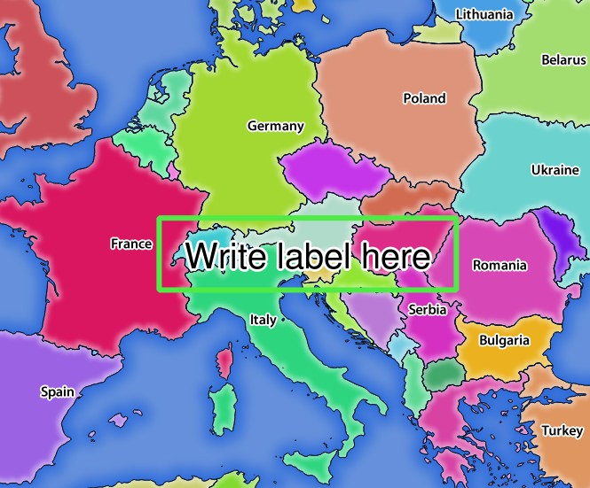

.. _`qgisserver-redlining`:

REDLINING
=========

This feature is available and can be used with ``GetMap`` and
``GetPrint`` requests.

The redlining feature can be used to pass geometries and labels in the
request which are overlapped by the server over the standard returned
image (map).
This permits the user to put emphasis or maybe add some comments (labels)
to some areas, locations etc. that are not in the standard map.

The ``GetMap`` request is in the format::

 http://qgisplatform.demo/cgi-bin/qgis_mapserv.fcgi?map=/world.qgs&SERVICE=WMS&VERSION=1.3.0&
 REQUEST=GetMap
 ...
 &HIGHLIGHT_GEOM=POLYGON((590000 5647000, 590000 6110620, 2500000 6110620, 2500000 5647000, 590000 5647000))
 &HIGHLIGHT_SYMBOL=<StyledLayerDescriptor><UserStyle><Name>Highlight</Name><FeatureTypeStyle><Rule><Name>Symbol</Name><LineSymbolizer><Stroke><SvgParameter name="stroke">%23ea1173</SvgParameter><SvgParameter name="stroke-opacity">1</SvgParameter><SvgParameter name="stroke-width">1.6</SvgParameter></Stroke></LineSymbolizer></Rule></FeatureTypeStyle></UserStyle></StyledLayerDescriptor>
 &HIGHLIGHT_LABELSTRING=Write label here
 &HIGHLIGHT_LABELSIZE=16
 &HIGHLIGHT_LABELCOLOR=%23000000
 &HIGHLIGHT_LABELBUFFERCOLOR=%23FFFFFF
 &HIGHLIGHT_LABELBUFFERSIZE=1.5

The ``GetPrint`` equivalent is in the format (note that ``mapX:`` parameter is added to tell which map has redlining)::

 http://qgisplatform.demo/cgi-bin/qgis_mapserv.fcgi?map=/world.qgs&SERVICE=WMS&VERSION=1.3.0&
 REQUEST=GetPrint
 ...
 &map0:HIGHLIGHT_GEOM=POLYGON((590000 5647000, 590000 6110620, 2500000 6110620, 2500000 5647000, 590000 5647000))
 &map0:HIGHLIGHT_SYMBOL=<StyledLayerDescriptor><UserStyle><Name>Highlight</Name><FeatureTypeStyle><Rule><Name>Symbol</Name><LineSymbolizer><Stroke><SvgParameter name="stroke">%23ea1173</SvgParameter><SvgParameter name="stroke-opacity">1</SvgParameter><SvgParameter name="stroke-width">1.6</SvgParameter></Stroke></LineSymbolizer></Rule></FeatureTypeStyle></UserStyle></StyledLayerDescriptor>
 &map0:HIGHLIGHT_LABELSTRING=Write label here
 &map0:HIGHLIGHT_LABELSIZE=16
 &map0:HIGHLIGHT_LABELCOLOR=%23000000
 &map0:HIGHLIGHT_LABELBUFFERCOLOR=%23FFFFFF
 &map0:HIGHLIGHT_LABELBUFFERSIZE=1.5

Here is the image outputed by the above request in which a polygon and
a label are drawn on top of the normal map:

.. _figure_server_redlining:

   Server response to a GetMap request with redlining parameters

You can see there are several parameters in this request:

* **HIGHLIGHT_GEOM**: You can add POINT, MULTILINESTRING, POLYGON etc.
  It supports multipart geometries. Here is an example:
  ``HIGHLIGHT_GEOM=MULTILINESTRING((0 0, 0 1, 1 1))``.
  The coordinates should be in the CRS of the GetMap/GetPrint request.

* **HIGHLIGHT_SYMBOL**: This controls how the geometry is outlined and
  you can change the stroke width, color and opacity.

* **HIGHLIGHT_LABELSTRING**: You can pass your labeling text to this
  parameter.

* **HIGHLIGHT_LABELSIZE**: This parameter controls the size of the
  label.

* **HIGHLIGHT_LABELFONT**: This parameter controls the font of the
  label (e.g. Arial)

* **HIGHLIGHT_LABELCOLOR**: This parameter controls the label color.

* **HIGHLIGHT_LABELBUFFERCOLOR**: This parameter controls the label
  buffer color.

* **HIGHLIGHT_LABELBUFFERSIZE**: This parameter controls the label
  buffer size.
