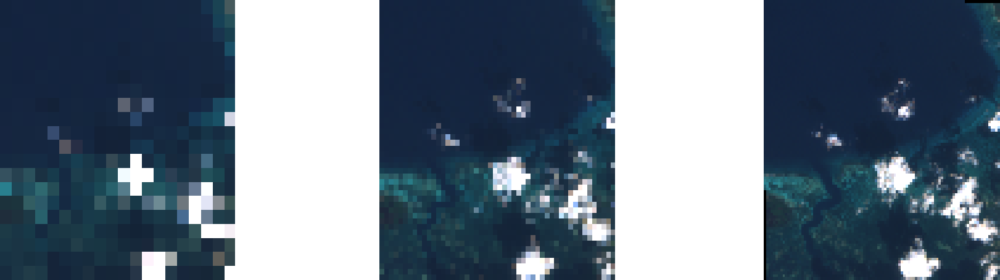

Web Coverage Service (WCS)
==========================

The **1.0.0** and **1.1.1** WCS standards implemented in QGIS Server provide a
HTTP interface to access raster data, referred to as *coverage*, coming from a
QGIS project.

Specifications:

- `WCS 1.0.0 <http://docs.ogc.org/is/16-083r2/16-083r2.html>`_
- `WCS 1.1.1 <http://docs.ogc.org/is/09-146r8/09-146r8.html>`_

Standard requests provided by QGIS Server:

.. csv-table::
   :header: "Request", "Description"
   :widths: auto

   ":ref:`GetCapabilities <wcs_getcapabilities>`", "Returns XML metadata with information about the server"
   ":ref:`DescribeCoverage <wcs_describecoverage>`", "Retrieves XML document about additional information about coverages"
   ":ref:`GetCoverage <wcs_getcoverage>`", "Retrieves coverage"

.. _wcs_getcapabilities:

GetCapabilities
---------------

Standard parameters for the **GetCapabilities** request according to the OGC
WCS 1.1.1 specifications:

.. csv-table::
   :header: "Parameter", "Required", "Description"
   :widths: auto

   ":ref:`SERVICE <services_basics_service>`", "Yes", "Name of the service (**WCS**)"
   ":ref:`REQUEST <services_basics_request>`", "Yes", "Name of the request (**GetCapabilities**)"
   ":ref:`VERSION <wcs_version>`", "No", "Version of the service"

In addition to the standard ones, QGIS Server supports the following extra
parameters:

.. csv-table::
   :header: "Parameter", "Required", "Description"
   :widths: auto

   ":ref:`MAP <services_basics_map>`", "Yes", "QGIS project file"

URL example:

.. code-block:: bash

  http://localhost/qgisserver?
  SERVICE=WCS
  &VERSION=1.1.1
  &REQUEST=GetCapabilities

XML document example when a single raster layer (named
``T20QPD_20171123T144719_TCI``) is published in the QGIS project for the WCS
service:

.. code-block:: xml

  <WCS_Capabilities xmlns="http://www.opengis.net/wcs" xmlns:xlink="http://www.w3.org/1999/xlink" xmlns:gml="http://www.opengis.net/gml" xmlns:xsi="http://www.w3.org/2001/XMLSchema-instance" version="1.0.0" updateSequence="0" xsi:schemaLocation="http://www.opengis.net/wcs http://schemas.opengis.net/wcs/1.0.0/wcsCapabilities.xsd">
    <Service>
      ...
    </Service>
    <Capability>
      ...
    </Capability>
    <ContentMetadata>
      <CoverageOfferingBrief>
        <name>T20QPD_20171123T144719_TCI</name>
        <label>T20QPD_20171123T144719_TCI</label>
        <lonLatEnvelope srsName="urn:ogc:def:crs:OGC:1.3:CRS84">
          <gml:pos>-61.585973 16.331189</gml:pos>
          <gml:pos>-61.52537 16.400376</gml:pos>
        </lonLatEnvelope>
      </CoverageOfferingBrief>
    </ContentMetadata>
  </WCS_Capabilities>

.. _wcs_version:

VERSION
^^^^^^^

This parameter allows to specify the version of the service to use. Currently,
the version values is not internally used and always fallback to ``1.1.1``.

.. _wcs_describecoverage:

DescribeCoverage
----------------

This request allows to retrieve additional information about coverages like the
format of the underlying datasource, the number of bands, ... Standard
parameters for the **DescribeCoverage** request according to the OGC WCS 1.1.1
specifications:

.. csv-table::
   :header: "Parameter", "Required", "Description"
   :widths: auto

   ":ref:`SERVICE <services_basics_service>`", "Yes", "Name of the service (**WCS**)"
   ":ref:`REQUEST <services_basics_request>`", "Yes", "Name of the request (**DescribeCoverage**)"
   ":ref:`VERSION <wcs_version>`", "No", "Version of the service"
   ":ref:`COVERAGE <wcs_describecoverage_coverage>`", "No", "Specify coverage layers (WCS 1.0.0)"
   ":ref:`IDENTIFIER <wcs_describecoverage_identifier>`", "No", "Specify coverage layers (WCS 1.1.1)"

In addition to the standard ones, QGIS Server supports the following extra
parameters:

.. csv-table::
   :header: "Parameter", "Required", "Description"
   :widths: auto

   ":ref:`MAP <services_basics_map>`", "Yes", "QGIS project file"

The XML document for a 3 bands GeoTIFF raster layer looks like:

.. code-block:: xml

  <CoverageDescription xmlns:xlink="http://www.w3.org/1999/xlink" xmlns="http://www.opengis.net/wcs" xmlns:gml="http://www.opengis.net/gml" xmlns:xsi="http://www.w3.org/2001/XMLSchema-instance" updateSequence="0" version="1.0.0" xsi:schemaLocation="http://www.opengis.net/wcs http://schemas.opengis.net/wcs/1.0.0/describeCoverage.xsd">
    <CoverageOffering>
      <name>T20QPD_20171123T144719_TCI</name>
      <label>T20QPD_20171123T144719_TCI</label>
      <lonLatEnvelope srsName="urn:ogc:def:crs:OGC:1.3:CRS84">
        ...
      </lonLatEnvelope>
      <domainSet>
        ...
      </domainSet>
      <rangeSet>
        <RangeSet>
          <name>Bands</name>
          <label>Bands</label>
          <axisDescription>
            <AxisDescription>
              <name>bands</name>
              <label>bands</label>
              <values>
                <singleValue>1</singleValue>
                <singleValue>2</singleValue>
                <singleValue>3</singleValue>
              </values>
            </AxisDescription>
          </axisDescription>
        </RangeSet>
      </rangeSet>
      <supportedCRSs>
      ...
      </supportedCRSs>
      <supportedFormats nativeFormat="raw binary">
        <formats>GeoTIFF</formats>
      </supportedFormats>
    </CoverageOffering>
  </CoverageDescription>

.. _wcs_describecoverage_coverage:

COVERAGE
^^^^^^^^

This parameter, defined in WCS ``1.0.0``, allows to specify the layers to query
for additional information. Names have to be separated by a comma.

In addition, QGIS Server introduced an option to select layers by its short
name. The short name of a layer may be configured through
:menuselection:`Properties --> Metadata` in layer menu. If the short name is
defined, then it's used by default instead of the layer's name:

.. code-block:: bash

  http://localhost/qgisserver?
  SERVICE=WCS
  &REQUEST=DescribeCoverage
  &COVERAGE=mylayer1name,mylayer2shortname

.. note::

  ``COVERAGE`` is mandatory if ``IDENTIFIER`` is not set.

.. _wcs_describecoverage_identifier:

IDENTIFIER
^^^^^^^^^^

This parameter replaces the :ref:`COVERAGE <wcs_describecoverage_coverage>`
parameter in WCS ``1.1.1``. But QGIS Server does not filter according to the
``VERSION`` parameter so ``IDENTIFIER`` and ``COVERAGE`` have the same effect.

.. note::

  ``IDENTIFIER`` is mandatory if ``COVERAGE`` is not set. If both
  ``IDENTIFIER`` and ``COVERAGE`` parameters are defined, ``COVERAGE`` is
  always used in priority.

.. _wcs_getcoverage:

GetCoverage
-----------

This request allows to retrieve the coverage according to specific constraints
like the extent or the CRS. Standard parameters for the **DescribeCoverage**
request according to the OGC WCS 1.1.1 specifications:

.. csv-table::
   :header: "Parameter", "Required", "Description"
   :widths: auto

   ":ref:`SERVICE <services_basics_service>`", "Yes", "Name of the service (**WCS**)"
   ":ref:`REQUEST <services_basics_request>`", "Yes", "Name of the request (**GetCoverage**)"
   ":ref:`VERSION <wcs_version>`", "No", "Version of the service"
   ":ref:`COVERAGE <wcs_describecoverage_coverage>`", "No", "Specify coverage layers (WCS 1.0.0)"
   ":ref:`IDENTIFIER <wcs_describecoverage_identifier>`", "No", "Specify coverage layers (WCS 1.1.1)"
   ":ref:`WIDTH <wcs_getcoverage_width>`", "Yes", "Width of the response in pixels"
   ":ref:`HEIGHT <wcs_getcoverage_height>`", "Yes", "Height of the response in pixels"
   ":ref:`BBOX <wcs_getcoverage_bbox>`", "Yes", "Map extent in CRS units"
   ":ref:`CRS <wcs_getcoverage_crs>`", "Yes", "Coordinate reference system of the extent"
   ":ref:`RESPONSE_CRS <wcs_getcoverage_responsecrs>`", "No", "Coordinate reference system of the response"

In addition to the standard ones, QGIS Server supports the following extra
parameters:

.. csv-table::
   :header: "Parameter", "Required", "Description"
   :widths: auto

   ":ref:`MAP <services_basics_map>`", "Yes", "QGIS project file"

.. _wcs_getcoverage_bbox:

BBOX
^^^^

This parameter allows to specify the map extent in the units of the current
CRS. Coordinates have to be separated by a comma. The ``BBOX`` parameter is
formed like ``minx,miny,maxx,maxy``.

URL example:

.. code-block:: bash

  http://localhost/qgisserver?
  SERVICE=WCS
  &REQUEST=GetCoverage
  &IDENTIFIER=T20QPD_20171123T144719_TCI
  &BBOX=647533,1805950,660987,1813940
  &CRS=EPSG:32620

.. _wcs_getcoverage_crs:

CRS
^^^

This parameter allows to indicate the  Spatial Reference System of the ``BBOX``
parameter and has to be formed like ``EPSG:XXXX``.

.. _wcs_getcoverage_responsecrs:

RESPONSE_CRS
^^^^^^^^^^^^

This parameter allows to indicate the output response Spatial Reference System
and has to be formed like ``EPSG:XXXX``. The CRS of the corresponding coverage
layer is used by default.

.. _wcs_getcoverage_width:

WIDTH
^^^^^

This parameter allows to specify the width in pixels of the output image. The
resolution of the response image depends on this value.

.. _wcs_getcoverage_height:

HEIGHT
^^^^^^

This parameter allows to specify the height in pixels of the output image. The
resolution of the response image depends on this value.

  From left to right: ``WIDTH=20&HEIGHT=20``, ``WIDTH=50&HEIGHT=50``, ``WIDTH=100&HEIGHT=100``
