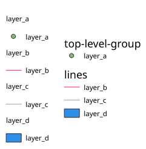

Web Map Service (WMS)
=====================

The **1.1.1** and **1.3.0** WMS standards implemented in QGIS Server provide
a HTTP interface to request map or legend images generated from a QGIS project.
A typical WMS request defines the QGIS project to use, the layers to render as
well as the image format to generate. Basic support is also available for
**Styled Layer Descriptor (SLD)**.

Specifications:

- `WMS 1.1.1 <https://portal.ogc.org/files/?artifact_id=1081&amp;version=1&amp;format=pdf>`_
- `WMS 1.3.0 <https://portal.ogc.org/files/?artifact_id=14416&format=pdf>`_
- `SLD 1.1.0 WMS profile <https://portal.ogc.org/files/?artifact_id=22364&format=pdf>`_

Standard requests provided by QGIS Server:

.. csv-table::
   :header: "Request", "Description"
   :widths: auto

   ":ref:`GetCapabilities <wms_getcapabilities>`", "Returns XML metadata with information about the server"
   ":ref:`GetMap <wms_getmap>`", "Returns a map"
   ":ref:`GetFeatureInfo <wms_getfeatureinfo>`", "Retrieves data (geometry and values) for a pixel location"
   ":ref:`GetLegendGraphic <wms_getlegendgraphic>`", "Returns legend symbols"
   ":ref:`GetStyle(s) <wms_getstyle>`", "Returns XML document with style description in SLD"
   ":ref:`DescribeLayer <wms_describelayer>`", "Returns information about WFS and WCS availability respectively for vector and raster layers"

Vendor requests provided by QGIS Server:

.. csv-table::
   :header: "Request", "Description"
   :widths: auto

   ":ref:`GetPrint <wms_getprint>`", "Returns a QGIS layout"
   ":ref:`GetProjectSettings <wms_getprojectsettings>`", "Returns specific information about QGIS Server"
   ":ref:`GetSchemaExtension <wms_getschemaextension>`", "Returns XML metadata about optional extended capabilities"

.. _wms_getcapabilities:

GetCapabilities
---------------

Standard parameters for the **GetCapabilities** request according to the OGC
WMS 1.1.1 and 1.3.0 specifications:

.. csv-table::
   :header: "Parameter", "Required", "Description"
   :widths: auto

   ":ref:`SERVICE <services_basics_service>`", "Yes", "Name of the service (**WMS**)"
   ":ref:`REQUEST <services_basics_request>`", "Yes", "Name of the request (**GetCapabilities**)"
   ":ref:`VERSION <wms_version>`", "No", "Version of the service"

The **GetCapabilities** request supports as well the following vendor
parameters:

.. csv-table::
   :header: "Parameter", "Required", "Description"
   :widths: auto

   ":ref:`MAP <services_basics_map>`", "Yes", "QGIS project file"

URL example:

.. code-block:: bash

  http://localhost/qgisserver?
  SERVICE=WMS
  &VERSION=1.3.0
  &REQUEST=GetCapabilities

.. _wms_getmap:

GetMap
------

Standard parameters for the **GetMap** request according to the OGC
WMS 1.1.1 and 1.3.0 specifications:

.. csv-table::
   :header: "Parameter", "Required", "Description"
   :widths: auto

   ":ref:`SERVICE <services_basics_service>`", "Yes", "Name of the service (**WMS**)"
   ":ref:`REQUEST <services_basics_request>`", "Yes", "Name of the request (**GetMap**)"
   ":ref:`VERSION <wms_version>`", "Yes", "Version of the service"
   ":ref:`LAYERS <wms_layers>`", "No", "Layers to display"
   ":ref:`STYLES <wms_styles>`", "No", "Layers' style"
   ":ref:`SRS / CRS <wms_srs>`", "Yes", "Coordinate reference system"
   ":ref:`BBOX <wms_bbox>`", "Yes", "Map extent"
   ":ref:`WIDTH <wms_width>`", "Yes", "Width of the image in pixels"
   ":ref:`HEIGHT <wms_height>`", "Yes", "Height of the image in pixels"
   ":ref:`FORMAT <wms_getmap_format>`", "No", "Image format"
   ":ref:`TRANSPARENT <wms_transparent>`", "No", "Transparent background"
   "SLD", "No", "URL of an SLD to be used for styling"
   "SLD_BODY", "No", "In-line SLD (XML) to be used for styling"

In addition to the standard ones, QGIS Server supports :ref:`redlining
<wms_redlining>`, :ref:`external WMS layers <wms_external>`
as well as the following extra parameters:

.. csv-table::
   :header: "Parameter", "Required", "Description"
   :widths: 20, 10, 65

   ":ref:`MAP <services_basics_map>`", "Yes", "QGIS project file"
   ":ref:`BGCOLOR <wms_bgcolor>`", "No", "Specify the background color"
   ":ref:`DPI <wms_dpi>`", "No", "Specify the output resolution"
   ":ref:`IMAGE_QUALITY <wms_imagequality>`", "No", "JPEG compression"
   ":ref:`OPACITIES <wms_opacities>`", "No", "Opacity for layer or group"
   ":ref:`FILTER <wms_filter>`", "No", "Subset of features"
   ":ref:`SELECTION <wms_selection>`", "No", "Highlight features"
   "FILE_NAME", "No", "File name of the downloaded file

   Only for ``FORMAT=application/dxf``"
   ":ref:`FORMAT_OPTIONS <wms_getmap_formatoptions>`", "No", "Options of the specified file format

   Only for ``FORMAT=application/dxf``"
   ":ref:`TILED <wms_tiled>`", "No", "Working in *tiled mode*"

URL example:

.. code-block:: bash

  http://localhost/qgisserver?
  SERVICE=WMS
  &VERSION=1.3.0
  &REQUEST=GetMap
  &MAP=/home/qgis/projects/world.qgs
  &LAYERS=mylayer1,mylayer2,mylayer3
  &STYLES=style1,default,style3
  &OPACITIES=125,200,125
  &CRS=EPSG:4326
  &WIDTH=400
  &HEIGHT=400
  &FORMAT=image/png
  &TRANSPARENT=TRUE
  &DPI=300
  &TILED=TRUE

.. _wms_version:

VERSION
^^^^^^^

This parameter allows to specify the version of the service to use.
Available values for the ``VERSION`` parameter are:

- ``1.1.1``
- ``1.3.0``

According to the version number, slight differences have to be expected
as explained later for the next parameters:

- ``CRS`` / ``SRS``
- ``BBOX``

.. _wms_layers:

LAYERS
^^^^^^

This parameter allows to specify the layers to display on the map.
Names have to be separated by a comma.

In addition, QGIS Server introduced some options to select layers by:

* the layer id: the project option allowing to select layers by their id
  is in :menuselection:`QGIS Server --> WMS` tab of the :menuselection:`Project --> Properties...` dialog.
  Check the :guilabel:`Use layer ids as names` checkbox to activate this option.
* a :ref:`short name <services_basics_short_name>`

.. code-block:: bash

  http://localhost/qgisserver?
  SERVICE=WMS
  &REQUEST=GetMap
  &LAYERS=mylayerid1,mylayerid2
  &...

.. _wms_styles:

STYLES
^^^^^^

This parameter can be used to specify a layer's style for the
rendering step.
Styles have to be separated by a comma. The name of the default style
is ``default``.

.. _wms_srs:

SRS / CRS
^^^^^^^^^

This parameter allows to indicate the map output Spatial Reference
System in WMS **1.1.1** and has to be formed like ``EPSG:XXXX``.
Note that ``CRS`` is also supported if current version is **1.1.1**.

For WMS **1.3.0**, ``CRS`` parameter is preferable but ``SRS`` is also
supported.

Note that if both ``CRS`` and ``SRS`` parameters are indicated in the
request, then it's the current version indicated in ``VERSION``
parameter which is decisive.

In the next case, the ``SRS`` parameter is kept whatever the
``VERSION`` parameter because ``CRS`` is not indicated:

.. code-block:: bash

  http://localhost/qgisserver?
  SERVICE=WMS
  &REQUEST=GetMap
  &VERSION=1.3.0
  &SRS=EPSG:2854
  &...

In the next case, the ``SRS`` parameter is kept instead of ``CRS``
because of the ``VERSION`` parameter:

.. code-block:: bash

  http://localhost/qgisserver?
  SERVICE=WMS
  &REQUEST=GetMap
  &VERSION=1.1.1
  &CRS=EPSG:4326
  &SRS=EPSG:2854
  &...

In the next case, the ``CRS`` parameter is kept instead of ``SRS``
because of the ``VERSION`` parameter:

.. code-block:: bash

  http://localhost/qgisserver?
  SERVICE=WMS
  &REQUEST=GetMap
  &VERSION=1.3.0
  &CRS=EPSG:4326
  &SRS=EPSG:2854
  &...

.. _wms_bbox:

BBOX
^^^^

This parameter allows to specify the map extent with units according
to the current CRS. Coordinates have to be separated by a comma.

The ``BBOX`` parameter is formed like ``min_a,min_b,max_a,max_b`` but ``a`` and
``b`` axis definition is different according to the current ``VERSION``
parameter:

* in WMS **1.1.1**, the axis ordering is always east/north
* in WMS **1.3.0**, the axis ordering depends on the CRS authority

For example in case of ``EPSG:4326`` and WMS **1.1.1**, ``a`` is the longitude
(east) and ``b`` the latitude (north), leading to a request like:

.. code-block:: bash

  http://localhost/qgisserver?
  SERVICE=WMS
  &REQUEST=GetMap
  &VERSION=1.1.1
  &SRS=epsg:4326
  &BBOX=-180,-90,180,90
  &...

But in case of WMS **1.3.0**, the axis ordering defined in the EPSG database is
north/east so ``a`` is the latitude and ``b`` the longitude:

.. code-block:: bash

  http://localhost/qgisserver?
  SERVICE=WMS
  &REQUEST=GetMap
  &VERSION=1.3.0
  &CRS=epsg:4326
  &BBOX=-90,-180,90,180
  &...

.. _wms_width:

WIDTH
^^^^^

This parameter allows to specify the width in pixels of the output
image.

.. _wms_height:

HEIGHT
^^^^^^

This parameter allows to specify the height in pixels of the output
image.

.. _wms_getmap_format:

FORMAT
^^^^^^

This parameter may be used to specify the format of map image.
Available values are:

* ``jpg``
* ``jpeg``
* ``image/jpeg``
* ``image/png``
* ``image/png; mode=1bit``
* ``image/png; mode=8bit``
* ``image/png; mode=16bit``
* ``image/webp``
* ``application/dxf``: only layers that have read access in the WFS service are
  exported in the DXF format
* ``application/pdf``

  URL example:

  .. code-block:: bash

   http://localhost/qgisserver?
   SERVICE=WMS&VERSION=1.3.0
   &REQUEST=GetMap
   &FORMAT=application/dxf
   &LAYERS=Haltungen,Normschacht,Spezialbauwerke
   &CRS=EPSG%3A21781
   &BBOX=696136.28844801,245797.12108743,696318.91114315,245939.25832905
   &WIDTH=1042
   &HEIGHT=811
   &FORMAT_OPTIONS=MODE:SYMBOLLAYERSYMBOLOGY;SCALE:250
   &FILE_NAME=plan.dxf

.. _wms_transparent:

TRANSPARENT
^^^^^^^^^^^

This boolean parameter can be used to specify the background
transparency.
Available values are (not case sensitive):

- ``TRUE``
- ``FALSE``

However, this parameter is ignored if the format of the image indicated with
``FORMAT`` is different from PNG.

.. _wms_bgcolor:

BGCOLOR
^^^^^^^

This parameter allows to indicate a background color for the map image.
However it cannot be combined with ``TRANSPARENT`` parameter in case of
PNG images (transparency takes priority). The colour may be literal or
in hexadecimal notation.

URL example with the literal notation:

.. code-block:: bash

  http://localhost/qgisserver?
  SERVICE=WMS
  &REQUEST=GetMap
  &VERSION=1.3.0
  &BGCOLOR=green
  &...

URL example with the hexadecimal notation:

.. code-block:: bash

  http://localhost/qgisserver?
  SERVICE=WMS
  &REQUEST=GetMap
  &VERSION=1.3.0
  &BGCOLOR=0x00FF00
  &...

.. _wms_dpi:

DPI
^^^

This parameter can be used to specify the requested output resolution.

.. _wms_imagequality:

IMAGE_QUALITY
^^^^^^^^^^^^^

This parameter is only used for JPEG images. By default, the JPEG
compression is ``-1``.

You can change the default per QGIS project in the
:menuselection:`OWS Server --> WMS capabilities` menu of the
:menuselection:`Project --> Properties...` dialog.
If you want to override it in a ``GetMap`` request you can do it using
the ``IMAGE_QUALITY`` parameter.

.. _wms_opacities:

OPACITIES
^^^^^^^^^

Comma separated list of opacity values.
Opacity can be set on layer or group level. Allowed values range from
``0`` (fully transparent) to ``255`` (fully opaque).

URL example:

.. code-block:: bash

  http://localhost/qgisserver?
  SERVICE=WMS
  &REQUEST=GetMap
  &VERSION=1.3.0
  &WIDTH=400
  &HEIGHT=200
  &CRS=EPSG:4326
  &LAYERS=countries,places
  &BBOX=42,-6,52,15
  &OPACITIES=255,0

  To the left ``OPACITIES=255,0`` and to the right ``OPACITIES=255,255``

.. _wms_filter:

FILTER
^^^^^^

A subset of layers can be selected with the ``FILTER`` parameter.
The syntax is basically the same as for the QGIS subset string.
However, there are some restrictions to avoid SQL injections into
databases via QGIS Server.
If a dangerous string is found in the parameter, QGIS Server will
return the next error:

.. code-block:: bash

  <ServiceExceptionReport>
    <ServiceException code="Security">The filter string XXXXXXXXX has been rejected because of security reasons.
    Note: Text strings have to be enclosed in single or double quotes. A space between each word / special character is mandatory.
    Allowed Keywords and special characters are IS,NOT,NULL,AND,OR,IN,=,<,=<,>,>=,!=,',',(,),DMETAPHONE,SOUNDEX.
    Not allowed are semicolons in the filter expression.</ServiceException>
  </ServiceExceptionReport>

URL example:

.. code-block:: bash

  http://localhost/qgisserver?
  SERVICE=WMS
  &REQUEST=GetMap
  &VERSION=1.3.0
  &WIDTH=400
  &HEIGHT=300
  &CRS=EPSG:4326
  &BBOX=41,-6,52,10
  &LAYERS=countries_shapeburst,countries,places
  &FILTER=countries_shapeburst,countries:"name" = 'France';places: "name" = 'Paris'

.. figure:: img/wms_getmap_filter.png
  :align: center

  Server response to a GetMap request with FILTER parameter

In this example, the same filter ``"name" = 'France'`` is applied to layers
``countries`` and ``countries_shapeburst``, while the filter ``"name" =
'Paris'`` is only applied to ``places``.

.. note::

  It is possible to make attribute searches via GetFeatureInfo and omit
  the X/Y parameter if a FILTER is there. QGIS Server then returns info
  about the matching features and generates a combined bounding box in
  the XML output.

.. _wms_selection:

SELECTION
^^^^^^^^^

The ``SELECTION`` parameter can highlight features from one or more
layers.
Vector features can be selected by passing comma separated lists with
feature ids.

.. code-block:: bash

  http://localhost/qgisserver?
  SERVICE=WMS
  &REQUEST=GetMap
  &LAYERS=mylayer1,mylayer2
  &SELECTION=mylayer1:3,6,9;mylayer2:1,5,6
  &...

The following image presents the response from a GetMap request using
the ``SELECTION`` option e.g.
``http://myserver.com/...&SELECTION=countries:171,65``.

As those features id's correspond in the source dataset to **France**
and **Romania** they're highlighted in yellow.

.. _figure_server_selection:

.. figure:: img/server_selection_parameter.png
  :align: center

  Server response to a GetMap request with SELECTION parameter

.. _wms_getmap_formatoptions:

FORMAT_OPTIONS
^^^^^^^^^^^^^^

This parameter can be used to specify options for the selected format.
Only for ``FORMAT=application/dxf`` in GetMap request.
Takes a list of key:value pairs separated by semicolon:

* SCALE: to be used for symbology rules, filters and styles (not
  actual scaling of the data - data remains in the original scale).
* MODE: corresponds to the export options offered in the QGIS
  Desktop DXF export dialog. Possible values are ``NOSYMBOLOGY``,
  ``FEATURESYMBOLOGY`` and ``SYMBOLLAYERSYMBOLOGY``.
* LAYERATTRIBUTES: specify a field or in case of many layers a comma separated list of fields
  that contains values for DXF layer names - if not specified, the original QGIS layer names are used.
* USE_TITLE_AS_LAYERNAME: if enabled, the title of the layer will
  be used as layer name.
* CODEC: specify a codec to be used for encoding. Default is ``ISO-8859-1``
  check the QGIS desktop DXF export dialog for valid values.
* NO_MTEXT: Use TEXT instead of MTEXT for labels.
* FORCE_2D: Force 2D output. This is required for polyline width.

.. _wms_tiled:

TILED
^^^^^

For performance reasons, QGIS Server can be used in tiled mode.
In this mode, the client requests several small fixed size tiles, and assembles
them to form the whole map. Doing this, symbols at or near the
boundary between two tiles may appeared cut, because they are only present in
one of the tile.

Set the ``TILED`` parameter to ``TRUE`` to tell QGIS Server to work in
*tiled* mode, and to apply the *Tile buffer* configured in the QGIS
project (see :ref:`Creatingwmsfromproject`).

When ``TILED`` is ``TRUE`` and when a non-zero Tile buffer is
configured in the QGIS project, features outside the tile extent are
drawn to avoid cut symbols at tile boundaries.

``TILED`` defaults to ``FALSE``.

.. _wms_getfeatureinfo:

GetFeatureInfo
--------------

Standard parameters for the **GetFeatureInfo** request according to
the OGC WMS 1.1.1 and 1.3.0 specifications:

.. csv-table::
   :header: "Parameter", "Required", "Description"
   :widths: auto

   ":ref:`SERVICE <services_basics_service>`", "Yes", "Name of the service (**WMS**)"
   ":ref:`REQUEST <services_basics_request>`", "Yes", "Name of the request (**GetFeatureInfo**)"
   ":ref:`VERSION <wms_version>`", "No", "Version of the service"
   ":ref:`QUERY_LAYERS <wms_querylayers>`", "Yes", "Layers to query"
   ":ref:`LAYERS <wms_layers>`", "Yes", "Layers to display (identical to `QUERY_LAYERS`)"
   ":ref:`STYLES <wms_styles>`", "No", "Layers' style"
   ":ref:`SRS / CRS <wms_srs>`", "Yes", "Coordinate reference system"
   ":ref:`BBOX <wms_bbox>`", "No", "Map extent"
   ":ref:`WIDTH <wms_width>`", "Yes", "Width of the image in pixels"
   ":ref:`HEIGHT <wms_height>`", "Yes", "Height of the image in pixels"
   ":ref:`TRANSPARENT <wms_transparent>`", "No", "Transparent background"
   ":ref:`INFO_FORMAT <wms_infoformat>`", "No", "Output format"
   ":ref:`FEATURE_COUNT <wms_featurecount>`", "No", "Maximum number of features to return"
   ":ref:`I <wms_i>`", "No", "Pixel column of the point to query"
   ":ref:`X <wms_x>`", "No", "Same as `I` parameter, but in WMS 1.1.1"
   ":ref:`J <wms_j>`", "No", "Pixel row of the point to query"
   ":ref:`Y <wms_y>`", "No", "Same as `J` parameter, but in WMS 1.1.1"
   "WMS_PRECISION", "No", "The precision (number of digits) to be used
   when returning geometry (see :ref:`how to add geometry to feature response <addGeometryToFeatureResponse>`).
   The default value is ``-1`` meaning that the precision defined in the project is used."

In addition to the standard ones, QGIS Server supports the following
extra parameters:

.. csv-table::
   :header: "Parameter", "Required", "Description"
   :widths: auto

   ":ref:`MAP <services_basics_map>`", "Yes", "QGIS project file"
   ":ref:`FILTER <wms_filter>`", "No", "Subset of features"
   ":ref:`FI_POINT_TOLERANCE <wms_fipointtolerance>`", "No", "Tolerance in pixels for point layers"
   ":ref:`FI_LINE_TOLERANCE <wms_filinetolerance>`", "No", "Tolerance in pixels for line layers"
   ":ref:`FI_POLYGON_TOLERANCE <wms_fipolygontolerance>`", "No", "Tolerance in pixels for polygon layers"
   ":ref:`FILTER_GEOM <wms_filtergeom>`", "No", "Geometry filtering"
   ":ref:`WITH_DISPLAY_NAME <wms_withdisplayname>`", "No", "Add the feature display name to the output"
   ":ref:`WITH_MAPTIP <wms_withmaptip>`", "No", "Add map tips to the output"
   ":ref:`WITH_GEOMETRY <wms_withgeometry>`", "No", "Add geometry to the output"

URL example:

.. code-block:: bash

  http://localhost/qgisserver?
  SERVICE=WMS
  &VERSION=1.3.0
  &REQUEST=GetMap
  &MAP=/home/qgis/projects/world.qgs
  &LAYERS=mylayer1,mylayer2,mylayer3
  &CRS=EPSG:4326
  &WIDTH=400
  &HEIGHT=400
  &INFO_FORMAT=text/xml
  &TRANSPARENT=TRUE
  &QUERY_LAYERS=mylayer1
  &FEATURE_COUNT=3
  &I=250
  &J=250

.. _wms_infoformat:

INFO_FORMAT
^^^^^^^^^^^

This parameter may be used to specify the format of the result.
Available values are:

- ``text/xml``
- ``text/html``
- ``text/plain``
- ``application/vnd.ogc.gml``
- ``application/json``

.. _wms_querylayers:

QUERY_LAYERS
^^^^^^^^^^^^

This parameter specifies the layers to display on the map.
Names are separated by a comma.

In addition, QGIS Server introduces options to select layers by:

* short name
* layer id

See the ``LAYERS`` parameter defined in
:ref:`GetMap <wms_layers>` for more information.

.. _wms_featurecount:

FEATURE_COUNT
^^^^^^^^^^^^^

This parameter specifies the maximum number of features per layer to
return.
For example if ``QUERY_LAYERS`` is set to ``layer1,layer2`` and
``FEATURE_COUNT`` is set to ``3`` then a maximum of 3 features from
layer1 will be returned.
Likewise a maximum of 3 features from layer2 will be returned.

By default, only 1 feature per layer is returned.

.. _wms_i:

I
^

This parameter, defined in WMS 1.3.0, allows you to specify the pixel
column of the query point.

.. _wms_x:

X
^

Same parameter as ``I``, but defined in WMS 1.1.1.

.. _wms_j:

J
^

This parameter, defined in WMS 1.3.0, allows you to specify the pixel
row of the query point.

.. _wms_y:

Y
^

Same parameter as ``J``, but defined in WMS 1.1.1.

.. _wms_fipointtolerance:

FI_POINT_TOLERANCE
^^^^^^^^^^^^^^^^^^

This parameter specifies the tolerance in pixels for point layers.

.. _wms_filinetolerance:

FI_LINE_TOLERANCE
^^^^^^^^^^^^^^^^^

This parameter specifies the tolerance in pixels for line layers.

.. _wms_fipolygontolerance:

FI_POLYGON_TOLERANCE
^^^^^^^^^^^^^^^^^^^^

This parameter specifies the tolerance in pixels for polygon layers.

.. _wms_filtergeom:

FILTER_GEOM
^^^^^^^^^^^

This parameter specifies a WKT geometry with which features have to
intersect.

.. _wms_withdisplayname:

WITH_DISPLAY_NAME
^^^^^^^^^^^^^^^^^

This parameter specifies whether to add feature display name to the output.

Available values are (not case sensitive):

- ``TRUE``
- ``FALSE``

.. _wms_withmaptip:

WITH_MAPTIP
^^^^^^^^^^^

This parameter specifies whether to add map tips to the output.

Available values are (not case sensitive):

- ``TRUE``
- ``FALSE``
- ``HTML_FI_ONLY_MAPTIP``: like ``TRUE``, with the difference that the HTML response
  to the feature info request only contains the maptip.
  This gives full control over the HTML response using e.g. the built-in layer maptip editor.

.. _wms_withgeometry:

WITH_GEOMETRY
^^^^^^^^^^^^^

This parameter specifies whether to add geometries to the output. To use
this feature you must first enable the :guilabel:`Add geometry to feature response`
option in the QGIS project. See :ref:`Configure your project <Creatingwmsfromproject>`.

Available values are (not case sensitive):

- ``TRUE``
- ``FALSE``

.. _wms_getlegendgraphic:

GetLegendGraphic
-----------------

Standard parameters for the **GetLegendGraphic** request according to the OGC
WMS 1.1.1 and 1.3.0 specifications:

.. csv-table::
   :header: "Parameter", "Required", "Description"
   :widths: auto

   ":ref:`SERVICE <services_basics_service>`", "Yes", "Name of the service (**WMS**)"
   ":ref:`REQUEST <services_basics_request>`", "Yes", "Name of the request (**GetLegendGraphic**)"
   ":ref:`VERSION <wms_version>`", "No", "Version of the service"
   ":ref:`LAYERS <wms_layers>`", "Yes", "Layers to display"
   ":ref:`STYLES <wms_styles>`", "No", "Layers' style"
   ":ref:`SRS / CRS <wms_srs>`", "No", "Coordinate reference system"
   ":ref:`BBOX <wms_getlegendgraphic_bbox>`", "No", "Map extent"
   ":ref:`WIDTH <wms_getlegendgraphic_width>`", "No", "Width of the image in pixels"
   ":ref:`HEIGHT <wms_getlegendgraphic_height>`", "No", "Height of the image in pixels"
   ":ref:`FORMAT <wms_getlegendgraphic_format>`", "No", "Legend format"
   ":ref:`TRANSPARENT <wms_transparent>`", "No", "Transparent background"

In addition to the standard ones, QGIS Server supports extra parameters to
change the size of the legend elements or the font properties for layer titles
and item labels:

.. csv-table::
   :header: "Parameter", "Required", "Description"
   :widths: auto

   ":ref:`MAP <services_basics_map>`", "Yes", "QGIS project file"
   ":ref:`SRCWIDTH <wms_getlegendgraphic_srcwidth>`", "No", "Map width"
   ":ref:`SRCHEIGHT <wms_getlegendgraphic_srcheight>`", "No", "Map height"
   ":ref:`SHOWFEATURECOUNT <wms_getlegendgraphic_showfeaturecount>`", "No", "Add feature count of features"
   ":ref:`RULE <wms_getlegendgraphic_rule>`", "No", "Rule symbol to render"
   ":ref:`RULELABEL <wms_getlegendgraphic_rulelabel>`", "No", "Item labels rendering"
   ":ref:`BOXSPACE <wms_getlegendgraphic_boxspace>`", "No", "Space between legend frame and content (mm)"
   ":ref:`LAYERSPACE <wms_getlegendgraphic_layerspace>`", "No", "Vertical space between layers (mm)"
   ":ref:`LAYERTITLESPACE <wms_getlegendgraphic_layertitlespace>`", "No", "Vertical space between layer title and items (mm)"
   ":ref:`SYMBOLSPACE <wms_getlegendgraphic_symbolspace>`", "No", "Vertical space between symbol and items (mm)"
   ":ref:`ICONLABELSPACE <wms_getlegendgraphic-iconlabelspace>`", "No", "Horizontal space between symbol and label (mm)"
   ":ref:`SYMBOLWIDTH <wms_getlegendgraphic_symbolwidth>`", "No", "Width of the symbol preview (mm)"
   ":ref:`SYMBOLHEIGHT <wms_getlegendgraphic_symbolheight>`", "No", "Height of the symbol preview (mm)"
   ":ref:`LAYERTITLE <wms_getlegendgraphic_layertitle>`", "No", "Layer title rendering"
   ":ref:`LAYERFONTFAMILY <wms_getlegendgraphic_layerfontfamily>`", "No", "Layer font family"
   ":ref:`LAYERFONTBOLD <wms_getlegendgraphic_layerfontbold>`", "No", "Layer title bold rendering"
   ":ref:`LAYERFONTSIZE <wms_getlegendgraphic_layerfontsize>`", "No", "Layer title font size (pt)"
   ":ref:`LAYERFONTITALIC <wms_getlegendgraphic_layerfontitalic>`", "No", "Layer title italic rendering"
   ":ref:`LAYERFONTCOLOR <wms_getlegendgraphic_layerfontcolor>`", "No", "Layer title color"
   ":ref:`ITEMFONTFAMILY <wms_getlegendgraphic_itemfontfamily>`", "No", "Item font family"
   ":ref:`ITEMFONTBOLD <wms_getlegendgraphic_itemfontbold>`", "No", "Item label bold rendering"
   ":ref:`ITEMFONTSIZE <wms_getlegendgraphic_itemfontsize>`", "No", "Item label font size (pt)"
   ":ref:`ITEMFONTITALIC <wms_getlegendgraphic_itemfontitalic>`", "No", "Item label italic rendering"
   ":ref:`ITEMFONTCOLOR <wms_getlegendgraphic_itemfontcolor>`", "No", "Item label color"
   ":ref:`SHOWRULEDETAILS <wms_getlegendgraphic_showruledetails>`", "No", "Adds the rule text to JSON output"
   ":ref:`ADDLAYERGROUPS <wms_getlegendgraphic_addlayergroups>`", "No", "Adds the layer groups to JSON output"

.. _wms_getlegendgraphic_bbox:

BBOX
^^^^

This parameter can be used to specify the geographical area for which the
legend should be built (its format is described :ref:`here <wms_bbox>`) but
cannot be combined with the ``RULE`` parameter. The ``SRS``/``CRS`` parameter
becomes mandatory when using the ``BBOX`` parameter.

URL example:

.. code-block:: bash

  http://localhost/qgisserver?
  SERVICE=WMS
  &REQUEST=GetLegendGraphic
  &LAYERS=countries,airports
  &BBOX=43.20,-2.93,49.35,8.32
  &CRS=EPSG:4326

.. note::

  When the ``BBOX`` parameter is defined, the legend is referred to as a
  *content based legend*.

.. _wms_getlegendgraphic_width:

WIDTH
^^^^^

This parameter is not used by default but becomes mandatory when the ``RULE``
parameter is set. In this case it allows to specify the width in pixels of the
output image.

.. code-block:: bash

  http://localhost/qgisserver?
  SERVICE=WMS
  &REQUEST=getlegendgraphic
  &LAYER=testlayer%20%C3%A8%C3%A9
  &RULE=rule1
  &WIDTH=30
  &HEIGHT=30

.. _wms_getlegendgraphic_height:

HEIGHT
^^^^^^

This parameter is not used by default but becomes mandatory when the ``RULE``
parameter is set. In this case it allows to specify the height in pixels of the
output image.

.. code-block:: bash

  http://localhost/qgisserver?
  SERVICE=WMS
  &REQUEST=GetLegendGraphic
  &LAYER=testlayer%20%C3%A8%C3%A9
  &RULE=rule1
  &WIDTH=30
  &HEIGHT=30

.. _wms_getlegendgraphic_format:

FORMAT
^^^^^^

This parameter may be used to specify the format of legend image. Available
values are:

* ``image/jpeg``
* ``image/png``
* ``application/json``

For JSON, symbols are encoded with Base64 and most other options related to
layout or fonts are not taken into account because the legend must be built on
the client side. The ``RULE`` parameter cannot be combined with this format.

URL example with the corresponding JSON output:

.. code-block:: bash

  http://localhost/qgisserver?
  SERVICE=WMS&
  REQUEST=GetLegendGraphic&
  LAYERS=airports&
  FORMAT=application/json

And the corresponding JSON output:

.. code-block:: json

  {
    "nodes":[
      {
        "icon":"<base64 icon>",
        "title":"airports",
        "type":"layer"
      }
    ],
    "title":""
  }

.. _wms_getlegendgraphic_srcwidth:

SRCWIDTH
^^^^^^^^

This parameter may de defined when the ``RULE`` parameter is set. In this case,
the ``SRCWIDTH`` value is forwarded to the underlying ``GetMap`` request as the
``WIDTH`` parameter while the ``WIDTH`` parameter of ``GetLegendGraphic`` is
used for the image legend size.

.. _wms_getlegendgraphic_srcheight:

SRCHEIGHT
^^^^^^^^^

This parameter may de defined when the ``RULE`` parameter is set. In this case,
the ``SRCHEIGHT`` value is forwarded to the underlying ``GetMap`` request as
the ``HEIGHT`` parameter while the ``HEIGHT`` parameter of ``GetLegendGraphic``
is used for the image legend size.

.. _wms_getlegendgraphic_showfeaturecount:

SHOWFEATURECOUNT
^^^^^^^^^^^^^^^^

This parameter can be used to activate feature count in the legend. Available
values are (not case sensitive):

- ``TRUE``
- ``FALSE``

For example:

.. _wms_getlegendgraphic_rule:

RULE
^^^^

This parameter is available on layers with :guilabel:`Rule-based` rendering and
allows to build a legend with only the named rule symbol. It cannot be combined
with ``BBOX`` parameter. ``HEIGHT`` and ``WIDTH`` must be specified.

URL example:

.. code-block:: bash

  http://localhost/qgisserver?
  SERVICE=WMS
  &REQUEST=GetLegendGraphic
  &LAYERS=mylayer,
  &RULE=myrulename,
  &WIDTH=20,
  &HEIGHT=20

.. _wms_getlegendgraphic_rulelabel:

RULELABEL
^^^^^^^^^

This parameter allows to control the item label rendering. Available values are
(not case sensitive):

- ``TRUE``: display item label
- ``FALSE``: hide item label
- ``AUTO``: hide item label for layers with :guilabel:`Single symbol` rendering

URL example:

.. code-block:: bash

  http://localhost/qgisserver?
  SERVICE=WMS
  &REQUEST=GetLegendGraphic
  &LAYERS=countries,airports
  &BBOX=43.20,-2.93,49.35,8.32
  &CRS=EPSG:4326
  &TRANSPARENT=TRUE
  &RULELABEL=AUTO

.. figure:: img/wms_getlegendgraphic_rulelabel.png
   :align: center

   Legend rendering without label for single symbol layers

.. _wms_getlegendgraphic_boxspace:

BOXSPACE
^^^^^^^^

This parameter allows to specify the space between legend frame and content in
millimeters. By default, the space value is ``2`` mm.

URL example:

.. code-block:: bash

  http://localhost/qgisserver?
  SERVICE=WMS
  &REQUEST=GetLegendGraphic
  &LAYERS=airports
  &BBOX=43.20,-2.93,49.35,8.32
  &CRS=EPSG:4326
  &TRANSPARENT=TRUE
  &BOXSPACE=0

.. figure:: img/wms_getlegendgraphic_boxspace.png
   :align: center

   To the left ``BOXSPACE=0`` and to the right ``BOXSPACE=15``

.. _wms_getlegendgraphic_layerspace:

LAYERSPACE
^^^^^^^^^^

This parameter allows to specify the vertical space between layers in
millimeters. By default, the space value is ``3`` mm.

URL example:

.. code-block:: bash

  http://localhost/qgisserver?
  SERVICE=WMS
  &REQUEST=GetLegendGraphic
  &LAYERS=airports,places
  &BBOX=43.20,-2.93,49.35,8.32
  &CRS=EPSG:4326
  &TRANSPARENT=TRUE
  &LAYERSPACE=0

.. figure:: img/wms_getlegendgraphic_layerspace.png
   :align: center

   To the left ``LAYERSPACE=0`` and to the right ``LAYERSPACE=10``

.. _wms_getlegendgraphic_layertitlespace:

LAYERTITLESPACE
^^^^^^^^^^^^^^^

This parameter allows to specify the vertical space between layer title and
items following in millimeters. By default the space value is ``3`` mm.

URL example:

.. code-block:: bash

  http://localhost/qgisserver?
  SERVICE=WMS
  &REQUEST=GetLegendGraphic
  &LAYERS=airports,places
  &BBOX=43.20,-2.93,49.35,8.32
  &CRS=EPSG:4326
  &TRANSPARENT=TRUE
  &LAYERTITLESPACE=0

.. figure:: img/wms_getlegendgraphic_layertitlespace.png
   :align: center

   To the left ``LAYERTITLESPACE=0`` and to the right ``LAYERTITLESPACE=10``

.. _wms_getlegendgraphic_symbolspace:

SYMBOLSPACE
^^^^^^^^^^^

This parameter allows to specify the vertical space between symbol and item
following in millimeters. By default the space value is ``2`` mm.

URL example:

.. code-block:: bash

  http://localhost/qgisserver?
  SERVICE=WMS
  &REQUEST=GetLegendGraphic
  &LAYERS=countries
  &BBOX=43.20,-2.93,49.35,8.32
  &CRS=EPSG:4326
  &TRANSPARENT=TRUE
  &SYMBOLSPACE=0

.. figure:: img/wms_getlegendgraphic_symbolspace.png
   :align: center

   To the left ``SYMBOLSPACE=0`` and to the right ``SYMBOLSPACE=5``

.. _wms_getlegendgraphic-iconlabelspace:

ICONLABELSPACE
^^^^^^^^^^^^^^

This parameter allows to specify the horizontal space between symbol and label
text in millimeters. By default the space value is ``2`` mm.

URL example:

.. code-block:: bash

  http://localhost/qgisserver?
  SERVICE=WMS
  &REQUEST=getlegendgraphic
  &LAYERS=countries,
  &BBOX=43.20,-2.93,49.35,8.32
  &CRS=EPSG:4326
  &TRANSPARENT=TRUE
  &ICONLABELSPACE=0

.. figure:: img/wms_getlegendgraphic_iconlabelspace.png
   :align: center

   To the left ``ICONLABELSPACE=0`` and to the right ``ICONLABELSPACE=10``

.. _wms_getlegendgraphic_symbolwidth:

SYMBOLWIDTH
^^^^^^^^^^^

This parameter allows to specify the width of the symbol preview in
millimeters. By default the width value is ``7`` mm.

URL example:

.. code-block:: bash

  http://localhost/qgisserver?
  SERVICE=WMS
  &REQUEST=GetLegendGraphic
  &LAYERS=countries,
  &BBOX=43.20,-2.93,49.35,8.32
  &CRS=EPSG:4326
  &TRANSPARENT=TRUE
  &SYMBOLWIDTH=2

.. figure:: img/wms_getlegendgraphic_symbolwidth.png
   :align: center

   To the left ``SYMBOLWIDTH=2`` and to the right ``SYMBOLWIDTH=20``

.. _wms_getlegendgraphic_symbolheight:

SYMBOLHEIGHT
^^^^^^^^^^^^

This parameter allows to specify the height of the symbol preview in
millimeters. By default the height value is ``4`` mm.

URL example:

.. code-block:: bash

  http://localhost/qgisserver?
  SERVICE=WMS
  &REQUEST=GetLegendGraphic
  &LAYERS=countries,
  &BBOX=43.20,-2.93,49.35,8.32
  &CRS=EPSG:4326
  &TRANSPARENT=TRUE
  &SYMBOLHEIGHT=2

.. figure:: img/wms_getlegendgraphic_symbolheight.png
   :align: center

   To the left ``SYMBOLHEIGHT=2`` and to the right ``SYMBOLHEIGHT=6``

.. _wms_getlegendgraphic_layertitle:

LAYERTITLE
^^^^^^^^^^

This parameter specifies whether to render layer title.

Available values are (not case sensitive):

- ``TRUE`` (default value)
- ``FALSE``

.. _wms_getlegendgraphic_layerfontfamily:

LAYERFONTFAMILY
^^^^^^^^^^^^^^^

This parameter specifies the font family to use for rendering layer title.

.. code-block:: bash

  http://localhost/qgisserver?
  SERVICE=WMS
  &REQUEST=GetLegendGraphic
  &LAYERS=countries
  &LAYERFONTFAMILY=monospace

.. _wms_getlegendgraphic_layerfontbold:

LAYERFONTBOLD
^^^^^^^^^^^^^

This parameter specifies whether the layer title is rendered in bold. Available
values are (not case sensitive):

- ``TRUE``
- ``FALSE``

URL example:

.. code-block:: bash

  http://localhost/qgisserver?
  SERVICE=WMS
  &REQUEST=GetLegendGraphic
  &LAYERS=airports,places
  &BBOX=43.20,-2.93,49.35,8.32
  &CRS=EPSG:4326
  &TRANSPARENT=TRUE
  &LAYERFONTBOLD=TRUE

.. figure:: img/wms_getlegendgraphic_layerfontbold.png
   :align: center

   Legend with ``LAYERFONTBOLD=TRUE``

.. _wms_getlegendgraphic_layerfontsize:

LAYERFONTSIZE
^^^^^^^^^^^^^

This parameter specifies the font size for rendering layer title in point.

URL example:

.. code-block:: bash

  http://localhost/qgisserver?
  SERVICE=WMS
  &REQUEST=GetLegendGraphic
  &LAYERS=airports,places
  &BBOX=43.20,-2.93,49.35,8.32
  &CRS=EPSG:4326
  &TRANSPARENT=TRUE
  &LAYERFONTSIZE=20

   Legend with ``LAYERFONTSIZE=20``

.. _wms_getlegendgraphic_layerfontitalic:

LAYERFONTITALIC
^^^^^^^^^^^^^^^

This parameter specifies whether the layer title is rendered in italic.
Available values are (not case sensitive):

- ``TRUE``
- ``FALSE``

URL example:

.. code-block:: bash

  http://localhost/qgisserver?
  SERVICE=WMS
  &REQUEST=GetLegendGraphic
  &LAYERS=airports,places
  &BBOX=43.20,-2.93,49.35,8.32
  &CRS=EPSG:4326
  &TRANSPARENT=TRUE
  &LAYERFONTITALIC=TRUE

.. figure:: img/wms_getlegendgraphic_layerfontitalic.png
   :align: center

   Legend with ``LAYERFONTITALIC=TRUE``

.. _wms_getlegendgraphic_layerfontcolor:

LAYERFONTCOLOR
^^^^^^^^^^^^^^

This parameter specifies the layer title color. The color may be literal
(``red``, ``green``, ..) or in hexadecimal notation (``0xFF0000``,
``0x00FF00``, ...).

URL example:

.. code-block:: bash

  http://localhost/qgisserver?
  SERVICE=WMS
  &REQUEST=GetLegendGraphic
  &LAYERS=airports,places
  &BBOX=43.20,-2.93,49.35,8.32
  &CRS=EPSG:4326
  &TRANSPARENT=TRUE
  &LAYERFONTCOLOR=0x5f9930

.. figure:: img/wms_getlegendgraphic_layerfontcolor.png
   :align: center

   Legend with ``LAYERFONTCOLOR=0x5f9930``

.. _wms_getlegendgraphic_itemfontfamily:

ITEMFONTFAMILY
^^^^^^^^^^^^^^

This parameter specifies the font family to use for rendering item label.

.. code-block:: bash

  http://localhost/qgisserver?
  SERVICE=WMS
  &REQUEST=GetLegendGraphic
  &LAYERS=countries
  &ITEMFONTFAMILY=monospace

.. _wms_getlegendgraphic_itemfontbold:

ITEMFONTBOLD
^^^^^^^^^^^^

This parameter specifies whether the item label is rendered in bold. Available
values are (not case sensitive):

- ``TRUE``
- ``FALSE``

URL example:

.. code-block:: bash

  http://localhost/qgisserver?
  SERVICE=WMS
  &REQUEST=GetLegendGraphic
  &LAYERS=airports,places
  &BBOX=43.20,-2.93,49.35,8.32
  &CRS=EPSG:4326
  &TRANSPARENT=TRUE
  &ITEMFONTBOLD=TRUE

   Legend with ``ITEMFONTBOLD=TRUE``

.. _wms_getlegendgraphic_itemfontsize:

ITEMFONTSIZE
^^^^^^^^^^^^

This parameter specifies the font size for rendering layer title in point.

URL example:

.. code-block:: bash

  http://localhost/qgisserver?
  SERVICE=WMS
  &REQUEST=GetLegendGraphic
  &LAYERS=airports,places
  &BBOX=43.20,-2.93,49.35,8.32
  &CRS=EPSG:4326
  &TRANSPARENT=TRUE
  &ITEMFONTSIZE=20

.. figure:: img/wms_getlegendgraphic_itemfontsize.png
   :align: center

   Legend with ``ITEMFONTSIZE=30``

.. _wms_getlegendgraphic_itemfontitalic:

ITEMFONTITALIC
^^^^^^^^^^^^^^

This parameter specifies whether the item label is rendered in italic.
Available values are (not case sensitive):

- ``TRUE``
- ``FALSE``

URL example:

.. code-block:: bash

  http://localhost/qgisserver?
  SERVICE=WMS
  &REQUEST=GetLegendGraphic
  &LAYERS=airports,places
  &BBOX=43.20,-2.93,49.35,8.32
  &CRS=EPSG:4326
  &TRANSPARENT=TRUE
  &ITEMFONTITALIC=TRUE

.. figure:: img/wms_getlegendgraphic_itemfontitalic.png
   :align: center

   Legend with ``ITEMFONTITALIC=TRUE``

.. _wms_getlegendgraphic_itemfontcolor:

ITEMFONTCOLOR
^^^^^^^^^^^^^

This parameter specifies the item label color. The color may be literal
(``red``, ``green``, ..) or in hexadecimal notation (``0xFF0000``,
``0x00FF00``, ...).

URL example:

.. code-block:: bash

  http://localhost/qgisserver?
  SERVICE=WMS
  &REQUEST=GetLegendGraphic
  &LAYERS=airports,places
  &BBOX=43.20,-2.93,49.35,8.32
  &CRS=EPSG:4326
  &TRANSPARENT=TRUE
  &ITEMFONTCOLOR=0x5f9930

.. figure:: img/wms_getlegendgraphic_itemfontcolor.png
   :align: center

   Legend with ``ITEMFONTCOLOR=0x5f9930``

.. _wms_getlegendgraphic_showruledetails:

SHOWRULEDETAILS
^^^^^^^^^^^^^^^

This parameter specifies if the JSON output will also
contain the details about the rule that generated the 
legend entry. This parameter only has effect when the
renderer is rule-based or categorized.

URL example with the corresponding JSON output:

.. code-block:: bash

  http://localhost/qgisserver?
  SERVICE=WMS&
  REQUEST=GetLegendGraphic&
  LAYERS=airports&
  FORMAT=application/json&
  SHOWRULEDETAILS=TRUE

And the corresponding JSON output:

.. code-block:: json

  {
    "nodes":[
      {
        "icon":"<base64 icon>",
        "title":"airports",
        "type":"layer",
        "rule": "type = 'airport'"
      }
    ],
    "title":""
  }

.. _wms_getlegendgraphic_addlayergroups:

ADDLAYERGROUPS
^^^^^^^^^^^^^^

This parameter specifies if the JSON output will also
display the names of the layers groups (and subgroups) in the legend entry.
Possible values are:

- ``TRUE``: display the groups labels
- ``FALSE`` (default): hide the groups labels

   Legend without (left) and with (right) layer groups labels display

The corresponding JSON output showing groups name would look like:

.. code-block:: json

  { "nodes":
    [{ "nodes":
       [{ "icon":"iVBORw0KGgoAAAANSUhEUgAAABQAAAAUCAYAAACNiR0NAAAACXBIWXMAABYlAAAWJQFJUiTwAAAAUklEQVQ4jWNgGAXDHzASUqCsrPwfmX/37l28evBKKisr/0+a7IMiNi93C15DcUpgM4wYQ5nwuZAcMIQNvHv3LuO83C0kG0hysoFZRrJNo2AYAQC87BpkGQj1fwAAAABJRU5ErkJggg==",
          "title":"layer_a", "type":"layer"
       },
       { "nodes":
         [{ "icon":"iVBORw0KGgoAAAANSUhEUgAAABMAAAAUCAYAAABvVQZ0AAAACXBIWXMAABYlAAAWJQFJUiTwAAAAHUlEQVQ4jWNgGAWjYCQDxh887r8G2hGjYBQMGAAA1x0CR0FzIkYAAAAASUVORK5CYII=",
            "title":"layer_b", "type":"layer"
          },
          { "icon":"iVBORw0KGgoAAAANSUhEUgAAABMAAAAUCAYAAABvVQZ0AAAACXBIWXMAABYlAAAWJQFJUiTwAAAAHUlEQVQ4jWNgGAWjYCQDxtmzZ/8aaEeMglEwYAAAaIoCzTtn5XoAAAAASUVORK5CYII=",
            "title":"layer_c", "type":"layer"
         }],
         "title":"lines", "type":"group"
       },
       { "icon":"iVBORw0KGgoAAAANSUhEUgAAABMAAAATCAYAAAByUDbMAAAACXBIWXMAABYlAAAWJQFJUiTwAAAAKklEQVQ4jWNUVlX/z0AlwMLAwMDAnXmQKoYxUcWUUcNGDRs1bNSwYWYYACXDAsvQaTuVAAAAAElFTkSuQmCC",
         "title":"layer_d", "type":"layer"
       }],
       "title":"top-level-group", "type":"group"
    }],
    "title":""
  }

.. _wms_getstyle:

GetStyle(s)
-----------

Standard parameters for the **GetStyle** (or **GetStyles**) request according
to the OGC WMS 1.1.1 specifications:

.. csv-table::
   :header: "Parameter", "Required", "Description"
   :widths: auto

   ":ref:`SERVICE <services_basics_service>`", "Yes", "Name of the service (**WMS**)"
   ":ref:`REQUEST <services_basics_request>`", "Yes", "Name of the request (**GetStyle** or **GetStyles**)"
   ":ref:`LAYERS <wms_layers>`", "Yes", "Layers to query"

The **GetStyle** request supports as well the following vendor parameters:

.. csv-table::
   :header: "Parameter", "Required", "Description"
   :widths: auto

   ":ref:`MAP <services_basics_map>`", "Yes", "QGIS project file"

URL example:

.. code-block:: bash

  http://localhost/qgisserver?
  SERVICE=WMS
  &REQUEST=GetStyles
  &LAYERS=mylayer1,mylayer2

.. _wms_describelayer:

DescribeLayer
-------------

Standard parameters for the **DescribeLayer** request according to the OGC WMS
1.1.1 and 1.3.0 specifications:

.. csv-table::
   :header: "Parameter", "Required", "Description"
   :widths: auto

   ":ref:`SERVICE <services_basics_service>`", "Yes", "Name of the service (**WMS**)"
   ":ref:`REQUEST <services_basics_request>`", "Yes", "Name of the request (**DescribeLayer**)"
   ":ref:`LAYERS <wms_layers>`", "Yes", "Layers to describe"
   ":ref:`SLD_VERSION <wms_describelayer_sldversion>`", "Yes", "SLD version"

The **DescribeLayer** request supports as well the following vendor
parameters:

.. csv-table::
   :header: "Parameter", "Required", "Description"
   :widths: auto

   ":ref:`MAP <services_basics_map>`", "Yes", "QGIS project file"

URL example:

.. code-block:: bash

  http://localhost/qgisserver?
  SERVICE=WMS
  &REQUEST=DescribeLayer
  &SLD_VERSION=1.1.0
  &LAYERS=mylayer1

The XML document looks like:

.. code-block:: xml

   <DescribeLayerResponse xmlns="http://www.opengis.net/sld" xmlns:xsi="http://www.w3.org/2001/XMLSchema-instance" xmlns:ows="http://www.opengis.net/ows" xmlns:xlink="http://www.w3.org/1999/xlink" xmlns:se="http://www.opengis.net/se" xsi:schemaLocation="http://www.opengis.net/sld http://schemas.opengis.net/sld/1.1.0/DescribeLayer.xsd">
       <Version>1.1.0</Version>
       <LayerDescription>
           <owsType>wfs</owsType>
           <se:OnlineResource xlink:href="http://localhost/qgisserver" xlink:type="simple"/>
           <TypeName>
               <se:FeatureTypeName>my_vector_layer</se:FeatureTypeName>
           </TypeName>
       </LayerDescription>
       <LayerDescription>
           <owsType>wcs</owsType>
           <se:OnlineResource xlink:href="http://localhost/qgisserver" xlink:type="simple"/>
           <TypeName>
               <se:FeatureTypeName>my_raster_layer</se:FeatureTypeName>
           </TypeName>
       </LayerDescription>
   </DescribeLayerResponse>

.. _wms_describelayer_sldversion:

SLD_VERSION
^^^^^^^^^^^

This parameter allows to specify the version of SLD. Only the value ``1.1.0``
is available.

.. _wms_getprint:

GetPrint
--------

QGIS Server has the capability to create print layout output in pdf or pixel format.
Print layout windows in the published project are used as templates.
In the **GetPrint** request, the client has the possibility to specify
parameters of the contained layout maps and labels.

The **GetPrint** request supports :ref:`redlining <wms_redlining>`,
:ref:`external WMS layers <wms_external>` as well as the following
parameters:

.. csv-table::
   :header: "Parameter", "Required", "Description"
   :widths: auto

   ":ref:`MAP <services_basics_map>`", "Yes", "QGIS project file"
   ":ref:`SERVICE <services_basics_service>`", "Yes", "Name of the service (**WMS**)"
   ":ref:`REQUEST <services_basics_request>`", "Yes", "Name of the request (**GetPrint**)"
   ":ref:`VERSION <wms_version>`", "No", "Version of the service"
   ":ref:`LAYERS <wms_layers>`", "No", "Layers to display"
   ":ref:`TEMPLATE <wms_template>`", "Yes", "Layout template to use"
   ":ref:`SRS / CRS <wms_srs>`", "Yes", "Coordinate reference system"
   ":ref:`FORMAT <wms_getprint_format>`", "No", "Output format"
   ":ref:`FORMAT_OPTIONS <wms_getprint_formatoptions>`", "No", "Options of the specified file format

   Only for ``FORMAT=application/pdf``"
   ":ref:`ATLAS_PK <wms_atlaspk>`", "No", "Atlas features"
   ":ref:`STYLES <wms_styles>`", "No", "Layers' style"
   ":ref:`TRANSPARENT <wms_transparent>`", "No", "Transparent background"
   ":ref:`OPACITIES <wms_opacities>`", "No", "Opacity for layer or group"
   ":ref:`SELECTION <wms_selection>`", "No", "Highlight features"
   ":ref:`mapX:EXTENT <wms_mapextent>`", "No", "Extent of the map 'X'"
   ":ref:`mapX:LAYERS <wms_maplayers>`", "No", "Layers of the map 'X'"
   ":ref:`mapX:STYLES <wms_mapstyles>`", "No", "Layers' style of the map 'X'"
   ":ref:`mapX:SCALE <wms_mapscale>`", "No", "Layers' scale of the map 'X'"
   ":ref:`mapX:ROTATION <wms_maprotation>`", "No", "Rotation  of the map 'X'"
   ":ref:`mapX:GRID_INTERVAL_X <wms_mapgridintervalx>`", "No", "Grid interval on x axis of the map 'X'"
   ":ref:`mapX:GRID_INTERVAL_Y <wms_mapgridintervaly>`", "No", "Grid interval on y axis of the map 'X'"

URL example:

.. code-block:: bash

  http://localhost/qgisserver?
  SERVICE=WMS
  &VERSION=1.3.0
  &REQUEST=GetPrint
  &MAP=/home/qgis/projects/world.qgs
  &CRS=EPSG:4326
  &FORMAT=png
  &TEMPLATE=Layout%201
  &map0:EXTENT=-180,-90,180,90
  &map0:LAYERS=mylayer1,mylayer2,mylayer3
  &map0:OPACITIES=125,200,125
  &map0:ROTATION=45

Note that the layout template may contain more than one map.
In this way, if you want to configure a specific map, you have to use
``mapX:`` parameters where ``X`` is a positive number that you can
retrieve thanks to the **GetProjectSettings** request.

For example:

.. code-block:: xml

    <WMS_Capabilities>
    ...
    <ComposerTemplates xsi:type="wms:_ExtendedCapabilities">
    <ComposerTemplate width="297" height="210" name="Druckzusammenstellung 1">
    <ComposerMap width="171" height="133" name="map0"/>
    <ComposerMap width="49" height="46" name="map1"/></ComposerTemplate>
    </ComposerTemplates>
    ...
    </WMS_Capabilities>

.. _wms_template:

TEMPLATE
^^^^^^^^

This parameter can be used to specify the name of a layout template
to use for printing.

.. _wms_getprint_format:

FORMAT
^^^^^^

This parameter specifies the format of map image. Available values are:

- ``png`` (default value)
- ``image/png``
- ``jpg``
- ``jpeg``
- ``image/jpeg``
- ``svg``
- ``image/svg``
- ``image/svg+xml``
- ``pdf``
- ``application/pdf``

If the ``FORMAT`` parameter is different from one of these values,
then an exception is returned.

.. _wms_getprint_formatoptions:

FORMAT_OPTIONS
^^^^^^^^^^^^^^

This parameter can be used to specify options for the selected format.
Only for ``FORMAT=application/pdf`` in GetPrint requests.
Takes a list of key:value pairs separated by semicolon:

* ``RASTERIZE_WHOLE_IMAGE``: whether the whole pdf should be exported as an image. Default: false.
* ``FORCE_VECTOR_OUTPUT``: whether pdf should be exported as vector. Default: false.
* ``APPEND_GEOREFERENCE``: whether georeference info shall be added to the pdf. Default: true.
* ``EXPORT_METADATA``: whether metadata shall be added to the pdf. Default: true.
* ``TEXT_RENDER_FORMAT``: sets the text render format for pdf export.
  It can be ``AlwaysOutlines`` (default) or ``AlwaysText``.
* ``SIMPLIFY_GEOMETRY``: whether features geometries shall be simplified. Default: true.
* ``WRITE_GEO_PDF``: whether a GeoPDF shall be exported. Default: false.
* ``USE_ISO_32000_EXTENSION_FORMAT_GEOREFERENCING``: whether Iso32000 georeferencing shall be used. Default: false.
* ``USE_OGC_BEST_PRACTICE_FORMAT_GEOREFERENCING``: whether OGC best practice georeferencing shall be used. Default: false.
* ``EXPORT_THEMES``: a comma separated list of map themes to use for a GeoPDF export
* ``PREDEFINED_MAP_SCALES``: a comma separated list of map scales to render the map
* ``LOSSLESS_IMAGE_COMPRESSION``: whether images embedded in pdf must be compressed using a lossless algorithm. Default: false.
* ``DISABLE_TILED_RASTER_RENDERING``: whether rasters shall be untiled in the pdf. Default: false.

URL example:

.. code-block:: bash

  http://localhost/qgisserver?
  SERVICE=WMS
  &VERSION=1.3.0
  &REQUEST=GetPrint
  &MAP=/home/qgis/projects/world.qgs
  &CRS=EPSG:4326
  &FORMAT=pdf
  &TEMPLATE=Layout%201
  &FORMAT_OPTIONS=FORCE_VECTOR_OUTPUT:TRUE;TEXT_RENDER_FORMAT:AlwaysOutlines;PREDEFINED_MAP_SCALES:250

.. _wms_atlaspk:

ATLAS_PK
^^^^^^^^

This parameter allows activation of Atlas rendering by indicating
which features we want to print.
In order to retrieve an atlas with all features, the ``*`` symbol may
be used (according to the maximum number of features allowed in the
project configuration).

When ``FORMAT`` is ``pdf``, a single PDF document combining the feature
pages is returned.
For all other formats, a single page is returned.

.. _wms_mapextent:

mapX:EXTENT
^^^^^^^^^^^

This parameter specifies the extent for a layout map item as
xmin,ymin,xmax,ymax.

.. _wms_maprotation:

mapX:ROTATION
^^^^^^^^^^^^^

This parameter specifies the map rotation in degrees.

.. _wms_mapgridintervalx:

mapX:GRID_INTERVAL_X
^^^^^^^^^^^^^^^^^^^^

This parameter specifies the grid line density in the X direction.

.. _wms_mapgridintervaly:

mapX:GRID_INTERVAL_Y
^^^^^^^^^^^^^^^^^^^^

This parameter specifies the grid line density in the Y direction.

.. _wms_mapscale:

mapX:SCALE
^^^^^^^^^^

This parameter specifies the map scale for a layout map item.
This is useful to ensure scale based visibility of layers and
labels even if client and server may have different algorithms to
calculate the scale denominator.

.. _wms_maplayers:

mapX:LAYERS
^^^^^^^^^^^

This parameter specifies the layers for a layout map item. See
:ref:`GetMap Layers <wms_layers>` for more information on
this parameter.

.. _wms_mapstyles:

mapX:STYLES
^^^^^^^^^^^

This parameter specifies the layers' styles defined in a specific
layout map item.
See :ref:`GetMap Styles <wms_styles>` for more information on
this parameter.

.. _wms_getprojectsettings:

GetProjectSettings
------------------

This request type works similar to :ref:`GetCapabilities
<wms_getcapabilities>`, but it is more specific to QGIS Server and allows a
client to read additional information which are not available in the
:ref:`GetCapabilities <wms_getcapabilities>` output:

* initial visibility of layers
* information about vector attributes and their edit types
* information about layer order and drawing order
* list of layers published in WFS
* show if a group in the layer tree is :ref:`mutually exclusive <group_layers_interact>`

The **GetProjectSettings** request supports the following parameters:

.. csv-table::
   :header: "Parameter", "Required", "Description"
   :widths: auto

   ":ref:`MAP <services_basics_map>`", "Yes", "QGIS project file"
   ":ref:`SERVICE <services_basics_service>`", "Yes", "Name of the service (**WMS**)"
   ":ref:`REQUEST <services_basics_request>`", "Yes", "Name of the request (**GetProjectSettings**)"

.. _wms_getschemaextension:

GetSchemaExtension
------------------

The **GetSchemaExtension** request allows to retrieve optional extended
capabilities and operations of the WMS service such as implemented by QGIS
Server.

.. csv-table::
   :header: "Parameter", "Required", "Description"
   :widths: auto

   ":ref:`MAP <services_basics_map>`", "Yes", "QGIS project file"
   ":ref:`SERVICE <services_basics_service>`", "Yes", "Name of the service (**WMS**)"
   ":ref:`REQUEST <services_basics_request>`", "Yes", "Name of the request (**GetSchemaExtension**)"

URL example:

.. code-block:: bash

  http://localhost/qgisserver?
  SERVICE=WMS
  &REQUEST=GetSchemaExtension

The XML document looks like:

.. code-block:: xml

  <schema xmlns="http://www.w3.org/2001/XMLSchema" xmlns:wms="http://www.opengis.net/wms" xmlns:qgs="http://www.qgis.org/wms" targetNamespace="http://www.qgis.org/wms" elementFormDefault="qualified" version="1.0.0">
      <import namespace="http://www.opengis.net/wms" schemaLocation="http://schemas.opengis.net/wms/1.3.0/capabilities_1_3_0.xsd"/>
      <element name="GetPrint" type="wms:OperationType" substitutionGroup="wms:_ExtendedOperation"/>
      <element name="GetStyles" type="wms:OperationType" substitutionGroup="wms:_ExtendedOperation"/>
  </schema>

.. _wms_external:

External WMS layers
-------------------

QGIS Server allows including layers from external WMS servers in WMS
:ref:`GetMap <wms_getmap>` and WMS :ref:`GetPrint <wms_getprint>` requests.
This is especially useful if a web client uses an external background layer in
the web map.
For performance reasons, such layers should be directly requested by the web
client (not cascaded via QGIS server). For printing however, these layers
should be cascaded via QGIS server in order to appear in the printed map.

External layers can be added to the LAYERS parameter as
EXTERNAL_WMS:<layername>.
The parameters for the external WMS layers (e.g. url, format,
dpiMode, crs, layers, styles) can later be given as service
parameters <layername>:<parameter>.
In a :ref:`GetMap <wms_getmap>` request, this might look like this:

.. code-block:: bash

   http://localhost/qgisserver?
   SERVICE=WMS
   &REQUEST=GetMap
   &LAYERS=EXTERNAL_WMS:basemap,layer1,layer2
   &OPACITIES=100,200,255
   &STYLES=,,
   &basemap:url=http://externalserver.com/wms.fcgi
   &basemap:format=image/jpeg
   &basemap:dpiMode=7
   &basemap:crs=EPSG:2056
   &basemap:layers=orthofoto
   &basemap:styles=default

Similarly, external layers can be used in :ref:`GetPrint <wms_getprint>`
requests:

.. code-block:: bash

   http://localhost/qgisserver?
   SERVICE=WMS
   &REQUEST=GetPrint
   &TEMPLATE=A4
   &map0:layers=EXTERNAL_WMS:basemap,layer1,layer2
   &map0:EXTENT=<minx,miny,maxx,maxy>
   &OPACITIES=100,200,255
   &basemap:url=http://externalserver.com/wms.fcgi
   &basemap:format=image/jpeg
   &basemap:dpiMode=7
   &basemap:crs=EPSG:2056
   &basemap:layers=orthofoto
   &basemap:styles=default

.. _wms_redlining:

Redlining
---------

This feature is available and can be used with :ref:`GetMap <wms_getmap>` and
:ref:`GetPrint <wms_getprint>` requests.

The redlining feature can be used to pass geometries and labels in the request
which are overlapped by the server over the standard returned image (map). This
permits the user to put emphasis or maybe add some comments (labels) to some
areas, locations etc. that are not in the standard map.

The :ref:`GetMap <wms_getmap>` request is in the format:

.. code-block:: bash

 http://localhost/qgisserver?
 SERVICE=WMS
 &VERSION=1.3.0
 &REQUEST=GetMap
 &HIGHLIGHT_GEOM=POLYGON((590000 5647000, 590000 6110620, 2500000 6110620, 2500000 5647000, 590000 5647000))
 &HIGHLIGHT_SYMBOL=<StyledLayerDescriptor><UserStyle><Name>Highlight</Name><FeatureTypeStyle><Rule><Name>Symbol</Name><LineSymbolizer><Stroke><SvgParameter name="stroke">%23ea1173</SvgParameter><SvgParameter name="stroke-opacity">1</SvgParameter><SvgParameter name="stroke-width">1.6</SvgParameter></Stroke></LineSymbolizer></Rule></FeatureTypeStyle></UserStyle></StyledLayerDescriptor>
 &HIGHLIGHT_LABELSTRING=Write label here
 &HIGHLIGHT_LABELSIZE=16
 &HIGHLIGHT_LABELCOLOR=%23000000
 &HIGHLIGHT_LABELBUFFERCOLOR=%23FFFFFF
 &HIGHLIGHT_LABELBUFFERSIZE=1.5

The :ref:`GetPrint <wms_getprint>` equivalent is in the format (note that
``mapX:`` parameter is added to tell which map has redlining):

.. code-block:: bash

 http://localhost/qgisserver?
 SERVICE=WMS
 &VERSION=1.3.0
 &REQUEST=GetPrint
 &map0:HIGHLIGHT_GEOM=POLYGON((590000 5647000, 590000 6110620, 2500000 6110620, 2500000 5647000, 590000 5647000))
 &map0:HIGHLIGHT_SYMBOL=<StyledLayerDescriptor><UserStyle><Name>Highlight</Name><FeatureTypeStyle><Rule><Name>Symbol</Name><LineSymbolizer><Stroke><SvgParameter name="stroke">%23ea1173</SvgParameter><SvgParameter name="stroke-opacity">1</SvgParameter><SvgParameter name="stroke-width">1.6</SvgParameter></Stroke></LineSymbolizer></Rule></FeatureTypeStyle></UserStyle></StyledLayerDescriptor>
 &map0:HIGHLIGHT_LABELSTRING=Write label here
 &map0:HIGHLIGHT_LABELSIZE=16
 &map0:HIGHLIGHT_LABELCOLOR=%23000000
 &map0:HIGHLIGHT_LABELBUFFERCOLOR=%23FFFFFF
 &map0:HIGHLIGHT_LABELBUFFERSIZE=1.5

Here is the image outputed by the above request in which a polygon and
a label are drawn on top of the normal map:

.. _figure_server_redlining:

.. figure:: img/server_redlining.png
   :align: center

   Server response to a GetMap request with redlining parameters

You can see there are several parameters in this request to control
the redlining feature. The full list includes:

* **HIGHLIGHT_GEOM**: You can add POINT, MULTILINESTRING, POLYGON etc.
  It supports multipart geometries. Here is an example:
  ``HIGHLIGHT_GEOM=MULTILINESTRING((0 0, 0 1, 1 1))``.
  The coordinates should be in the CRS of the GetMap/GetPrint request.
* **HIGHLIGHT_LABELBUFFERCOLOR**: This parameter controls the label
  buffer color.
* **HIGHLIGHT_LABELBUFFERSIZE**: This parameter controls the label
  buffer size.
* **HIGHLIGHT_LABELCOLOR**: This parameter controls the label color.
* **HIGHLIGHT_LABEL_DISTANCE**: controls the distance between feature
  (e.g. point or line) and the label in mm
* **HIGHLIGHT_LABELFONT**: This parameter controls the font of the
  label (e.g. Arial)
* **HIGHLIGHT_LABEL_HORIZONTAL_ALIGNMENT**: places the label horizontally
  on a point using the specified alignment (e.g. 'left', 'center', 'right')
* **HIGHLIGHT_LABEL_ROTATION**: controls the label rotation in degrees
* **HIGHLIGHT_LABELSIZE**: This parameter controls the size of the
  label.
* **HIGHLIGHT_LABELSTRING**: You can pass your labeling text to this
  parameter.
* **HIGHLIGHT_LABEL_VERTICAL_ALIGNMENT**: places the label vertically
  on a point using the specified alignment (e.g. 'top', 'half', 'bottom')
* **HIGHLIGHT_SYMBOL**: This controls how the geometry is outlined and
  you can change the stroke width, color and opacity.
