Answer Sheet
===============================================================================

|RF| *Creating a New Vector Dataset*
-------------------------------------------------------------------------------

.. _create-vector-digitize-1:

|basic| *Digitizing*
...............................................................................

The symbology doesn't matter, but the results should look more or less like
this:

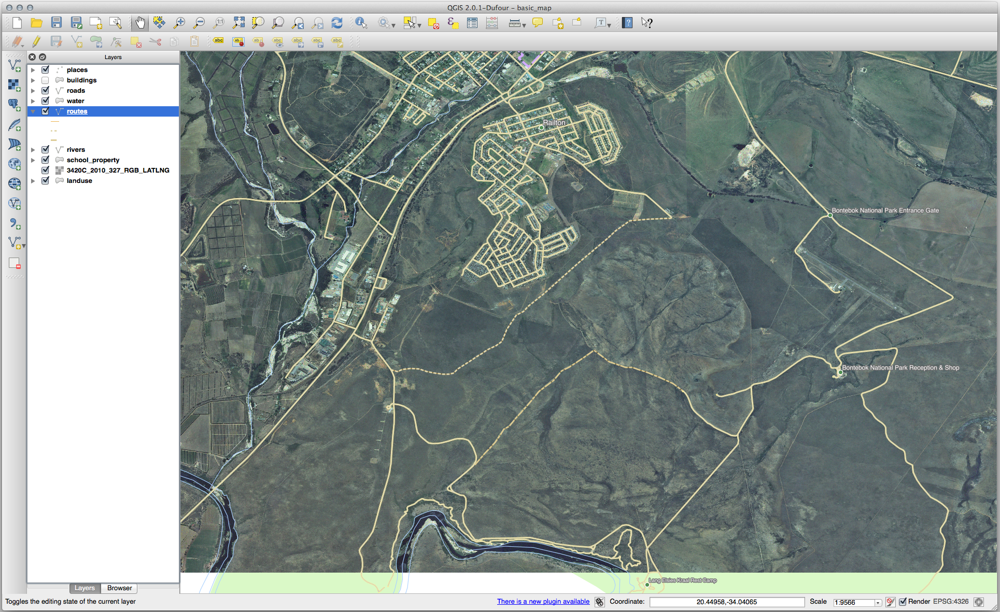

:ref:`Back to text <backlink-create-vector-digitize-1>`

.. _create-vector-topology-1:

|moderate| *Topology: Add Ring Tool*
...............................................................................

The exact shape doesn't matter, but you should be getting a hole in the middle
of your feature, like this one:

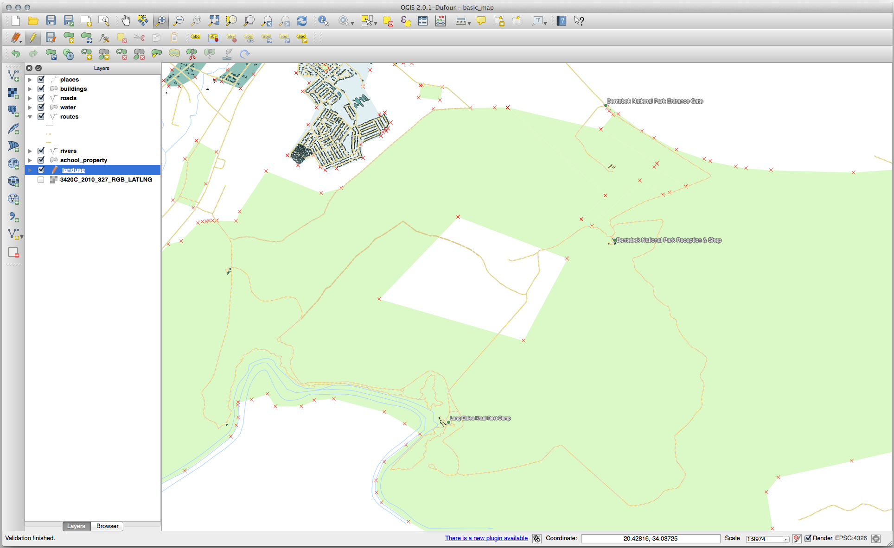

* Undo your edit before continuing with the exercise for the next tool.

:ref:`Back to text <backlink-create-vector-topology-1>`

.. _create-vector-topology-2:

|moderate| *Topology: Add Part Tool*
...............................................................................

* First select the |largeLandUseArea|:

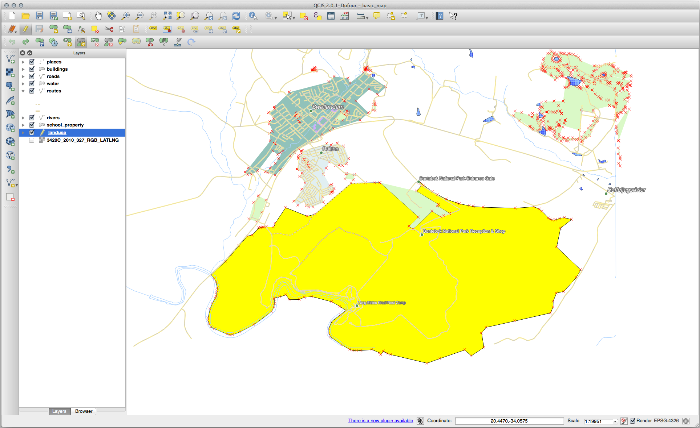

* Now add your new part:

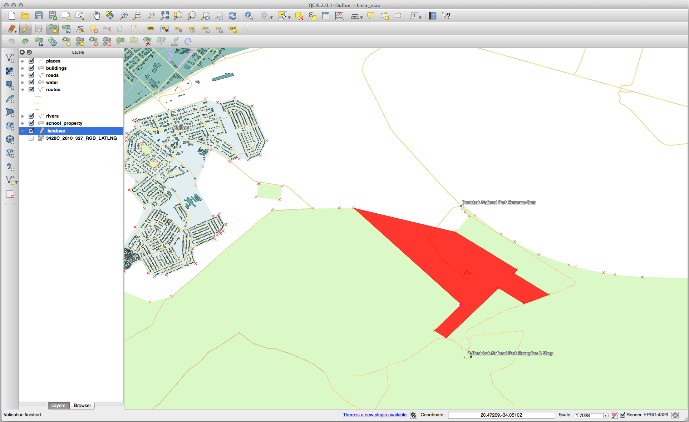

* Undo your edit before continuing with the exercise for the next tool.

:ref:`Back to text <backlink-create-vector-topology-2>`

.. _create-vector-topology-4:

|hard| *Merge Features*
...............................................................................

* Use the :guilabel:`Merge Selected Features` tool, making sure to first select
  both of the polygons you wish to merge.
* Use the feature with the :guilabel:`OGC_FID` of :kbd:`1` as the source of your
  attributes (click on its entry in the dialog, then click the :guilabel:`Take
  attributes from selected feature` button):

.. note:: If you're using a different dataset, it is highly likely that your
  original polygon's :guilabel:`OGC_FID` will not be ``1``. Just choose the
  feature which has an :guilabel:`OGC_FID`.

  .. figure:: img/merge_feature_dialog.png
     :align: center

.. Note:: Using the :guilabel:`Merge Attributes of Selected Features` tool
  will keep the geometries distinct, but give them the same attributes.

:ref:`Back to text <backlink-create-vector-topology-4>`

.. _create-vector-forms-1:

|moderate| *Forms*
...............................................................................

For the :guilabel:`TYPE`, there is obviously a limited amount of types that a
road can be, and if you check the attribute table for this layer, you'll see
that they are predefined.

* Set the widget to :guilabel:`Value Map` and click
  :guilabel:`Load Data from Layer`.
* Select :guilabel:`roads` in the :guilabel:`Label` dropdown and
  :guilabel:`highway` for both the :guilabel:`Value` and :guilabel:`Description`
  options:

  .. figure:: img/value_map_settings.png
     :align: center

* Click :guilabel:`OK` three times.
* If you use the :guilabel:`Identify` tool on a street now while edit mode is
  active, the dialog you get should look like this:

  .. figure:: img/highway_as_value_map.png
     :align: center

:ref:`Back to text <backlink-create-vector-forms-1>`

|RF| *Vector Analysis*
-------------------------------------------------------------------------------

.. _vector-analysis-basic-1:

|basic| *Distance from High Schools*
...............................................................................

* Your buffer dialog should look like this:

  .. figure:: img/schools_buffer_setup.png
     :align: center

  The :guilabel:`Buffer distance` is :guilabel:`1` kilometer.

* The :guilabel:`Segments to approximate` value is set to :guilabel:`20`. This is
  optional, but it's recommended, because it makes the output buffers look
  smoother. Compare this:

  .. figure:: img/schools_buffer_5.png
     :align: center

  To this:

  .. figure:: img/schools_buffer_6.png
     :align: center

The first image shows the buffer with the :guilabel:`Segments to approximate`
value set to :guilabel:`5` and the second shows the value set to :guilabel:`20`.
In our example, the difference is subtle, but you can see that the buffer's edges
are smoother with the higher value.

:ref:`Back to text <backlink-vector-analysis-basic-1>`

.. _vector-analysis-basic-2:

|basic| *Distance from Restaurants*
...............................................................................

To create the new :guilabel:`houses_restaurants_500m` layer, we go through a two step
process:

* First, create a buffer of 500m around the restaurants and add the layer to
  the map:

  .. figure:: img/restaurants_buffer.png
     :align: center

  .. figure:: img/restaurants_buffer_result.png
     :align: center

* Next, extract buildings within that buffer area:

  .. figure:: img/select_within_restaurants.png
     :align: center

Your map should now show only those buildings which are within 50m of a road,
1km of a school and 500m of a restaurant:

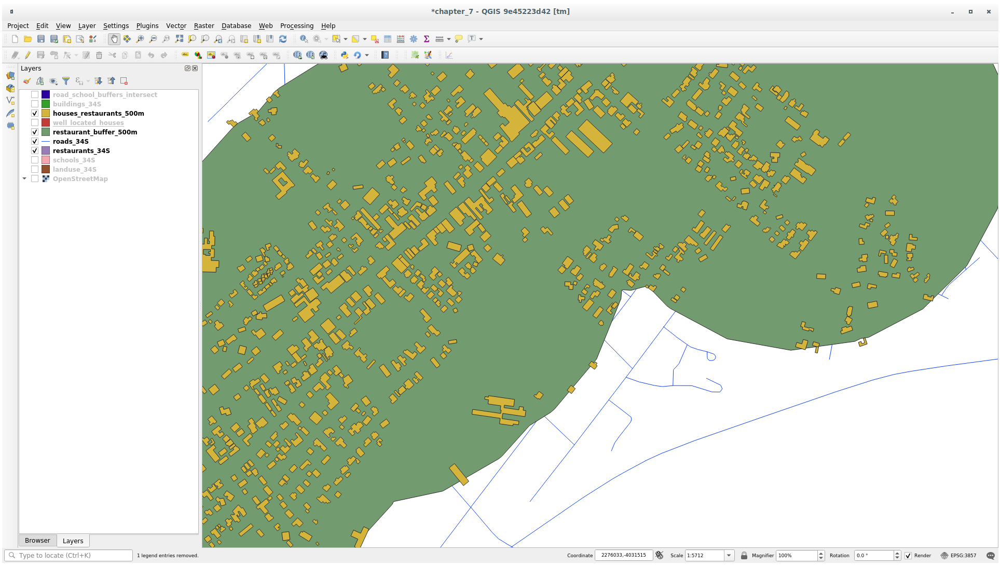

:ref:`Back to text <backlink-vector-analysis-basic-2>`

|RF| *Network Analysis*
-------------------------------------------------------------------------------

.. _network-analysis-1:

|moderate| *Fastest path*
-------------------------------------------------------------------------------

Open :menuselection:`Network Analysis --> Shortest Path (Point to Point)` and
fill the dialog as:

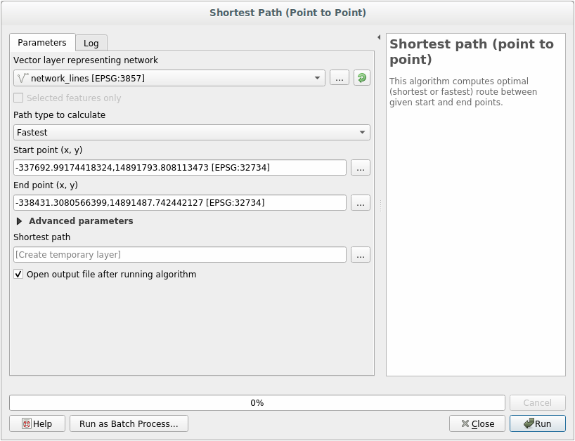

Make sure that the :guilabel:`Path type to calculate` is ``Fastest``.

Click on :guilabel:`Run` and close the dialog.

Open now the attribute table of the output layer. The :guilabel:`cost` field
contains the travel time between the two points (as fraction of hours):

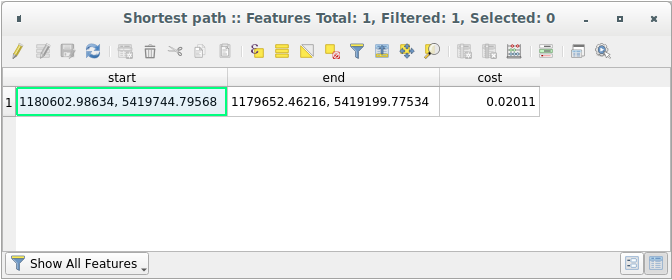

:ref:`Back to text <backlink-network_analysis_1>`

|RF| *Raster Analysis*
-------------------------------------------------------------------------------

.. _raster-analysis-1:

|basic| *Calculate Aspect*
...............................................................................

* Set your :guilabel:`Aspect` dialog up like this:

  .. figure:: img/answer_dem_aspect.png
     :align: center

Your result:

.. figure:: img/answer_aspect_result.png
   :align: center

:ref:`Back to text <backlink-raster-analysis-1>`

.. _raster-analysis-2:

|moderate| *Calculate Slope (less than 2 and 5 degrees)*
...............................................................................

* Set your :guilabel:`Raster calculator` dialog up with:

  * the following expression: ``slope@1 <= 2``
  * the ``slope`` layer as the :guilabel:`Reference layer(s)`

  .. figure:: img/answer_raster_calculator_slope.png
     :align: center

* For the 5 degree version, replace the ``2`` in the expression and file
  name with ``5``.

Your results:

* 2 degrees:

  .. figure:: img/answer_2degree_result.png
     :align: center

* 5 degrees:

  .. figure:: img/answer_5degree_result.png
     :align: center

:ref:`Back to text <backlink-raster-analysis-2>`

|RF| *Completing the Analysis*
-------------------------------------------------------------------------------

.. _complete-analysis-1:

|moderate| *Raster to Vector*
...............................................................................

#. Open the :guilabel:`Query Builder` by right-clicking on the
   :guilabel:`all_terrain` layer in the :guilabel:`Layers` panel, and selecting
   the :menuselection:`Properties --> Source` tab.
#. Then build the query ``"suitable" = 1``.
#. Click :guilabel:`OK` to filter out all the polygons where this condition
   isn't met.

   When viewed over the original raster, the areas should overlap perfectly:

   .. figure:: img/polygonize_raster.png
      :align: center

#. You can save this layer by right-clicking on the :guilabel:`all_terrain`
   layer in the :guilabel:`Layers` panel and choosing :guilabel:`Save As...`,
   then continue as per the instructions.

:ref:`Back to text <backlink-complete-analysis-1>`

.. _complete-analysis-2:

|moderate| *Inspecting the Results*
...............................................................................

You may notice that some of the buildings in your :file:`new_solution` layer have
been "sliced" by the :guilabel:`Intersection` tool. This shows that only part of the
building - and therefore only part of the property - lies on suitable terrain.
We can therefore sensibly eliminate those buildings from our dataset.

:ref:`Back to text <backlink-complete-analysis-2>`

.. _complete-analysis-3:

|moderate| *Refining the Analysis*
...............................................................................

At the moment, your analysis should look something like this:

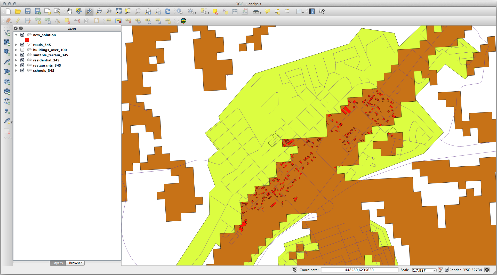

Consider a circular area, continuous for 100 meters in all directions.

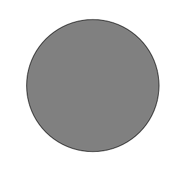

If it is greater than 100 meters in radius, then subtracting 100 meters from
its size (from all directions) will result in a part of it being left in the
middle.

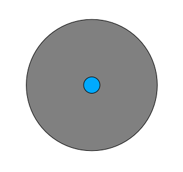

Therefore, you can run an *interior buffer* of 100 meters on your existing
:guilabel:`suitable_terrain` vector layer. In the output of the buffer
function, whatever remains of the original layer will represent areas where
there is suitable terrain for 100 meters beyond.

To demonstrate:

#. Go to :menuselection:`Vector --> Geoprocessing Tools --> Buffer(s)` to open
   the Buffer(s) dialog.
#. Set it up like this:

   .. figure:: img/suitable_terrain_buffer.png
      :align: center

#. Use the :guilabel:`suitable_terrain` layer with ``10`` segments and a
   buffer distance of ``-100``. (The distance is automatically in meters
   because your map is using a projected CRS.)
#. Save the output in :file:`exercise_data/residential_development/` as
   :file:`suitable_terrain_continuous100m.shp`.
#. If necessary, move the new layer above your original
   :guilabel:`suitable_terrain` layer.

   Your results will look like something like this:

   .. figure:: img/suitable_buffer_results.png
      :align: center

#. Now use the :guilabel:`Select by Location` tool (:menuselection:`Vector -->
   Research Tools --> Select by location`).
#. Set up like this:

   .. figure:: img/select_by_location.png
      :align: center

#. Select features in :guilabel:`new_solution` that intersect features in
   :guilabel:`suitable_terrain_continuous100m.shp`.

   This is the result:

   .. figure:: img/buffer_select_result.png
      :align: center

   The yellow buildings are selected. Although some of the buildings fall
   partly outside the new :guilabel:`suitable_terrain_continuous100m` layer,
   they lie well within the original :guilabel:`suitable_terrain` layer and
   therefore meet all of our requirements.

#. Save the selection under :file:`exercise_data/residential_development/` as
   :file:`final_answer.shp`.

:ref:`Back to text <backlink-complete-analysis-3>`

|RF| *WMS*
-------------------------------------------------------------------------------

.. _wms-1:

|basic| *Adding Another WMS Layer*
...............................................................................

Your map should look like this (you may need to re-order the layers):

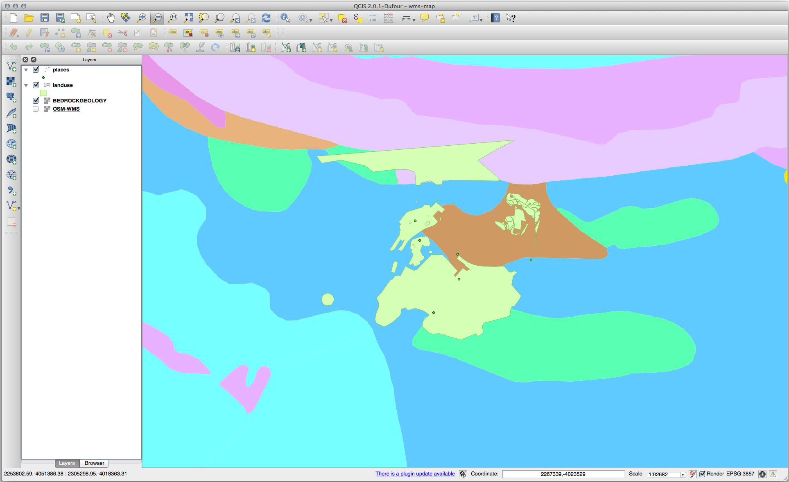

:ref:`Back to text <backlink-wms-1>`

.. _wms-2:

|moderate| *Adding a New WMS Server*
...............................................................................

* Use the same approach as before to add the new server and the appropriate
  layer as hosted on that server:

  .. figure:: img/add_ogc_server.png
     :align: center

  .. figure:: img/add_bluemarble_layer.png
     :align: center

* If you zoom into the |majorUrbanName| area, you'll notice that this dataset has a
  low resolution:

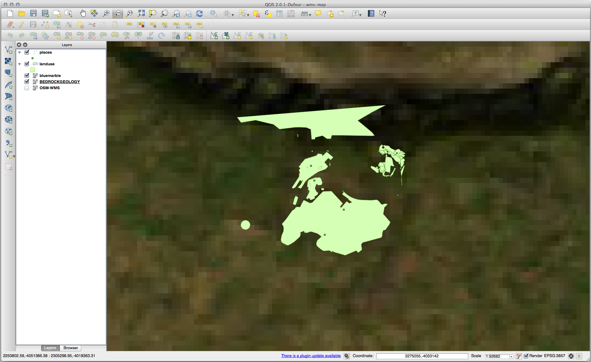

Therefore, it's better not to use this data for the current map. The Blue
Marble data is more suitable at global or national scales.

:ref:`Back to text <backlink-wms-2>`

.. _wms-3:

|moderate| *Finding a WMS Server*
...............................................................................

You may notice that many WMS servers are not always available. Sometimes this
is temporary, sometimes it is permanent. An example of a WMS server that worked
at the time of writing is the :guilabel:`World Mineral Deposits` WMS at
http://apps1.gdr.nrcan.gc.ca/cgi-bin/worldmin_en-ca_ows. It does not
require fees or have access constraints, and it is global. Therefore, it does
satisfy the requirements. Keep in mind, however, that this is merely an
example. There are many other WMS servers to choose from.

:ref:`Back to text <backlink-wms-3>`

.. _grass_add_to_mapset:

|RF| *GRASS Integration*
-------------------------------------------------------------------------------

|basic| *Add Layers to Mapset*
...............................................................................

You can add layers (both vector and raster) into a GRASS Mapset by drag and drop
them in the Browser (see :ref:`grass_browser`) or by using the ``v.in.gdal.qgis``
for vector and ``r.in.gdal.qgis`` for raster layers.

:ref:`Back to text <backlink-grass_add_to_mapset>`

.. _grass_reclass:

|moderate| *Reclassify raster layer*
...............................................................................

To discover the maximum value of the raster run the :kbd:`r.info` tool: in the
console you will see that the maximum value is 1699.

You are now ready to write the rules. Open a text editor and add the following
rules::

  0 thru 1000 = 1
  1000 thru 1400 = 2
  1400 thru 1699 = 3

save the file as a ``my_rules.txt`` file and close the text editor.

Run the :kbd:`r.reclass` tool, choose the :kbd:`g_dem` layer and load the file
containing the rules you just have saved.

Click on :guilabel:`Run` and then on :guilabel:`View Output`. You can change the
colors and the final result should look like the following picture:

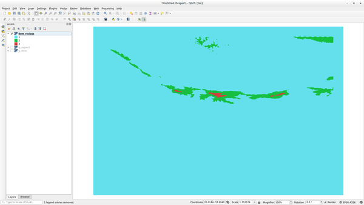

:ref:`Back to text <backlink-grass_reclass>`

|RF| *Database Concepts*
-------------------------------------------------------------------------------

.. _database-concepts-1:

|basic| *Address Table Properties*
...............................................................................

For our theoretical address table, we might want to store the following
properties::

    House Number
    Street Name
    Suburb Name
    City Name
    Postcode
    Country

When creating the table to represent an address object, we would create columns
to represent each of these properties and we would name them with SQL-compliant
and possibly shortened names::

    house_number
    street_name
    suburb
    city
    postcode
    country

:ref:`Back to text <backlink-database-concepts-1>`

.. _database-concepts-2:

|basic| *Normalising the People Table*
...............................................................................

The major problem with the `people` table is that there is a single address
field which contains a person's entire address. Thinking about our theoretical
`address` table earlier in this lesson, we know that an address is made up of
many different properties. By storing all these properties in one field, we make
it much harder to update and query our data. We therefore need to split the
address field into the various properties. This would give us a table which has
the following structure::

  id |     name      | house_no |  street_name   |    city    |   phone_no
   --+---------------+----------+----------------+------------+-----------------
   1 | Tim Sutton    |     3    | Buirski Plein  | Swellendam | 071 123 123
   2 | Horst Duester |     4    | Avenue du Roix | Geneva     | 072 121 122

.. note:: In the next section, you will learn about Foreign Key relationships
  which could be used in this example to further improve our database's
  structure.

:ref:`Back to text <backlink-database-concepts-2>`

.. _database-concepts-3:

|moderate| *Further Normalisation of the People Table*
...............................................................................

Our `people` table currently looks like this::

   id |     name     | house_no | street_id |  phone_no
   ---+--------------+----------+-----------+-------------
    1 | Horst Duster |        4 |         1 | 072 121 122

The :kbd:`street_id` column represents a 'one to many' relationship between the
`people` object and the related `street` object, which is in the `streets`
table.

One way to further normalise the table is to split the name field into
*first_name* and *last_name*::

    id | first_name | last_name  | house_no | street_id |  phone_no
    ---+------------+------------+----------+-----------+------------
     1 |    Horst   |   Duster   |     4    |     1     | 072 121 122

We can also create separate tables for the town or city name and country,
linking them to our `people` table via 'one to many' relationships::

    id | first_name | last_name | house_no | street_id | town_id | country_id
    ---+------------+-----------+----------+-----------+---------+------------
     1 |    Horst   |   Duster  |     4    |     1     |    2    |     1

An ER Diagram to represent this would look like this:

.. figure:: img/er-people-normalised-example.png
   :align: center

:ref:`Back to text <backlink-database-concepts-3>`

.. _database-concepts-4:

|moderate| *Create a People Table*
...............................................................................

The SQL required to create the correct people table is::

  create table people (id serial not null primary key,
                       name varchar(50),
                       house_no int not null,
                       street_id int not null,
                       phone_no varchar null );

The schema for the table (enter :kbd:`\\d people`) looks like this::

  Table "public.people"

  Column     |         Type          |                      Modifiers
  -----------+-----------------------+-------------------------------------
  id         | integer               | not null default
             |                       | nextval('people_id_seq'::regclass)
  name       | character varying(50) |
  house_no   | integer               | not null
  street_id  | integer               | not null
  phone_no   | character varying     |
  Indexes:
    "people_pkey" PRIMARY KEY, btree (id)

.. note::  For illustration purposes, we have purposely omitted the fkey
    constraint.

:ref:`Back to text <backlink-database-concepts-4>`

.. _database-concepts-5:

|basic| *The DROP Command*
...............................................................................

The reason the DROP command would not work in this case is because the `people`
table has a Foreign Key constraint to the `streets` table. This means that
dropping (or deleting) the `streets` table would leave the `people` table with
references to non-existent `streets` data.

.. note:: It is possible to 'force' the `streets` table to be deleted by using
  the `CASCADE` command, but this would also delete the `people` and any other
  table which had a relationship to the `streets` table. Use with caution!

:ref:`Back to text <backlink-database-concepts-5>`

.. _database-concepts-6:

|basic| *Insert a New Street*
...............................................................................

The SQL command you should use looks like this (you can replace the street name
with a name of your choice)::

    insert into streets (name) values ('Low Road');

:ref:`Back to text <backlink-database-concepts-6>`

.. _database-concepts-7:

|moderate| *Add a New Person With Foreign Key Relationship*
...............................................................................

Here is the correct SQL statement::

  insert into streets (name) values('Main Road');
  insert into people (name,house_no, street_id, phone_no)
    values ('Joe Smith',55,2,'072 882 33 21');

If you look at the streets table again (using a select statement as before),
you'll see that the :kbd:`id` for the :kbd:`Main Road` entry is :kbd:`2`.

That's why we could merely enter the number :kbd:`2` above. Even though we're
not seeing :kbd:`Main Road` written out fully in the entry above, the
database will be able to associate that with the :kbd:`street_id` value of
:kbd:`2`.

.. note:: If you have already added a new :kbd:`street` object, you might find
   that the new :kbd:`Main Road` has an ID of :kbd:`3` not :kbd:`2`.

:ref:`Back to text <backlink-database-concepts-7>`

.. _database-concepts-8:

|moderate| *Return Street Names*
...............................................................................

Here is the correct SQL statement you should use::

  select count(people.name), streets.name
  from people, streets
  where people.street_id=streets.id
  group by streets.name;

Result::

     count |    name
     ------+-------------
         1 | Low Street
         2 | High street
         1 | Main Road
     (3 rows)

.. note::  You will notice that we have prefixed field names with table names
   (e.g. people.name and streets.name). This needs to be done whenever the
   field name is ambiguous (i.e. not unique across all tables in the database).

:ref:`Back to text <backlink-database-concepts-8>`

|RF| *Spatial Queries*
-------------------------------------------------------------------------------

.. _spatial-queries-1:

|basic| *The Units Used in Spatial Queries*
...............................................................................

The units being used by the example query are degrees, because the CRS that the
layer is using is WGS 84. This is a Geographic CRS, which means that its units
are in degrees. A Projected CRS, like the UTM projections, is in meters.

Remember that when you write a query, you need to know which units the layer's
CRS is in. This will allow you to write a query that will return the results
that you expect.

:ref:`Back to text <backlink-spatial-queries-1>`

.. _spatial-queries-2:

|basic| *Creating a Spatial Index*
...............................................................................

::

  CREATE INDEX cities_geo_idx
    ON cities
    USING gist (the_geom);

:ref:`Back to text <backlink-spatial-queries-2>`

|RF| *Geometry Construction*
-------------------------------------------------------------------------------

.. _geometry-1:

|moderate| *Creating Linestrings*
...............................................................................

::

  alter table streets add column the_geom geometry;
  alter table streets add constraint streets_geom_point_chk check
       (st_geometrytype(the_geom) = 'ST_LineString'::text OR the_geom IS NULL);
  insert into geometry_columns values ('','public','streets','the_geom',2,4326,
       'LINESTRING');
  create index streets_geo_idx
    on streets
    using gist
    (the_geom);

:ref:`Back to text <backlink-geometry-1>`

.. _geometry-2:

|moderate| *Linking Tables*
...............................................................................

::

  delete from people;
  alter table people add column city_id int not null references cities(id);

(capture cities in QGIS)

::

  insert into people (name,house_no, street_id, phone_no, city_id, the_geom)
     values ('Faulty Towers',
             34,
             3,
             '072 812 31 28',
             1,
             'SRID=4326;POINT(33 33)');

  insert into people (name,house_no, street_id, phone_no, city_id, the_geom)
     values ('IP Knightly',
             32,
             1,
             '071 812 31 28',
             1,F
             'SRID=4326;POINT(32 -34)');

  insert into people (name,house_no, street_id, phone_no, city_id, the_geom)
     values ('Rusty Bedsprings',
             39,
             1,
             '071 822 31 28',
             1,
             'SRID=4326;POINT(34 -34)');

If you're getting the following error message:

::

  ERROR:  insert or update on table "people" violates foreign key constraint
          "people_city_id_fkey"
  DETAIL: Key (city_id)=(1) is not present in table "cities".

then it means that while experimenting with creating polygons for the
cities table, you must have deleted some of them and started over. Just
check the entries in your cities table and use any :kbd:`id` which exists.

:ref:`Back to text <backlink-geometry-2>`

|RF| *Simple Feature Model*
-------------------------------------------------------------------------------

.. _simple-feature-1:

|moderate| *Populating Tables*
...............................................................................

::

  create table cities (id serial not null primary key,
                       name varchar(50),
                       the_geom geometry not null);
   alter table cities
   add constraint cities_geom_point_chk
   check (st_geometrytype(the_geom) = 'ST_Polygon'::text );

:ref:`Back to text <backlink-simple-feature-1>`

.. _simple-feature-2:

|moderate| *Populate the Geometry_Columns Table*
...............................................................................

::

  insert into geometry_columns values
        ('','public','cities','the_geom',2,4326,'POLYGON');

:ref:`Back to text <backlink-simple-feature-2>`

.. _simple-feature-3:

|hard| *Adding Geometry*
...............................................................................

::

  select people.name,
         streets.name as street_name,
         st_astext(people.the_geom) as geometry
  from   streets, people
  where  people.street_id=streets.id;

Result::

         name     | street_name |   geometry
    --------------+-------------+---------------
     Roger Jones  | High street |
     Sally Norman | High street |
     Jane Smith   | Main Road   |
     Joe Bloggs   | Low Street  |
     Fault Towers | Main Road   | POINT(33 -33)
    (5 rows)

As you can see, our constraint allows nulls to be added into the database.

:ref:`Back to text <backlink-simple-feature-3>`

.. Substitutions definitions - AVOID EDITING PAST THIS LINE
   This will be automatically updated by the find_set_subst.py script.
   If you need to create a new substitution manually,
   please add it also to the substitutions.txt file in the
   source folder.

.. |RF| replace:: Results For
.. |basic| image:: /static/common/basic.png
.. |dataDefined| image:: /static/common/mIconDataDefine.png
   :width: 1.5em
.. |hard| image:: /static/common/hard.png
.. |largeLandUseArea| replace:: Bontebok National Park
.. |majorUrbanName| replace:: Swellendam
.. |moderate| image:: /static/common/moderate.png
.. |openTable| image:: /static/common/mActionOpenTable.png
   :width: 1.5em
.. |signPlus| image:: /static/common/symbologyAdd.png
   :width: 1.5em
.. |symbology| image:: /static/common/symbology.png
   :width: 2em
