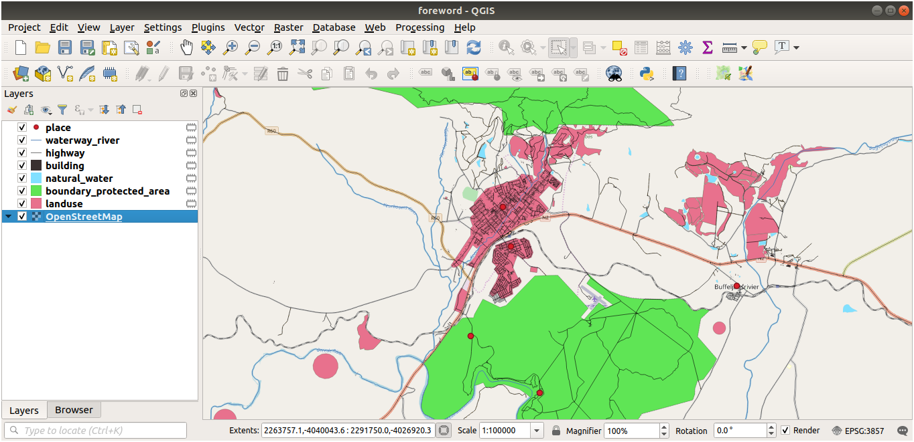

.. _tm_preparing_data:

Preparing Exercise Data
=======================

.. important:: This process is intended for course conveners, or more experienced
  QGIS users who wish to create localised sample data sets for their course.
  Default data sets are provided with the Training Manual, but you may follow
  these instructions if you wish to replace the default data sets.

The :ref:`sample data provided <data_downloadlink>` with the Training Manual
refers to the town of |majorUrbanName| and its surroundings. |majorUrbanName| is
located about 2 hours' east of Cape Town in the Western Cape of South Africa.
The dataset contains feature names in both English and Afrikaans.

Anyone can use this dataset without difficulty, but you may prefer to use data
from your own country or home town. If you choose to do so, your localised
data will be used in all lessons from Module 3 to Module 7.2. Later modules use
more complex data sources which may or may not be available for your region.

.. note:: These instructions assume you have a good knowledge of QGIS and are
  not intended to be used as teaching material.

Create OSM based vector files
--------------------------------------------------------------------------------

If you wish to replace the default data set with localised data for your course,
this can easily be done with tools built into QGIS. The region you choose to use
should have a good mix of urban and rural areas, containing roads of differing
significance, area boundaries (such as nature reserves or farms) and surface
water, such as streams and rivers.

#. Open a new QGIS project
#. Select :menuselection:`Layer --> Data Source Manager` to open the
   :guilabel:`Data Source Manager` dialog
#. In the :guilabel:`Browser` tab, expand the :guilabel:`XYZ Tiles` drop-down menu
   and double-click the :guilabel:`OpenStreetMap` item.

   .. figure:: img/browser_xyztiles.png
      :align: center
      :scale: 60

   A map of the world is now visible on the map canvas.
#. Close the :guilabel:`Data Source Manager` dialog
#. Move to the area you'd like to use as study area

   .. figure:: img/swellendam_neighborhood.png
      :align: center
      :scale: 60

Now that we have the area we'll extract the data from, let's enable the extraction
tools.

#. Go to :menuselection:`Plugins --> Manage/Install Plugins...`
#. In the :guilabel:`All` tab, type ``QuickOSM`` in the search box
#. Select the QuickOSM plugin, press :guilabel:`Install Plugin` and then :guilabel:`Close`
   the dialog.

   .. figure:: img/quickosm_plugin_download.png
      :align: center

#. Execute the new plugin from :menuselection:`Vector --> QuickOSM --> QuickOSM...` menu
#. In the :guilabel:`Quick query` tab, select ``building`` in the :guilabel:`Key`
   drop-down menu
#. Leave the :guilabel:`Value` field empty, meaning that you are querying all
   buildings.
#. Select :guilabel:`Canvas Extent` in the next drop-down menu
#. Expand the :guilabel:`Advanced` group below and uncheck all
   geometry types on the right except :guilabel:`Multipolygons`.
#. Press :guilabel:`Run query`

   .. figure:: img/building_query_builder.png
      :align: center

   A new ``building`` layer is added to the :guilabel:`Layers` panel, showing
   buildings in the selected extent.
#. Proceed as above to extract other data:

   #. ``Key = landuse`` and ``Multipolygons`` geometry type.
   #. ``Key = boundary``, ``Value = protected_area`` and ``Multipolygons``
      geometry type.
   #. ``Key = natural``, ``Value = water`` and ``Multipolygons`` geometry type.
   #. ``Key = highway`` and check ``Lines`` and ``Multilines`` geometry types.
   #. ``Key = waterway``, ``Value = river`` and check ``Lines`` and ``Multilines``
      geometry types.
   #. ``Key = place`` and ``Points`` geometry type.

This process adds the layers as temporary files (indicated by the
|indicatorMemory| icon next to their name).

You can sample the data your region contains in order to see what kind of
results your region will yield.

We now need to save the resulting data to use during your
course. We'll be using ESRI Shapefile, GeoPackage and SpatiaLite formats
depending on the data.

To convert the :guilabel:`place` temporary layer to another format:

#. Click the |indicatorMemory| icon next to the :guilabel:`place` layer
   to open the :guilabel:`Save Scratch Layer` dialog.

   .. note:: If you need to change any of the temporary layer's properties (CRS, extent,
     fields...), use the :menuselection:`Export
     --> Save Features as...` contextual menu instead, and ensure the :guilabel:`Add
     saved file to map` option is checked. This adds a new layer.

#. Select the :guilabel:`ESRI Shapefile` format
#. Use the :guilabel:`...` button to browse to the :file:`exercise_data/shapefile/`
   folder and save the file as :file:`places.shp`.

   .. figure:: img/save_osm_place.png
      :align: center

#. Press :guilabel:`OK`

   In the :guilabel:`Layers` panel, the temporary :guilabel:`place` layer is
   replaced with the saved :guilabel:`places` shapefile layer and
   the temporary icon next to it removed.
#. Double-click the layer to open its :menuselection:`Layer Properties -->
   Source` tab and update the :guilabel:`Layer name` property to match the file
   name.

#. Repeat the process for other layers, renaming them as follows:

   * ``natural_water`` into ``water``
   * ``waterway_river`` into ``rivers``
   * ``boundary_protected_area`` into ``protected_areas``

   Each resulting data set should be saved in the :file:`exercise_data/shapefile/`
   directory.

The next step is to create a GeoPackage file from the :guilabel:`building` layer
to use during the course:

#. Click the |indicatorMemory| icon next to the :guilabel:`building` layer
#. Select the :guilabel:`GeoPackage` format
#. Save the file as :file:`training_data.gpkg` under the :file:`exercise_data/`
   folder
#. By default, the :guilabel:`Layer name` is filled as the file name.
   Replace it with ``buildings``.

   .. figure:: img/save_osm_building.png
      :align: center

#. Press :guilabel:`OK`
#. Rename the layer in its properties dialog
#. Repeat the process with the :guilabel:`highway` layer, saving it as ``roads`` in
   the same GeoPackage database.

The last step is to save the remaining temporary file as a SpatiaLite file.

#. Click the |indicatorMemory| icon next to the :guilabel:`landuse` layer
#. Select the :guilabel:`SpatiaLite` format
#. Save the file as :file:`landuse.sqlite` under the :file:`exercise_data/`
   folder. By default, the :guilabel:`Layer name` is filled as the file name.
   Do not change it.

   .. figure:: img/save_osm_landuse.png
      :align: center

#. Press :guilabel:`OK`

You should now have a map which looks something like this (the symbology will
certainly be very different, because QGIS randomly assigns colors when layers
are added to the map):

.. figure:: img/post_osm_import.png
   :align: center

The important thing is that you have 7 vector layers matching those
shown above and that all those layers have some data.

Create SRTM DEM tiff files
--------------------------------------------------------------------------------

For modules :ref:`tm_create_vector_data` and :ref:`tm_rasters`, you'll also need
raster images (SRTM DEM) which cover the region you have selected for your
course.

The `CGIAR-CGI <https://srtm.csi.cgiar.org/>`_ provides some SRTM DEM you can download
from https://srtm.csi.cgiar.org/srtmdata/.

You'll need images which cover the entire region you have chosen to use.
To find the extent coordinates, in QGIS , |zoomToLayer| zoom to the extent of
the largest layer and pick the values in the |extents| :guilabel:`Extents`
box of the status bar.
Keep the :file:`GeoTiff` format. Once the form is filled, click on the
:guilabel:`Click here to Begin Search >>` button and download the file(s).

Once you have downloaded the required file(s), they should be saved in the
:file:`exercise_data` directory, under :file:`raster/SRTM` subfolders.

Create imagery tiff files
--------------------------------------------------------------------------------

In Module :ref:`tm_create_vector_data`, :ref:`tm_datasources` lesson shows
close-up images of three school sports fields
which students are asked to digitize. You'll therefore need to reproduce these
images using your new SRTM DEM tiff file(s). There is no obligation to use school
sports fields: any three school land-use types can be used (e.g. different
school buildings, playgrounds or car parks).

For reference, the image in the example data is:

.. figure:: img/field_outlines.png
   :align: center

Replace tokens
--------------------------------------------------------------------------------

Having created your localized dataset, the final step is to replace the tokens
in the :file:`substitutions.txt` file so that the appropriate names will appear
in your localized version of the Training Manual.

The tokens you need to replace are as follows:

* ``majorUrbanName``: this defaults to "Swellendam". Replace with the name of
  the major town in your region.
* ``schoolAreaType1``: this defaults to "athletics field". Replace with the
  name of the largest school area type in your region.
* ``largeLandUseArea``: this defaults to "Bontebok National Park". Replace
  with the name of a large landuse polygon in your region.
* ``srtmFileName``: this defaults to :file:`srtm_41_19.tif`. Replace this
  with the filename of your SRTM DEM file.
* ``localCRS``: this defaults to ``WGS 84 / UTM 34S``. You should replace
  this with the correct CRS for your region.

.. Substitutions definitions - AVOID EDITING PAST THIS LINE
   This will be automatically updated by the find_set_subst.py script.
   If you need to create a new substitution manually,
   please add it also to the substitutions.txt file in the
   source folder.

.. |extents| image:: /static/common/extents.png
   :width: 1.5em
.. |indicatorMemory| image:: /static/common/mIndicatorMemory.png
   :width: 1.5em
.. |majorUrbanName| replace:: Swellendam
.. |zoomToLayer| image:: /static/common/mActionZoomToLayer.png
   :width: 1.5em
