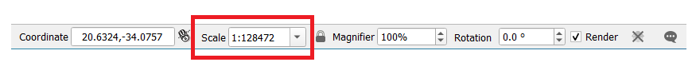

Lesson: Navigating the Map Canvas
===============================================================================
This section will focus on basic QGIS navigation tools used to navigate within 
the Map Canvas. These tools will allow you to visually explore the layers at 
different scales.

**The goal for this lesson:** Learn how to use Pan and Zoom tools within QGIS 
and learn about map scale.

:abbr:`★☆☆ (Basic level)` Follow Along: Basic Navigation Tools
-------------------------------------------------------------------------------

Before learning how to navigate within the Map Canvas, let's add some
layers that we can explore during this tutorial.

#. Open a new blank project and using the steps learnt in :ref:`Create a Map
   <tm_prepare_a_map>`, load the previously seen ``protected_areas``, ``roads``
   and ``buildings`` layers to the project.
   The result view should look similar to the snippet in
   :numref:`figure_roads_buildings_added` below (colors do not matter): 

   .. _figure_roads_buildings_added:

   .. figure:: img/roads_buildings_added.png
      :align: center

      Protected areas, roads and buildings added

Let's first learn how to use the Pan Tool.

#. In the `Map Navigation Toolbar`, make sure the |pan| :sup:`Pan` button is activated.
#. Move the mouse to the center of the Map Canvas area.
#. Left-click and hold, and drag the mouse in any direction to pan the map.

Next, let's zoom in and take a closer look at the layers we imported.

#. In the `Map Navigation Toolbar`, click on the |zoomIn| :sup:`Zoom In` button.
#. Move your mouse to approximately the top left area of where there is the highest 
   density of buildings and roads.
#. Left click and hold. 
#. Then drag the mouse, which will create a rectangle, and cover the dense area of 
   buildings and roads (:numref:`figure_zoom_in_mapview`).

   .. _figure_zoom_in_mapview:

   .. figure:: img/zoom_in.png
      :align: center

      Zoom in

#. Release the left click.  This will zoom in to include the area that you
   selected with your rectangle.

   .. figure:: img/zoomed_in.png
     :align: center

#. To zoom out, select the |zoomOut| :sup:`Zoom Out` button and perform the same
   action as you did for zooming in.

As you pan, zoom in, or zoom out, QGIS saves these views in a history.  This allows 
you to backtrack to a previous view.  

#. In the `Map Navigation Toolbar`, click on |zoomLast| :sup:`Zoom Last` button to 
   go to your previous view.
#. Click on |zoomNext| :sup:`Zoom Next` button to proceed to move forward in your 
   history.

Sometimes after exploring the data, we need to reset our view to the extent of all 
the layers.  Instead of trying to use the Zoom Out tool multiple times, QGIS provides 
us with a button to do that action for us.

#. Click on the |zoomFullExtent| :sup:`Zoom Full Extent` button.

As you zoomed in and out, notice that the :guilabel:`Scale` value in the Status Bar
changes.
The :guilabel:`Scale` value represents the Map Scale.
In general, the number to the right of :guilabel:`:` represents how many times
smaller the object you are seeing in the Map Canvas is to the actual object in
the real world.

You can also use this field to set the Map Scale manually.

#. In the Status Bar, click on the :guilabel:`Scale` text field.
#. Type in ``50000`` and press :kbd:`Enter`.  This will redraw the features in the 
   Map Canvas to reflect the scale you typed in.
#. Alternatively, click on the options arrow of the :guilabel:`Scale` field to see
   the preset map scales.

   .. figure:: img/map_scale_options.png
     :align: center

#. Select :guilabel:`1:5000`.  This will also update the map scale in the Map Canvas.

Now you know the basics of navigating the Map Canvas. Check out the User Manual on 
:ref:`Zooming and Panning <zoom_pan>` to learn about alternative ways of navigating
the Map Canvas.

In Conclusion
-------------------------------------------------------------------------------

Knowing how to navigate the Map Canvas is important, as it allows one to explore
and visually inspect the layers. This could be done for initial data exploration,
or to validate output of a spatial analysis.

.. Substitutions definitions - AVOID EDITING PAST THIS LINE
   This will be automatically updated by the find_set_subst.py script.
   If you need to create a new substitution manually,
   please add it also to the substitutions.txt file in the
   source folder.

.. |pan| image:: /static/common/mActionPan.png
   :width: 1.5em
.. |zoomFullExtent| image:: /static/common/mActionZoomFullExtent.png
   :width: 1.5em
.. |zoomIn| image:: /static/common/mActionZoomIn.png
   :width: 1.5em
.. |zoomLast| image:: /static/common/mActionZoomLast.png
   :width: 1.5em
.. |zoomNext| image:: /static/common/mActionZoomNext.png
   :width: 1.5em
.. |zoomOut| image:: /static/common/mActionZoomOut.png
   :width: 1.5em
