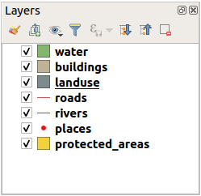
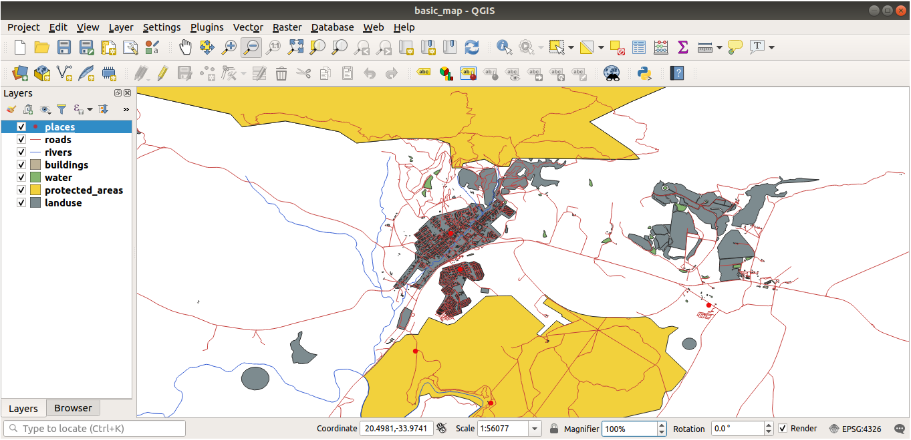

Lesson: Adding your first layers
===============================================================================

We will start the application, and create a basic map to use for examples and
exercises.

**The goal for this lesson:** To get started with an example map.

.. note::  Before starting this exercise, QGIS must be installed on your
   computer. Also, you should have downloaded the :ref:`sample data
   <data_downloadlink>` to use.

Launch QGIS from its desktop shortcut, menu item, etc., depending on how you
configured its installation.

.. note::  The screenshots for this course were taken in QGIS 3.4 running on
   Linux. Depending on your setup, the screens you encounter may well appear
   somewhat different. However, all the same buttons will still be available,
   and the instructions will work on any OS. You will need QGIS 3.4 (the latest
   version at time of writing) to use this course.

Let's get started right away!

.. _tm_prepare_a_map:

:abbr:`★☆☆ (Basic level)` Follow Along: Prepare a map
-------------------------------------------------------------------------------

#. Open QGIS. You will have a new, blank map.

   .. figure:: img/add_blank_qgis.png
      :align: center
      :width: 100 %

#. The :guilabel:`Data Source Manager` dialog allows you to choose the data to
   load depending on the data type. We'll use it to load our dataset:
   click the |dataSourceManager| :sup:`Open Data Source Manager` button.

   If you can't find the icon, check that the :guilabel:`Data Source Manager`
   toolbar is enabled in the :menuselection:`View --> Toolbars` menu.

   .. figure:: img/add_data_dialog.png
      :align: center
      :width: 100 %

#. Load the :file:`protected_areas.shp` vector dataset:
   
   #. Click on the :guilabel:`Vector` tab.
   #. Enable the |radioButtonOn|:guilabel:`File` source type.
   #. Press the :guilabel:`...` button next to :guilabel:`Vector Dataset(s)`.
   #. Select the :file:`exercise_data/shapefile/protected_areas.shp` file
      in your training directory.
   #. Click :guilabel:`Open`. You will see the original dialog,
      with the file path filled in.

      .. figure:: img/add_vector_dialog.png
         :align: center

   #. Click :guilabel:`Add` here as well. The data you specified will now load:
      you can see a ``protected_areas`` item in the :guilabel:`Layers` panel
      (bottom left) with its features shown in the main map canvas.

      .. figure:: img/first_loaded_layer.png
         :align: center
         :width: 100%

Congratulations! You now have a basic map. Now would be a good time to save
your work.

#. Click on the :guilabel:`Save As` button: |fileSaveAs|
#. Save the map under a :file:`solution` folder next to :file:`exercise_data`
   and call it :file:`basic_map.qgz`.

.. _backlink-interface-preparation-1:

:abbr:`★☆☆ (Basic level)` Try Yourself:
-------------------------------------------------------------------------------

Repeat the steps above to add the :file:`places.shp` and :file:`rivers.shp`
layers from the same folder (:file:`exercise_data/shapefile`) to the map.

.. admonition:: Answer
   :class: dropdown

   In the main area of the dialog you should see many shapes with different
   colors. Each shape belongs to a layer you can identify by its color in the
   left panel (your colors may be different from the ones in :numref:`figure_basic_map` below):

   .. _figure_basic_map:

   .. figure:: img/basic_map.png
      :align: center

      A basic map

.. _load_geopackage:

:abbr:`★☆☆ (Basic level)` Follow Along: Loading vector data from a GeoPackage Database
----------------------------------------------------------------------------------------

Databases allow you to store a large volume of associated data in one file. You
may already be familiar with a database management system (DBMS) such as
Libreoffice Base or MS Access. GIS applications can also make use of databases.
GIS-specific DBMSes (such as PostGIS) have extra functions, because they need to
handle spatial data.

The `GeoPackage <https://www.geopackage.org/>`_ open format is a container that
allows you to store GIS data (layers) in a single file.
Unlike the ESRI Shapefile format (e.g. the :file:`protected_areas.shp` dataset
you loaded earlier), a single GeoPackage file can contain various data (both
vector and raster data) in different coordinate reference systems, as well as
tables without spatial information; all these features allow you to share data
easily and avoid file duplication.

In order to load a layer from a GeoPackage, you will first need to create the
connection to it:

#. Click on the |dataSourceManager| :sup:`Open Data Source Manager` button.
#. On the left click on the |newGeoPackageLayer| :guilabel:`GeoPackage` tab.
#. Click on the :guilabel:`New` button and browse to the :file:`training_data.gpkg`
   file in the :file:`exercise_data` folder you downloaded before.
#. Select the file and press :guilabel:`Open`. The file path is now added to the
   Geopackage connections list, and appears in the drop-down menu.

You are now ready to add any layer from this GeoPackage to QGIS.

#. Click on the :guilabel:`Connect` button.
   In the central part of the window you should now see the list of all the layers
   contained in the GeoPackage file.
#. Select the :guilabel:`roads` layer and click on the :guilabel:`Add` button.

   .. figure:: img/add_data_dialog_geopackage.png
      :align: center

   A :guilabel:`roads` layer is added to the :guilabel:`Layers` panel with
   features displayed on the map canvas.
#. Click on :guilabel:`Close`.

Congratulations! You have loaded the first layer from a GeoPackage.

.. _backlink-vector-load-from-database-1:

:abbr:`★☆☆ (Basic level)` Follow Along: Loading vector data from a SpatiaLite Database with the Browser
--------------------------------------------------------------------------------------------------------

QGIS provides access to many other database formats. Like GeoPackage, the
SpatiaLite database format is an extension of the SQLite library. And adding
a layer from a SpatiaLite provider follows the same rules as described
above: Create the connection --> Enable it --> Add the layer(s).

While this is one way to add SpatiaLite data to your map,
let's explore another powerful way to add data:
the :guilabel:`Browser`.

#. Click the |dataSourceManager| icon to open the :guilabel:`Data Source Manager`
   window.
#. Click on the |fileOpen| :guilabel:`Browser` tab.
#. In this tab you can see all the storage disks connected to your computer
   as well as entries for most of the tabs in the left. These allow quick access
   to connected databases or folders.

   For example, click on the drop-down icon next to the |geoPackage|
   :guilabel:`GeoPackage` entry. You'll see the :file:`training-data.gpkg` file
   we previously connected to (and its layers, if expanded).
#. Right-click the |spatialite| :guilabel:`SpatiaLite` entry and select
   :guilabel:`New Connection...`.
#. Navigate to the :file:`exercise_data` folder, select the :file:`landuse.sqlite`
   file and click :guilabel:`Open`.

   Notice that a |dbSchema| :guilabel:`landuse.sqlite` entry has
   been added under the :guilabel:`SpatiaLite` one.
#. Expand the |dbSchema| :guilabel:`landuse.sqlite` entry.
#. Double-click the |polygonLayer| :guilabel:`landuse` layer or select and
   drag-and-drop it onto the map canvas. A new layer is added to the
   :guilabel:`Layers` panel and its features are displayed on the map canvas.

   .. figure:: img/spatialite_dialog_connected.png
      :align: center

.. tip:: Enable the :guilabel:`Browser` panel in :menuselection:`View --> Panels -->`
  and use it to add your data. It's a handy shortcut for the :menuselection:`Data Source
  Manager --> Browser` tab, with the same functionality.

.. note:: Remember to save your project frequently! The project file doesn't contain
   any of the data itself, but it remembers which layers you loaded into your map.

:abbr:`★★☆ (Moderate level)` Try Yourself: Load More Vector Data
-------------------------------------------------------------------------------

Load the following datasets from the :file:`exercise_data` folder into your map
using any of the methods explained above:

* :guilabel:`buildings`
* :guilabel:`water`

.. admonition:: Answer
   :class: dropdown

   Your map should have seven layers:

   * :guilabel:`protected_areas`
   * :guilabel:`places`
   * :guilabel:`rivers`
   * :guilabel:`roads`
   * :guilabel:`landuse`
   * :guilabel:`buildings` (taken from :file:`training_data.gpkg`) and
   * :guilabel:`water` (taken from :file:`exercise_data/shapefile`).

Follow Along: Reordering the Layers
-------------------------------------------------------------------------------

The layers in your Layers list are drawn on the map in a certain order. The
layer at the bottom of the list is drawn first, and the layer at the top is
drawn last. By changing the order that they are shown on the list, you can
change the order they are drawn in.

.. note:: You can alter this behavior using the :guilabel:`Control rendering
   order` checkbox beneath the :guilabel:`Layer Order` panel. We will
   however not discuss this feature yet.

The order in which the layers have been loaded into the map is probably not
logical at this stage. It's possible that the road layer is completely hidden
because other layers are on top of it.

For example, this layer order...

... would result in roads and places being hidden as they run *underneath*
the polygons of the landuse layer.

To resolve this problem:

#. Click and drag on a layer in the Layers list.
#. Reorder them to look like this:

You'll see that the map now makes more sense visually, with roads and buildings
appearing above the land use regions.

In Conclusion
-------------------------------------------------------------------------------

Now you've added all the layers you need from several different sources
and created a basic map!

What's Next?
-------------------------------------------------------------------------------

Now you're familiar with the basic function of the :guilabel:`Open Data Source Manager`
button, but what about all the others? How does this interface work? Before we
go on, let's take a look at some basic interaction with the QGIS interface.
This is the topic of the next lesson.

.. Substitutions definitions - AVOID EDITING PAST THIS LINE
   This will be automatically updated by the find_set_subst.py script.
   If you need to create a new substitution manually,
   please add it also to the substitutions.txt file in the
   source folder.

.. |dataSourceManager| image:: /static/common/mActionDataSourceManager.png
   :width: 1.5em
.. |dbSchema| image:: /static/common/mIconDbSchema.png
   :width: 1.5em
.. |fileOpen| image:: /static/common/mActionFileOpen.png
   :width: 1.5em
.. |fileSaveAs| image:: /static/common/mActionFileSaveAs.png
   :width: 1.5em
.. |geoPackage| image:: /static/common/mGeoPackage.png
   :width: 1.5em
.. |newGeoPackageLayer| image:: /static/common/mActionNewGeoPackageLayer.png
   :width: 1.5em
.. |polygonLayer| image:: /static/common/mIconPolygonLayer.png
   :width: 1.5em
.. |radioButtonOn| image:: /static/common/radiobuttonon.png
   :width: 1.5em
.. |spatialite| image:: /static/common/mIconSpatialite.png
   :width: 1.5em
