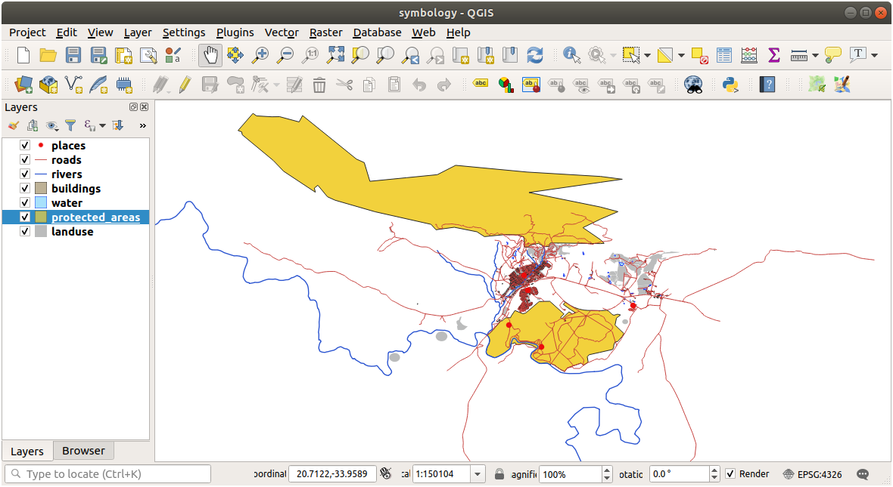
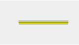
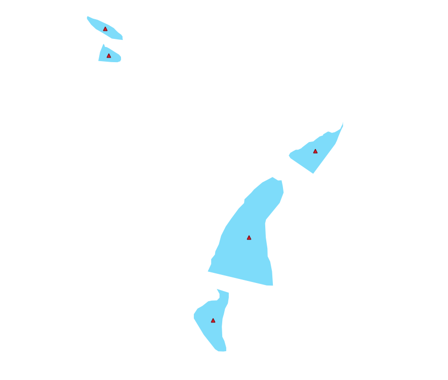

Lesson: Symbology
===============================================================================

The symbology of a layer is its visual appearance on the map.
The basic strength of GIS over other ways of representing data with spatial
aspects is that with GIS, you have a dynamic visual representation of the data
you're working with.

Therefore, the visual appearance of the map (which depends on the symbology of
the individual layers) is very important. The end user of the maps you produce
will need to be able to easily see what the map represents. Equally as
important, you need to be able to explore the data as you're working with it,
and good symbology helps a lot.

In other words, having proper symbology is not a luxury or just nice to have.
In fact, it's essential for you to use a GIS properly and produce maps and
information that people will be able to use.

**The goal for this lesson:** To be able to create any symbology you want for
any vector layer.

:abbr:`★☆☆ (Basic level)` Follow Along: Changing Colors
-------------------------------------------------------------------------------

To change a layer's symbology, open its :guilabel:`Layer Properties`. Let's
begin by changing the color of the ``landuse`` layer.

#. Right-click on the ``landuse`` layer in the layers list.
#. Select the menu item :guilabel:`Properties...` in the menu that appears.

   .. note:: By default, you can also access a layer's properties by
     double-clicking on the layer in the Layers list.

   .. tip:: The |symbology| button at the top of the :guilabel:`Layers`
     panel will open the :guilabel:`Layer Styling` panel. You can use this
     panel to change some properties of the layer: by default, changes will be
     applied immediately!

#. In the :guilabel:`Layer Properties` window, select the |symbology|
   :guilabel:`Symbology` tab:

   .. figure:: img/layer_properties_style.png
      :align: center

#. Click the color select button next to the :guilabel:`Color` label.
   A standard color dialog will appear.
#. Choose a gray color and click :guilabel:`OK`.
#. Click :guilabel:`OK` again in the :guilabel:`Layer Properties` window, and
   you will see the color change being applied to the layer.

:abbr:`★☆☆ (Basic level)` Try Yourself:
-------------------------------------------------------------------------------

Change the color of the ``water`` layer to light blue. Try to use the
:guilabel:`Layer Styling` panel instead of the :guilabel:`Layer Properties` menu.

.. admonition:: Solution
   :class: dropdown

   * Verify that the colors are changing as you expect them to change.
   * It is enough to select the ``water`` layer in the legend and then click
     on the |symbology| :sup:`Open the Layer Styling panel` button. Change the color
     to one that fits the water layer.

   .. figure:: img/answer_water_blue.png
      :align: center

   If you want to work on only one layer at a time and don't want the
   other layers to distract you, you can hide a layer by clicking in the checkbox
   next to its name in the layers list. If the box is blank, then the layer
   is hidden.

:abbr:`★☆☆ (Basic level)` Follow Along: Changing Symbol Structure
-------------------------------------------------------------------------------

This is good stuff so far, but there's more to a layer's symbology than just
its color. Next we want to eliminate the lines between the different land use
areas so as to make the map less visually cluttered.

#. Open the :guilabel:`Layer Properties` window for the ``landuse``
   layer.

   Under the |symbology| :guilabel:`Symbology` tab, you will see the same kind
   of dialog as before. This time, however, you're doing more than just quickly
   changing the color.
#. In the symbol layers tree, expand the :guilabel:`Fill` dropdown
   and select the :guilabel:`Simple fill` option.
#. Click on the :guilabel:`Stroke style` dropdown. At the moment, it should be
   showing a short line and the words :guilabel:`Solid Line`.
#. Change this to :guilabel:`No Line`.

   .. figure:: img/simple_fill_selected.png
      :align: center

#. Click :guilabel:`OK`.

Now the ``landuse`` layer won't have any lines between areas.

:abbr:`★☆☆ (Basic level)` Try Yourself:
-------------------------------------------------------------------------------

* Change the ``water`` layer's symbology again so that it has a
  darker blue outline.
* Change the ``rivers`` layer's symbology to a sensible representation
  of waterways.

Remember: you can use the |symbology| :sup:`Open the Layer Styling panel`
button and see all the changes instantly. That panel also allows you to undo
individual changes while symbolizing a layer.

.. admonition:: Answer
   :class: dropdown

   Your map should now look like this:

   .. figure:: img/answer_symbology1.png
      :align: center

   If you are a Beginner-level user, you may stop here.

   * Use the method above to change the colors and styles for all the remaining
     layers.
   * Try using natural colors for the objects. For example, a road should not be
     red or blue, but can be gray or black.
   * Also feel free to experiment with different :guilabel:`Fill style` and
     :guilabel:`Stroke style` settings for the polygons.

   .. figure:: img/answer_symbology2.png
      :align: center

:abbr:`★★☆ (Moderate level)` Follow Along: Scale-Based Visibility
-------------------------------------------------------------------------------

Sometimes you will find that a layer is not suitable for a given scale. For
example, a dataset of all the continents may have low detail, and not be very
accurate at street level. When that happens, you want to be able to hide the
dataset at inappropriate scales.

In our case, we may decide to hide the buildings from view at small scales. This
map, for example...

... is not very useful. The buildings are hard to distinguish at that scale.

To enable scale-based rendering:

#. Open the :guilabel:`Layer Properties` dialog for the ``buildings`` layer.
#. Activate the |rendering| :guilabel:`Rendering` tab.
#. Enable scale-based rendering by clicking on the checkbox labeled
   :guilabel:`Scale dependent visibility`:
#. Change the :guilabel:`Minimum` value to ``1:10000``.

   .. figure:: img/scale_dependent_visibility.png
      :align: center

#. Click :guilabel:`OK`.

Test the effects of this by zooming in and out in your map, noting when the
``buildings`` layer disappears and reappears.

.. note::  You can use your mouse wheel to zoom in increments.
   Alternatively, use the zoom tools to zoom to a window:

   |zoomIn| |zoomOut|

:abbr:`★★☆ (Moderate level)` Follow Along: Adding Symbol Layers
-------------------------------------------------------------------------------

Now that you know how to change simple symbology for layers, the next step is
to create more complex symbology. QGIS allows you to do this using symbol
layers.

#. Go back to the ``landuse`` layer's symbol properties panel (by clicking
   :guilabel:`Simple fill` in the symbol layers tree).

   In this example, the current symbol has no outline (i.e., it uses the
   :guilabel:`No Line` border style).

   .. figure:: img/simple_fill_selected.png
      :align: center

#. Select the :guilabel:`Fill` level in the tree and click
   the |symbologyAdd| :sup:`Add symbol layer` button.
   The dialog will change to look something like this, with a new symbol layer
   added:

   .. figure:: img/new_symbol_layer.png
      :align: center

   It may appear somewhat different in color, for example, but you're going
   to change that anyway.

Now there's a second symbol layer. Being a solid color, it will of course
completely hide the previous kind of symbol. Plus, it has a :guilabel:`Solid
Line` border style, which we don't want. Clearly this symbol has to be changed.

.. note::  It's important not to get confused between a map layer and a symbol
   layer. A map layer is a vector (or raster) that has been loaded into the
   map. A symbol layer is part of the symbol used to represent a map layer.
   This course will usually refer to a map layer as just a layer, but a symbol
   layer will always be called a symbol layer, to prevent confusion.

With the new :guilabel:`Simple Fill` symbol layer selected:

#. Set the border style to :guilabel:`No Line`, as before.
#. Change the fill style to something other than :guilabel:`Solid` or
   :guilabel:`No brush`. For example:

   .. figure:: img/new_fill_settings.png
      :align: center

#. Click :guilabel:`OK`.

Now you can see your results and tweak them as needed.
You can even add multiple extra symbol layers and create a kind of texture for
your layer that way.

.. figure:: img/multiple_symbol_layers.png
   :align: center

It's fun! But it probably has too many colors to use in a real map...

:abbr:`★★☆ (Moderate level)` Try Yourself:
-------------------------------------------------------------------------------

Remembering to zoom in if necessary, create a simple, but not distracting
texture for the ``buildings`` layer using the methods above.

.. admonition:: Answer
   :class: dropdown

   Customize your ``buildings`` layer as you like, but remember that it
   has to be easy to tell different layers apart on the map.

   Here's an example:

   .. figure:: img/answer_buildings_symbology.png
      :align: center

:abbr:`★★☆ (Moderate level)` Follow Along: Ordering Symbol Levels
-------------------------------------------------------------------------------

When symbol layers are rendered, they are also rendered in a sequence, similar
to the way the different map layers are rendered. This means that in some cases,
having many symbol layers in one symbol can cause unexpected results.

#. Give the ``roads`` layer an extra symbol layer (using the method
   for adding symbol layers demonstrated above).
#. Give the base line a :guilabel:`Stroke width` of ``1.5`` and a black color.
#. Give the new, uppermost layer a thickness of ``0.8`` and a white color.

You'll notice that this happens:

.. figure:: img/bad_roads_symbology.png
   :align: center

Well, roads have now a *street* like symbology, but you see that lines are
overlapping each others at each cross. That's not what we want at all!

To prevent this from happening, you can sort the symbol levels and thereby
control the order in which the different symbol layers are rendered.

To change the order of the symbol layers:

#. Select the topmost :guilabel:`Line` layer in the symbol layers tree.
#. Click :menuselection:`Advanced --> Symbol levels...` in the
   bottom right-hand corner of the window.

   .. figure:: img/symbol_levels_main_dialog.png
      :align: center

   This will open a dialog like this:

   .. figure:: img/symbol_levels_dialog.png
      :align: center

#. Check |checkbox| :guilabel:`Enable symbol levels`. You can then set the
   layer order of each symbol by entering the corresponding level number.
   0 is the bottom layer.

   In our case, we just want to activate the option, like this:

   .. figure:: img/correct_symbol_layers.png
      :align: center

   This will render the white line above the thick black line borders:

#. Click :guilabel:`OK` twice to return to the map.

   The map will now look like this:

   .. figure:: img/better_roads_symbology.png
      :align: center

When you're done, remember to save the symbol itself so as not to lose your
work if you change the symbol again in the future. You can save your current
symbol style by clicking the :guilabel:`Save Style...` button at the bottom
of the :guilabel:`Layer Properties` dialog.
We will be using the :guilabel:`QGIS QML Style File` format.

.. TODO: imho there's a mix of saving symbols and saving styles here that could
 be misleading. Saving style should deserve its own section.

Save your style in the :file:`solution/styles/better_roads.qml` folder. You can load a
previously saved style at any time by clicking the :guilabel:`Load Style...`
button. Before you change a style, keep in mind that any unsaved style you are
replacing will be lost.

:abbr:`★★☆ (Moderate level)` Try Yourself:
-------------------------------------------------------------------------------

Change the appearance of the ``roads`` layer again.

Make the roads narrow and yellow, with a thin, pale gray outline and a
thin black line in the middle. Remember that you may need to change the layer
rendering order via the :menuselection:`Advanced --> Symbol levels...` dialog.

.. admonition:: Answer
   :class: dropdown

   To make the required symbol, you need three symbol layers:

   .. figure:: img/answer_road_symbology.png
      :align: center

   The lowest symbol layer is a broad, solid gray line. On top of it there is a
   slightly thinner solid yellow line and finally another thinner solid black line.

   If your symbol layers resemble the above but you're not getting the result
   you want:

   #. Check that your symbol levels look something like this:

      .. figure:: img/answer_road_symbol_levels.png
         :align: center

   #. Now your map should look like this:

      .. figure:: img/target_road_symbology_answer.png
         :align: center

:abbr:`★★★ (Advanced level)` Try Yourself:
-------------------------------------------------------------------------------

Symbol levels also work for classified layers (i.e., layers having multiple
symbols). Since we haven't covered classification yet, you will work with some
rudimentary pre-classified data.

#. Create a new project and add only the ``roads`` dataset.
#. Apply the style file :file:`advanced_levels_demo.qml` provided in
   :file:`exercise_data/styles` to the layer. This can be done through the
   :menuselection:`Style --> Load Style...` combobox at the bottom of the
   :guilabel:`Layer Properties` dialog.
#. Zoom in to the |majorUrbanName| area.
#. Using symbol layers, ensure that the outlines of layers flow into one another
   as per the image below:

   .. figure:: img/correct_advanced_levels.png
      :align: center

.. admonition:: Answer
   :class: dropdown

   #. Adjust your symbol levels to these values:

   .. figure:: img/answer_road_symbol_layers.png
      :align: center

   #. Experiment with different values to get different results.
   #. Open your original map again before continuing with the next exercise.

:abbr:`★★☆ (Moderate level)` Follow Along: Symbol layer types
-------------------------------------------------------------------------------

In addition to setting fill colors and using predefined patterns, you can use
different symbol layer types entirely. The only type we've been using up to now
was the :guilabel:`Simple Fill` type. The more advanced symbol layer types allow
you to customize your symbols even further.

Each type of vector (point, line and polygon) has its own set of symbol layer
types. First we will look at the types available for points.

Point Symbol Layer Types
...............................................................................

#. Uncheck all the layers except for ``places``.
#. Change the symbol properties for the ``places`` layer:

   .. figure:: img/places_layer_properties.png
      :align: center

#. You can access the various symbol layer types by selecting the
   :guilabel:`Simple marker` layer in the symbol layers tree, then
   click the :guilabel:`Symbol layer type` dropdown:

   .. figure:: img/marker_type_dropdown.png
      :align: center

#. Investigate the various options available to you, and choose a symbol with
   styling you think is appropriate.
#. If in doubt, use a round :guilabel:`Simple marker` with a white border and
   pale green fill, with a :guilabel:`Size` of ``3.00`` and a
   :guilabel:`Stroke width` of ``0.5``.

Line Symbol Layer Types
...............................................................................

To see the various options available for line data:

#. Change the :guilabel:`Symbol layer type` for the ``roads`` layer's
   topmost symbol layer to :guilabel:`Marker line`:

   .. figure:: img/change_to_marker_line.png
      :align: center

#. Select the :guilabel:`Simple marker` layer in the symbol layers
   tree. Change the symbol properties to match this dialog:

   .. figure:: img/simple_marker_line_properties.png
      :align: center

#. Select the :guilabel:`Marker line` layer and change the interval to ``1.00``:

   .. figure:: img/marker_line_interval.png
      :align: center

#. Ensure that the symbol levels are correct (via the
   :menuselection:`Advanced --> Symbol levels` dialog we used earlier) before
   applying the style.

Once you have applied the style, take a look at its results on the map. As you
can see, these symbols change direction along with the road but don't always
bend along with it. This is useful for some purposes, but not for others. If
you prefer, you can change the symbol layer in question back to the way it was
before.

Polygon Symbol Layer Types
...............................................................................

To see the various options available for polygon data:

#. Change the :guilabel:`Symbol layer type` for the ``water`` layer, as
   before for the other layers.
#. Investigate what the different options on the list can do.
#. Choose one of them that you find suitable.
#. If in doubt, use the :guilabel:`Point pattern fill` with the following
   options:

   .. figure:: img/pattern_fill_size.png
      :align: center

   .. figure:: img/pattern_fill_distances.png
      :align: center

#. Add a new symbol layer with a normal :guilabel:`Simple fill`.
#. Make it the same light blue with a darker blue border.
#. Move it underneath the point pattern symbol layer with the :guilabel:`Move
   down` button:

   .. figure:: img/simple_fill_move_down.png
      :align: center

As a result, you have a textured symbol for the water layer, with the added
benefit that you can change the size, shape and distance of the individual dots
that make up the texture.

.. _backlink-symbology-marker-line:

:abbr:`★★☆ (Moderate level)` Try Yourself:
-------------------------------------------------------------------------------

Apply a green transparent fill color to the ``protected_areas`` layer,
and change the outline to look like this:

.. figure:: img/marker_line_preview.png
   :align: center

.. admonition:: Answer
   :class: dropdown

   Here are examples of the symbol structure:

   .. figure:: img/answer_marker_line.png
      :align: center

   .. figure:: img/answer_marker_line2.png
      :align: center

:abbr:`★★★ (Advanced level)` Follow Along: Geometry generator symbology
-------------------------------------------------------------------------------

You can use the Geometry generator symbology with all layer types (points, lines
and polygons). The resulting symbol depends directly on the layer type.

Very briefly, the Geometry generator symbology allows you to run some spatial
operations within the symbology itself. For example you can run a real centroid
spatial operation on a polygon layer without creating a point layer.

Moreover, you have all the styling options to change the appearance of the resulting
symbol.

Let's give it a try!

#. Select the ``water`` layer.
#. Click on :guilabel:`Simple fill` and change the :guilabel:`Symbol layer type`
   to :guilabel:`Geometry generator`.

   .. figure:: img/geometry_generator.png
      :align: center

#. Before to start writing the spatial query we have to choose the Geometry Type
   in output. In this example we are going to create centroids for each feature,
   so change the Geometry Type to :guilabel:`Point / Multipoint`.
#. Now let's write the query in the query panel::

    centroid($geometry)

   .. figure:: img/geometry_generator_query.png
      :align: center

#. When you click on :guilabel:`OK` you will see that the ``water`` layer
   is rendered as a point layer! We have just run a spatial operation within the
   layer symbology itself, isn't that amazing?

   .. figure:: img/geometry_generator_result.png
      :align: center

With the Geometry generator symbology you can really go over the edge of *normal*
symbology.

:abbr:`★★★ (Advanced level)` Try Yourself:
...............................................................................

Geometry generator are just another symbol level. Try to add another
:guilabel:`Simple fill` underneath the :guilabel:`Geometry generator` one.

Change also the appearance of the Simple marker of the Geometry generator symbology.

The final result should look like this:

.. admonition:: Answer
   :class: dropdown

   #. Click on the |symbologyAdd| button to add another Symbol level.
   #. Move the new symbol at the bottom of the list clicking the |arrowDown| button.
   #. Choose a good color to fill the water polygons.
   #. Click on :guilabel:`Marker` of the Geometry generator symbology and change the
      circle with another shape as your wish.
   #. Try experimenting other options to get more useful results.

:abbr:`★★★ (Advanced level)` Follow Along: Creating a Custom SVG Fill
-------------------------------------------------------------------------------

.. note::  To do this exercise, you will need to have the free vector editing
   software `Inkscape <https://inkscape.org/>`_ installed.

#. Start the Inkscape program.
   You will see the following interface:

   .. figure:: img/inkscape_default.png
      :align: center

   You should find this familiar if you have used other vector image editing
   programs, like Corel.

   First, we'll change the canvas to a size appropriate for a small texture.

#. Click on the menu item :menuselection:`File --> Document Properties`. This
   will give you the :guilabel:`Document Properties` dialog.
#. Change the :guilabel:`Units` to :guilabel:`px`.
#. Change the :guilabel:`Width` and :guilabel:`Height` to ``100``.
#. Close the dialog when you are done.
#. Click on the menu item :menuselection:`View --> Zoom --> Page` to see the
   page you are working with.
#. Select the :guilabel:`Circle` tool:

   .. figure:: img/inkscape_circle_tool.png
      :align: center

#. Click and drag on the page to draw an ellipse. To make the ellipse turn into
   a circle, hold the :kbd:`Ctrl` button while you're drawing it.
#. Right-click on the circle you just created and open its :guilabel:`Fill and
   Stroke` options. You can modify its rendering, such as:

   #. Change the :guilabel:`Fill` color to a somehow pale grey-blue,
   #. Assign to the border a darker color in :guilabel:`Stroke paint` tab,
   #. And reduce the border thickness under :guilabel:`Stroke style` tab.

   .. figure:: img/inkscape_stroke_fill.png
      :align: center

#. Draw a line using the :guilabel:`Pencil` tool:

   #. Click once to start the line. Hold :kbd:`Ctrl` to make it snap to increments
      of 15 degrees.
   #. Move the pointer horizontally and place a point with a simple click.
   #. Click and snap to the vertex of the line and trace a vertical line, ended
      by a simple click.
   #. Now join the two end vertices.
   #. Change the color and width of the triangle symbol to match the circle's stroke
      and move it around as necessary, so that you end up with a symbol like this one:

   .. figure:: img/inkscape_final_symbol.png
      :align: center

#. If the symbol you get satisfies you, then save it as ``landuse_symbol``
   under the directory that the course is in, under :file:`exercise_data/symbols`,
   as SVG file.

In QGIS:

#. Open the :guilabel:`Layer Properties` for the ``landuse`` layer.
#. In the |symbology| :guilabel:`Symbology` tab, change the symbol structure by
   changing the :guilabel:`Symbol Layer Type` to :guilabel:`SVG Fill` 
   shown below.
#. Click the :guilabel:`...` button and then
   :guilabel:`Select File...` to select your SVG image.
 
   It's added to the symbol tree and you can now customize its different
   characteristics (colors, angle, effects, units...).

   .. figure:: img/svg_symbol_settings.png
      :align: center

Once you validate the dialog, features in ``landuse`` layer should now
be covered by a set of symbols, showing a texture like the one on the
following map. If textures are not visible, you may need to zoom in the map
canvas or set in the layer properties a bigger :guilabel:`Texture width`.

:abbr:`★★☆ (Moderate level)` Follow Along: Masking
-------------------------------------------------------------------------------

Masking feature allows you to mask some symbol layer using another symbol layer or label.

In the following exercise, we want to configure rendering so that polygon labels will mask the black part
of lines layer.

#. Load the :file:`selective_masking.qgs` from dataset in directory :file:`exercise_data/masking`.

#. Open the :guilabel:`Layer Properties` window for the ``polys``
   layer.

   Under the |labelingSingle| :guilabel:`Labels` tab, you will see that |labelingSingle| :guilabel:`Single Labels` have
   already been defined.

#. From the :guilabel:`Labels` tab, select the |labelmask| :guilabel:`Mask` (and not :guilabel:`Masks` in general category list)
   
#. Enable label mask by checking the |unchecked| :guilabel:`Enable mask` option

   A message tells you that the now defined label mask shape can be later selected as a mask source to
   mask other symbol layers. Let's do that.

#. Click :guilabel:`OK`
#. Open the :guilabel:`Layer Properties` window for the ``lines``
   layer.

#. Go to the |labelmask| :guilabel:`Masks` tab

#. Click on the black line part of lines checkbox from masked symbol layers

   A message warns you that you have to select both masking and masked symbol layers to be able to save
   masking configuration. Again, let's do that.

#. Click on ``polys`` :guilabel:`Label mask` checkbox

   The message disappears, you can now safely save your configuration.

   .. figure:: img/mask_selection.png
      :align: center
   
#. Click :guilabel:`OK`

You can see now that labels are masking the black part of lines, leaving only the
yellow part.
   

:abbr:`★★☆ (Moderate level)` Follow Along: Masking using points symbols
-------------------------------------------------------------------------------

We want now to mask the black part of lines using only black planes that represent the ``points`` layer (i.e. ``B52`` and ``Jet`` points categories).
For the sake of visibility, you can switch off ``polys`` layer visibility.

#. Open the :guilabel:`Layer Properties` window for the ``points``
   layer.

   Under the |symbology| :guilabel:`Symbology` tab, you will see that a |categorizedSymbol| :guilabel:`Categorized` renderer has
   been defined with 3 different symbols depending on the ``Class`` field value.

#. Double click on ``B52`` plane icon, within the :guilabel:`Symbol` column

   .. figure:: img/plane_symbology.png
      :align: center

#. Click the |symbologyAdd| :sup:`Add symbol layer` button and select the ``Mask`` :guilabel:`Symbol layer type`

   A new hierarchy ``Mask`` (`symbol layer`) > ``Marker`` (`symbol`) > ``Simple Marker`` (`symbol layer`) appear below the root symbol ``Marker``.

   .. figure:: img/mask_hierarchy.png
      :align: center
   
   Now, let's define a mask that is identical to our plane marker but a little bit bigger.

#. Select the newly created ``Simple Marker`` symbol layer and change its :guilabel:`Symbol layer type` to ``SVG marker``
   
#. Set the SVG file path to be the same as the already existing SVG marker, and the size to be bigger (24 millimeters
   is a pretty good choice for this use case).

   Mask color doesn't matter here, only the shape is used in masking. Symbol layer order is also irrelevant in that
   situation.

   You should get something like that:
   
   .. figure:: img/point_masking.png
      :align: center

#. Repeat the same operations on ``Jet`` symbol.
	   
#. Click :guilabel:`OK`
#. Open the :guilabel:`Layer Properties` window for the ``lines``
   layer.

#. Go to the |labelmask| :guilabel:`Masks` tab.

   The black line part of lines checkbox from masked symbol layers is already checked from our previous
   configuration.

#. Uncheck the :guilabel:`Label mask` ``polys`` checkbox and check both ``B52`` and ``Jet`` :guilabel:`Mask symbol layer`
   
#. Click :guilabel:`OK`

You now see that black planes are masking the black part of lines, with only the yellow part visible.

In Conclusion
-------------------------------------------------------------------------------

Changing the symbology for the different layers has transformed a collection of
vector files into a legible map. Not only can you see what's happening, it's
even nice to look at!

Further Reading
-------------------------------------------------------------------------------

`Examples of Beautiful Maps
<https://gis.stackexchange.com/questions/3083/seeking-examples-of-beautiful-maps>`_

What's Next?
-------------------------------------------------------------------------------

Changing symbols for whole layers is useful, but the information contained
within each layer is not yet available to someone reading these maps. What are
the streets called? Which administrative regions do certain areas belong to?
What are the relative surface areas of the farms? All of this information is
still hidden. The next lesson will explain how to represent this data on your
map.

.. note::  Did you remember to save your map recently?

.. Substitutions definitions - AVOID EDITING PAST THIS LINE
   This will be automatically updated by the find_set_subst.py script.
   If you need to create a new substitution manually,
   please add it also to the substitutions.txt file in the
   source folder.

.. |arrowDown| image:: /static/common/mActionArrowDown.png
   :width: 1.5em
.. |categorizedSymbol| image:: /static/common/rendererCategorizedSymbol.png
   :width: 1.5em
.. |checkbox| image:: /static/common/checkbox.png
   :width: 1.3em
.. |labelingSingle| image:: /static/common/labelingSingle.png
   :width: 1.5em
.. |labelmask| image:: /static/common/labelmask.png
   :width: 1.5em
.. |majorUrbanName| replace:: Swellendam
.. |rendering| image:: /static/common/rendering.png
   :width: 1.5em
.. |symbology| image:: /static/common/symbology.png
   :width: 2em
.. |symbologyAdd| image:: /static/common/symbologyAdd.png
   :width: 1.5em
.. |unchecked| image:: /static/common/unchecked.png
   :width: 1.3em
.. |zoomIn| image:: /static/common/mActionZoomIn.png
   :width: 1.5em
.. |zoomOut| image:: /static/common/mActionZoomOut.png
   :width: 1.5em
