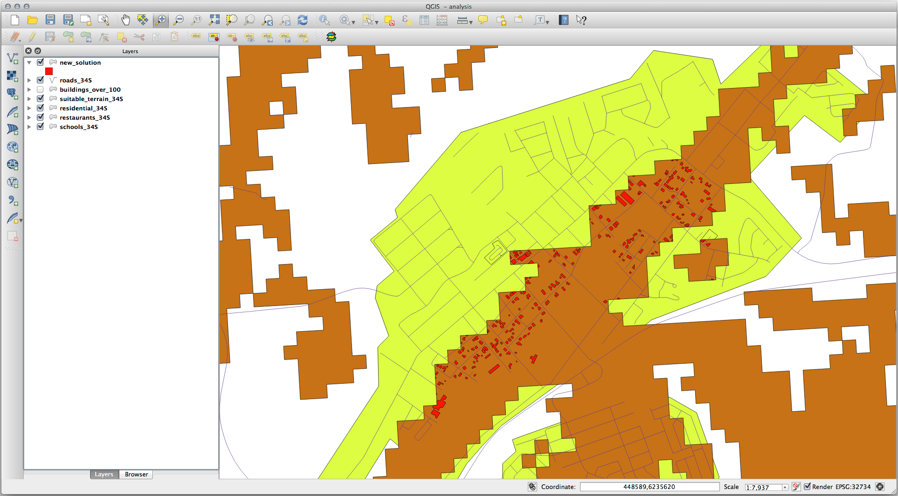

Lesson: Combining the Analyses
===============================================================================

Using the vectorized results of the raster analysis will allow you to select
only those buildings on suitable terrain.

**The goal for this lesson:** To use the vectorized terrain results to select
suitable plots.

:abbr:`★★☆ (Moderate level)` Try Yourself:
-------------------------------------------------------------------------------

#. Save your current map (:file:`raster_analysis.qgs`).
#. Open the map which you created during the vector analysis earlier
   (you should have saved the file as :file:`analysis.qgs`).
#. In the :guilabel:`Layers` panel, enable these layers:

   * :guilabel:`hillshade`,
   * :guilabel:`solution` (or :guilabel:`buildings_over_100`)

#. In addition to these layers, which should already be loaded in the map from
   when you worked on it before, also add the :file:`suitable_terrain.shp`
   dataset.
#. If you are missing some layers, you should find them in
   :file:`exercise_data/residential_development/`
#. Use the :guilabel:`Intersection` tool (:menuselection:`Vector --> Geoprocessing Tools`)
   to create a new vector layer called :file:`new_solution.shp` which contains
   only those buildings which intersect the :guilabel:`suitable_terrain` layer.

You should now have a layer showing certain buildings as your solution, for
example:

:abbr:`★★☆ (Moderate level)` Try Yourself: Inspecting the Results
-------------------------------------------------------------------------------

Look at each of the buildings in your :guilabel:`new_solution` layer. Compare them
with the :guilabel:`suitable_terrain` layer by changing the symbology for the
:guilabel:`new_solution` layer so that it has outlines only. What do you notice
about some of the buildings? Are they all suitable just because they intersect with
the :guilabel:`suitable_terrain` layer? Why or why not? Which ones would you
deem to be unsuitable?

.. admonition:: Answer
   :class: dropdown

   You may notice that some of the buildings in your :file:`new_solution` layer
   have been "sliced" by the :guilabel:`Intersection` tool. This shows that only
   part of the building - and therefore only part of the property - lies on
   suitable terrain. We can therefore sensibly eliminate those buildings from
   our dataset.

:abbr:`★★☆ (Moderate level)` Try Yourself: Refining the Analysis
-------------------------------------------------------------------------------

You can see from the results that some buildings which were included were
not really suitable, so we can now refine the analysis.

We want to ensure that our analysis returns only those buildings which fall
entirely within the :guilabel:`suitable_terrain` layer. How would you achieve this?
Use one or more Vector Analysis tools and remember that our buildings are all
over 100m squared in size.

.. admonition:: Answer
   :class: dropdown

   At the moment, your analysis should look something like this:
   
   .. figure:: img/new_solution_example.png
      :align: center
   
   Consider a circular area, continuous for 100 meters in all directions.
   
   .. figure:: img/circle_100.png
      :align: center
   
   If it is greater than 100 meters in radius, then subtracting 100 meters from
   its size (from all directions) will result in a part of it being left in the
   middle.
   
   .. figure:: img/circle_with_remainder.png
      :align: center
   
   Therefore, you can run an *interior buffer* of 100 meters on your existing
   :guilabel:`suitable_terrain` vector layer. In the output of the buffer
   function, whatever remains of the original layer will represent areas where
   there is suitable terrain for 100 meters beyond.
   
   To demonstrate:
   
   #. Go to :menuselection:`Vector --> Geoprocessing Tools --> Buffer(s)` to open
      the Buffer(s) dialog.
   #. Set it up like this:
   
      .. figure:: img/suitable_terrain_buffer.png
         :align: center
   
   #. Use the :guilabel:`suitable_terrain` layer with ``10`` segments and a
      buffer distance of ``-100``. (The distance is automatically in meters
      because your map is using a projected CRS.)
   #. Save the output in :file:`exercise_data/residential_development/` as
      :file:`suitable_terrain_continuous100m.shp`.
   #. If necessary, move the new layer above your original
      :guilabel:`suitable_terrain` layer.
   
      Your results will look like something like this:
   
      .. figure:: img/suitable_buffer_results.png
         :align: center
   
   #. Now use the :guilabel:`Select by Location` tool (:menuselection:`Vector -->
      Research Tools --> Select by location`).
   #. Set up like this:
   
      .. figure:: img/select_by_location.png
         :align: center
   
   #. Select features in :guilabel:`new_solution` that intersect features in
      :guilabel:`suitable_terrain_continuous100m.shp`.
   
      This is the result:
   
      .. figure:: img/buffer_select_result.png
         :align: center
   
      The yellow buildings are selected. Although some of the buildings fall
      partly outside the new :guilabel:`suitable_terrain_continuous100m` layer,
      they lie well within the original :guilabel:`suitable_terrain` layer and
      therefore meet all of our requirements.
   
   #. Save the selection under :file:`exercise_data/residential_development/` as
      :file:`final_answer.shp`.

In Conclusion
-------------------------------------------------------------------------------

You have now answered the original research question, and can offer an opinion
(with reasons, backed by analysis) for a recommendation regarding which
property to develop.

What's Next?
-------------------------------------------------------------------------------

Next you will present these results as part of your second assignment.
