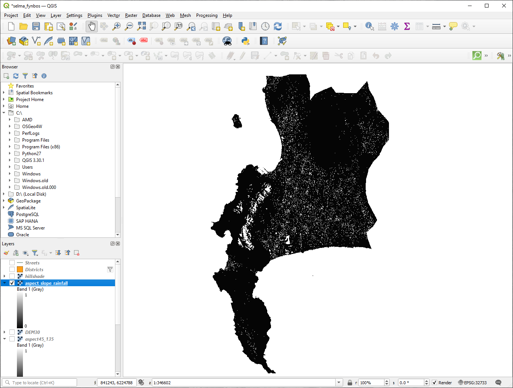

|LS| Supplementary Exercise
======================================================================

In this lesson, you will be guided through a complete GIS analysis in
QGIS.

.. note:: Lesson developed by Linfiniti Consulting (South Africa) and
   Siddique Motala (Cape Peninsula University of Technology)

Problem Statement
----------------------------------------------------------------------

You are tasked with finding areas in and around the Cape Peninsula
that are suitable habitats for a rare fynbos plant species.
The extent of your area of investigation covers Cape Town and the Cape
Peninsula between Melkbosstrand in the north and Strand in the south.
Botanists have provided you with the following preferences exhibited
by the species in question:

* It grows on east facing slopes
* It grows on slopes with a gradient between 15% and 60%
* It grows in areas that have a total annual rainfall of > 1000 mm
* It will only be found at least 250 m away from any human settlement
* The area of vegetation in which it occurs should be at least 6000 ㎡
  in area

As a student at the University, you have agreed to search for the
plant in four different suitable areas of land.
You want those four suitable areas to be the ones that are closest to
the University of Cape Town where you live.
Use your GIS skills to determine where you should go to look.

Solution Outline
----------------------------------------------------------------------

The data for this exercise can be found in the
:file:`exercise_data/more_analysis` folder.

You are going to find the four suitable areas that are closest to the
University of Cape Town.

The solution will involve:

#. Analyzing a DEM raster layer to find the east facing slopes and the
   slopes with the correct gradients
#. Analyzing a rainfall raster layer to find the areas with the
   correct amount of rainfall
#. Analyzing a zoning vector layer to find areas that are away from
   human settlement and are of the correct size

|FA| Setting up the Map
----------------------------------------------------------------------

#. Click on the |projectionEnabled| :sup:`Current CRS` button in the
   lower right corner of the screen.
   Under the :guilabel:`CRS` tab of the dialog that appears, use the
   "Filter" tool to search for "33S".
   Select the entry :guilabel:`WGS 84 / UTM zone 33S` (with EPSG code
   ``32733``). 
#. Click :guilabel:`OK`

   .. figure:: img/crs.png
      :align: center

      Setting up the CRS

#. Save the project file by clicking on the |fileSave|
   :sup:`Save Project` toolbar button, or use the
   :menuselection:`Project --> Save As...` menu item.

   Save it in a new directory called :file:`Rasterprac`, that you
   should create somewhere on your computer.
   You will save whatever layers you create in this directory as well.
   Save the project as :file:`your_name_fynbos.qgs`.

Loading Data into the Map
----------------------------------------------------------------------

In order to process the data, you will need to load the necessary
layers (street names, zones, rainfall, DEM, districts) into the map
canvas.

For vectors...
......................................................................

#. Click on the |dataSourceManager| :sup:`Open Data Source Manager`
   button in the *Data Source Manager Toolbar*, and enable the
   |addOgrLayer| :guilabel:`Vector` tab in the dialog that appears, or
   use the :menuselection:`Layer --> Add Layer -->` |addOgrLayer|
   :menuselection:`Add Vector Layer...` menu item
#. Ensure that |radioButtonOn| :guilabel:`File` is selected
#. Click on the :guilabel:`...` button to browse for
   vector dataset(s)
#. In the dialog that appears, open the
   :file:`exercise_data/more_analysis/Streets` directory
#. Select the file :file:`Street_Names_UTM33S.shp`
#. Click :guilabel:`Open`.

   The dialog closes and shows the original dialog, with the file
   path specified in the text field next to
   :guilabel:`Vector dataset(s)`.
   This allows you to ensure that the correct file is selected.
   It is also possible to enter the file path in this field manually,
   should you wish to do so.
#. Click :guilabel:`Add`.
   The vector layer will be loaded into your map.
   Its color is automatically assigned.
   You will change it later.
#. Rename the layer to ``Streets``

   #. Right-click on it in the :guilabel:`Layers` panel (by default,
      the pane along the left-hand side of the screen)
   #. Click :guilabel:`Rename` in the dialog that appears and rename
      it, pressing the :kbd:`Enter` key when done
#. Repeat the vector adding process, but this time select the
   :file:`Generalised_Zoning_Dissolve_UTM33S.shp` file in the
   :file:`Zoning` directory.
#. Rename it to ``Zoning``.
#. Load also the vector layer
   :file:`admin_boundaries/Western_Cape_UTM33S.shp` into your map.
#. Rename it to ``Districts``.

For rasters...
......................................................................

#. Click on the |dataSourceManager| :sup:`Open Data Source Manager`
   button and enable the |addRasterLayer| :guilabel:`Raster` tab in
   the dialog that appears, or use the
   :menuselection:`Layer --> Add Layer -->` |addRasterLayer|
   :menuselection:`Add Raster Layer...` menu item
#. Ensure that |radioButtonOn| :guilabel:`File` is selected
#. Navigate to the appropriate file, select it, and click
   :guilabel:`Open`
#. Do this for each of the following two raster files,
   :file:`DEM/SRTM.tif` and :file:`rainfall/reprojected/rainfall.tif`
#. Rename the SRTM raster to ``DEM`` and the rainfall raster to
   ``Rainfall`` (with an initial capital)

Changing the layer order
----------------------------------------------------------------------

Click and drag layers up and down in the :guilabel:`Layers` panel to
change the order they appear in on the map so that you can see as many
of the layers as possible.

Now that all the data is loaded and properly visible, the analysis
can begin.
It is best if the clipping operation is done first. This is so that no
processing power is wasted on computing values in areas that are not
going to be used anyway.

Find the Correct Districts
----------------------------------------------------------------------

Due to the aforementioned area of investigation, we need to limit our
districts to the following ones:

* ``Bellville``
* ``Cape``
* ``Goodwood``
* ``Kuils River``
* ``Mitchells Plain``
* ``Simon Town``
* ``Wynberg``

#. Right-click on the ``Districts`` layer in the
   :guilabel:`Layers` panel.
#. In the menu that appears,  select the :guilabel:`Filter...` menu
   item.
   The :guilabel:`Query Builder` dialog appears.

#. You will now build a query to select only the candidate districts:

   #. In the :guilabel:`Fields` list, double-click on the
      ``NAME_2`` field to make it appear in the
      :guilabel:`SQL where clause` text field below
   #. Click the :guilabel:`IN` button to append it to the SQL query
   #. Open the brackets
   #. Click the :guilabel:`All` button below the (currently empty)
      :guilabel:`Values` list.

      After a short delay, this will populate the :guilabel:`Values`
      list with the values of the selected field (``NAME_2``).
   #. Double-click the value ``Bellville`` in the
      :guilabel:`Values` list to append it to the SQL query.
   #. Add a comma and double-click to add ``Cape`` district
   #. Repeat the previous step for the remaining districts
   #. Close the brackets

   .. figure:: img/query_builder.png
      :align: center

      Query builder

      The final query should be (the order of the districts in the brackets
      does not matter)::

        "NAME_2" in ('Bellville', 'Cape', 'Goodwood', 'Kuils River',
                     'Mitchells Plain', 'Simon Town', 'Wynberg')

      .. note:: You can also use the ``OR`` operator; the query would look
         like this::

          "NAME_2" = 'Bellville' OR "NAME_2" = 'Cape' OR
          "NAME_2" = 'Goodwood' OR "NAME_2" = 'Kuils River' OR
          "NAME_2" = 'Mitchells Plain' OR "NAME_2" = 'Simon Town' OR
          "NAME_2" = 'Wynberg'

   #. Click :guilabel:`OK` twice.

      The districts shown in your map are now limited to those in the
      list above.

Clip the Rasters
----------------------------------------------------------------------

Now that you have an area of interest, you can clip the rasters to
this area.

#. Open the clipping dialog by selecting the menu item
   :menuselection:`Raster --> Extraction --> Clip Raster by Mask Layer...`
#. In the :guilabel:`Input layer` dropdown list, select the ``DEM``
   layer
#. In the :guilabel:`Mask layer` dropdown list, select the
   ``Districts`` layer
#. Scroll down and specify an output location in the
   :guilabel:`Clipped (mask)` text field by clicking the
   :guilabel:`...` button and choosing :guilabel:`Save to File...`

   #. Navigate to the :file:`Rasterprac` directory
   #. Enter a file name - ``DEM_clipped.tif``
   #. Save

#. Make sure that |checkbox|
   :guilabel:`Open output file after running algorithm` is checked
#. Click :guilabel:`Run`

   After the clipping operation has completed, leave the
   :guilabel:`Clip Raster by Mask Layer` dialog open, to be able to reuse
   the clipping area
#. Select the ``Rainfall`` raster layer in the :guilabel:`Input layer`
   dropdown list and save your output as :file:`Rainfall_clipped.tif`
#. Do not change any other options.
   Leave everything the same and click :guilabel:`Run`.
#. After the second clipping operation has completed, you may close
   the :guilabel:`Clip Raster by Mask Layer` dialog
#. Save the map

   .. figure:: img/clipped_r_filtered_v_reordered_l.png
      :align: center

      Map view with filtered vector, clipped raster and reordered layers 

Align the rasters
......................................................................

For our analysis we need the rasters to have the same CRS and they
have to be aligned.

First we change the resolution of our rainfall data to 30 meters
(pixel size):
	
#. In the :guilabel:`Layers` panel, ensure that
   ``Rainfall_clipped`` is the active layer (i.e., it is highlighted by
   having been clicked on)
#. Click on the :menuselection:`Raster --> Projections --> Warp (Reproject)...`
   menu item to open the :guilabel:`Warp (Reproject)` dialog
#. Under :guilabel:`Resampling method to use`, select :guilabel:`Bilinear (2x2 kernel)`
   from the drop down menu
#. Set :guilabel:`Output file resolution in target georeferenced units` to ``30`` 
#. Scroll down to :guilabel:`Reprojected` and save the output in your
   :file:`rainfall/reprojected` directory as :file:`Rainfall30.tif`.
#. Make sure that |checkbox|
   :guilabel:`Open output file after running algorithm` is checked

   .. figure:: img/wrap_rainfall.png
      :align: center

      Warp (Reproject) Rainfall_clipped

Then we align the DEM:

#. In the :guilabel:`Layers` panel, ensure that
   ``DEM_clipped`` is the active layer (i.e., it is highlighted by
   having been clicked on)
#. Click on the :menuselection:`Raster --> Projections --> Warp (Reproject)...`
   menu item to open the :guilabel:`Warp (Reproject)` dialog
#. Under :guilabel:`Target CRS`, select :guilabel:`Project CRS: EPSG:32733 - WGS 84 / UTM zone 33S` from the drop down menu
#. Under :guilabel:`Resampling method to use`, select :guilabel:`Bilinear (2x2 kernel)`
   from the drop down menu
#. Set :guilabel:`Output file resolution in target georeferenced units` to ``30``
#. Scroll down to :guilabel:`Georeferenced extents of output file to be created`. Use the button to the right of the text box to select :menuselection:`Calculate from Layer --> Rainfall30`.
#. Scroll down to :guilabel:`Reprojected` and save the output in your
   :file:`DEM/reprojected` directory as :file:`DEM30.tif`.
#. Make sure that |checkbox|
   :guilabel:`Open output file after running algorithm` is checked
   

In order to properly see what's going on, the symbology for the
layers needs to be changed.

Changing the symbology of vector layers
----------------------------------------------------------------------

#. In the :guilabel:`Layers` panel, right-click on the
   :guilabel:`Streets` layer
#. Select :guilabel:`Properties` from the menu that appears
#. Switch to the :guilabel:`Symbology` tab in the dialog that appears
#. Click on the :guilabel:`Line` entry in the top widget
#. Select a symbol in the list below or set a new one (color,
   transparency, ...)
#. Click :guilabel:`OK` to close the :guilabel:`Layer Properties`
   dialog.
   This will change the rendering of the :guilabel:`Streets` layer.
#. Follow a similar process for the :guilabel:`Zoning` layer and
   choose an appropriate color for it

.. _changing_raster_symbology:

Changing the symbology of raster layers
----------------------------------------------------------------------

Raster layer symbology is somewhat different.

#. Open the :guilabel:`Properties` dialog for the
   :guilabel:`Rainfall30` raster layer
#. Switch to the :guilabel:`Symbology` tab.
   You'll notice that this dialog is very different from the version
   used for vector layers.
#. Expand :guilabel:`Min/Max Value Settings`
#. Ensure that the button :guilabel:`Mean +/- standard deviation` is
   selected
#. Make sure that the value in the associated box is ``2.00``
#. For :guilabel:`Contrast enhancement`, make sure it says
   :guilabel:`Stretch to MinMax`
#. For :guilabel:`Color gradient`, change it to
   :guilabel:`White to Black`
#. Click :guilabel:`OK`

   .. figure:: img/raster_symbology.png
      :align: center

      Raster symbology 

   The ``Rainfall30`` raster, if visible, should change colors,
   allowing you to see different brightness values for each pixel
#. Repeat this process for the ``DEM30`` layer, but set the standard
   deviations used for stretching to ``4.00``

Clean up the map
----------------------------------------------------------------------

#. Remove the original ``Rainfall`` and ``DEM`` layers, as well as
   ``Rainfall_clipped`` and ``DEM_clipped`` from the
   :guilabel:`Layers` panel:

   * Right-click on these layers and select :guilabel:`Remove`.

     .. note:: This will not remove the data from your storage device,
        it will merely take it out of your map.

#. Save the map
#. You can now hide the vector layers by unchecking the box next to
   them in the :guilabel:`Layers` panel.
   This will make the map render faster and will save you some time.

Create the hillshade
----------------------------------------------------------------------

In order to create the hillshade, you will need to use an algorithm
that was written for this purpose.

#. In the :guilabel:`Layers` panel, ensure that
   ``DEM30`` is the active layer (i.e., it is highlighted by
   having been clicked on)
#. Click on the :menuselection:`Raster --> Analysis --> Hillshade...`
   menu item to open the :guilabel:`Hillshade` dialog
#. Scroll down to :guilabel:`Hillshade` and save the output in your
   :file:`Rasterprac` directory as :file:`hillshade.tif`
#. Make sure that |checkbox|
   :guilabel:`Open output file after running algorithm` is checked
#. Click :guilabel:`Run`
#. Wait for it to finish processing.

   .. figure:: img/hillshade.png
      :align: center

      Raster analysis Hillshade 

The new ``hillshade`` layer has appeared in the
:guilabel:`Layers` panel.

#. Right-click on the ``hillshade`` layer in the
   :guilabel:`Layers` panel and bring up the :guilabel:`Properties`
   dialog
#. Click on the :guilabel:`Transparency` tab and set the
   :guilabel:`Global Opacity` slider to ``20%``
#. Click :guilabel:`OK`
#. Note the effect when the transparent hillshade is superimposed over
   the clipped DEM.
   You may have to change the order of your layers, or click off the
   ``Rainfall30`` layer in order to see the effect.

Slope
----------------------------------------------------------------------

#. Click on the :menuselection:`Raster --> Analysis --> Slope...`
   menu item to open the :guilabel:`Slope` algorithm dialog
#. Select ``DEM30`` as :guilabel:`Input layer`
#. Check |checkbox|
   :guilabel:`Slope expressed as percent instead of degrees`.
   Slope can be expressed in different units (percent or degrees).
   Our criteria suggest that the plant of interest grows on slopes with
   a gradient between 15% and 60%.
   So we need to make sure our slope data is expressed as a percent.
#. Specify an appropriate file name and location for your output.
#. Make sure that |checkbox|
   :guilabel:`Open output file after running algorithm` is checked
#. Click :guilabel:`Run`

   .. figure:: img/slope.png
      :align: center

      Raster analysis Slope 

The slope image has been calculated and added to the map.
As usual, it is rendered in grayscale.
Change the symbology to a more colorful one:

#. Open the layer :guilabel:`Properties` dialog (as usual, via the
   right-click menu of the layer)
#. Click on the :guilabel:`Symbology` tab
#. Where it says :guilabel:`Singleband gray` (in the
   :guilabel:`Render type` dropdown menu), change it to
   :guilabel:`Singleband pseudocolor`
#. Choose :guilabel:`Mean +/- standard deviation x` for
   :guilabel:`Min / Max Value Settings` with a value of ``2.0``
#. Select a suitable :guilabel:`Color ramp`
#. Click :guilabel:`Run`

|TY| Aspect
----------------------------------------------------------------------

Use the same approach as for calculating the slope, choosing
:guilabel:`Aspect...` in the
:menuselection:`Raster --> Analysis` menu.

Remember to save the project periodically.

Reclassifying rasters
----------------------------------------------------------------------

#. Choose :menuselection:`Raster --> Raster calculator...`
#. Specify your :file:`Rasterprac` directory as the location for the
   :guilabel:`Output layer` (click on the :guilabel:`...` button),
   and save it as :file:`slope15_60.tif`
#. Ensure that the
   :guilabel:`Open output file after running algorithm` box is
   selected.
   
   In the :guilabel:`Raster bands` list on the left, you will see all
   the raster layers in your :guilabel:`Layers` panel.
   If your Slope layer is called :guilabel:`slope`, it will be listed
   as ``slope@1``.
   Indicating band 1 of the slope raster.
#. The slope needs to be between ``15`` and ``60`` degrees.

   Using the list items and buttons in the interface, build the
   following expression::

     (slope@1 > 15) AND (slope@1 < 60)

#. Set the :guilabel:`Output layer` field to an appropriate location
   and file name.
#. Click :guilabel:`Run`.

   .. figure:: img/raster_calculator_slope.png
      :align: center

      Raster calculator Slope 

Now find the correct aspect (east-facing: between ``45`` and ``135``
degrees) using the same approach.

#. Build the following expression::

     (aspect@1 > 45) AND (aspect@1 < 135)

You will know it worked when all of the east-facing slopes are white 
in the resulting raster (it's almost as if they are being lit by the 
morning sunlight).

Find the correct rainfall (greater than ``1000`` mm) the same way.
Use the following expression::

  Rainfall30@1 > 1000

Now that you have all three criteria each in separate rasters, you
need to combine them to see which areas satisfy all the criteria.
To do so, the rasters will be multiplied with each other.
When this happens, all overlapping pixels with a value of ``1`` will
retain the value of ``1`` (i.e. the location meets the criteria), but
if a pixel in any of the three rasters has the value of ``0`` (i.e.
the location does not meet the criteria), then it will be ``0`` in the
result.
In this way, the result will contain only the overlapping areas that
meet all of the appropriate criteria.

Combining rasters
----------------------------------------------------------------------

#. Open the *Raster Calculator*
   (:menuselection:`Raster --> Raster Calculator...`)
#. Build the following expression (with the appropriate names for your
   layers)::

    [aspect45_135] * [slope15_60] * [rainfall_1000]

#. Set the output location to the :file:`Rasterprac` directory
#. Name the output raster :file:`aspect_slope_rainfall.tif`
#. Ensure that |checkbox|
   :guilabel:`Open output file after running algorithm` is checked
#. Click :guilabel:`Run`

The new raster now properly displays the areas where all three criteria
are satisfied.

Save the project.

   Map view where all three criteria are satisfied  

The next criterion that needs to be satisfied is that the area must be 
``250`` m away from urban areas.
We will satisfy this requirement by ensuring that the areas we compute
are inside rural areas, and are ``250`` m or more from the edge of the area. 
Hence, we need to find all rural areas first.

Finding rural areas
-------------------------------------------------------------------------------

#. Hide all layers in the :guilabel:`Layers` panel
#. Unhide the ``Zoning`` vector layer
#. Right-click on it and bring up the :guilabel:`Attribute Table` dialog.
   Note the many different ways that the land is zoned here.
   We want to isolate the rural areas.
   Close the Attribute table.
#. Right-click on the ``Zoning`` layer and select :guilabel:`Filter...` to
   bring up the :guilabel:`Query Builder` dialog
#. Build the following query::

     "Gen_Zoning" = 'Rural'

   See the earlier instructions if you get stuck.
#. Click :guilabel:`OK` to close the :guilabel:`Query Builder` dialog.
   The query should return one feature.

   .. figure:: img/query_builder_zoning.png
    :align: center

   Query builder Zoning

You should see the rural polygons from the ``Zoning`` layer.
You will need to save these.

#. In the right-click menu for ``Zoning``, select
   :menuselection:`Export --> Save Features As...`.
#. Save your layer under the :file:`Rasterprac` directory
#. Name the output file :file:`rural.shp`
#. Click :guilabel:`OK`
#. Save the project

Now you need to exclude the areas that are within ``250m`` from the
edge of the rural areas.
Do this by creating a negative buffer, as explained below.

Creating a negative buffer
----------------------------------------------------------------------

#. Click the menu item
   :menuselection:`Vector --> Geoprocessing Tools --> Buffer...`
#. In the dialog that appears, select the ``rural`` layer as
   your input vector layer (:guilabel:`Selected features only` should
   not be checked)
#. Set :guilabel:`Distance` to ``-250``.
   The negative value means that the buffer will be an internal
   buffer.
   Make sure that the units are meters in the dropdown menu.
#. Check |checkbox| :guilabel:`Dissolve result`
#. In :guilabel:`Buffered`, place the output file in the
   :file:`Rasterprac` directory, and name it :file:`rural_buffer.shp`
#. Click :guilabel:`Save`
#. Click :guilabel:`Run` and wait for the processing to complete
#. Close the :guilabel:`Buffer` dialog.

   Make sure that your buffer worked correctly by noting how the
   ``rural_buffer`` layer is different from the
   ``rural`` layer.
   You may need to change the drawing order in order to observe the
   difference.
#. Remove the ``rural`` layer
#. Save the project

   .. figure:: img/rural_buffer.png
      :align: center

      Map view with rural buffer 

Now you need to combine your ``rural_buffer`` vector layer with the
``aspect_slope_rainfall`` raster.
To combine them, we will need to change the data format of one of the
layers. In this case, you will vectorize the raster, since vector
layers are more convenient when we want to calculate areas.

Vectorizing the raster
----------------------------------------------------------------------

#. Click on the menu item 
   :menuselection:`Raster --> Conversion --> Polygonize (Raster to  Vector)...`
#. Select the :file:`aspect_slope_rainfall` raster  as
   :guilabel:`Input layer`
#. Set :guilabel:`Name of the field to create` to ``suitable`` (the
   default field name is ``DN`` - Digital number data)
#. Save the output.
   Under :guilabel:`Vectorized`, select :guilabel:`Save file as`.
   Set the location to :file:`Rasterprac` and name the file
   :file:`aspect_slope_rainfall_all.shp`.
#. Ensure that |checkbox|
   :guilabel:`Open output file after running algorithm` is checked
#. Click :guilabel:`Run`
#. Close the dialog when processing is complete

   .. figure:: img/vectorized.png
      :align: center

      Raster to Vector 

All areas of the raster have been vectorized, so you need to select
only the areas that have a value of ``1`` in the ``suitable`` field.
(Digital Number.

#. Open the :guilabel:`Query Builder` dialog (right-click - 
   :guilabel:`Filter...`) for the new vector layer
#. Build this query::

     "suitable" = 1

#. Click :guilabel:`OK`
#. After you are sure the query is complete (and only the areas that
   meet all three criteria, i.e. with a value of ``1`` are visible),
   create a new vector file from the results, using the
   :menuselection:`Export --> Save Features As...` in the layer's
   right-click menu
#. Save the file in the :file:`Rasterprac` directory
#. Name the file :file:`aspect_slope_rainfall_1.shp`
#. Remove the ``aspect_slope_rainfall_all`` layer from your
   map
#. Save your project

When we use an algorithm to vectorize a raster, sometimes the
algorithm yields what is called "Invalid geometries", i.e. there are
empty polygons, or polygons with mistakes in them, that will be
difficult to analyze in the future.
So, we need to use the "Fix Geometry" tool.

Fixing geometry
----------------------------------------------------------------------

#. In the :guilabel:`Processing Toolbox`, search for "Fix geometries",
   and :guilabel:`Execute...` it
#. For the :guilabel:`Input layer`, select ``aspect_slope_rainfall_1``
#. Under :guilabel:`Fixed geometries`, select
   :guilabel:`Save file as`, and save the output to :file:`Rasterprac`
   and name the file :file:`fixed_aspect_slope_rainfall.shp`.
#. Ensure that |checkbox|
   :guilabel:`Open output file after running algorithm` is checked
#. Click :guilabel:`Run`
#. Close the dialog when processing is complete

Now that you have vectorized the raster, and fixed the resulting
geometry, you can combine the aspect, slope, and rainfall criteria
with the distance from human settlement criteria by finding the
intersection of the ``fixed_aspect_slope_rainfall`` layer and the
``rural_buffer`` layer.

Determining the Intersection of vectors
----------------------------------------------------------------------

#. Click the menu item
   :menuselection:`Vector --> Geoprocessing Tools -->
   Intersection...`
#. In the dialog that appears, select the ``rural_buffer`` layer as
   :guilabel:`Input layer`
#. For the :guilabel:`Overlay layer`, select the
   ``fixed_aspect_slope_rainfall`` layer
#. In :guilabel:`Intersection`, place the output file in the
   :file:`Rasterprac` directory
#. Name the output file :file:`rural_aspect_slope_rainfall.shp`
#. Click :guilabel:`Save`
#. Click :guilabel:`Run` and wait for the processing to complete
#. Close the :guilabel:`Intersection` dialog.

   Make sure that your intersection worked correctly by noting that
   only the overlapping areas remain.
#. Save the project

The next criteria on the list is that the area must be greater than
``6000`` ㎡.
You will now calculate the polygon areas in order to identify the
areas that are the appropriate size for this project. 

Calculating the area for each polygon
----------------------------------------------------------------------

#. Open the new vector layer's right-click menu
#. Select :guilabel:`Open attribute table`
#. Click the |toggleEditing| :sup:`Toggle editing` button in the top
   left corner of the table, or press :kbd:`Ctrl+e`
#. Click the |calculateField| :sup:`Open field calculator` button in
   the toolbar along the top of the table, or press :kbd:`Ctrl+i`
#. In the dialog that appears, make sure that |checkbox|
   :guilabel:`Create new field` is checked, and set the
   :guilabel:`Output field name` to ``area``
   The output field type should be a decimal number (real).
   Set :guilabel:`Precision` to ``1`` (one decimal).
#. In the :guilabel:`Expression` area, type::

     $area

   This means that the field calculator will calculate the area of
   each polygon in the vector layer and will then populate a new
   integer column (called ``area``) with the computed value.

   .. figure:: img/field_calculator_area.png
      :align: center

      Field Calculator  

#. Click :guilabel:`OK`
#. Do the same thing for another new field called ``id``.
   In :guilabel:`Field calculator expression`, type::

    $id

   This ensures that each polygon has a unique ID for identification
   purposes.
#. Click |toggleEditing| :sup:`Toggle editing` again, and save your
   edits if prompted to do so

   .. figure:: img/attribute_table.png
      :align: center

      Attribute table with area and id columns 

Selecting areas of a given size
----------------------------------------------------------------------

Now that the areas are known:

#. Build a query (as usual) to select only the polygons that are
   larger than ``6000`` ㎡.
   The query is::

     "area" > 6000

#. Save the selection in the :file:`Rasterprac` directory as a new
   vector layer called :file:`suitable_areas.shp`.

You now have the suitable areas that meet all of the habitat criteria
for the rare fynbos plant, from which you will pick the four areas
that are nearest to the University of Cape Town.

Digitize the University of Cape Town
----------------------------------------------------------------------

#. Create a new vector layer in the :file:`Rasterprac` directory as
   before, but this time, use :guilabel:`Point` as
   :guilabel:`Geometry type` and name it :file:`university.shp`
#. Ensure that it is in the correct CRS
   (``Project CRS:EPSG:32733 - WGS 84 / UTM zone 33S``)
#. Finish creating the new layer (click :guilabel:`OK`)
#. Hide all layers except the new ``university`` layer and the
   ``Streets`` layer.
#. Add a background map (OSM): 
   
   #. Go to the :guilabel:`Browser` panel and navigate to
      :menuselection:`XYZ Tiles --> OpenStreetMap`
   #. Drag and drop the ``OpenStreetMap`` entry to the bottom of the
      :guilabel:`Layers` panel

   Using your internet browser, look up the location of the University
   of Cape Town.
   Given Cape Town's unique topography, the university is in a very
   recognizable location.
   Before you return to QGIS, take note of where the university is
   located, and what is nearby.
   
#. Ensure that the ``Streets`` layer clicked on, and that the
   ``university`` layer is highlighted in the
   :guilabel:`Layers` panel
#. Navigate to the :menuselection:`View --> Toolbars` menu item and
   ensure that :guilabel:`Digitizing` is selected.
   You should then see a toolbar icon with a pencil on it
   (|toggleEditing| :sup:`Toggle editing`).
   This is the *Toggle Editing* button.
#. Click the :guilabel:`Toggle editing` button to enter *edit mode*.
   This allows you to edit a vector layer
#. Click the |capturePoint| :sup:`Add Point Feature` button, which
   should be nearby the |toggleEditing| :sup:`Toggle editing` button
#. With the :guilabel:`Add feature` tool activated, left-click on
   your best estimate of the location of the University of Cape Town
#. Supply an arbitrary integer when asked for the ``id``
#. Click :guilabel:`OK`
#. Click the |saveEdits| :sup:`Save Layer Edits` button
#. Click the :guilabel:`Toggle editing` button to stop your editing
   session
#. Save the project

Find the locations that are closest to the University of Cape Town
----------------------------------------------------------------------

#. Go to the *Processing Toolbox*, locate the
   *Join Attributes by Nearest* algorithm
   (:menuselection:`Vector general --> Join Attributes by Nearest`)
   and execute it
#. :guilabel:`Input layer` should be ``university``, and
   :guilabel:`Input layer 2` ``suitable_areas``
#. Set an appropriate output location and name
   (:guilabel:`Joined layer`)
#. Set the :guilabel:`Maximum nearest neighbors` to ``4``
#. Ensure that |checkbox|
   :guilabel:`Open output file after running algorithm` is checked
#. Leave the rest of the parameters with their default values
#. Click :guilabel:`Run`

The resulting point layer will contain four features - they will
all have the location of the university and its attributes, and in
addition, the attributes of the nearby suitable areas (including the
``id``), and the distance to that location.

#. Open the attribute table of the result of the join
#. Note the ``id`` of the four nearest suitable areas, and
   then close the attribute table
#. Open the attribute table of the ``suitable_areas`` layer
#. Build a query to select the four suitable areas closest to the
   university (selecting them using the ``id`` field)

This is the final answer to the research question.

For your submission, create a fully labeled layout that includes the
semi-transparent hillshade layer over an appealing raster of your
choice (such as the DEM or the slope raster,
for example).
Also include the university and the ``suitable_areas`` layer, with
the four suitable areas that are closest to the university
highlighted.
Follow all the best practices for cartography in creating your output
map.

.. Substitutions definitions - AVOID EDITING PAST THIS LINE
   This will be automatically updated by the find_set_subst.py script.
   If you need to create a new substitution manually,
   please add it also to the substitutions.txt file in the
   source folder.

.. |FA| replace:: Follow Along:
.. |LS| replace:: Lesson:
.. |TY| replace:: Try Yourself
.. |addOgrLayer| image:: /static/common/mActionAddOgrLayer.png
   :width: 1.5em
.. |addRasterLayer| image:: /static/common/mActionAddRasterLayer.png
   :width: 1.5em
.. |calculateField| image:: /static/common/mActionCalculateField.png
   :width: 1.5em
.. |capturePoint| image:: /static/common/mActionCapturePoint.png
   :width: 1.5em
.. |checkbox| image:: /static/common/checkbox.png
   :width: 1.3em
.. |dataSourceManager| image:: /static/common/mActionDataSourceManager.png
   :width: 1.5em
.. |fileSave| image:: /static/common/mActionFileSave.png
   :width: 1.5em
.. |projectionEnabled| image:: /static/common/mIconProjectionEnabled.png
   :width: 1.5em
.. |radioButtonOn| image:: /static/common/radiobuttonon.png
   :width: 1.5em
.. |saveEdits| image:: /static/common/mActionSaveEdits.png
   :width: 1.5em
.. |toggleEditing| image:: /static/common/mActionToggleEditing.png
   :width: 1.5em
