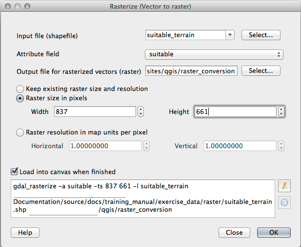

Lesson: Raster to Vector Conversion
===============================================================================

Converting between raster and vector formats allows you to make use of both
raster and vector data when solving a GIS problem, as well as using the various
analysis methods unique to these two forms of geographic data. This increases
the flexibility you have when considering data sources and processing methods
for solving a GIS problem.

To combine a raster and vector analysis, you need to convert the one type of
data to the other. Let's convert the raster result of the previous lesson to a
vector.

**The goal for this lesson:** To get the raster result into a vector that can
be used to complete the analysis.

:abbr:`★★☆ (Moderate level)` Follow Along: The :guilabel:`Raster to Vector` Tool
----------------------------------------------------------------------------------

Start with the map from the last module, :kbd:`raster_analysis.qgs`. There you
should have the :kbd:`all_conditions_simple.tif` calculated during the previous
exercises.

* Click on :menuselection:`Raster --> Conversion --> Polygonize (Raster to
  Vector)`. The tool dialog will appear.
* Set it up like this:

  .. figure:: img/polygonize_raster.png
     :align: center

* Change the field name (describing the values of the raster) to
  :guilabel:`suitable`.
* Save the layer under :file:`exercise_data/residential_development`
  as :file:`all_terrain.shp`.

Now you have a vector file which contains all the values of the raster, but
the only areas you're interested in are those that are suitable; i.e., those
polygons where the value of :guilabel:`suitable` is ``1``. You can change the
style of this layer if you want to have a clearer visualization of it.

:abbr:`★★☆ (Moderate level)` Try Yourself:
-------------------------------------------------------------------------------

Refer back to the module on vector analysis.

* Create a new vector file that contains only the polygons where
  :guilabel:`suitable` has the value of ``1``.
* Save the new file under :file:`exercise_data/residential_development/` as
  :file:`suitable_terrain.shp`.

.. admonition:: Answer
  :class: dropdown

   #. Open the :guilabel:`Query Builder` by right-clicking on the
      :guilabel:`all_terrain` layer in the :guilabel:`Layers` panel, and selecting
      the :menuselection:`Properties --> Source` tab.
   #. Then build the query ``"suitable" = 1``.
   #. Click :guilabel:`OK` to filter out all the polygons where this condition
      isn't met. When viewed over the original raster, the areas should overlap
      perfectly:

      .. figure:: img/polygonize_raster.png
         :align: center

   #. You can save this layer by right-clicking on the :guilabel:`all_terrain`
      layer in the :guilabel:`Layers` panel and choosing :guilabel:`Save As...`,
      then continue as per the instructions.

:abbr:`★★☆ (Moderate level)` Follow Along: The :guilabel:`Vector to Raster` Tool
----------------------------------------------------------------------------------

Although unnecessary for our current problem, it's useful to know about the
opposite conversion from the one performed above. Convert to raster the
:file:`suitable_terrain.shp` vector file you just created in previous step.

* Click on :menuselection:`Raster --> Conversion --> Rasterize (Vector to
  Raster)` to start this tool, then set it up as in the screenshot below:

* :guilabel:`Input layer` is :guilabel:`all_terrain`.
* Field name is :guilabel:`suitable`.
* :guilabel:`Output raster size units` is :guilabel:`Pixels`.
* :guilabel:`Width` and :guilabel:`Height` are ``837`` and ``661``,
  respectively.
* Get the :guilabel:`Output extent` from the :guilabel:`all_terrain` layer.
* Set output file :guilabel:`Rasterized` to
  :file:`exercise_data/residential_development/raster_conversion.tif`.

.. note::  The size of the output image is specified here to be the same as the
   original raster which was vectorized. To view the dimensions of an image,
   open its metadata (:guilabel:`Metadata` tab in the :guilabel:`Layer
   Properties`).

* Click :guilabel:`OK` on the dialog to begin the conversion process.
* When it is complete, gauge its success by comparing the new raster with the
  original one.  They should match up exactly, pixel for pixel.

In Conclusion
-------------------------------------------------------------------------------

Converting between raster and vector formats allows you to widen the
applicability of data, and need not lead to data degradation.

What's Next?
-------------------------------------------------------------------------------

Now that we have the results of the terrain analysis available in vector
format, they can be used to solve the problem of which buildings we should consider
for the residential development.
