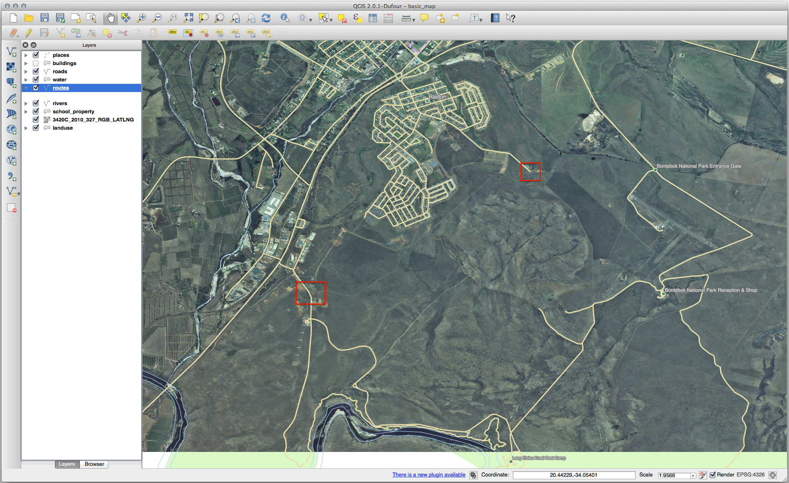
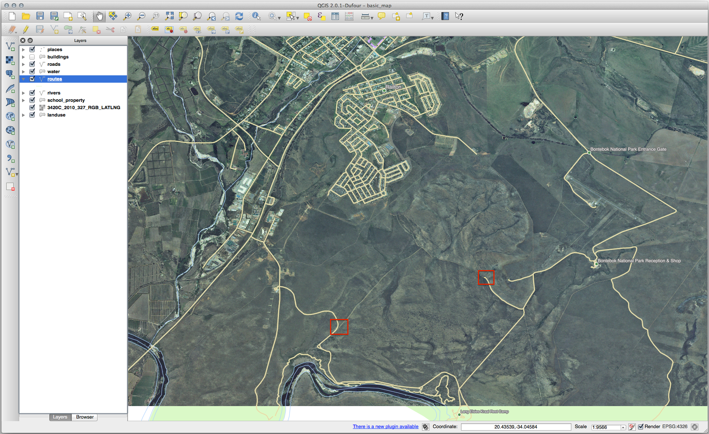

Lesson: Creating a New Vector Dataset
===============================================================================

The data that you use has to come from somewhere. For most common applications,
the data exists already; but the more particular and specialized the project,
the less likely it is that the data will already be available. In such cases,
you'll need to create your own new data.

**The goal for this lesson:** To create a new vector dataset.

:abbr:`★☆☆ (Basic level)` Follow Along: The Layer Creation Dialog
-------------------------------------------------------------------------------

Before you can add new vector data, you need a vector dataset to add it to. In
our case, you'll begin by creating new data entirely, rather than editing an
existing dataset. Therefore, you'll need to define your own new dataset first.

#. Open QGIS and create a new blank project.
#. Navigate to and click on the menu entry
   :menuselection:`Layer --> Create Layer --> New Shapefile Layer`. 
   You'll be presented with the :guilabel:`New Shapefile Layer` dialog, which will
   allow you to define a new layer.

   .. figure:: img/create_vector_layer.png
     :align: center

#. Click :guilabel:`...` for the :guilabel:`File name` field.
   A save dialog will appear.
#. Navigate to the :file:`exercise_data` directory.
#. Save your new layer as :file:`school_property.shp`.

   It's important to decide which kind of dataset you want at this stage. Each
   different vector layer type is "built differently" in the background, so once
   you've created the layer, you can't change its type.

   For the next exercise, we're going to create new features which describe
   areas. For such features, you'll need to create a polygon dataset.

#. For :guilabel:`Geometry Type`, select :guilabel:`Polygon` from the drop down menu:

   .. figure:: img/polygon_selected.png
     :align: center

   This has no impact on the rest of the dialog, but it will cause the correct
   type of geometry to be used when the vector dataset is created.

   The next field allows you to specify the Coordinate Reference System,
   or CRS. CRS is a method of associating numerical coordinates with a
   position on the surface of the Earth.
   See the User Manual on :ref:`Working with Projections <label_projections>`
   to learn more.
   
   For this example we will use the default CRS associated with this
   project, which is WGS84.

   .. figure:: img/default_crs.png
     :align: center

   Next there is a collection of fields grouped under :guilabel:`New Field`.
   By default, a new layer has only one attribute, the ``id`` field (which you
   should see in the :guilabel:`Fields list`) below. However, in order for the
   data you create to be useful, you actually need to say something about the
   features you'll be creating in this new layer. For our current purposes, it
   will be enough to add one field called ``name`` that will hold ``Text data``
   and will be limited to text length of ``80`` characters.

#. Replicate the setup below, then click the :guilabel:`Add to Fields List` button:

   .. figure:: img/new_attribute.png
     :align: center

#. Check that your dialog now looks like this:

   .. figure:: img/new_attribute_added.png
     :align: center

#. Click :guilabel:`OK`

The new layer should appear in your :guilabel:`Layers` panel.

.. _tm_datasources:

:abbr:`★☆☆ (Basic level)` Follow Along: Data Sources
-------------------------------------------------------------------------------

When you create new data, it obviously has to be about objects that really
exist on the ground. Therefore, you'll need to get your information from
somewhere.

There are many different ways to obtain data about objects. For example, you
could use a GPS to capture points in the real world, then import the data into
QGIS afterwards. Or you could survey points using a theodolite, and enter the
coordinates manually to create new features. Or you could use the digitizing
process to trace objects from remote sensing data, such as satellite imagery
or aerial photography.

For our example, you'll be using the digitizing approach. Sample raster datasets
are provided, so you'll need to import them as necessary.

#. Click on |dataSourceManager| :sup:`Data Source Manager` button.
#. Select |raster| :guilabel:`Raster` on the left side.
#. In the :guilabel:`Source` panel, click on the :guilabel:`...` button: 
#. Navigate to :file:`exercise_data/raster/`.
#. Select the file :file:`3420C_2010_327_RGB_LATLNG.tif`.
#. Click :guilabel:`Open` to close the dialogue window.

   .. figure:: img/add_raster.png
     :align: center

#. Click :guilabel:`Add` and :guilabel:`Close`. An image will load into your map.

   .. figure:: img/raster_added.png
     :align: center

#. If you don't see an aerial image appear, select the new layer, right click,
   and choose :guilabel:`Zoom to Layer` in the context menu.

   .. figure:: img/zoom_to_raster.png
     :align: center

#. Click on the |zoomIn| :sup:`Zoom In` button, and zoom to the area highlighted in blue below:

   .. figure:: img/map_area_zoom.png
     :align: center

Now you are ready to digitize these three fields:

   .. figure:: img/field_outlines.png
     :align: center

Before starting to digitize, let's move the ``school_property`` layer above the aerial image.

#. Select ``school_property`` layer in the :guilabel:`Layers` pane and drag it to the top.

.. figure:: img/move_school_layer.png
     :align: center

In order to begin digitizing, you'll need to enter **edit mode**. GIS software
commonly requires this to prevent you from accidentally editing or deleting
important data. Edit mode is switched on or off individually for each layer.

To enter edit mode for the ``school_property`` layer:

#. Click on the ``school_property`` layer in the :guilabel:`Layers` panel to select it.
#. Click on the |toggleEditing| :sup:`Toggle Editing` button.

   If you can't find this button, check that the :guilabel:`Digitizing` toolbar is
   enabled. There should be a check mark next to the :menuselection:`View -->
   Toolbars --> Digitizing` menu entry.

   As soon as you are in edit mode, you'll see that some digitizing tools have become
   active:

     - |capturePolygon| :sup:`Capture Polygon`
     - |vertexToolActiveLayer| :sup:`Vertex Tool`

   Other relevant buttons are still inactive, but will become active when
   we start interacting with our new data.

   Notice that the layer ``school_property`` in the :guilabel:`Layers` panel now
   has the pencil icon, indicating that it is in edit mode.

#. Click on the |capturePolygon| :sup:`Capture Polygon` button to begin digitizing
   our school fields.

   You'll notice that your mouse cursor has become a crosshair. This allows you to
   more accurately place the points you'll be digitizing. Remember that even when
   you're using the digitizing tool, you can zoom in and out on your map by
   rolling the mouse wheel, and you can pan around by holding down the mouse wheel
   and dragging around in the map.

   The first feature you'll be digitizing is the |schoolAreaType1|:

   .. figure:: img/school_area_one.png
     :align: center

#. Start digitizing by clicking on a point somewhere along the edge of the field.
#. Place more points by clicking further along the edge, until the shape you're
   drawing completely covers the field.
  
   .. figure:: img/school_field_outline.png
     :align: center

#. After placing your last point, right click to finish drawing the polygon.
   This will finalize the feature and show you the :guilabel:`Attributes` dialog.
#. Fill in the values as below:

   .. figure:: img/school_area_one_attributes.png
     :align: center

#. Click :guilabel:`OK`, and you have created a new feature!

   .. figure:: img/new_feature.png
     :align: center

#. In the :guilabel:`Layers` panel select the ``school_property`` layer.
#. Right click and choose :guilabel:`Open Attribute Table` in the context menu.

   .. figure:: img/open_attribute_table.png
     :align: center

   In the table you will see the feature you just added.
   While in edit mode you can update the attributes data by double click on the cell
   you want to update.

   .. figure:: img/feature_table.png
     :align: center

#. Close the attribute table.
#. To save the new feature we just created, click on |saveEdits| :sup:`Save Edits` button.

Remember, if you've made a mistake while digitizing a feature, you can always
edit it after you're done creating it. If you've made a mistake, continue
digitizing until you're done creating the feature as above. Then:

#. Click on |vertexToolActiveLayer| :sup:`Vertex Tool` button.
#. Hover the mouse over a vertex you want to move and left click on the vertex.
#. Move the mouse to the correct location of the vertex, and left click.
   This will move the vertex to the new location.

   .. figure:: img/select_vertex.png
     :align: center
   .. figure:: img/moved_vertex.png
     :align: center

   The same procedure can be used to move a line segment, but you will need to
   hover over the midpoint of the line segment.

   If you want to undo a change, you can press the |undo| :sup:`Undo` button or :kbd:`Ctrl+Z`.

#. Remember to save your changes by clicking the |saveEdits| :sup:`Save Edits` button.
#. When done editing, click the |toggleEditing| :sup:`Toggle Editing` button
   to get out of edit mode.

:abbr:`★☆☆ (Basic level)` Try Yourself: Digitizing Polygons
-------------------------------------------------------------------------------

Digitize the school itself and the upper field. Use this image to assist you:

.. figure:: img/field_outlines.png
     :align: center

Remember that each new feature needs to have a unique ``id`` value!

.. note::  When you're done adding features to a layer, remember to save your
   edits and then exit edit mode.

.. note:: You can style the fill, outline and label placement and formatting
   of the ``school_property`` using techniques learnt in earlier
   lessons.

:abbr:`★★☆ (Moderate level)` Follow Along: Using Vertex Editor Table
-------------------------------------------------------------------------------

Another way to edit a feature is to manually enter the actual
coordinate values for each vertex using the :guilabel:`Vertex Editor`
table.

#. Make sure you are in edit mode on layer ``school_property``.
#. If not already activated, click on |vertexToolActiveLayer|
   :sup:`Vertex Tool` button.
#. Move the mouse over one of the polygon features you created in the
   ``school_property`` layer and right click on it.
   This will select the feature and a :guilabel:`Vertex Editor` pane will appear.  

   .. figure:: img/vertex_editor_table.png
     :align: center

   .. note:: This table contains the coordinates for the vertices of the feature.  
      Notice there are seven vertices for this feature, but only six are 
      visually identified in the map area.
      Upon closer inspection, one will notice that row 0 and 6 have
      identical coordinates.
      These are the start and end vertices of the feature geometry,
      and are required in order to create a closed polygon feature.

#. Click and drag a box over a vertex, or multiple vertices, of the selected feature.

   .. figure:: img/vertex_select.png
     :align: center

   The selected vertices will change to a color blue and the
   :guilabel:`Vertex Editor` table will have the corresponding rows
   highlighted, which contain the coordinates of the vertices.
   
   .. figure:: img/vertex_selected.png
     :align: center

#. To update a coordinate, double left click on the cell in the table
   that you want to edit and enter the updated value.
   In this example, the x coordinate of row ``4`` is updated from
   ``20.4450`` to ``20.4444``.

   .. figure:: img/edit_vertex_in_vertex_editor.png
     :align: center
	 
#. After entering the updated value, hit the enter key to apply the change.
   You will see the vertex move to the new location in the map window.
#. When done editing, click the |toggleEditing| :sup:`Toggle Editing`
   button to get out of edit mode, and save your edits.

:abbr:`★☆☆ (Basic level)` Try Yourself: Digitizing Lines
-------------------------------------------------------------------------------
We are going to digitize two routes which are not already marked on the roads layer;
one is a path, the other is a track.
Our path runs along the southern edge of the suburb of Railton, starting and
ending at marked roads:

Our track is a little further to the south:

#. If the *roads* layer is not yet in your map, then add the :file:`roads`
   layer from the GeoPackage file :file:`training-data.gpkg` included in the
   :file:`exercise_data` folder of the training data you downloaded.
   You can read :ref:`load_geopackage` for a how-to.
#. Create a new ESRI Shapefile line dataset called ``routes.shp`` in the 
   :file:`exercise_data` directory, with attributes ``id`` and ``type``
   (use the approach above to guide you.)
#. Activate edit mode on the :guilabel:`routes` layer.
#. Since you are working with a line feature, click on the
   |captureLine| :sup:`Add Line` button to initiate line
   digitizing mode.
#. One at a time, digitize the path and the track on the ``routes`` layer.
   Try to follow the routes as accurately as possible, adding additional points along
   corners or turns.
#. Set the ``type`` attribute value to ``path`` or ``track``.
#. Use the :guilabel:`Layer Properties` dialog to add styling to your routes.
   Feel free to use different styles for paths and tracks.
#. Save your edits and toggle off editing mode by pressing the
   |toggleEditing| :sup:`Toggle Editing` button.

.. admonition:: Answer
   :class: dropdown

   The symbology doesn't matter, but the results should look more or less like
   this:

   .. figure:: img/routes_layer_result.png
      :align: center

In Conclusion
-------------------------------------------------------------------------------

Now you know how to create features! This course doesn't cover adding point
features, because that's not really necessary once you've worked with more
complicated features (lines and polygons). It works exactly the same, except
that you only click once where you want the point to be, give it attributes as
usual, and then the feature is created.

Knowing how to digitize is important because it's a very common activity in GIS
programs.

What's Next?
-------------------------------------------------------------------------------

Features in a GIS layer aren't just pictures, but objects in space. For
example, adjacent polygons know where they are in relation to one another. This
is called **topology**. In the next lesson you'll see an example of why this can
be useful.

.. Substitutions definitions - AVOID EDITING PAST THIS LINE
   This will be automatically updated by the find_set_subst.py script.
   If you need to create a new substitution manually,
   please add it also to the substitutions.txt file in the
   source folder.

.. |captureLine| image:: /static/common/mActionCaptureLine.png
   :width: 1.5em
.. |capturePolygon| image:: /static/common/mActionCapturePolygon.png
   :width: 1.5em
.. |dataSourceManager| image:: /static/common/mActionDataSourceManager.png
   :width: 1.5em
.. |raster| image:: /static/common/mIconRaster.png
   :width: 1.5em
.. |saveEdits| image:: /static/common/mActionSaveEdits.png
   :width: 1.5em
.. |schoolAreaType1| replace:: athletics field
.. |toggleEditing| image:: /static/common/mActionToggleEditing.png
   :width: 1.5em
.. |undo| image:: /static/common/mActionUndo.png
   :width: 1.5em
.. |vertexToolActiveLayer| image:: /static/common/mActionVertexToolActiveLayer.png
   :width: 1.5em
.. |zoomIn| image:: /static/common/mActionZoomIn.png
   :width: 1.5em
