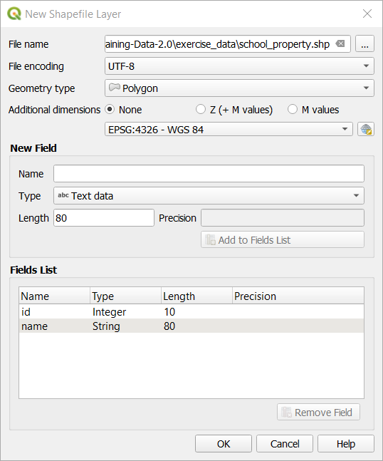

|LS| Creating a New Vector Dataset
===============================================================================

The data that you use has to come from somewhere. For most common applications,
the data exists already; but the more particular and specialized the project,
the less likely it is that the data will already be available. In such cases,
you'll need to create your own new data.

**The goal for this lesson:** To create a new vector dataset.

|basic| |FA| The Layer Creation Dialog
-------------------------------------------------------------------------------

Before you can add new vector data, you need a vector dataset to add it to. In
our case, you'll begin by creating new data entirely, rather than editing an
existing dataset. Therefore, you'll need to define your own new dataset first.

You'll need to open a :guilabel:`Create Layer` dialog that will allow you
to define a new layer.

* Navigate to and click on the menu entry :menuselection:`Layer --> Create Layer --> New
  Shapefile Layer`.

You'll be presented with the following dialog:

.. figure:: img/create_vector_layer.png
   :align: center

* Click :guilabel:`...` for the File name field. A save dialog will appear.
* Navigate to the :kbd:`exercise_data` directory.
* Save your new layer as :kbd:`school_property.shp`.

It's important to decide which kind of dataset you want at this stage. Each
different vector layer type is "built differently" in the background, so once
you've created the layer, you can't change its type.

For the next exercise, we're going to be creating new features which describe
areas. For such features, you'll need to create a polygon dataset.

* For Geometry Type, select :guilabel:`Polygon` from the drop down menu:

.. figure:: img/polygon_selected.png
   :align: center

This has no impact on the rest of the dialog, but it will cause the correct
type of geometry to be used when the vector dataset is created.

The next field allows you to specify the Coordinate Reference System, or CRS. A
CRS specifies how to describe a point on Earth in terms of coordinates, and
because there are many different ways to do this, there are many different CRSs.
The CRS of this project is WGS84, so it's already correct by default:

Next there is a collection of fields grouped under :guilabel:`New Field`.
By default, a new layer has only one attribute, the :kbd:`id` field (which you
should see in the :guilabel:`Fields list`) below. However, in order for the
data you create to be useful, you actually need to say something about the
features you'll be creating in this new layer. For our current purposes, it
will be enough to add one field called :kbd:`name` that will hold :kbd:`Text data`
and will be limited to text length of ``80`` characters.

* Replicate the setup below, then click the :guilabel:`Add to Fields List`
  button:

* Check that your dialog now looks like this:

* Click :guilabel:`OK`

The new layer should appear in your :guilabel:`Layers` panel.

.. _tm_datasources:

|basic| |FA| Data Sources
-------------------------------------------------------------------------------

When you create new data, it obviously has to be about objects that really
exist on the ground. Therefore, you'll need to get your information from
somewhere.

There are many different ways to obtain data about objects. For example, you
could use a GPS to capture points in the real world, then import the data into
QGIS afterwards. Or you could survey points using a theodolite, and enter the
coordinates manually to create new features. Or you could use the digitizing
process to trace objects from remote sensing data, such as satellite imagery
or aerial photography.

For our example, you'll be using the digitizing approach. Sample raster datasets
are provided, so you'll need to import them as necessary.

* Click on Data Source Manager button |dataSourceManager| .
* Select :guilabel:`Raster` on the left side.
* In the :guilabel:`Source` panel, click on the :guilabel:`...` button: 
* Navigate to :kbd:`exercise_data/raster/`.
* Select the file :kbd:`3420C_2010_327_RGB_LATLNG.tif`.
* Click :guilabel:`Open` to close the dialogue window.

.. figure:: img/add_raster.png
	:align: center
	
* Click :guilabel:`Add` and :guilabel:`Close`. An image will load into your map.

* If you don't see an aerial image appear, select the new layer image,
  right click, and click on :guilabel:`Zoom to Layer`.

.. figure:: img/zoom_to_raster.png
	:align: center

* Click on the |zoomIn| button, and zoom to the area highlighted in blue below:

.. figure:: img/map_area_zoom.png
   :align: center

You'll be digitizing these three fields:

.. figure:: img/field_outlines.png
   :align: center

Before starting to digitize, let's move the :kbd:`school_property` layer above the aerial image.

* Select :kbd:`school_property` layer in the :guilabel:`Layers` pane and drag it to the top.

.. figure:: img/move_school_layer.png
	:align: center

In order to begin digitizing, you'll need to enter **edit mode**. GIS software
commonly requires this to prevent you from accidentally editing or deleting
important data. Edit mode is switched on or off individually for each layer.

To enter edit mode for the :guilabel:`school_property` layer:

* Click on the :kbd:'school_property' layer in the :guilabel:`Layer list` to select it.
* Click on the :guilabel:`Toggle Editing` button: |toggleEditing|

If you can't find this button, check that the :guilabel:`Digitizing` toolbar is
enabled. There should be a check mark next to the :menuselection:`View -->
Toolbars --> Digitizing` menu entry.

As soon as you are in edit mode, you'll see that some digitizing tools have become
active:

  - |capturePolygon|: Add a new feature.
  - |vertexToolActiveLayer|: move only one part of a feature.

Other relevant buttons are still inactive, but will become active when we
start interacting with our new data.

Notice that the layer ``school_layer`` in the :guilabel:`Layers` panel
now has the pencil icon, indicating that it is in edit mode.

* Click on the |capturePolygon| button to begin digitizing our school
  fields.

You'll notice that your mouse cursor has become a crosshair. This allows you to
more accurately place the points you'll be digitizing. Remember that even as
you're using the digitizing tool, you can zoom in and out on your map by
rolling the mouse wheel, and you can pan around by holding down the mouse wheel
and dragging around in the map.

The first feature you'll be digitizing is the |schoolAreaType1|:

.. figure:: img/school_area_one.png
   :align: center

* Start digitizing by clicking on a point somewhere along the edge of the
  field.
* Place more points by clicking further along the edge, until the shape you're
  drawing completely covers the field.
  
.. figure:: img/school_field_outline.png
	:align: center
	
* After placing your last point, *right-click* to finish drawing the polygon.
  This will finalize the feature and show you the :guilabel:`Attributes` dialog.
* Fill in the values as below:

.. figure:: img/school_area_one_attributes.png
   :align: center

* Click :guilabel:`OK` and you've created a new feature!

.. figure:: img/new_feature.png
	:align: center
	
* In the :guilabel:`Layers` panel select the :kbd:`school_property` layer, right click,
  and click on :guilabel:`Open Attribute Table`.

.. figure:: img/open_attribute_table.png
	:align: center
	
In the table you will see the feature you just added.
While in edit mode you can update the attributes data by double click on the cell
you want to update.

* Close the attribute table.
* To save the new feature we just created click on the Save Edits button: |saveEdits|

Remember, if you've made a mistake while digitizing a feature, you can always
edit it after you're done creating it. If you've made a mistake, continue
digitizing until you're done creating the feature as above. Then:

* Click on |vertexToolActiveLayer| Vertex Editor tool.
* Hover the mouse over a vertex you want to move and *left-click* on the vertex.
* Move the mouse to the correct location of the vertex, and *left-click*.
  This will move the vertext to the new location.

.. figure:: img/select_vertex.png
	:align: center
.. figure:: img/moved_vertext.png
	:align: center

The same procedure can be used to move a line segment, but you will need to
hover over the midpoint of the line segment.

Another way to edited the feature is by manually entering the coordinates for each vertex.  

* Make sure the Vertex Editor tool |vertexToolActiveLayer| is still active.
* Move the mouse over the feature and *right-click* on it.
* A :guilabel:`Vertex Editor` pane will appear.  

.. figure:: img/vertex_editor_table.png
	:align: center
	
* Click on a row, and notice that for this feature the vertex circle color will change to blue.
* Double *left-click* in the table on the x or y coordinate you want to edit and enter the
  updated value. 
	
.. figure:: img/edit_vertext_in_vertex_editor.png
	:align: center
	
If you want to undo a change, you can undo changes by pressing the Undo button |undo|.
	
* Remember to save your changes by clicking the Save Edits button |saveEdits|.

To enable the remaining feature editing tools, one needs to select the feature.

* Click on the Select Rectange button |selectRectangle| in the Attributes Toolbar.
* Click on the feature that was just created and this will enable the remaining buttons.

.. figure:: img/all_active_buttons.png
	:align: center

Here is a summary of the editing actions of these buttons:

- |deleteSelectedFeatures|: delete the selected feature.
- |editCut| : cut the selected feature.
- |editCopy|: copy the selected feature.
- |editPaste|: paste a cut or copied feature back into the map.

* When done editing, click the Toggle Editing button |toggleEditing| to get
  out of edit mode, and save your edits.

	
|basic| |TY|
-------------------------------------------------------------------------------

* Digitize the school itself and the upper field. Use this image to assist you:

.. figure:: img/field_outlines.png
   :align: center

Remember that each new feature needs to have a unique :kbd:`id` value!

.. note::  When you're done adding features to a layer, remember to save your
   edits and then exit edit mode.

.. note:: You can style the fill, outline and label placement and formatting
   of the :guilabel:`school_property` using techniques learnt in earlier
   lessons. In our example, we will use a dashed outline of light green color
   with no fill.

.. _backlink-create-vector-digitize-1:

|basic| |TY|
-------------------------------------------------------------------------------

* Create a new line feature called :kbd:`routes.shp` with attributes :kbd:`id`
  and :kbd:`type`. (Use the approach above to guide you.)

We are going to digitize two routes which are not already marked on the roads layer;
one is a path, the other is a track. 

* If the roads layer is not in your map, then add it from the GeoPackage file
  :file:`training-data.gpk` included in the :file:`exercise_data` folder of the
  training data you downloaded.

Our path runs along the southern edge of the suburb of Railton, starting and
ending at marked roads:

.. figure:: img/path_start_end.png
   :align: center

Our track is a little further to the south:

.. figure:: img/track_start_end.png
   :align: center

One at a time, digitize the path and the track on the :guilabel:`routes` layer.
Try to follow the routes as accurately as possible, using points (left-click) at
any corners or turns.

When creating each route, give them the :kbd:`type` attribute value of
:kbd:`path` or :kbd:`track`.

You'll probably find that only the points are marked; use the
:guilabel:`Layer Properties` dialog to add styling to your routes. Feel free to
give different styles to the path and track.

Save your edits and toggle |toggleEditing| mode.

:ref:`Check your results <create-vector-digitize-1>`

|IC|
-------------------------------------------------------------------------------

Now you know how to create features! This course doesn't cover adding point
features, because that's not really necessary once you've worked with more
complicated features (lines and polygons). It works exactly the same, except
that you only click once where you want the point to be, give it attributes as
usual, and then the feature is created.

Knowing how to digitize is important because it's a very common activity in GIS
programs.

|WN|
-------------------------------------------------------------------------------

Features in a GIS layer aren't just pictures, but objects in space. For
example, adjacent polygons know where they are in relation to one another. This
is called *topology*. In the next lesson you'll see an example of why this can
be useful.

.. Substitutions definitions - AVOID EDITING PAST THIS LINE
   This will be automatically updated by the find_set_subst.py script.
   If you need to create a new substitution manually,
   please add it also to the substitutions.txt file in the
   source folder.

.. |FA| replace:: Follow Along:
.. |IC| replace:: In Conclusion
.. |LS| replace:: Lesson:
.. |TY| replace:: Try Yourself
.. |WN| replace:: What's Next?
.. |addRasterLayer| image:: /static/common/mActionAddRasterLayer.png
   :width: 1.5em
.. |basic| image:: /static/common/basic.png
.. |capturePolygon| image:: /static/common/mActionCapturePolygon.png
   :width: 1.5em
.. |deleteSelectedFeatures| image:: /static/common/mActionDeleteSelectedFeatures.png
   :width: 1.5em
.. |edit| image:: /static/common/edit.png
   :width: 1.5em
.. |editCopy| image:: /static/common/mActionEditCopy.png
   :width: 1.5em
.. |editCut| image:: /static/common/mActionEditCut.png
   :width: 1.5em
.. |editPaste| image:: /static/common/mActionEditPaste.png
   :width: 1.5em
.. |moveFeature| image:: /static/common/mActionMoveFeature.png
   :width: 1.5em
.. |saveEdits| image:: /static/common/mActionSaveEdits.png
   :width: 1.5em
.. |schoolAreaType1| replace:: athletics field
.. |vertexToolActiveLayer| image:: /static/common/mActionVertexToolActiveLayer.png
   :width: 1.5em
.. |toggleEditing| image:: /static/common/mActionToggleEditing.png
   :width: 1.5em
.. |dataSourceManager| image:: /static/common/mActionDataSourceManager.png
   :width: 1.5em
.. |zoomIn| image:: /static/common/mActionZoomIn.png
   :width: 1.5em
.. |undo| image:: /static/common/mActionUndo.png
   :width: 1.5em
.. |selectRectangle| image:: /static/common/mActionSelectRectangle.png
   :width: 1.5em
