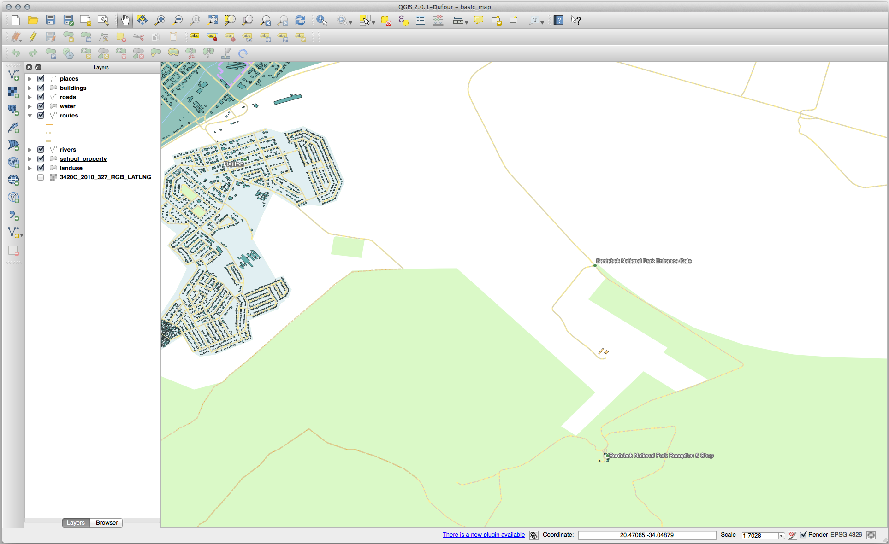

Lesson: Feature Topology
======================================================================

Topology is a useful aspect of vector data layers, because it minimizes errors
such as overlap or gaps.

For example: if two features share a border, and you edit the border using
topology, then you won't need to edit first one feature, then another, and
carefully line up the borders so that they match. Instead, you can edit their
shared border and both features will change at the same time.

**The goal for this lesson:** To understand topology using examples.

:abbr:`★★☆ (Moderate level)` Follow Along: Snapping
----------------------------------------------------------------------

Snapping makes topological editing easier.
This will allow your mouse cursor to snap to other objects while you
digitize.
To set snapping options:

#. Navigate to the menu entry
   :menuselection:`Project --> Snapping Options...`.
#. Set up your :guilabel:`Snapping options` dialog to activate the
   ``landuse`` layer with :guilabel:`Type` *vertex* and tolerance
   ``12`` pixels:

   .. figure:: img/set_snapping_options.png
      :align: center

#. Make sure that the box in the :guilabel:`Avoid overlap` column is
   checked.
#. Leave the dialog.
#. Select the :guilabel:`landuse` layer and enter edit mode
   (|toggleEditing|)
#. Check (under :menuselection:`View --> Toolbars`) that the
   :guilabel:`Advanced Digitizing` toolbar is enabled.
#. Zoom to this area (enable layers and labels if necessary):

   .. figure:: img/zoom_to.png
      :align: center

#. Digitize this new (fictional) area shown in red:

   .. figure:: img/new_park_area.png
      :align: center

#. When prompted, give it an *OGC_FID* of :kbd:`999`, but feel free to
   leave the other values unchanged.

   If you are careful while digitizing, and allow the cursor to snap to
   the vertices of adjoining areas, you'll notice that there won't be
   any gaps between your new area and the existing adjacent areas.

#. Note the |undo| :sup:`undo`
   and |redo| :sup:`redo` tools in the
   :guilabel:`Advanced Digitizing` toolbar.

:abbr:`★★☆ (Moderate level)` Follow Along: Correct Topological Features
------------------------------------------------------------------------

Topology features can sometimes need to be updated.
In our study area, an area has been turned into forest, so the
``landuse`` layer need an update.
We will therefore expand and join some forest features in this
area:

Instead of creating new polygons to join the forest areas, we are
going to use the *Vertex Tool* to edit and join existing polygons.

#. Enter edit mode (if it is not active already)
#. Select the |vertexToolActiveLayer| :sup:`Vertex Tool` tool.
#. Choose an area of forest, select a vertex, and move it to an
   adjoining vertex so that the two forest features meet:

   .. figure:: img/corner_selected_move.png
      :align: center

#. Click on the other vertices and snap them into place.

   The topologically correct border looks like this:

   .. figure:: img/areas_joined.png
      :align: center

   Go ahead and join a few more areas using the *Vertex Tool*.

   You can also use the |capturePolygon| :sup:`Add Polygon Feature`
   tool to fill the gap between the two forest polygons.
   If you have enabled *Avoid overlap*, you don't have to add every
   single vertex - they will be added automatically if your new
   polygon overlaps the existing ones.

   If you are using our example data, you should have a forest area
   looking something like this:

  .. figure:: img/node_example_result.png
     :align: center

  Don't worry if you have joined more, less or different areas of
  forest.

:abbr:`★★☆ (Moderate level)` Follow Along: Tool: Simplify Feature
----------------------------------------------------------------------

Continuing on the same layer, we will test the |simplify|
:sup:`Simplify Feature` tool:

#. Click on it to activate it.
#. Click on one of the areas which you joined using either the
   *Vertex Tool* or *Add Feature* tool.
   You will see this dialog:

   .. figure:: img/simplify_line_dialog.png
      :align: center

#. Modify the :guilabel:`Tolerance` and watch what happens:

   .. figure:: img/simplify_line_example.png
      :align: center

   This allows you to reduce the number of vertices.

#. Click :guilabel:`OK`

The advantage of this tool is that it provides you with a simple and
intuitive interface for generalization.
But notice that the tool ruins topology.
The simplified polygon no longer shares boundaries with its adjacent
polygons, as it should.
So this tool is better suited for stand-alone features.

Before you go on, set the polygon back to its original state by
undoing the last change.

:abbr:`★★☆ (Moderate level)` Try Yourself: Tool: Add Ring
----------------------------------------------------------------------

The |addRing| :sup:`Add Ring` tool allows you to add an interior ring
to a polygon feature (cut a hole in the polygon), as long as the hole
is completely contained within the polygon (touching the boundary is
OK).
For example, if you have digitized the outer boundaries of South
Africa and you need to add a hole for Lesotho, you would use this
tool.

If you experiment with the tool, you may notice that the snapping
options can prevent you from creating a ring inside a polygon.
So you are advised to turn off snapping before cutting a hole.

#. Disable snapping for the ``landuse`` layer using the |snapping|
   :sup:`Enable Snapping` button (or use the shortcut :kbd:`s`).
#. Use the |addRing| :sup:`Add Ring` tool to create a hole in the
   middle of a polygon geometry.
#. Draw a polygon over the target feature, as if you were using the
   |capturePolygon| :sup:`Add polygon` tool.
#. When you right-click, the hole will be visible.
#. Remove the hole you just created using the |deleteRing|
   :sup:`Delete Ring` tool.
   Click inside the hole to delete it.

.. admonition:: Answer
   :class: dropdown

   The exact shape doesn't matter, but you should be getting a hole in the middle
   of your feature, like this one:

   .. figure:: img/ring_tool_result.png
      :align: center

* Undo your edit before continuing with the exercise for the next tool.

:abbr:`★★☆ (Moderate level)` Try Yourself: Tool: Add Part
----------------------------------------------------------------------

The |addPart| :sup:`Add Part` tool allows you to add a new part to a
feature, that is not directly connected to the main feature.
For example, if you have digitized the boundaries of mainland South
Africa, but you haven't yet added the Prince Edward Islands, you
would use this tool to create them.

#. Select the polygon to which you wish to add the part by using the
   |selectRectangle| :sup:`Select Features by area or single click`
   tool.
#. Use the :guilabel:`Add Part` tool to add an outlying area.
#. Delete the part you just created using the |deletePart|
   :sup:`Delete Part` tool.

   .. Note:: Click inside the part to delete it.

.. admonition:: Answer
   :class: dropdown

   #. First select the |largeLandUseArea|:

      .. figure:: img/park_selected.png
         :align: center

   #. Now add your new part:

      .. figure:: img/new_park_area_answer.png
         :align: center

   #. Undo your edit before continuing with the exercise for the next tool.

:abbr:`★★☆ (Moderate level)` Follow Along: Tool: Reshape Features
----------------------------------------------------------------------

The |reshape| :sup:`Reshape Features` tool is used to extend a polygon
feature or cut away a part of it (along the boundary).

Extending:

#. Select the polygon using the |selectRectangle|
   :sup:`Select Features by area or single click` tool.
#. Left-click inside the polygon to start drawing.
#. Draw a shape outside the polygon. The last vertex should be back
   inside the polygon.
#. Right-click to finish the shape:

   .. figure:: img/reshape_step_one.png
      :align: center

   This will give a result similar to:

   .. figure:: img/reshape_result.png
      :align: center

Cut away a part:

#. Select the polygon using the |selectRectangle|
   :sup:`Select Features by area or single click` tool.
#. Click outside the polygon.
#. Draw a shape inside the polygon. The last vertex must be back
   outside the polygon.
#. Right-click outside the polygon:

   .. figure:: img/reshape_inverse_example.png
     :align: center

   The result of the above:

   .. figure:: img/reshape_inverse_result.png
      :align: center

:abbr:`★★☆ (Moderate level)` Try Yourself: Tool: Split Features
----------------------------------------------------------------------

The |splitFeatures| :sup:`Split Features` tool is similar to the
|reshape| :sup:`Reshape Features` tool, except that it does not delete
either of the two parts.
Instead, it keeps them both.

We will use the tool to split a corner from a polygon.

#. First, select the ``landuse`` layer and re-enable snapping for it.

#. Select the |splitFeatures| :sup:`Split Features` tool and click on
   a vertex to begin drawing a line.

#. Draw the bounding line.

#. Click a vertex on the "opposite" side of the polygon you wish to
   split and right-click to complete the line:

   .. figure:: img/split_feature_example.png
      :align: center

#. At this point, it may seem as if nothing has happened.
   But remember that the ``landuse`` layer is rendered without
   border lines, so the new division line will not be shown.
#. Use the |selectRectangle|
   :sup:`Select Features by area or single click` tool to select the
   part you just split out; the new feature will now be highlighted:

   .. figure:: img/new_corner_selected.png
      :align: center

.. _backlink-create-vector-topology-4:

:abbr:`★★★ (Advanced level)` Try Yourself: Tool: Merge Features
----------------------------------------------------------------------

Now we will re-join the feature you just split out to the remaining
part of the polygon:

#. Experiment with  the |mergeFeatures|:sup:`Merge Selected Features`
   and |mergeFeatureAttributes|
   :sup:`Merge Attributes of Selected Features` tools.
#. Note the differences.

.. admonition:: Answer
   :class: dropdown

   * Use the :guilabel:`Merge Selected Features` tool, making sure to first select
     both of the polygons you wish to merge.
   * Use the feature with the :guilabel:`OGC_FID` of ``1`` as the source of your
     attributes (click on its entry in the dialog, then click the :guilabel:`Take
     attributes from selected feature` button):

   If you're using a different dataset, it is highly likely that your original
   polygon's :guilabel:`OGC_FID` will not be ``1``. Just choose the feature
   which has an :guilabel:`OGC_FID`.

   .. figure:: img/merge_feature_dialog.png
      :align: center

   Using the :guilabel:`Merge Attributes of Selected Features` tool will keep the
   geometries distinct, but give them the same attributes.

In Conclusion
----------------------------------------------------------------------

Topology editing is a powerful tool that allows you to create and modify
objects quickly and easily, while ensuring that they remain topologically
correct.

What's Next?
----------------------------------------------------------------------

Now you know how to digitize the shape of the objects easily, but
adding attributes is still a bit of a headache!
Next we will show you how to use forms, making attribute editing
simpler and more effective.

.. Substitutions definitions - AVOID EDITING PAST THIS LINE
   This will be automatically updated by the find_set_subst.py script.
   If you need to create a new substitution manually,
   please add it also to the substitutions.txt file in the
   source folder.

.. |addPart| image:: /static/common/mActionAddPart.png
   :width: 1.5em
.. |addRing| image:: /static/common/mActionAddRing.png
   :width: 2em
.. |capturePolygon| image:: /static/common/mActionCapturePolygon.png
   :width: 1.5em
.. |deletePart| image:: /static/common/mActionDeletePart.png
   :width: 2em
.. |deleteRing| image:: /static/common/mActionDeleteRing.png
   :width: 2em
.. |largeLandUseArea| replace:: Bontebok National Park
.. |mergeFeatureAttributes| image:: /static/common/mActionMergeFeatureAttributes.png
   :width: 1.5em
.. |mergeFeatures| image:: /static/common/mActionMergeFeatures.png
   :width: 1.5em
.. |redo| image:: /static/common/mActionRedo.png
   :width: 1.5em
.. |reshape| image:: /static/common/mActionReshape.png
   :width: 1.5em
.. |selectRectangle| image:: /static/common/mActionSelectRectangle.png
   :width: 1.5em
.. |simplify| image:: /static/common/mActionSimplify.png
   :width: 1.5em
.. |snapping| image:: /static/common/mIconSnapping.png
   :width: 1.5em
.. |splitFeatures| image:: /static/common/mActionSplitFeatures.png
   :width: 1.5em
.. |toggleEditing| image:: /static/common/mActionToggleEditing.png
   :width: 1.5em
.. |undo| image:: /static/common/mActionUndo.png
   :width: 1.5em
.. |vertexToolActiveLayer| image:: /static/common/mActionVertexToolActiveLayer.png
   :width: 1.5em
