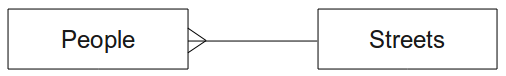

Lesson: Implementing the Data Model
===============================================================================

Now that we've covered all the theory, let's create a new database. This
database will be used for our exercises for the lessons that will follow
afterwards.

**The goal for this lesson:** To install the required software and use it to
implement our example database.

Install PostgreSQL
-------------------------------------------------------------------------------

.. note:: You can find PostgreSQL packages and installation instructions for
  your operating system at https://www.postgresql.org/download/.
  Please note that the documentation will assume users are running QGIS under
  Ubuntu.

Under Ubuntu:

.. code-block:: bash

  sudo apt install postgresql-9.1

You should get a message like this:

.. code-block:: bash

  [sudo] password for qgis:
  Reading package lists... Done
  Building dependency tree
  Reading state information... Done
  The following extra packages will be installed:
  postgresql-client-9.1 postgresql-client-common postgresql-common
  Suggested packages:
  oidentd ident-server postgresql-doc-9.1
  The following NEW packages will be installed:
  postgresql-9.1 postgresql-client-9.1 postgresql-client-common postgresql-common
  0 upgraded, 4 newly installed, 0 to remove and 5 not upgraded.
  Need to get 5,012kB of archives.
  After this operation, 19.0MB of additional disk space will be used.
  Do you want to continue [Y/n]?

Press :kbd:`Y` and :kbd:`Enter` and wait for the download and installation to
finish.

Help
-------------------------------------------------------------------------------

PostgreSQL has very good `online
<https://www.postgresql.org/docs/9.1/index.html>`_ documentation.

Create a database user
-------------------------------------------------------------------------------

Under Ubuntu:

After the installation is complete, run this command to become the postgres
user and then create a new database user:

.. code-block:: bash

  sudo su - postgres

Type in your normal log in password when prompted (you need to have sudo rights).

Now, at the postgres user's bash prompt, create the database user. Make sure
the user name matches your unix login name: it will make your life much easier,
as postgres will automatically authenticate you when you are logged in as that
user:

.. code-block:: bash

  createuser -d -E -i -l -P -r -s qgis

Enter a password when prompted. You should use a different password to your login
password.

What do those options mean?

.. code-block:: bash

  -d, --createdb     role can create new databases
  -E, --encrypted    encrypt stored password
  -i, --inherit      role inherits privileges of roles it is a member of (default)
  -l, --login        role can login (default)
  -P, --pwprompt     assign a password to new role
  -r, --createrole   role can create new roles
  -s, --superuser    role will be superuser

Now you should leave the postgres user's bash shell environment by
typing:

.. code-block:: bash

  exit

Verify the new account
-------------------------------------------------------------------------------

::

  psql -l

Should return something like this::

    Name      |  Owner   | Encoding | Collation  |   Ctype    |
    ----------+----------+----------+------------+------------+
    postgres  | postgres | UTF8     | en_ZA.utf8 | en_ZA.utf8 |
    template0 | postgres | UTF8     | en_ZA.utf8 | en_ZA.utf8 |
    template1 | postgres | UTF8     | en_ZA.utf8 | en_ZA.utf8 |
    (3 rows)

Type :kbd:`Q` to exit.

Create a database
-------------------------------------------------------------------------------

The ``createdb`` command is used to create a new database. It should be run
from the bash shell prompt:

.. code-block:: psql

  createdb address -O qgis

You can verify the existence of your new database by using this command:

.. code-block:: psql

  psql -l

Which should return something like this:

.. code-block:: psql

  Name      |  Owner   | Encoding | Collation  |   Ctype    |   Access privileges
  ----------+----------+----------+------------+------------+-----------------------
  address   | qgis     | UTF8     | en_ZA.utf8 | en_ZA.utf8 |
  postgres  | postgres | UTF8     | en_ZA.utf8 | en_ZA.utf8 |
  template0 | postgres | UTF8     | en_ZA.utf8 | en_ZA.utf8 | =c/postgres: postgres=CTc/postgres
  template1 | postgres | UTF8     | en_ZA.utf8 | en_ZA.utf8 | =c/postgres: postgres=CTc/postgres
  (4 rows)

Type :kbd:`Q` to exit.

Starting a database shell session
-------------------------------------------------------------------------------

You can connect to your database easily like this::

  psql address

To exit out of the psql database shell, type::

  \q

For help in using the shell, type::

  \?

For help in using sql commands, type::

  \help

To get help on a specific command, type (for example)::

  \help create table

See also the `Psql cheat sheet <http://www.postgresonline.com/downloads/special_feature/postgresql90_cheatsheet_A4.pdf>`_.

Make Tables in SQL
-------------------------------------------------------------------------------

Let's start making some tables! We will use our ER Diagram as a guide. First,
connect to the address db:

.. code-block:: sql

  psql address

Then create a :file:`streets` table:

.. code-block:: sql

  create table streets (id serial not null primary key, name varchar(50));

:kbd:`serial` and :kbd:`varchar` are **data types**. :kbd:`serial` tells
PostgreSQL to start an integer sequence (auto-number) to populate the :kbd:`id`
automatically for every new record. :kbd:`varchar(50)` tells PostgreSQL to
create a character field of 50 characters in length.

You will notice that the command ends with a :kbd:`;` - all SQL commands should
be terminated this way. When you press :kbd:`Enter`, psql will report something
like this:

.. code-block:: sql

  NOTICE:  CREATE TABLE will create implicit sequence "streets_id_seq"
           for serial column "streets.id"
  NOTICE:  CREATE TABLE / PRIMARY KEY will create implicit index
           "streets_pkey" for table "streets"
  CREATE TABLE

That means your table was created successfully, with a primary key :kbd:`streets_pkey`
using :kbd:`streets.id`.

Note: If you hit return without entering a :kbd:`;`, then you will get a prompt like
this: :kbd:`address-#`. This is because PG is expecting you to enter more. Enter
:kbd:`;` to run your command.

To view your table schema, you can do this:

.. code-block:: psql

  \d streets

Which should show something like this:

.. code-block:: sql

  Table "public.streets"
  Column  |         Type          |            Modifiers
  --------+-----------------------+--------------------------------------
   id     | integer               | not null default
          |                       | nextval('streets_id_seq'::regclass)
   name   | character varying(50) |
  Indexes:
    "streets_pkey" PRIMARY KEY, btree (id)

To view your table contents, you can do this:

.. code-block:: sql

  select * from streets;

Which should show something like this:

.. code-block:: sql

   id | name
   ---+------
   (0 rows)

As you can see, our table is currently empty.

Try Yourself: :abbr:`★★☆ (Moderate level)`
...............................................................................

Use the approach shown above to make a table called people:

Add fields such as phone number, home address, name, etc. (these aren't all
valid names: change them to make them valid). Make sure you give the table an
ID column with the same data-type as above.

.. admonition:: Answer
  :class: dropdown

  The SQL required to create the correct people table is::

    create table people (id serial not null primary key,
                         name varchar(50),
                         house_no int not null,
                         street_id int not null,
                         phone_no varchar null );

  The schema for the table (enter ``\\d people``) looks like this::

    Table "public.people"

    Column     |         Type          |                      Modifiers
    -----------+-----------------------+-------------------------------------
    id         | integer               | not null default
               |                       | nextval('people_id_seq'::regclass)
    name       | character varying(50) |
    house_no   | integer               | not null
    street_id  | integer               | not null
    phone_no   | character varying     |
    Indexes:
      "people_pkey" PRIMARY KEY, btree (id)

  For illustration purposes, we have purposely omitted the fkey constraint.

Create Keys in SQL
-------------------------------------------------------------------------------

The problem with our solution above is that the database doesn't know that
people and streets have a logical relationship. To express this relationship,
we have to define a foreign key that points to the primary key of the streets
table.

There are two ways to do this:

* Add the key after the table has been created
* Define the key at time of table creation

Our table has already been created, so let's do it the first way:

.. code-block:: sql

  alter table people
    add constraint people_streets_fk foreign key (street_id) references streets(id);

That tells the :kbd:`people` table that its :kbd:`street_id` fields must match
a valid street :kbd:`id` from the :kbd:`streets` table.

The more usual way to create a constraint is to do it when you create the table:

.. code-block:: psql

  create table people (id serial not null primary key,
                       name varchar(50),
                       house_no int not null,
                       street_id int references streets(id) not null,
                       phone_no varchar null);

  \d people

After adding the constraint, our table schema looks like this now:

.. code-block:: sql

  Table "public.people"

    Column   |         Type          |            Modifiers
  -----------+-----------------------+---------------------------------
   id        | integer               | not null default
             |                       | nextval('people_id_seq'::regclass)
   name      | character varying(50) |
   house_no  | integer               | not null
   street_id | integer               | not null
   phone_no  | character varying     |
  Indexes:
    "people_pkey" PRIMARY KEY, btree (id)
  Foreign-key constraints:
    "people_streets_fk" FOREIGN KEY (id) REFERENCES streets(id)

Create Indexes in SQL
-------------------------------------------------------------------------------

We want lightning fast searches on peoples names. To provide for this, we can
create an index on the name column of our people table:

.. code-block:: psql

  create index people_name_idx on people(name);

  \d people

Which results in:

.. code-block:: sql

  Table "public.people"

    Column   |         Type          |                      Modifiers
  -----------+-----------------------+-----------------------------------
   id        | integer               | not null default nextval
             |                       | ('people_id_seq'::regclass)
   name      | character varying(50) |
   house_no  | integer               | not null
   street_id | integer               | not null
   phone_no  | character varying     |
  Indexes:
   "people_pkey" PRIMARY KEY, btree (id)
   "people_name_idx" btree (name)    <-- new index added!
  Foreign-key constraints:
   "people_streets_fk" FOREIGN KEY (id) REFERENCES streets(id)

Dropping Tables in SQL
-------------------------------------------------------------------------------

If you want to get rid of a table you can use the :kbd:`drop` command:

.. code-block:: sql

  drop table streets;

In our current example, the above command would not work. Why not?

.. admonition:: Answer
  :class: dropdown

  The reason the DROP command would not work in this case is because the
  *people* table has a Foreign Key constraint to the *streets* table. This means
  that dropping (or deleting) the *streets* table would leave the *people* table
  with references to non-existent *streets* data.

  It is possible to 'force' the *streets* table to be deleted by using the
  ``CASCADE`` command, but this would also delete the *people* and any other table
  which had a relationship to the *streets* table. Use with caution!

If you used the same :kbd:`drop table` command on the `people` table, it would
be successful:

.. code-block:: sql

  drop table people;

.. note::  If you actually did enter that command and dropped the :kbd:`people`
   table, now would be a good time to rebuild it, as you will need it in the
   next exercises.

A word on pgAdmin III
-------------------------------------------------------------------------------

We are showing you the SQL commands from the `psql` prompt because it's a very
useful way to learn about databases. However, there are quicker and easier ways
to do a lot of what we are showing you. Install pgAdmin III and you can create,
drop, alter etc tables using 'point and click' operations in a GUI.

Under Ubuntu, you can install it like this:

.. code-block:: bash

  sudo apt install pgadmin3

pgAdmin III will be covered in more detail in another module.

In Conclusion
-------------------------------------------------------------------------------

You have now seen how to create a brand new database, starting completely from
scratch.

What's Next?
-------------------------------------------------------------------------------

Next you'll learn how to use the DBMS to add new data.
