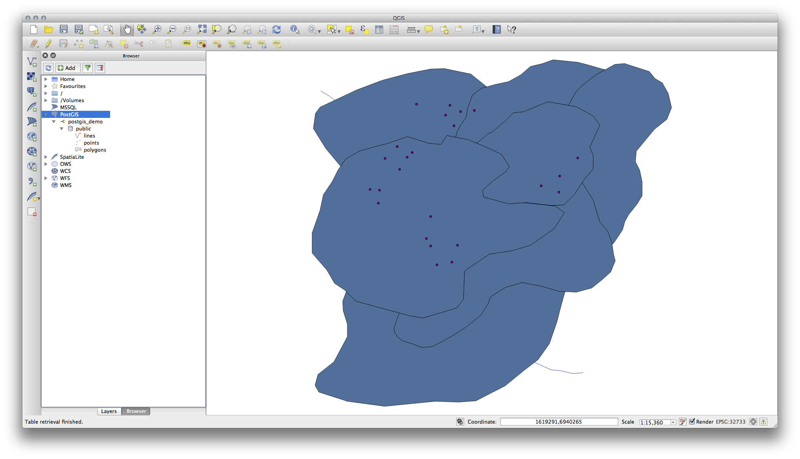
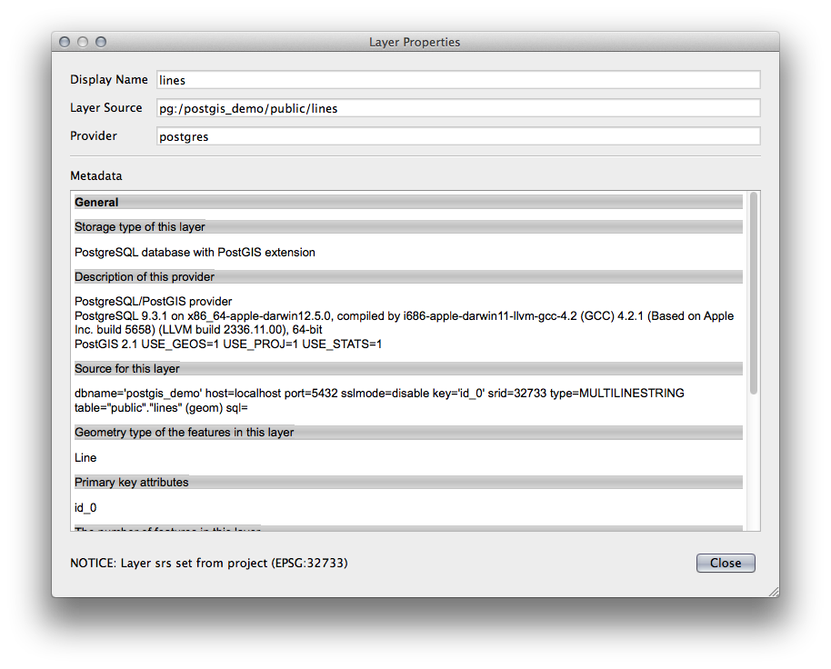
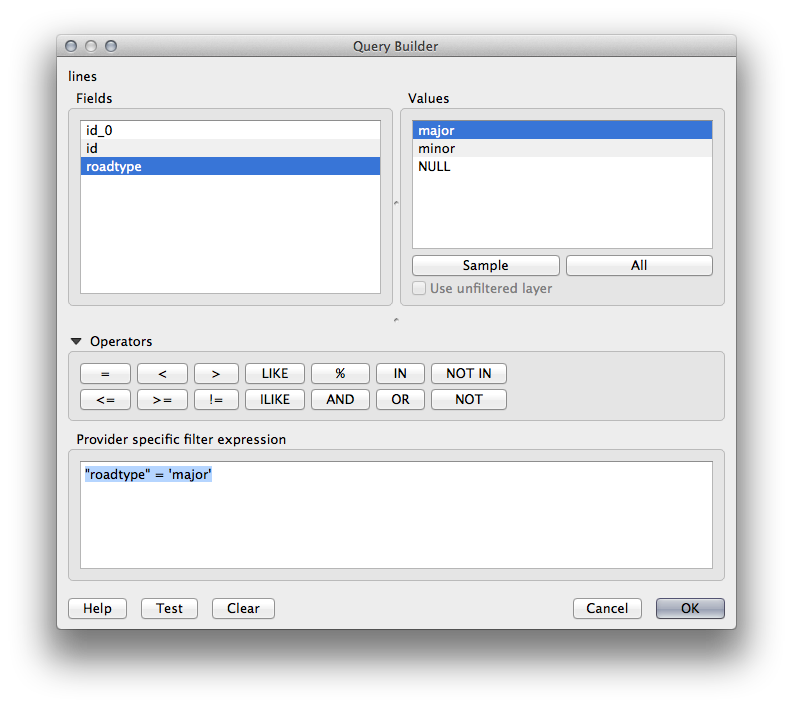

Lesson: Working with Databases in the QGIS Browser
===============================================================================

In the previous 2 modules we looked at the basic concepts, features and 
functions of relational databases as well as extensions that let us store, 
manage, query and manipulate spatial data in a relational database. This
section will dive deeper into how to effectively use spatial databases in QGIS. 

**The goal for this lesson:** To learn how to interact with spatial databases 
using the QGIS Browser interface. 

:abbr:`★☆☆ (Basic level)` Follow Along: Adding Database Tables to QGIS using the Browser
-----------------------------------------------------------------------------------------

We have already briefly looked at how to add tables from a database as QGIS 
layers, now lets look at this in a bit more detail and look at the different 
ways this can be done in QGIS. Lets start by looking at the new Browser
interface.

* Start a new empty map in QGIS.
* Open the Browser by clicking the :guilabel:`Browser` tab at the bottom of the
  *Layer Panel*
* Open the PostGIS portion of the tree and you should find your previously
  configured connection available (you may need to click the Refresh button at
  the top of the browser window).

* Double clicking on any of the table/layers listed here will add it to the Map
  Canvas.

* Right Clicking on a table/layer in this view will give you a few options.
  Click on the :guilabel:`Properties` item to look at the properties of the 
  layer.

.. note:: Of course you can also use this interface to connect to PostGIS 
   databases hosted on a server external to your workstation. Right clicking
   on the PostGIS entry in the tree will allow you to specify connection
   parameters for a new connection.

:abbr:`★☆☆ (Basic level)` Follow Along: Adding a filtered set of records as a Layer
------------------------------------------------------------------------------------

Now that we have seen how to add an entire table as a QGIS layer it might be
nice to learn how to add a filtered set of records from a table as a layer 
by using queries that we learned about in previous sections.

* Start a new empty map with no layers
* Click the :guilabel:`Add PostGIS Layers` button or select :menuselection:`Layer
  --> Add PostGIS Layers` from the menu.
* In the :guilabel:`Add PostGIS Table(s)` dialog that comes up, connect to the
  :kbd:`postgis_demo` connection.
* Expand the :kbd:`public schema` and you should find the three tables we were
  working with previously.
* Click the :kbd:`lines` layer to select it, but instead of adding it, click
  the :guilabel:`Set Filter` button to bring up the :guilabel:`Query Builder`
  dialog. 
* Construct the following expression using the buttons or by entering it
  directly::

  "roadtype" = 'major'

* Click :guilabel:`OK` to complete editing the filter and click :guilabel:`Add`
  to add the filtered layer to your map.
* Rename the :kbd:`lines` layer in the tree to :kbd:`roads_primary`.

You will notice that only the Primary Roads have been added to your map rather
than the entire layer.

In Conclusion
-------------------------------------------------------------------------------

You have seen how to interact with spatial databases using the QGIS Browser and 
how to add layers to your map based on a query filter.

What's Next?
-------------------------------------------------------------------------------

Next you'll see how to work with the DB Manager interface in QGIS for a more
complete set of database management tasks.
