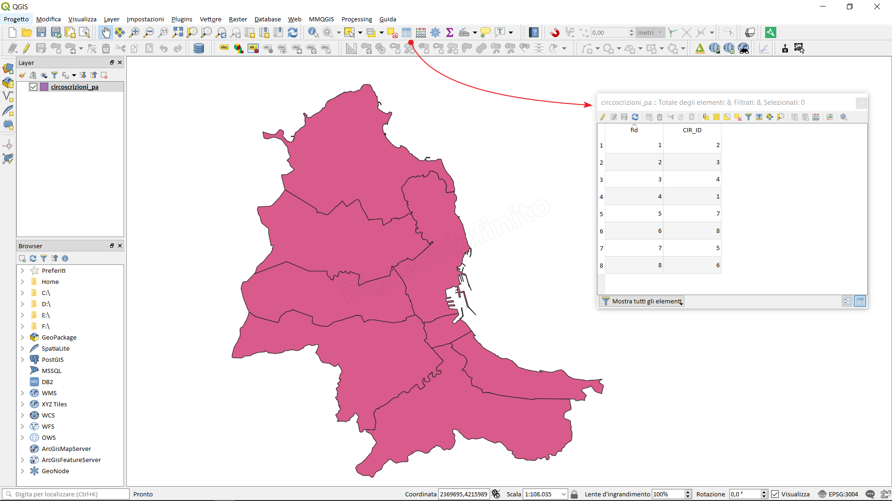
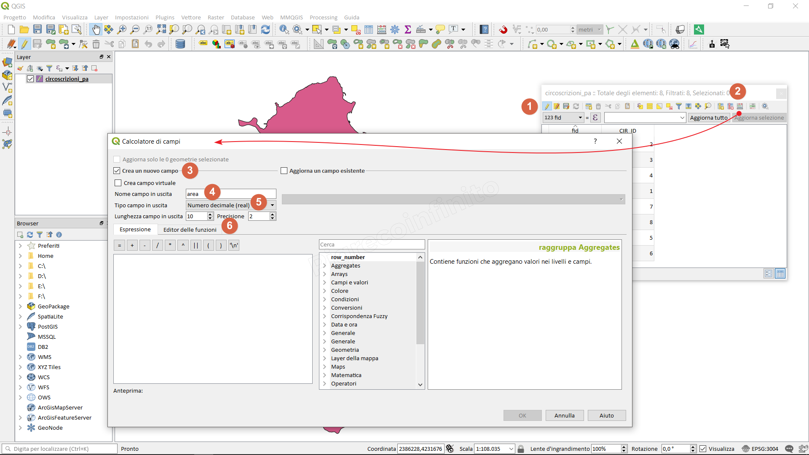
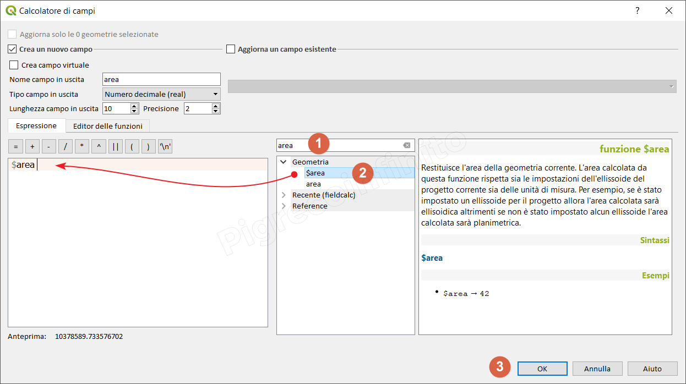
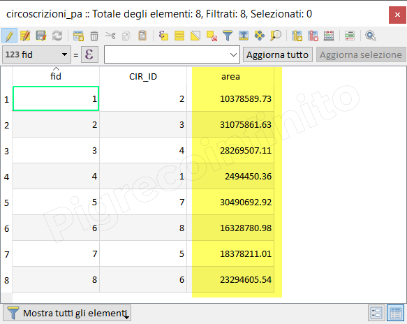

How to add column with area [m²]
================================

Module contributed by Carlos López Quintanilla and Salvatore Fiandaca

.. note:: This chapter shows how to add column with area [m²].

Let's take an example, geopackage with polygon vector:

.. |mActionOpenTable| image:: img/_common/mActionOpenTable.png  

Select the layer (present in the Layer Panel), right mouse button 'Open attributes table' or click on the |mActionOpenTable| or function key F6

.. |mActionCalculateField| image:: img/_common/mActionCalculateField.png  

#. Activate editing;
#. Open Field calculator |mActionCalculateField|
#. Create new field;
#. Type **area** field name;
#. Real output field type;
#. Outlet length 10 and 2;

#. In the search box we type the name of the function: **area**
#. Double click on the **$area** function to add it;
#. OK to execute;

The area column will be added and populated with the **$area** function.
