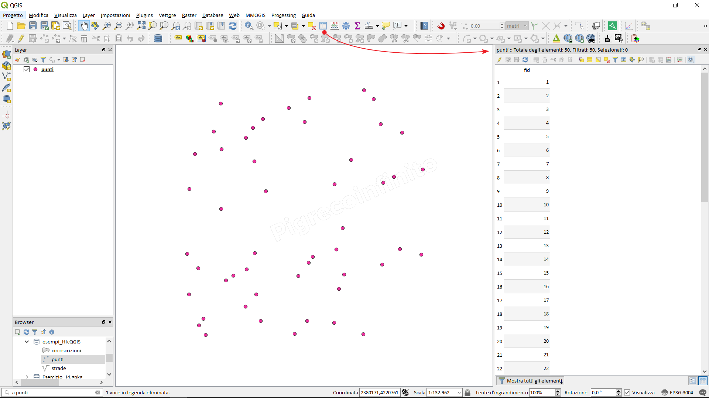
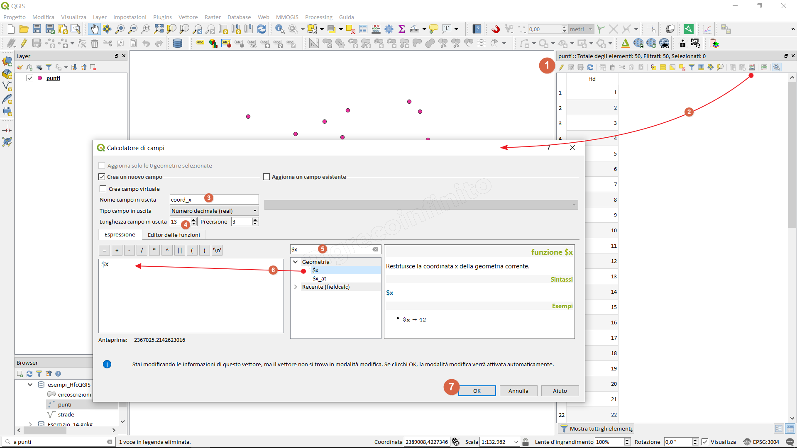

How to add x and y coordinates to the attribute table
=====================================================

Module contributed by Carlos López Quintanilla and Salvatore Fiandaca

.. note:: This chapter shows how to add x and y coordinates to the attribute table.

Let's take an example, geopackage with a point vector:

.. |mActionOpenTable| image:: img/qfield_area/mActionOpenTable.png  

select the layer (present in the Layer Panel), right mouse button 'Open attributes table' or click on the |mActionOpenTable| or function key F6

.. |mActionCalculateField| image:: img/qfield_area/mActionCalculateField.png  

1. Activate editing;
2. Open Field calculator |mActionCalculateField|
3. Create new field and type **cord_x**;
4. Real output field type and length 13 and 2;
5. Search the function: **$x**
6. Double click on the **$x** function to add it;
7. OK to execute and then the coord_x column will be added and populated;
repeat the same steps for coord_y and use the **$y** function:

.. figure:: img/coordinate_field/add_coord3.png

Here are highlighted the two columns with the coordinates:

.. figure:: img/coordinate_field/add_coord4.png
