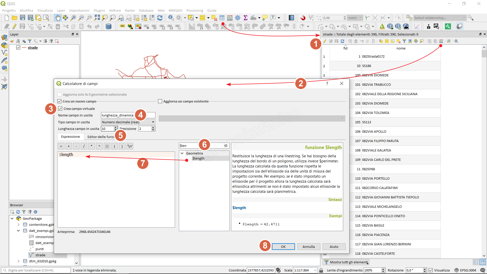
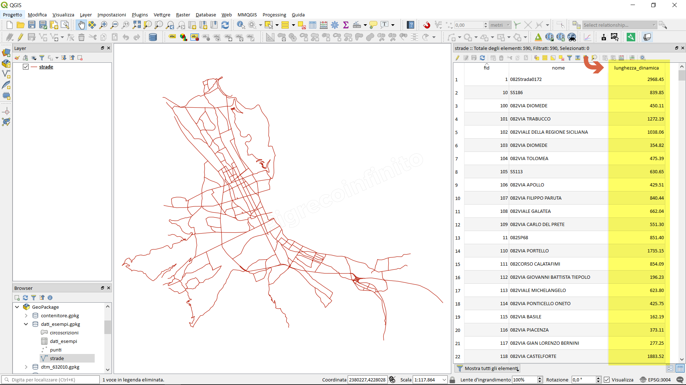

How to add the z dimension to the attribute table
=================================================

Module contributed by Carlos López Quintanilla and Salvatore Fiandaca

.. note:: This chapter shows how to add the z dimension to the attribute table.

Let's take an example, geopackage with a MultiLineStringZ vector:

.. |mActionOpenTable| image:: img/_common/mActionOpenTable.png  

Select the layer (present in the Layer Panel), right mouse button 'Open attributes table' or click on the |mActionOpenTable| or function key F6

.. |mActionCalculateField| image:: img/_common/mActionCalculateField.png  

1. Activate editing;
2. Open Field calculator |mActionCalculateField|
3. Create Virtual field and type **lengh_dinamic**;
4. Real output field type and length 10 and 2;
5. Search the function: **$length**
6. Double click on the **$length** function to add it;
7. OK to execute;

The **lengh_dinamic** column populated with the **$length** function will be added

.. note:: A virtual field is a field that dynamically updates and does not modify the attribute table as it is stored in the project and not in the layer.
