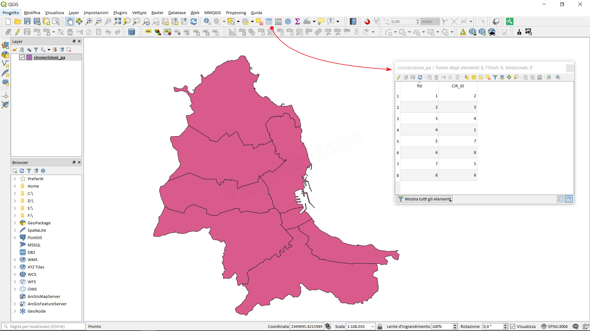

How to add column with area [m²]
================================

Module contributed by Carlos López Quintanilla and Salvatore Fiandaca

.. note:: This chapter shows how to add column with area [m²].

Let's take an example, geopackage with polygon vector:

select the layer (present in the Layer Panel), right mouse button 'Open attributes table' or click on the 
.. |biohazard| image:: img/qfield_area/mActionOpenTable.png  
or function key F6

- :menuselection:`GRASS --> v.generalize` [Maximal tolerance value: 30 m]

We can also do the reverse, and make a layer more complex, smoothing out sharp corners:

- :menuselection:`GRASS --> v.generalize` [method: chaiken]

Try to apply this second command both to original vector and to the one from the
first analysis, and see the difference. Note that adjacency is not lost.

This second option can be applied e.g. to contour lines resulting from a coarse
raster, to GPS tracks with sparse vertices, etc.
