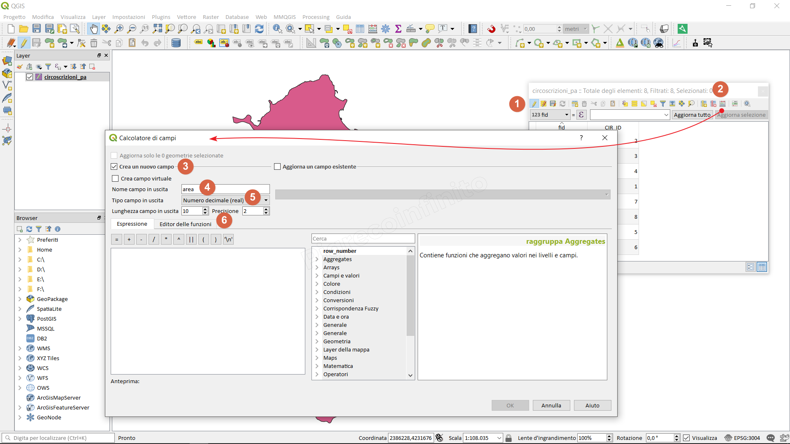
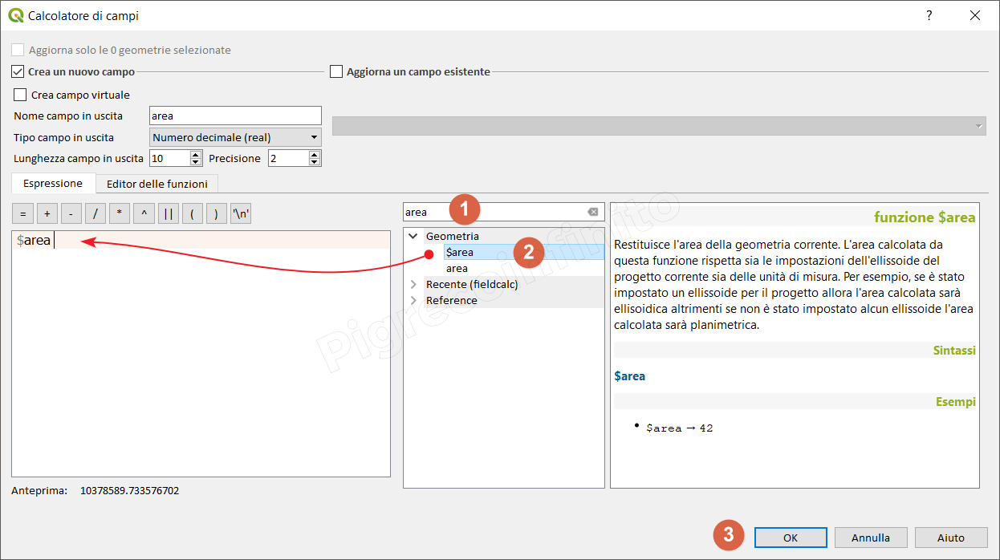
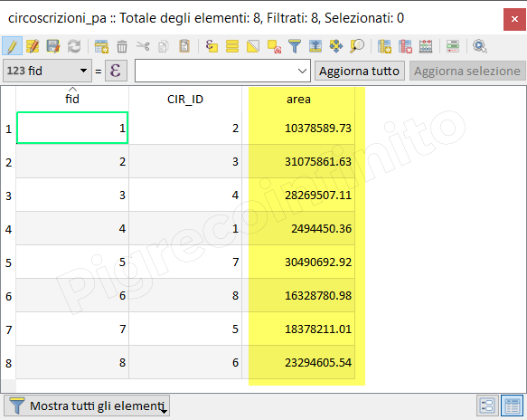

How to add column with area [m²]
================================

Module contributed by Carlos López Quintanilla and Salvatore Fiandaca

.. note:: This chapter shows how to add column with area [m²].

Let's take an example, geopackage with polygon vector:

.. figure:: img/qfield_area/add_col_a1.png

.. |mActionOpenTable| image:: img/qfield_area/mActionOpenTable.png  

select the layer (present in the Layer Panel), right mouse button 'Open attributes table' or click on the |mActionOpenTable| or function key F6

.. |mActionCalculateField| image:: img/qfield_area/mActionCalculateField.png  

1. Activate editing;
2. Open Field calculator |mActionCalculateField|
3. Create new field;
4. Type **area** field name;
5. Real output field type;
6. Outlet length 10 and 2;

1. In the search box we type the name of the function: **area**
2. Double click on the **$area** function to add it;
3. OK to execute;

The area column will be added and populated with the **$area** function.
