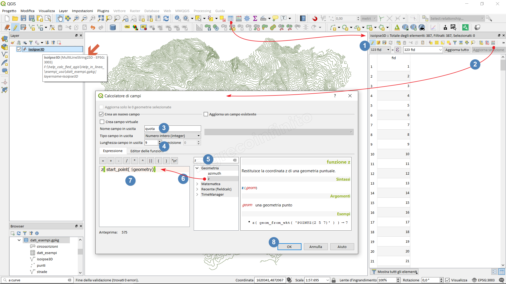
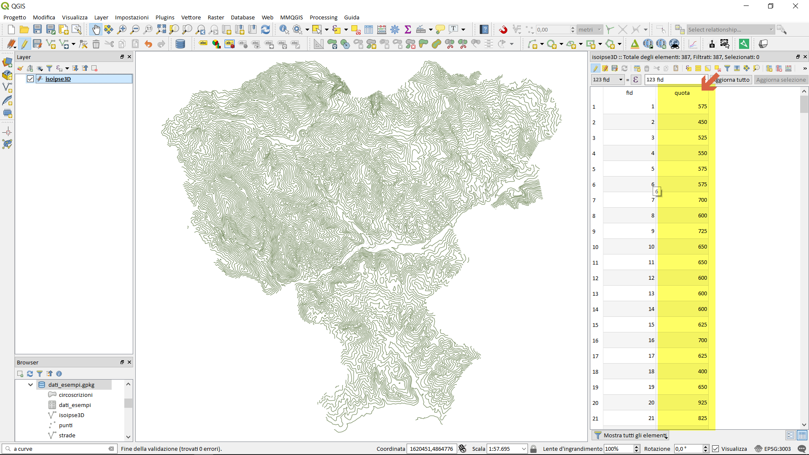

How to add the z dimension to the attribute table
=================================================

Module contributed by Carlos López Quintanilla and Salvatore Fiandaca

.. note:: This chapter shows how to add the z dimension to the attribute table.

Let's take an example, geopackage with a MultiLineStringZ vector:

.. |mActionOpenTable| image:: img/_common/mActionOpenTable.png  

Select the layer (present in the Layer Panel), right mouse button 'Open attributes table' or click on the |mActionOpenTable| or function key F6

.. |mActionCalculateField| image:: img/_common/mActionCalculateField.png  

#. Activate editing;
#. Open Field calculator |mActionCalculateField|
#. Create Virtual field and type **height**;
#. Real output field type and length 10 and 2;
#. Search the function: **z**
#. Double click on the **z** function to add it;
#. Add the function **start_point** and then **$geometry** as arguments to **z** 
#. **z(start_point($geometry))**;
#. OK to execute;

The **height** column populated will be added

.. note:: 
#. In case of PointZ → **z($geometry)**
#. In case of (Multi) LinestringZ → **z(start_point($geometry))** for contour line;
#. In case of PoligonZ **z(point_n($geometry, 1))**
