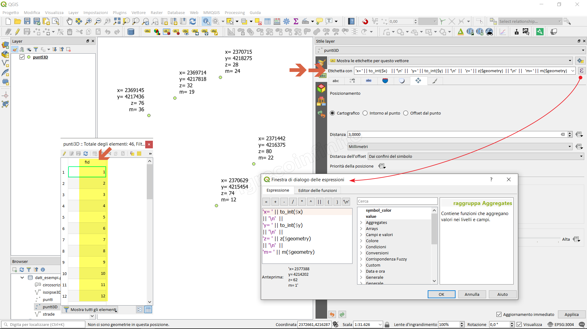
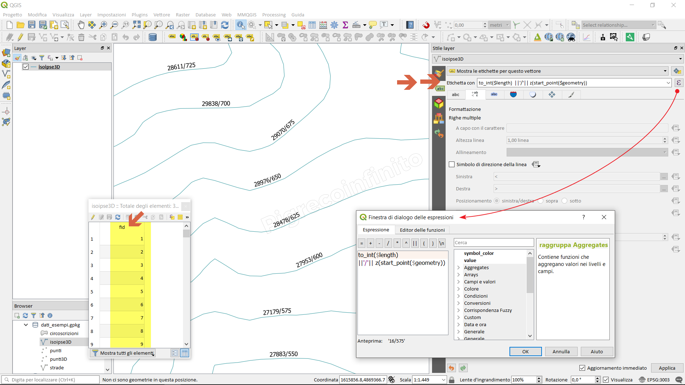
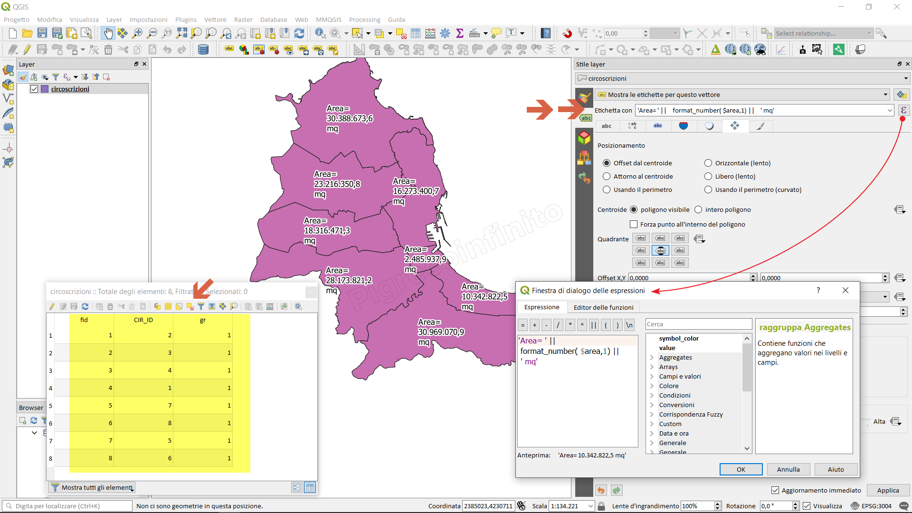

How to label using geometry
===========================

Module contributed by Carlos López Quintanilla and Salvatore Fiandaca

.. note:: This chapter shows how to label using geometry.

The geometry attribute is the only field not visible in the attribute table, but there is !!!
The geometry is expressed in a way that is not understandable by man and therefore it is avoided to show it, this attribute brings with it other implicit attributes to the geometry itself such as:

* in the case of geometry (Multi)Point(ZM): the x, y, z, m coordinates;
* in the case of geometry (Multi)LineString(ZM): length of the line and coordinates of the nodes/vertices;
* in the case of geometry (Multi)Polygon(ZM): area, perimeter and coordinates of the vertex;

The characteristics can always be recalled (if present, that is, if it has a Z or m) and therefore they do not need to be explicitly stated, indeed if explicit they create a redontacted dataset.

One way to recall them is through labeling:

* case (Multi)Point(ZM):

Expression to be written in the field calculator

::

   'x= ' || to_int($x)   || '\n'  || 
   'y= ' || to_int($y)   || '\n'  || 
   'z= ' || z($geometry) || '\n'  || 
   'm= ' || m($geometry)

* case (Multi)LineString(ZM):

Expression to be written in the field calculator

::

   to_int($length)  ||'/'||  z(start_point($geometry))

* case (Multi)Polygon(ZM):

Expression to be written in the field calculator

::

   'Area= ' || format_number($area,1) || ' mq'

.. note:: Functions used:

#. `to_int
   <https://docs.qgis.org/3.22/en/docs/user_manual/expressions/functions_list.html?highlight=format%20number#to-int>`_

