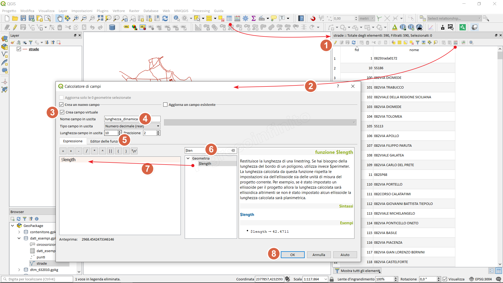
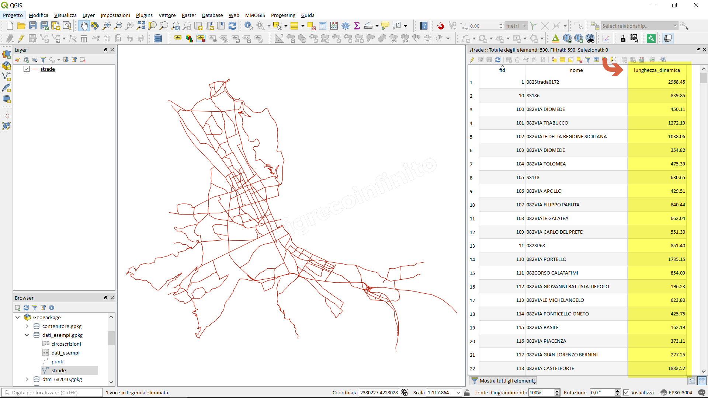

How to add a virtual field
==========================

Module contributed by Carlos López Quintanilla and Salvatore Fiandaca

.. note:: This chapter shows how to add a virtual field.

Let's take an example, geopackage with a line vector:

.. figure:: img/virtual_field/add_campo_virt3.png

.. |mActionOpenTable| image:: img/_common/mActionOpenTable.png  

Select the layer (present in the Layer Panel), right mouse button 'Open attributes table' or click on the |mActionOpenTable| or function key F6

.. |mActionCalculateField| image:: img/_common/mActionCalculateField.png  

#. Activate editing;
#. Open Field calculator |mActionCalculateField|
#. Create Virtual field and type **lengh_dinamic**;
#. Real output sfield type and length 10 and 2;
#. Search the function: **$length**
#. Double click on the **$length** function to add it;
#. OK to execute;

The **lengh_dinamic** column populated with the **$length** function will be added

.. note:: A virtual field is a field that dynamically updates and does not modify the attribute table as it is stored in the project and not in the layer.
