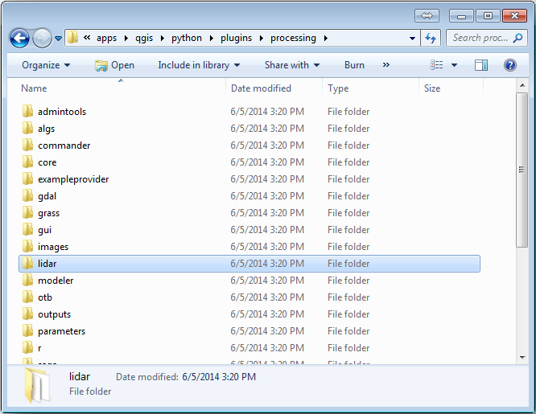
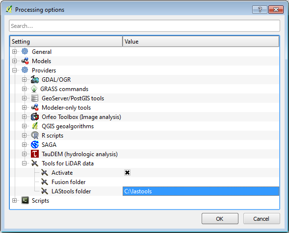
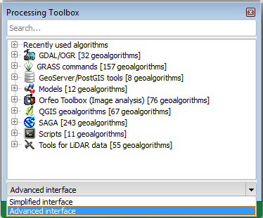
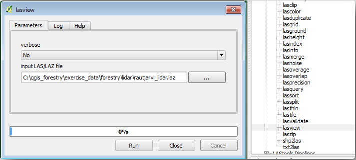
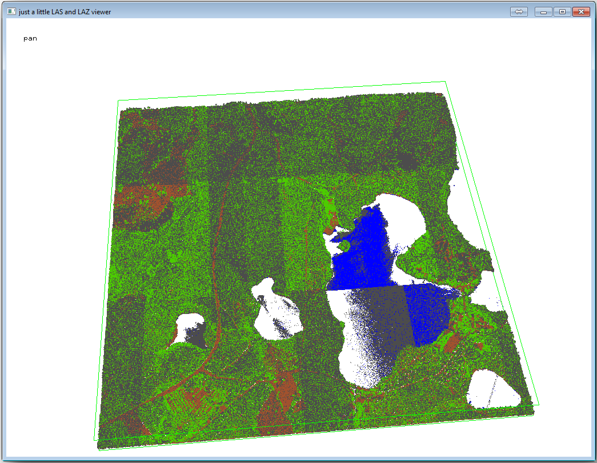
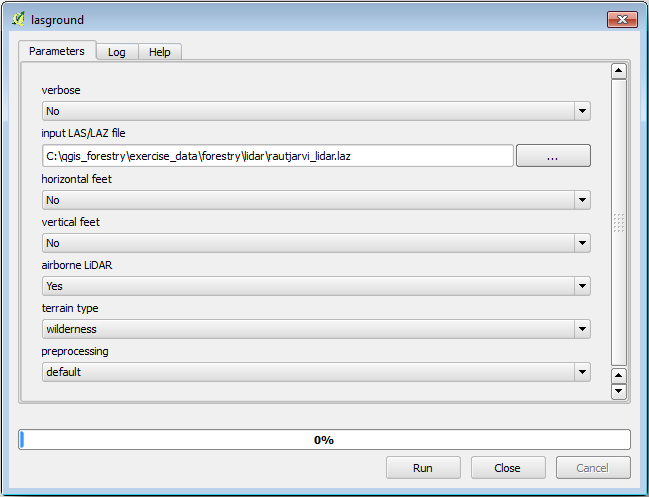
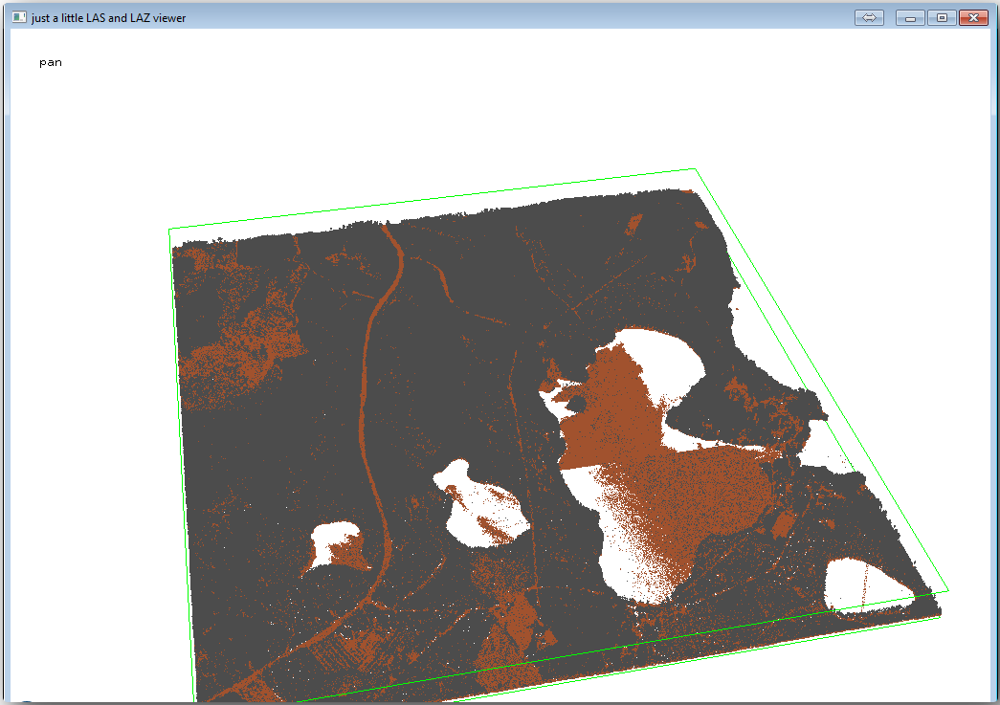
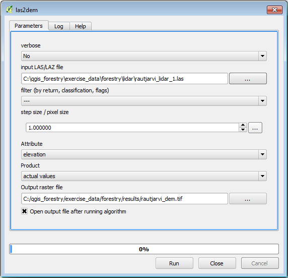
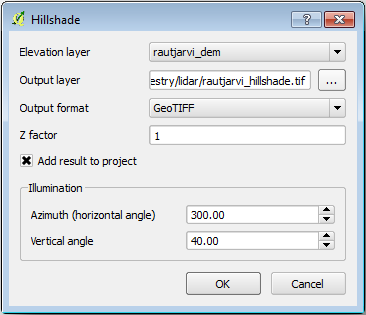
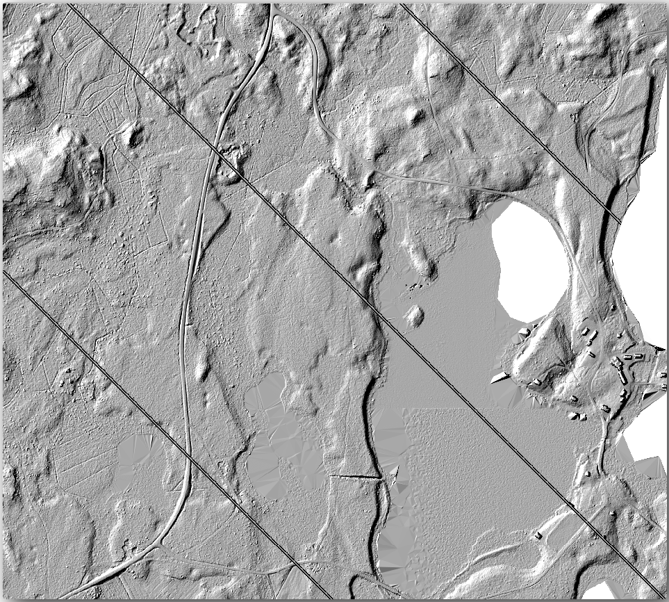

Lesson: DEM from LiDAR Data
===============================================================================

You can improve the look of your maps by using different background images.
You could use the basic map or the aerial image you have been using before,
but a hillshade raster of the terrain will look nicer in some situations.

You will use LAStools to extract a DEM from a LiDAR dataset and then create a
hillshade raster to use in your map presentation later.

**The goal for this lesson:** Install LAStools and calculate a DEM from LiDAR
data and a hillshade raster.

:abbr:`★☆☆ (Basic level)` Follow Along: Installing Lastools
-------------------------------------------------------------------------------

Managing LiDAR data within QGIS is possible using the Processing framework and
the algorithms provided by `LAStools <https://rapidlasso.com/2013/09/29/how-to-install-lastools-toolbox-in-qgis>`_.

You can obtain a digital elevation model (DEM) from a LiDAR point cloud and then
create a hillshade raster that is visually more intuitive for presentation purposes.
First you will have to set up the :guilabel:`Processing` framework settings to
properly work with LAStools:

* Close QGIS, if you have already started it.
* An old lidar plugin might be installed by default in your system in the folder
  :file:`C:/Program Files/QGIS Valmiera/apps/qgis/python/plugins/processing/`.
* If you have a folder named :kbd:`lidar`, delete it. This is valid for some
  installations of QGIS 2.2 and 2.4.

* Go to the :file:`exercise_data\\forestry\\lidar\\` folder, there you can find
  the file :file:`QGIS_2_2_toolbox.zip`. Open it and extract the :kbd:`lidar`
  folder to replace the one you just deleted.
* If you are using a different QGIS version, you can see more installation
  instructions in `this tutorial <https://rapidlasso.com/2013/09/29/how-to-install-lastools-toolbox-in-qgis/>`_.

Now you need to install the LAStools to your computer. Get the newest
*lastools* version `here <https://lastools.github.io/download/LAStools.zip>`_
and extract the content of the :file:`lastools.zip` file into a folder in your
system, for example, :file:`C:\\lastools\\`. The path to the :file:`lastools`
folder cannot have spaces or special characters.

.. note:: Read the :kbd:`LICENSE.txt` file inside the :kbd:`lastools` folder.
  Some of the LAStools are open source and other are closed source and require
  licensing for most commercial and governmental use.  For education and
  evaluation purposes you can use and test LAStools as much as you need to.

The plugin and the actual algorithms are now installed in your computer and
almost ready to use, you just need to set up the Processing framework to start using them:

* Open a new project in QGIS.
* Set the project's CRS to :kbd:`ETRS89 / ETRS-TM35FIN`.
* Save the project as :kbd:`forest_lidar.qgs`.

To setup the LAStools in QGIS:

* Go to :menuselection:`Processing --> Options and configuration`.
* In the :guilabel:`Processing options` dialog, go to :guilabel:`Providers` and
  then to :guilabel:`Tools for LiDAR data`.
* Check :guilabel:`Activate`.
* For :guilabel:`LAStools folder` set :kbd:`c:\\lastools\\` (or the folder you
  extracted LAStools to).

:abbr:`★☆☆ (Basic level)` Follow Along: Calculating a DEM with LAStools
-------------------------------------------------------------------------------

You have already used the :menuselection:`Processing` toolbox in :doc:`../vector_analysis/spatial_statistics`
to run some SAGA algorithms. Now you are going to use it to run LAStools programs:

* Open :menuselection:`Processing --> Toolbox`.
* In the dropdown menu at the bottom, select :guilabel:`Advanced interface`.
* You should see the :guilabel:`Tools for LiDAR data` category.

* Expand it to see the tools available, and expand also the :guilabel:`LAStools`
  category (the number of algorithms may vary).
* Scroll down until you find the :guilabel:`lasview` algorithm, double click it to open.
* At :guilabel:`Input LAS/LAZ file`, browse to :file:`exercise_data\\forestry\\lidar\\`
  and select the :file:`rautjarvi_lidar.laz` file.

* Click :guilabel:`Run`.

Now you can see the LiDAR data in the :guilabel:`just a little LAS and LAZ viewer` dialog window:

There are many things you can do within this viewer, but for now you can just
click and drag on the viewer to pan the LiDAR point cloud to see what it looks like.

.. note:: If you want to know further details on how the LAStools work, you can
  read the :file:`README` text files about each of the tools, in the :file:`C:\\lastools\\bin\\`
  folder. Tutorials and other materials are available at the `Rapidlasso webpage <https://rapidlasso.com/>`_.

* Close the viewer when you are ready.

Creating a DEM with LAStools can be done in two steps, first one to classify the
point cloud into :kbd:`ground` and :kbd:`no ground` points and then calculating
a DEM using only the :kbd:`ground` points.

* Go back to the :guilabel:`Processing Toolbox`.
* Note the :guilabel:`Search...` box, write :kbd:`lasground`.
* Double click to open the :guilabel:`lasground` tool and set it as shown in this image:

* The output file is saved to the same folder where the :file:`rautjarvi_lidar.laz`
  is located and it is named :file:`rautjarvi_lidar_1.las`.

You can open it with :guilabel:`lasview` if you want to check it.

The brown points are the points classified as ground and the gray ones are the rest,
you can click the letter :kbd:`g` to visualize only the ground points or the
letter :kbd:`u` to see only the unclassified points. Click the letter :kbd:`a`
to see all the points again. Check the :file:`lasview_README.txt` file for more
commands. If you are interested, also this `tutorial
<https://rapidlasso.com/2014/03/02/tutorial-manual-lidar-editing/>`_
about editing LiDAR points manually will show you different operations within
the viewer.

* Close the viewer again.
* In the :guilabel:`Processing Toolbox`, search for :kbd:`las2dem`.
* Open the :guilabel:`las2dem` tool and set it as shown in this image:

The result DEM is added to your map with the generic name :kbd:`Output raster file`.

.. note:: The :guilabel:`lasground` and :guilabel:`las2dem` tools require licensing.
  You can use the unlicensed tool as indicated in the license file, but you get
  the diagonals you can appreciate in the image results.

:abbr:`★☆☆ (Basic level)` Follow Along: Creating a Terrain Hillshade
-------------------------------------------------------------------------------

For visualization purposes, a hillshade generated from a DEM gives a better
 visualization of the terrain:

* Open :menuselection:`Raster --> Terrain analysis --> Hillshade`.
* As the :guilabel:`Output layer`, browse to :file:`exercise_data\\forestry\\lidar\\`
  and name the file :file:`hillshade.tif`.
* Leave the rest of parameters with the default settings.

* Select :kbd:`ETRS89 / ETRS-TM35FIN` as the CRS when prompted.

Despite the diagonal lines remaining in the hillshade raster result, you can
clearly see an accurate relief of the area. You can even see the different
soil drains that have been dug in the forests.

In Conclusion
-------------------------------------------------------------------------------

Using LiDAR data to get a DEM, specially in forested areas, gives good results
with not much effort. You could also use ready LiDAR derived DEMs or other
sources like the `SRTM 9m resolution DEMs <https://srtm.csi.cgiar.org/srtmdata/>`_.
Either way, you can use them to create a hillshade raster to use in your map
presentations.

What's Next?
-------------------------------------------------------------------------------

In the next, and final step in this module, lesson you will use the hillshade
raster and the forest inventory results to create a map presentation of the results.
