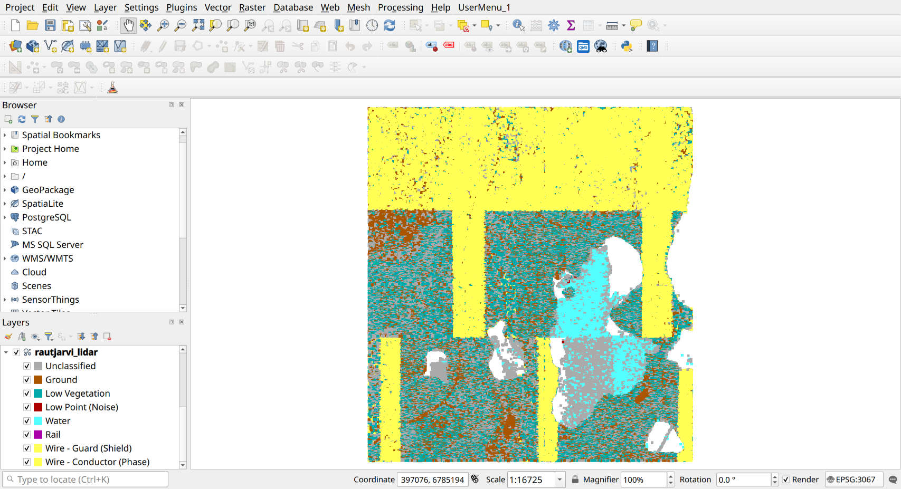
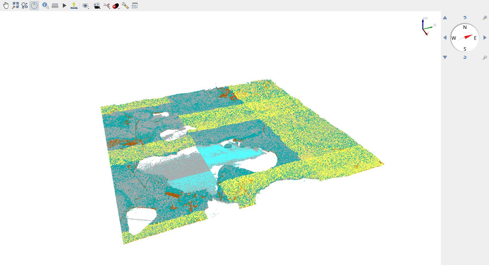
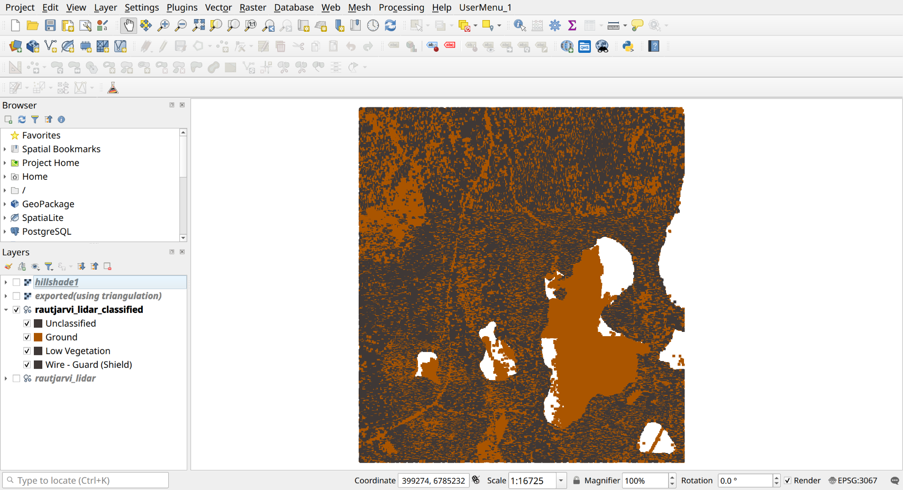
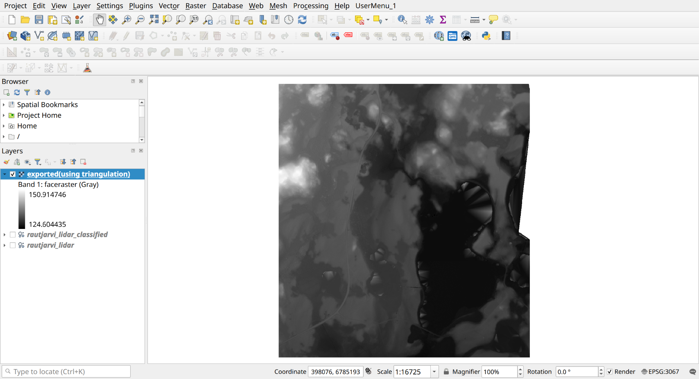

Lesson: DEM from LiDAR Data
===============================================================================

You can improve the look of your maps by using different background images.
You could use the basic map or the aerial image you have been using before,
but a hillshade raster of the terrain will look nicer in some situations.

You will use QGIS's native point cloud tools to extract a DEM from a LiDAR
dataset and then create a hillshade raster to use in your map presentation
later.

**The goal for this lesson:** Calculate a DEM from LiDAR data and create a
hillshade raster, using the point cloud tools built into QGIS.

.. note:: The :guilabel:`Classify ground points` algorithm used in this
  lesson requires QGIS 4.0 or later. All point cloud algorithms used here
  require QGIS installed with PDAL >= 2.5.0 (check under
  :menuselection:`Help --> About`).

:abbr:`★☆☆ (Basic level)` Follow Along: Viewing the Point Cloud
-------------------------------------------------------------------------------

QGIS has native support for point cloud data (LAS, LAZ, COPC, and more), so
no plugin or external tool needs to be installed.

#. Open a new project in QGIS.
#. Set the project's CRS to :guilabel:`EPSG:3067 - EUREF-FIN / TM35FIN`.
#. Save the project as :file:`forest_lidar.qgs`.
#. Open the :guilabel:`Data Source Manager` and go to the
   :guilabel:`Point Cloud` tab.
#. Browse to :file:`exercise_data\\forestry\\lidar\\`, select the
   :file:`rautjarvi_lidar.laz` file, and click :guilabel:`Add`.
#. Right-click the layer in the :guilabel:`Layers` panel, go to
   :guilabel:`Layer CRS`, then click :guilabel:`Set Layer CRS...` and choose
   :guilabel:`EPSG:3067 - EUREF-FIN / TM35FIN`, if the layer was added without a CRS
   assigned.

The point cloud is added to the map canvas, styled by default.

.. _figure_point_cloud_layer:

   Point cloud layer added to the map canvas

You can pan and zoom the point cloud like any other layer. For a more
immersive view, you can also open it in the 3D Map View
(:menuselection:`View --> 3D Map Views --> New 3D Map View`).

.. _figure_point_cloud_3d_view:

   Point cloud layer added to the 3D Map View

Close the 3D Map View when you are ready.

:abbr:`★☆☆ (Basic level)` Follow Along: Calculating a DEM
-------------------------------------------------------------------------------

Creating a DEM takes two steps: classify the point cloud to identify ground
points, then generate a raster DEM from those ground points only.

#. Open :guilabel:`Processing Toolbox`.
#. Search for and open :guilabel:`Classify ground points`
   (see :ref:`pdalclassifyground`).
#. :guilabel:`Input layer`: ``rautjarvi_lidar``.
#. Leave the remaining parameters at their defaults.
#. Save as :file:`rautjarvi_lidar_classified.las` in :file:`exercise_data\\forestry\\lidar\\`.
#. Click :guilabel:`Run`.

Add the resulting :file:`rautjarvi_lidar_classified.las` to your project
you can style it by :guilabel:`Classification` to check the result.

.. _figure_classified_point_cloud:

   Classified point cloud, symbolized by classification

#. In the :guilabel:`Processing Toolbox`, search for and open
   :guilabel:`Export point cloud to raster (using triangulation)`
   (see :ref:`pdalexportrastertin`).
#. :guilabel:`Input layer`: ``rautjarvi_lidar_classified``.
#. Click :guilabel:`Advanced parameters` at the bottom of the dialog, then set
   :guilabel:`Filter expression` to ``Classification = 2`` to use only the
   ground points.
#. Leave resolution at its default, or adjust as needed.
#. Save the output raster as :file:`exported(using triangulation)` in :file:`exercise_data\\forestry\\lidar\\`.
#. Click :guilabel:`Run`.

The result DEM is added to your map.

.. _figure_dem_export_triangulation:

   DEM generated from classified ground points

:abbr:`★☆☆ (Basic level)` Follow Along: Creating a Terrain Hillshade
-------------------------------------------------------------------------------

For visualization purposes, a hillshade generated from a DEM gives a better
visualization of the terrain:

#. Open :menuselection:`Raster --> Analysis --> Hillshade...`.
#. As the :guilabel:`Input layer`, select the DEM you just created.
#. As the :guilabel:`Output layer`, browse to :file:`exercise_data\\forestry\\lidar\\`
   and name the file :file:`hillshade.tif`.
#. Leave the rest of parameters with the default settings.

   .. figure:: img/hillshade_from_pc.png
      :align: center

      Hillshade raster generated from the DEM

#. Select :guilabel:`EPSG:3067 - EUREF-FIN / TM35FIN` as the CRS when prompted.

You can now clearly see an accurate relief of the area, including the
different soil drains that have been dug in the forests.

In Conclusion
-------------------------------------------------------------------------------

Using LiDAR data to get a DEM, specially in forested areas, gives good results
with not much effort. You could also use ready LiDAR derived DEMs or other
sources like the `SRTM 9m resolution DEMs <https://srtm.csi.cgiar.org/srtmdata/>`_.
Either way, you can use them to create a hillshade raster to use in your map
presentations.

What's Next?
-------------------------------------------------------------------------------

In the next, and final step in this module, lesson you will use the hillshade
raster and the forest inventory results to create a map presentation of the results.
