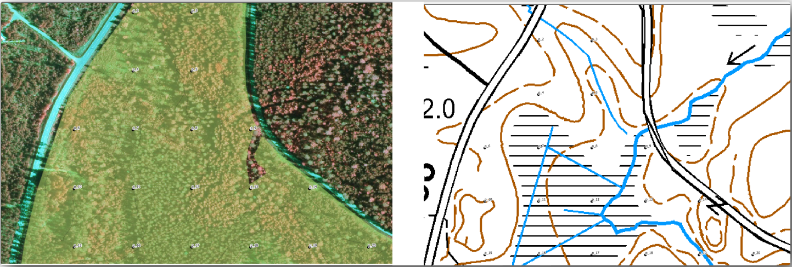
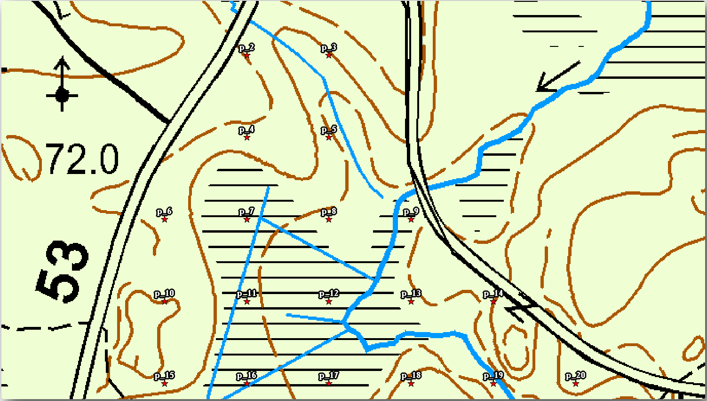
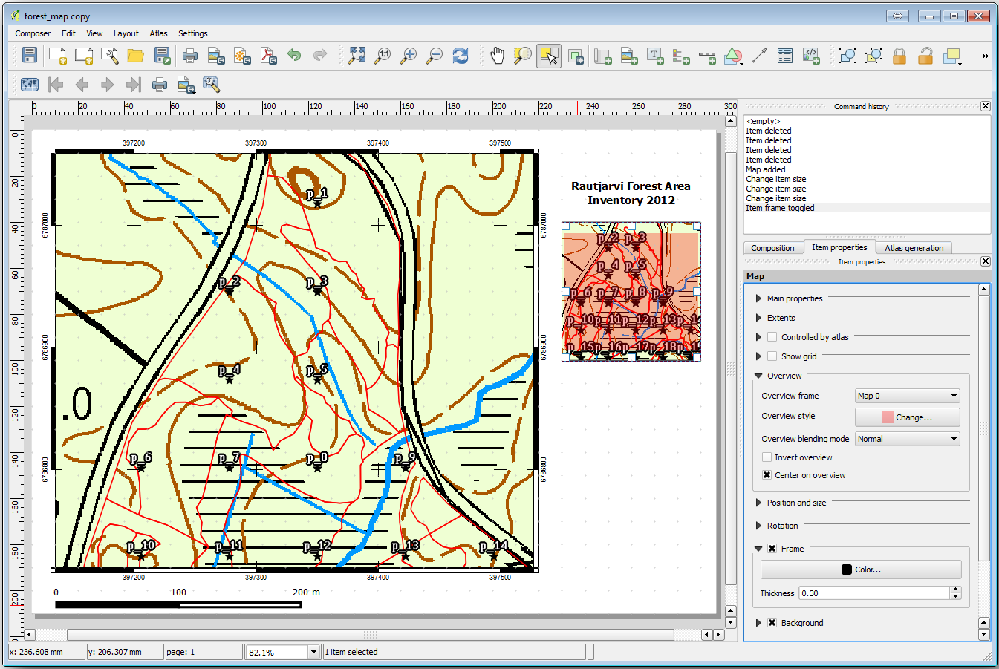
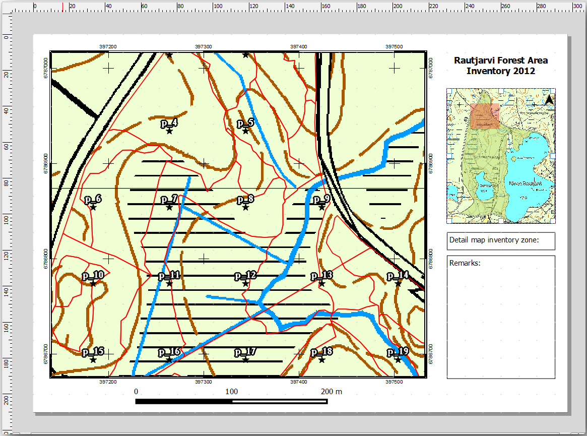
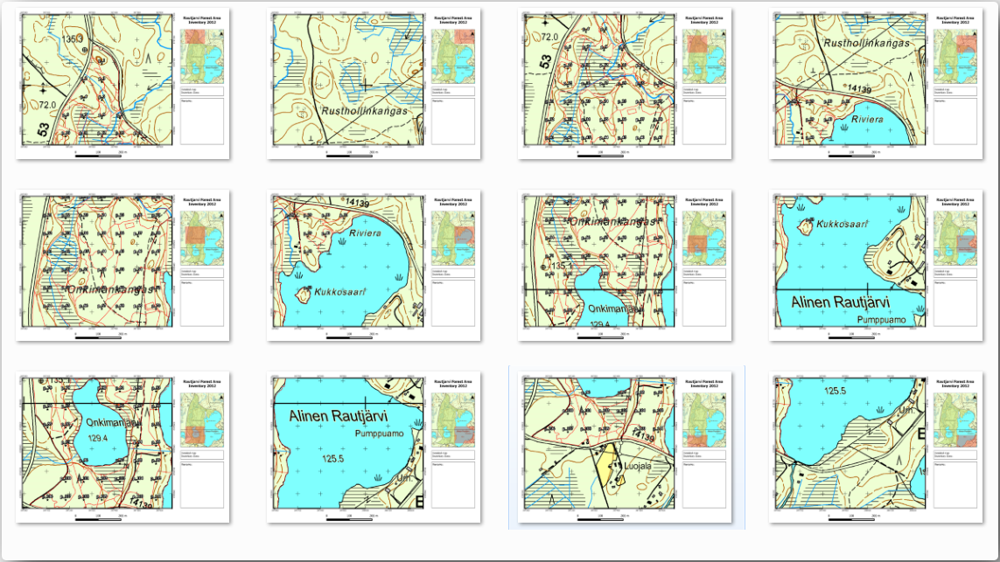
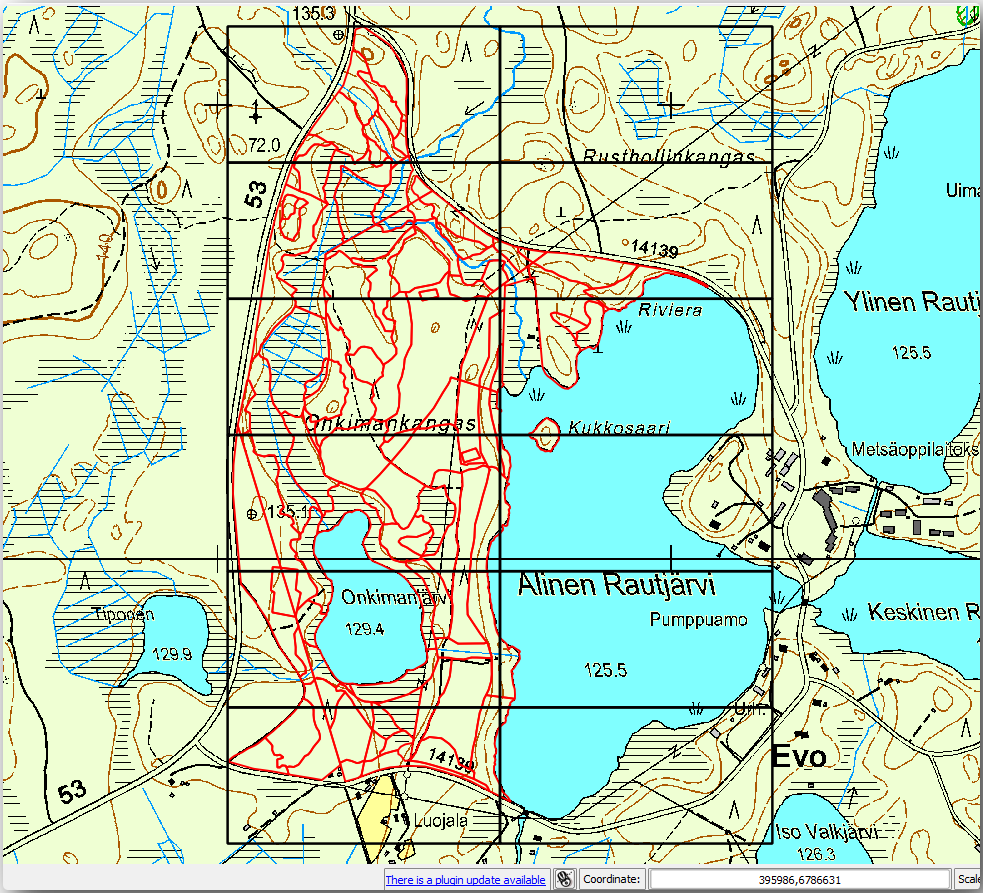
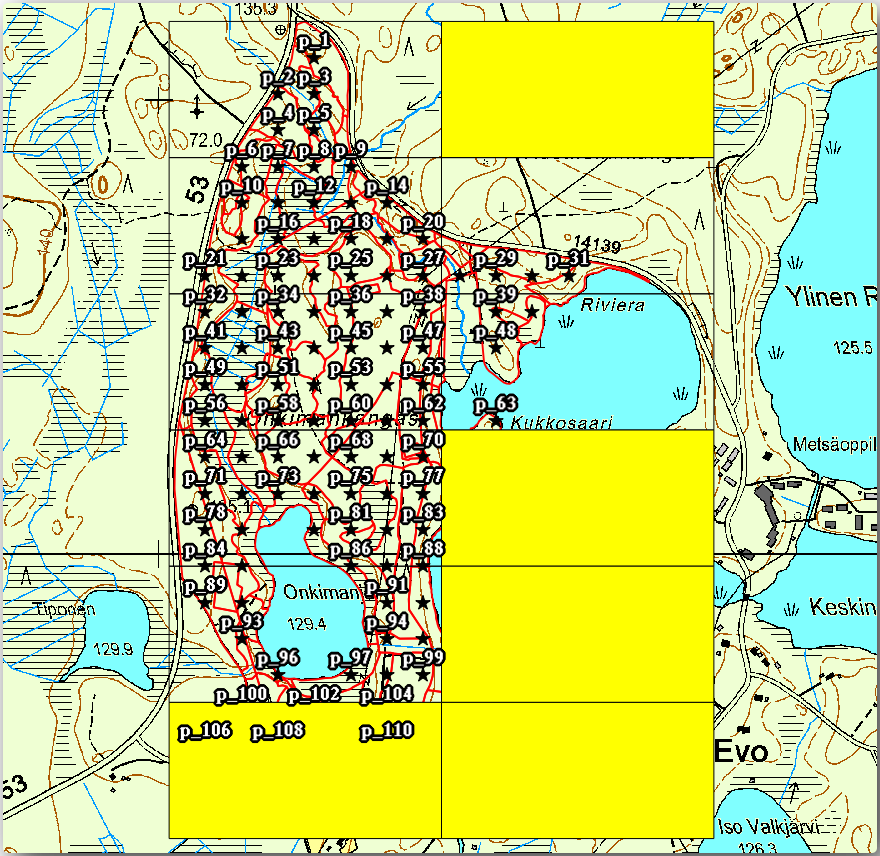

Lesson: Creating Detailed Maps with the Atlas Tool
===============================================================================

The systematic sampling design is ready and the field teams have loaded the GPS
coordinates in their navigation devices. They also have a field data form where
they will collect the information measured at every sample plot. To easier find
their way to every sample plot, they have requested a number of detail maps
where some ground information can be clearly seen along with a smaller subset
of sample plots and some information about the map area. You can use the Atlas
tool to automatically generate a number of maps with a common format.

**The goal for this lesson:** Learn to use the Atlas tool in QGIS to generate
detailed printable maps to assist in the field inventory work.

:abbr:`★☆☆ (Basic level)` Follow Along: Preparing the Print Layout
-------------------------------------------------------------------------------

Before we can automate the detailed maps of the forest area and our sampling
plots, we need to create a map template with all the elements we consider
useful for the field work. Of course the most important will be a properly
styled but, as you have seen before, you will also need to add lots of other
elements that complete the printed map.

#. Open the QGIS project from the previous lesson :file:`forest_inventory.qgs`.
   You should have at least the following layers:

   * :guilabel:`forest_stands_2012` (with a 50% transparency, green fill and darker
     green border lines)
   * :guilabel:`systematic_plots_clip`
   * :guilabel:`rautjarvi_aerial`

#. Save the project with a new name, :file:`map_creation.qgs`.

To create a printable map, remember that you use the :guilabel:`Layout Manager`:

#. Open :menuselection:`Project -->` |layoutManager| :guilabel:`Layout Manager...`.
#. In the :guilabel:`Layout manager` dialog:

   #. Under :guilabel:`New from template`, press the :guilabel:`Create...` button
      next to the :guilabel:`Empty layout` entry
   #. Name your print layout ``forest_map``.
   #. Press :guilabel:`OK`. A new print layout is created and opened, showing a blank paper.

#. In the print Layout window, ensure properties are set for an A4 paper:

   #. Right-click over the paper and select :guilabel:`Page properties`.
      The :guilabel:`Page properties` panel is open on the right side of the layout.
   #. Check :guilabel:`Size` is :guilabel:`A4`.
   #. Check :guilabel:`Orientation` is :guilabel:`Landscape`.
#. Enable the :guilabel:`Layout` tab next to the :guilabel:`Page properties` panel
   and set :guilabel:`Export resolution` to ``300 dpi``.

Composing a map is easier if you make use of the canvas grid to position the
different elements. Review the settings for the layout grid:

#. In the :guilabel:`Layout` tab expand the :guilabel:`Guides and Grid` region.
#. Check that :guilabel:`Grid spacing` is set to ``10 mm`` and that
   :guilabel:`Snap tolerance` is set to ``5 px``.

You need to activate the use of the grid:

#. Open the :menuselection:`View` menu.
#. Check :guilabel:`Show grid`.
#. Check :guilabel:`Snap to grid`.
#. Notice that options for using :guilabel:`Guides` are checked by default, which
   allows you to see guiding lines when you are moving elements in the layout.

#. Now you can start to add elements to your layout. Add first a map element so
   you can review how the map canvas looks as you will be making changes in the
   layers symbology:

   #. Click on the |addMap| :sup:`Add Map` button.
   #. Click and drag a box on the canvas so that the map occupies most of it.

   .. figure:: img/composer_1.png
      :align: center

Notice how the mouse cursor snaps to the canvas grid. Use this function when
you add other elements. If you want to have more accuracy, change the grid
:guilabel:`Spacing` setting. If for some reason you don't want to snap to the
grid at some point, you can always check or uncheck it in the
:menuselection:`View` menu.

:abbr:`★☆☆ (Basic level)` Follow Along: Adding Background Map
-------------------------------------------------------------------------------

Leave the layout open but go back to the map. Let's add some background data and
create some styling so that the map content is as clear as possible.

#. Add the background raster :file:`basic_map.tif` that you can find in the
   :file:`exercise_data\\forestry\\` folder.
#. If prompted select the :guilabel:`ETRS89 / ETRS-TM35FIN` CRS for the raster.

   As you can see the background map is already styled. This type of ready to use
   cartography raster is very common. It is created from vector data, styled in a
   standard format and stored as a raster so that you don't have to bother styling
   several vector layers and worrying about getting a good result.

#. Now zoom to your sample plots, so that you can see only about four or five
   lines of plots.

The current styling of the sample plots is not the best:

While during the last exercises, the white buffer was OK on top of the aerial
image, now that the background image is mostly white you barely can see the
labels. But how does it look in the print layout? Let's check it:

#. Go to the print layout window.
#. Use the |select| :sup:`Select/Move item` button to select the map element
   in the layout.
#. Go to the :guilabel:`Item properties` tab.
#. Click on |setToCanvasExtent| :guilabel:`Set map extent to match main canvas extent`.
#. If you need to refresh the element, click on |refresh| :guilabel:`Update map preview`.

.. Todo: A screenshot of what is displayed in print layout could be nice here!

Obviously this is not good enough; you want to make the plot numbers as clearly
visible as possible for the field teams.

:abbr:`★☆☆ (Basic level)` Try Yourself: Changing the Symbology of the Layers
-------------------------------------------------------------------------------

You have been working in :doc:`../basic_map/index` with symbology and in
:doc:`../vector_classification/index` with labeling. Go back to those modules
if you need to refresh about some of the available options and tools. Your goal
is to get the plots locations and their name to be as clearly visible as
possible but always allowing to see the background map elements. You can take
some guidance from this image:

You will use later the the green styling of the ``forest_stands_2012`` layer.
In order to keep it, and have a visualization of it that shows only the stand borders:

#. Right click on :guilabel:`forest_stands_2012` and select :guilabel:`Duplicate`
#. You get a new layer named ``forest_stands_2012 copy`` that you can use to
   define a different style, for example with no filling and red borders.

   Now you have two different visualizations of the forest stands and you can decide
   which one to display for your detail map.

   .. Todo: Instead of duplicating the layer we should consider using multiple styles
    for the same layer.

#. Go back to the print layout window often to see what the map would
   look like. For the purposes of creating detailed maps, you are looking for a
   symbology that looks good not at the scale of the whole forest area (left image
   below) but at a closer scale (right image below). Remember to use
   |refresh| :sup:`Update map preview` and |setToCanvasExtent|
   :guilabel:`Set map extent to match main canvas extent`
   whenever you change the zoom in your map or the layout.

   .. figure:: img/composer_2-3.png
      :align: center

:abbr:`★☆☆ (Basic level)` Try Yourself: Create a Basic Map Template
-------------------------------------------------------------------------------

#. Once you have a symbology you are happy with, you are ready to add some more
   information to your printed map. Add at least the following elements:

   * Title.
   * A scale bar.
   * Grid frame for your map.
   * Coordinates on the sides of the grid.

#. You have created a similar layout already in :doc:`../map_composer/index`.
   Go back to that module as you need. You can look at this example image for reference:

   .. figure:: img/map_template1.png
      :align: center

#. Export your map as an image and look at it.

   #. :menuselection:`Layout --> Export as Image...`.
   #. Use for example the :guilabel:`JPG format`.

That is what it will look like when printed.

:abbr:`★☆☆ (Basic level)` Follow Along: Adding More Elements to the Print Layout
---------------------------------------------------------------------------------

As you probably noticed in the suggested map template images, there are plenty
of room on the right side of the canvas. Lets see what else could go in there.
For the purposes of our map, a legend is not really necessary, but an overview
map and some text boxes could add value to the map.

The overview map will help the field teams place the detail map inside the
general forest area:

#. Add another map element to the canvas, right under the title text.
#. In the :guilabel:`Item properties` tab, open the :guilabel:`Overview` dropdown.
#. Set the :guilabel:`Overview frame` to :guilabel:`Map 0`. This creates a
   shadowed rectangle over the smaller map representing the extent visible in
   the bigger map.
#. Check also the :guilabel:`Frame` option with a black color and a
   :guilabel:`Thickness` of ``0.30``.

Notice that your overview map is not really giving an overview of the forest
area which is what you want. You want this map to represent the whole forest
area and you want it to show only the background map and the
:file:`forest_stands_2012` layer, and not display the sample plots. And also
you want to lock its view so it does not change anymore whenever you change
the visibility or order of the layers.

#. Go back to the map, but don't close the :guilabel:`Print Layout`.
#. Right click the :guilabel:`forest_stands_2012` layer and click on :guilabel:`Zoom
   to Layer Extent`.
#. Deactivate all layers except for :guilabel:`basic_map` and :guilabel:`forest_stands_2012`.
#. Expand the :sup:`Manage map themes` tool on the :guilabel:`Layers` panel
   and select :guilabel:`Add theme`.
#. Name it ``basic_overview``.
#. Go back to the print layout.
#. With the small map selected, click the :guilabel:`Set map extent to match
   main canvas extent` to set its extents to what you can see in the map window.
#. Lock the view for the overview map by checking :guilabel:`Follow map theme`
   and selecting ``basic_overview`` under :guilabel:`Main properties`.

Now your overview map is more what you expected and its view will not change
anymore. But, of course, now your detail map is not showing anymore the stand
borders nor the sample plots. Let's fix that:

#. Go to the map window again and select the layers you want to be visible
   (``systematic_plots_clip``, ``forest_stands_2012 copy`` and ``Basic_map``).
#. Zoom again to have only a few lines of sample plots visible.
#. Go back to the :guilabel:`Print Layout` window.
#. Select the bigger map in your layout.
#. In :guilabel:`Item properties` click on :guilabel:`Update preview` and
   :guilabel:`Set map extent to match main canvas extent`.

Notice that only the bigger map is displaying the current map view, and the
small overview map is keeping the same view you had when you locked it.

Note also that the overview is showing a shaded frame for the extent shown in the detail map.

Your template map is almost ready. Add now two text boxes below the map, one
containing the text 'Detailed map zone: ' and the other one 'Remarks: '. Place
them as you can see in the image above.

You can also add a North arrow to the overview map:

#. Select the |northArrow| :sup:`Add North Arrow` tool.
#. Click and drag a rectangle at the upper right corner of the overview map.
#. In :guilabel:`Item properties` Check :guilabel:`SVG image`
#. Browse :menuselection:`SVG Browser --> SVG Groups` for an arrow image.
#. Under :guilabel:`Image rotation`, check the :guilabel:`Sync with map` and
   select :guilabel:`Map 1` (the overview map).
#. Resize the arrow image to a size that looks good on the small map.

The basic map layout is ready, now you want to make use of the Atlas tool to
generate as many detail maps in this format as you consider necessary.

:abbr:`★☆☆ (Basic level)` Follow Along: Creating an Atlas Coverage
-------------------------------------------------------------------------------

The Atlas coverage is just a vector layer that will be used to generate the
detail maps, one map for every feature in the coverage. To get an idea of what
you will do next, here is a full set of detail maps for the forest area:

The coverage could be any existing layer, but usually it makes more sense to
create one for the specific purpose. Let's create a grid of polygons covering
the forest area:

#. In the QGIS map view, open :menuselection:`Vector --> Research Tools -->`
   |vectorGrid| :menuselection:`Create grid`.
#. Set the tool as shown in this image:

   .. figure:: img/coverage_polygons.png
      :align: center

   .. Todo: Use the Processing GUI and describe the options to set

#. Save the output as :file:`atlas_coverage.shp`.
#. Style the new ``atlas_coverage`` layer so that the polygons have no filling.

The new polygons are covering the whole forest area and they give you an idea
of what each map (created from each polygon) will contain.

:abbr:`★☆☆ (Basic level)` Follow Along: Setting Up the Atlas Tool
-------------------------------------------------------------------------------

The last step is to set up the Atlas tool:

#. Go back to the print layout.
#. In the panel on the right, go to the :guilabel:`Atlas generation` tab.
#. Set the options as follows:

   .. figure:: img/atlas_settings.png
      :align: center

   .. Todo: Describe the settings, please

   That tells the Atlas tool to use the features (polygons) inside
   :file:`atlas_coverage` as the focus for every detail map. It will output one
   map for every feature in the layer. The :guilabel:`Hidden coverage layer` tells
   the Atlas to not show the polygons in the output maps.

One more thing needs to be done. You need to tell the Atlas tool what map
element is going to be updated for every output map. By now, you probably can
guess that the map to be changed for every feature is the one you have prepared
to contain detail views of the sample plots, that is the bigger map element in
your canvas:

#. Select the bigger map element (``Map 0``).
#. Go to the :guilabel:`Item properties` tab.
#. In the list, check :guilabel:`Controlled by atlas`.
#. And set the :guilabel:`Marging around feature` to ``10%``. The view extent
   will be 10% bigger than the polygons, which means that your detail maps will
   have a 10% overlap.

   .. figure:: img/controlled_by_atlas.png
      :align: center

Now you can use the preview tool for Atlas maps to review what your maps will look like:

#. Activate the Atlas previews using the button |atlas| or if your Atlas toolbar
   is not visible, via :menuselection:`Atlas --> Preview Atlas`.
#. You can use the arrows in the Atlas tool bar or in the :menuselection:`Atlas`
   menu to move through maps that will be created.

Note that some of them cover areas that are not interesting. Let's do something
about it and save some trees by not printing those useless maps.

:abbr:`★☆☆ (Basic level)` Follow Along: Editing the Coverage Layer
-------------------------------------------------------------------------------

Besides removing the polygons for those areas that are not interesting, you can
also customize the text labels in your map to be generated with content from the
:guilabel:`Attribute table` of your coverage layer:

.. Todo: Instead of removing from the layer, we should consider filtering them
  out using the atlas filter

#. Go back to the map view.
#. Enable editing for the :guilabel:`atlas_coverage` layer.
#. Select the polygons that are selected (in yellow) in the image below.
#. Remove the selected polygons.
#. Disable editing and save the edits.

You can go back to the print layout and check that the previews of
the Atlas use only the polygons you left in the layer.

The coverage layer you are using does not yet have useful information that you
could use to customize the content of the labels in your map. The first step is
to create them, you can add for example a zone code for the polygon areas and a
field with some remarks for the field teams to have into account:

#. Open the :guilabel:`Attribute table` for the :guilabel:`atlas_coverage` layer.
#. Enable editing.
#. Use the |calculateField| calculator to create and populate the following two fields.
#. Create a field named ``Zone`` of type :guilabel:`Whole number (integer)`.
#. In the :guilabel:`Expression` box write/copy/construct ``$rownum``.
#. Create another field named ``Remarks``, of type :guilabel:`Text (string)` and
   a width of ``255``.
#. In the :guilabel:`Expression` box write ``'No remarks.'``. This will set
   all the default value for all the polygons.

The forest manager will have some information about the area that might be useful
when visiting the area.
For example, the existence of a bridge, a swamp or the location of a protected species.
The :guilabel:`atlas_coverage` layer is probably in edit mode still,
add the following text in the :guilabel:`Remarks` field to the corresponding polygons
(double click the cell to edit it):

* For the :guilabel:`Zone` 2: ``Bridge to the North of plot 19. Siberian squirrel
  between p_13 and p_14.``
* For the :guilabel:`Zone` 6: `Difficult to transit in swamp to the North of the lake.``
* For the :guilabel:`Zone` 7: ``Siberian squirrel to the South East of p_94.``
* Disable editing and save your edits.

Almost ready, now you have to tell the Atlas tool that you want some of the text
labels to use the information from the :guilabel:`atlas_coverage` layer's attribute table.

#. Go back to the :guilabel:`Print Layout`.
#. Select the text label containing ``Detailed map...``.
#. Set the :guilabel:`Font` size to ``12``.
#. Set the cursor at the end of the text in the label.
#. In  the :guilabel:`Item properties` tab, inside the :guilabel:`Main properties`
   click on :guilabel:`Insert or Edit an Expression...`.
#. In the :guilabel:`Function list` double-click on the field :guilabel:`Zone` under
   :guilabel:`Field and Values`.
#. Click :guilabel:`OK`.
#. The text inside the box in the :guilabel:`Item properties` should show
   ``Detail map inventory zone: [% "Zone" %]``. Note that the ``[% "Zone" %]``
   will be substituted by the value of the field :guilabel:`Zone` for the corresponding
   feature from the layer :guilabel:`atlas_coverage`.

#. Test the contents of the label by looking at the different Atlas preview maps.
#. Do the same for the labels with the text :guilabel:`Remarks:` using the field with
   the zone information. You can leave a break line before you enter the expression.
   You can see the result for the preview of zone 2 in the image below:

   .. figure:: img/preview_zone2.png
      :align: center

#. Use the Atlas preview to browse through all the maps you will be creating soon
   and enjoy!

:abbr:`★☆☆ (Basic level)` Follow Along: Printing the Maps
-------------------------------------------------------------------------------

Last but not least, printing or exporting your maps to image files or PDF files.
You can use the :menuselection:`Atlas --> Export Atlas as Images...` or
:menuselection:`Atlas --> Export Atlas as PDF...`. Currently the SVG export
format is not working properly and will give a poor result.

Lets print the maps as a single PDF that you can send to the field office for printing:

#. Go to the :guilabel:`Atlas generation` tab on the right panel.
#. Under the :guilabel:`Output` check the :guilabel:`Single file export when
   possible`. This will put all the maps together into a PDF file, if this option
   is not checked you will get one file for every map.
#. Open :menuselection:`Layout --> Export as PDF...`.
#. Save the PDF file as :file:`inventory_2012_maps.pdf` in your
   :file:`exercise_data\\forestry\\samplig\\map_creation\\` folder.
#. Open the PDF file to check that everything went as expected.
#. You could just as easily create separate images for every map (remember to
   uncheck the single file creation), here you can see the thumbnails of the
   images that would be created:

   .. figure:: img/maps_as_images.png
      :align: center

#. In the :guilabel:`Print Layout`, press |fileSave| :sup:`Save` in order
   to save your print layout changes in the project. This also saves the project file.
   You can reopen the project at any time and run or edit the atlas.

   It is also possible to save your map as a layout template as
   :file:`forestry_atlas.qpt` in your :file:`exercise_data\\forestry\\map_creation\\`
   folder. Use :menuselection:`Layout --> Save as Template`.
   You will be able to use this template again and again in other projects.

#. Close the :guilabel:`Print Layout` and the project.

In Conclusion
-------------------------------------------------------------------------------

You have managed to create a template map that can be used to automatically
generate detail maps to be used in the field to help navigate to the different
plots. As you noticed, this was not an easy task but the benefit will come when
you need to create similar maps for other regions and you can use the template
you just saved.

What's Next?
-------------------------------------------------------------------------------

In the next lesson, you will see how you can use LiDAR data to create a DEM and
then use it to enhance your data and maps visibility.

.. Substitutions definitions - AVOID EDITING PAST THIS LINE
   This will be automatically updated by the find_set_subst.py script.
   If you need to create a new substitution manually,
   please add it also to the substitutions.txt file in the
   source folder.

.. |addMap| image:: /static/common/mActionAddMap.png
   :width: 1.5em
.. |atlas| image:: /static/common/mIconAtlas.png
   :width: 1.5em
.. |calculateField| image:: /static/common/mActionCalculateField.png
   :width: 1.5em
.. |fileSave| image:: /static/common/mActionFileSave.png
   :width: 1.5em
.. |layoutManager| image:: /static/common/mActionLayoutManager.png
   :width: 1.5em
.. |northArrow| image:: /static/common/north_arrow.png
   :width: 1.5em
.. |refresh| image:: /static/common/mActionRefresh.png
   :width: 1.5em
.. |select| image:: /static/common/mActionSelect.png
   :width: 1.5em
.. |setToCanvasExtent| image:: /static/common/mActionSetToCanvasExtent.png
   :width: 1.5em
.. |vectorGrid| image:: /static/common/vector_grid.png
   :width: 1.5em
