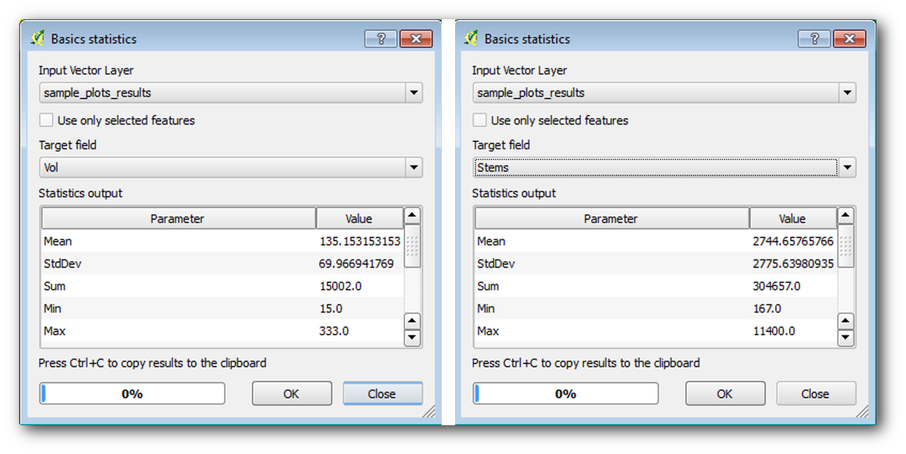
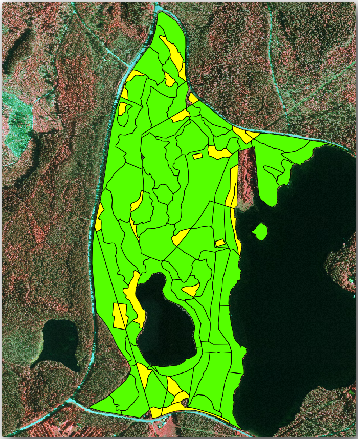
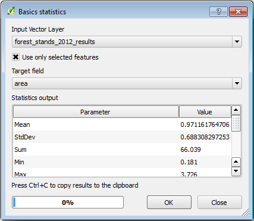

|LS| Calculating the Forest Parameters
===============================================================================

Estimating the parameters of the forest is the goal of the forest inventory.
Continuing the example from previous lesson, you will use the inventory
information gathered in the field to calculate the forest parameters, for the
whole forest first, and then for the stands you digitized before.

**The goal for this lesson:** Calculate forest parameters at general and stand level.

|basic| |FA| Adding the Inventory Results 
-------------------------------------------------------------------------------

The field teams visited the forest and with the help of the information you
provided, gathered information about the forest at every sample plot.

Most often the information will be collected into paper forms in the field,
then typed to a spreadsheet. The sample plots information has been condensed
into a :file:`.csv` file that can be easily open in QGIS.

Continue with the QGIS project from the lesson about designing the inventory,
you probably named it :file:`forest_inventory.qgs`.

First, add the sample plots measurements to your QGIS project:

#. Go to :menuselection:`Layer --> Add Layer --> Add Delimited Text Layer...`.
#. Browse to the file :file:`systematic_inventory_results.csv` located in
   :file:`exercise_data/forestry/results/`.
#. Make sure that the :guilabel:`Point coordinates` option is checked.
#. Set the fields for the coordinates to the :guilabel:`X` and :guilabel:`Y` fields.
#. Click :guilabel:`OK`.
#. When prompted, select :guilabel:`ETRS89 / ETRS-TM35FIN` as the CRS.
#. Open the new layer's :guilabel:`Attribute table` and have a look at the data.

You can read the type of data that is contained in the sample plots measurements
in the text file :file:`legend_2012_inventorydata.txt` located in the
:file:`exercise_data/forestry/results/` folder.

The :file:`systematic_inventory_results` layer you just added is actually just
a virtual representation of the text information in the :file:`.csv` file.
Before you continue, convert the inventory results to a real spatial dataset:

#. Right click on the :file:`systematic_inventory_results` layer.
#. Browse to :file:`exercise_data/forestry/results/` folder.
#. Name the file :file:`sample_plots_results.shp`.
#. Check :guilabel:`Add saved file to map`.
#. Remove the :file:`systematic_inventory_results` layer from your project.

|basic| |FA| Whole Forest Parameters Estimation
-------------------------------------------------------------------------------

You can calculate the averages for this whole forest area from the inventory
results for the some interesting parameters, like the volume and the number
of stems per hectare. Since the systematic sample plots represent equal areas,
you can directly calculate the averages of the volumes and number of stems per
hectare from the :file:`sample_plots_results` layer.

You can calculate the average of a field in a vector layer using the
:guilabel:`Basic statistics` tool:

#. Open :menuselection:`Vector --> Analysis Tools --> Basic statistics for Fields`.
#. Select ``sample_plots_results`` as the :guilabel:`Input Vector Layer`.
#. Select ``Vol`` as :guilabel:`Target field`.
#. Click :guilabel:`OK`.

The average volume in the forest is ``135.2 m3/ha``.

You can calculate the average for the number of stems in the same way, ``2745 stems/ha``.

|basic| |FA| Estimating Stand Parameters
-------------------------------------------------------------------------------

You can make use of those same systematic sample plots to calculate estimates
for the different forest stands you digitized previously. Some of the forest
stands did not get any sample plot and for those you will not get information.
You could have planned some extra sample plots when you planned the systematic
inventory, so that the field teams would have measured a few extra sample plots
for this purpose. Or you could send a field team later to get estimates of the
missing forest stands to complete the stand inventory. Nevertheless, you will
get information for a good number of stands just using the planned plots.

What you need is to get the averages of the sample plots that are falling
within each of the forest stands. When you want to combine information based
on their relative locations, you perform a spatial join:

#. Open the  :menuselection:`Vector --> Data Management --> Join attributes
   by location` tool.
#. Set ``forest_stands_2012`` as the :guilabel:`Target vector layer`.
   The layer you want the results for.
#. Set ``sample_plots_results`` as the :guilabel:`Join vector layer`.
   The layer you want to calculate estimates from.
#. Check :guilabel:`Take summary of intersecting features`.
#. Check to calculate only the :guilabel:`Mean`.
#. Name the result as :file:`forest_stands_2012_results.shp` and save it
   in the :file:`exercise_data/forestry/results/` folder.
#. Finally select :guilabel:`Keep all records...`, so you can check later
   what stands did not get information.
#. Click :guilabel:`OK`.
#. Accept adding the new layer to your project when prompted.
#. Close the :guilabel:`Join attributes by location` tool.

Open the :guilabel:`Attribute table` for :guilabel:`forest_stands_2012_results`
and review the results you got. Note that a number of forest stands have
``NULL`` as the value for the calculations, those are the ones having no
sample plots. Select them all and view them in the map, they are some of the
smaller stands:

Let's calculate now the same averages for the whole forest as you did before,
only this time you will use the averages you got for the stands as the bases
for the calculation. Remember that in the previous situation, each sample plot
represented a theoretical stand of ``80x80 m``. Now you have to consider the
area of each of the stands individually instead. That way, again, the average
values of the parameters that are in, for example, m3/ha for the volumes are
converted to total volumes for the stands.

You need to first calculate the areas for the stands and then calculate total
volumes and stem numbers for each of them:

#. In the :guilabel:`Attribute table` enable editing.
#. Open the :guilabel:`Field calculator`.
#. Create a new field called ``area``.
#. Set the :guilabel:`Output field type` to ``Decimal number (real)``.
#. Set the :guilabel:`Precision` to ``2``.
#. In the :guilabel:`Expression` box, write ``$area / 10000``.
   This will calculate the area of the forest stands in ha.
#. Click :guilabel:`OK`.

Now calculate a field with the total volumes and number of stems estimated for every stand:

#. Name the fields ``s_vol`` and ``s_stem``.
#. The fields can be integer numbers or you can use real numbers also.
#. Use the expressions ``"area"  *  "MEANVol"`` and ``"area"  *  "MEANStems"``
   for total volumes and total stems respectively.
#. Save the edits when you are finished.
#. Disable editing.

In the previous situation, the areas represented by every sample plot were the same,
so it was enough to calculate the average of the sample plots. Now to calculate the
estimates, you need to divide the sum of the stands volumes or number of stems by
the sum of the areas of the stands containing information.

#. In the :guilabel:`Attribute table` for the :file:`forest_stands_2012_results`
   layer, select all the stands containing information.
#. Open :menuselection:`Vector --> Analysis Tools --> Basic statistics for fields`.
#. Select the :file:`forest_stands_2012_results` as the :guilabel:`Input layer`.
#. Select ``area`` as :guilabel:`Field to calculate statistics on`.
#. Check the :guilabel:`Selected features only`
#. Click :guilabel:`OK`.

As you can see, the total sum of the stands' areas is ``66.04 ha``.
Note that the area of the missing forest stands is only about ``7 ha``.

In the same way, you can calculate that the total volume for these stands is
``8908 m3/ha`` and the total number of stems is ``179594 stems``.

Using the information from the forest stands, instead of directly using that
from the sample plots, gives the following average estimates:

* ``184.9 m3/ha`` and
* ``2719 stems/ha``.

Save your QGIS project, :file:`forest_inventory.qgs`.

|IC|
-------------------------------------------------------------------------------

You managed to calculate forest estimates for the whole forest using the information
from your systematic sample plots, first without considering the forest
characteristics and also using the interpretation of the aerial image into forest
stands. And you also got some valuable information about the particular stands,
which could be used to plan the management of the forest in the coming years.

|WN|
-------------------------------------------------------------------------------

In the following lesson, you will first create a hillshade background from a
LiDAR dataset which you will use to prepare a map presentation with the forest
results you just calculated.

.. Substitutions definitions - AVOID EDITING PAST THIS LINE
   This will be automatically updated by the find_set_subst.py script.
   If you need to create a new substitution manually,
   please add it also to the substitutions.txt file in the
   source folder.

.. |FA| replace:: Follow Along:
.. |IC| replace:: In Conclusion
.. |LS| replace:: Lesson:
.. |WN| replace:: What's Next?
.. |basic| image:: /static/common/basic.png
