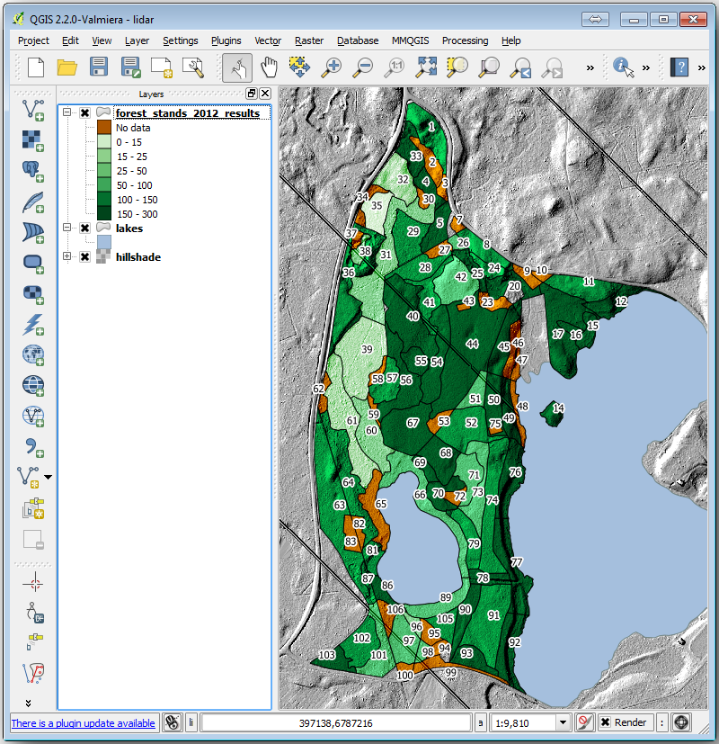
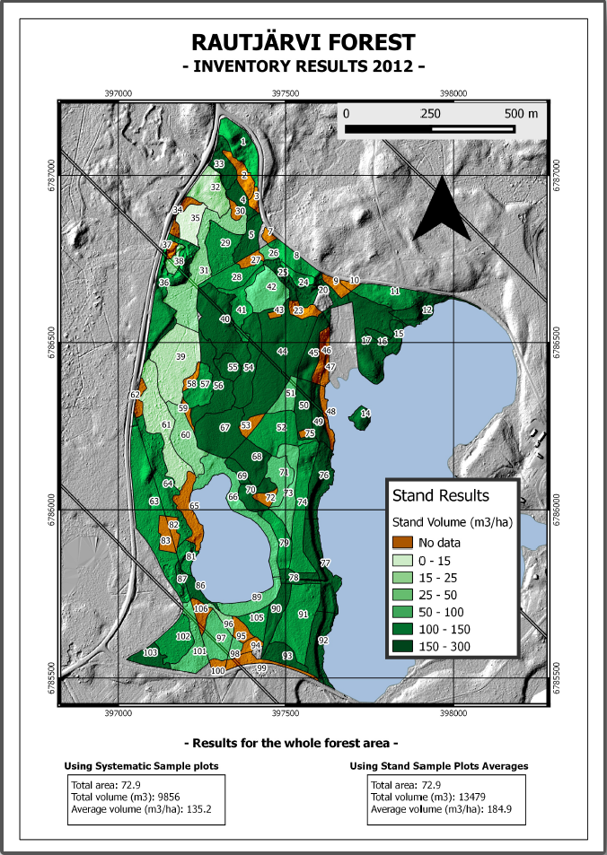

Lesson: Map Presentation
===============================================================================

In the previous lessons you have imported an old forest inventor as a GIS project,
updated it to the current situation, designed a forest inventory, created maps
for the field work and calculated forest parameters from the field measurements.

It is often important to create maps with the results of a GIS project. A map
presenting the results of the forest inventory will make it easier for anyone
to have a good idea of what the results are in a quick glance, without looking
at the specific numbers.

**The goal for this lesson:** Create a map to present the inventory results
using a hillshade raster as background.

:abbr:`★☆☆ (Basic level)` Follow Along: Preparing the Map Data
-------------------------------------------------------------------------------

Open the QGIS project from the parameters calculations lesson, :kbd:`forest_inventory.qgs`.
Keep at least the following layers:

* :kbd:`forest_stands_2012_results`.
* :kbd:`basic_map`.
* :kbd:`rautjarvi_aerial`.
* :kbd:`lakes` (if you don't have it, add it from the :kbd:`exercise_data\\forestry\\` folder).

You are going to present the average volumes of your forest stands in a map.
If you open the :guilabel:`Attribute table` for the :kbd:`forest_stands_2012_results`
layer, you can see the :kbd:`NULL` values for the stands without information.
To be able to get also those stands into your symbology you should change the
:kbd:`NULL` values to, for example, :kbd:`-999`, knowing that those negative
numbers mean there is no data for those polygons.

For the :kbd:`forest_stands_2012_results` layer:

* Open the :guilabel:`Attribute table` and enable editing.
* Select the polygons with :kbd:`NULL` values.
* Use the calculator to update the values of the :kbd:`MEANVol` field to
  :kbd:`-999` only for the selected features.
* Disable editing and save the changes.

Now you can use a saved style for this layer:

* Go to the :guilabel:`Symbology` tab.
* Click on :menuselection:`Style --> Load Style...`.
* Select the :kbd:`forest_stands_2012_results.qml` from the :kbd:`exercise_data\\forestry\\results\\` folder.
* Click :guilabel:`OK`.

.. figure:: img/styling_forest_results.png
   :align: center

Your map will look something like this:

:abbr:`★☆☆ (Basic level)` Try Yourself: Try Different Blending Modes
-------------------------------------------------------------------------------

The style you loaded:

.. figure:: img/styling_forest_results.png
   :align: center

is using the :kbd:`Hard light` mode for the :guilabel:`Layer blending mode`.
Note that the different modes apply different filters combining the underlying
and overlying layers, in this case the hillshade raster and your forest stands
are used. You can read about these modes in the :ref:`User Guide <blend-modes>`.

Try with different modes and see the differences in your map. Then choose the
one you like better for your final map.

:abbr:`★☆☆ (Basic level)` Try Yourself: Using a Layout Template to Create the Map result
------------------------------------------------------------------------------------------

Use a template prepared in advanced to present the results. The template
:kbd:`forest_map.qpt` is located in the :kbd:`exercise_data\\forestry\\results\\`
folder. Load it using the :menuselection:`Project --> Layout Manager...` dialog.

.. figure:: img/final_map_template.png
   :align: center

Open the print layout and edit the final map to get a result you are happy with.

The map template you are using will give a map similar to this one:

Save your QGIS project for future references.

In Conclusion
-------------------------------------------------------------------------------

Through this module you have seen how a basic forest inventory can be planned
and presented with QGIS. Many more forest analysis are possible with the variety
of tools that you can access, but hopefully this manual has given you a good
starting point to explore how you could achieve the specific results you need.
