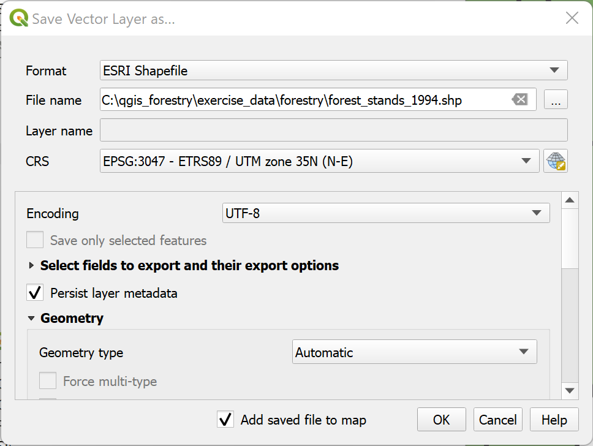

|LS| Digitizing Forest Stands
===============================================================================

Unless you are going to use your georeferenced map as a simple background image,
the next natural step is to digitize elements from it. You have already done so
in the exercises about creating vector data in :doc:`../create_vector_data/create_new_vector`,
when you digitized the school fields. In this lesson, you are going to digitize
the forest stands' borders that appear in the map as green lines but instead of
doing it using an aerial image, you will use your georeferenced map.

**The goal for this lesson:** Learn a technique to help the digitizing task,
digitizing forest stands and finally adding the inventory data to them.

|basic| |FA| Extracting the Forest Stands Borders
-------------------------------------------------------------------------------

Open your :file:`map_digitizing.qgs` project in QGIS, that you saved from the
previous lesson.

Once you have scanned and georeferenced your map you could start to digitize
directly by looking at the image as a guide. That would most likely be the way
to go if the image you are going to digitize from is, for example, an aerial
photograph.

If what you are using to digitize is a good map, as it is in our case, it is
likely that the information is clearly displayed as lines with different colors
for each type of element. Those colors can be relatively easy extracted as
individual images using an image processing software like `GIMP <https://www.gimp.org/>`_.
Such separate images can be used to assist the digitizing, as you will see below.

The first step will be to use GIMP to obtain an image that contains only the
forest stands, that is, all those greenish lines that you could see in the
original scanned map:

#. Open GIMP (if you don't have it installed yet, download it from the internet
   or ask your teacher).
#. Open the original map image, :menuselection:`File --> Open`, :file:`rautjarvi_map.tif`
   in the :file:`exercise_data/forestry` folder. Note that the forest stands are
   represented as green lines (with the number of the stand also in green inside
   each polygon). 

   .. figure:: img/gimp_map.png
      :align: center

   |

#. Now you can select the pixels in the image that are making up the forest stands'
   borders (the greenish pixels):

   #. Open the tool :menuselection:`Select --> By color`.
   #. With the tool active, zoom into the image (:kbd:`Ctrl` + mouse wheel)
      so that a forest stand line is close enough to differentiate the pixels forming
      the line. See the left image below.
   #. Click and drag the mouse cursor in the middle of the line so that the tool
      will collect several pixel color values.
   #. Release the mouse click and wait a few seconds. The pixels matching the colors
      collected by the tool will be selected through the whole image.
   #. Zoom out to see how the greenish pixels have been selected throughout the image.
   #. If you are not happy with the result, repeat the click and drag operation.
   #. Your pixel selection should look something like the right image below.

   .. figure:: img/green_px_selected.png
      :align: center

   |

#. Once you are done with the selection you need to copy this selection as a new
   layer and then save it as separate image file:

   #. Copy (:kbd:`Ctrl+C` or :menuselection:`Edit --> Copy`) the selected pixels.
   #. And paste the pixels directly as a new layer (:menuselection:`Edit --> Paste as --> New Layer`).
      GIMP will display the pasted pixels as a new layer (``Pasted Layer``) in the :guilabel:`Layers` panel.
   #. Click the "eye" icon next to the original image layer to switch it off,
      so that only the :guilabel:`Pasted Layer` is visible:

   .. figure:: img/saving_green_px.png
      :align: center

   |

#. Finally, select :menuselection:`File --> Export As...`, set :guilabel:`Select
   File Type (By Extension)` as a :guilabel:`TIFF image`, select the
   :file:`digitizing` folder and name it :file:`rautjarvi_map_green.tif`.
   Select no compression when asked.

You could do the same process with other elements in the image, for example
extracting the black lines that represent roads or the brown ones that represent
the terrain' contour lines. But for us, the forest stands is enough.

|basic| |TY| Georeference the Green Pixels Image
-------------------------------------------------------------------------------

As you did in the previous lesson, you need to georeference this new image to
be able to use it with the rest of your data.

Note that you don't need to digitize the ground control points anymore because
this image is basically the same image as the original map image, as far as the
Georeferencer tool is concerned. Here are some things you should remember:

* This image is also, of course, in ``KKJ / Finland zone 2`` CRS.
* You should use the ground control points you saved,
  :menuselection:`File --> Load GCP points`.
* Remember to review the :guilabel:`Transformation settings`.
* Name the output raster as :file:`rautjarvi_green_georef.tif` in the
  :file:`digitizing` folder.

Check that the new raster is fitting nicely with the original map.

|basic| |FA| Creating Supporting Points for Digitizing
-------------------------------------------------------------------------------

Having in mind the digitizing tools in QGIS, you might already be thinking that
it would be helpful to snap to those green pixels while digitizing. That is
precisely what you are going to do next create points from those pixels to use
them later to help you follow the forest stands' borders when digitizing, by
using the snapping tools available in QGIS.

#. Use the :menuselection:`Raster --> Conversion --> Polygonize (Raster to Vector)`
   tool to vectorize your green lines to polygons. If you don't remember how, you
   can review it in :doc:`../complete_analysis/raster_to_vector`.
#. Save as :file:`rautjarvi_green_polygon.shp` inside the :file:`digitizing` folder.

#. Zoom in and see what the polygons look like. You will get something like this:

   .. figure:: img/green_polygons.png
      :align: center

   |

#. Next option to get points out of those polygons is to get their centroids:

   #. Open :menuselection:`Vector --> Geometry Tools --> Centroids...`.
   #. Set :guilabel:`Input Layer` to |polygonLayer| :guilabel:`rautjarvi_green_polygon`
      (the polygon layer you have just created)
   #. Set :guilabel:`Centroids` output to :file:`green_centroids.shp` file
      within the folder :file:`digitizing`
   #. Check |checkbox| :menuselection:`Open output file after running algorithm`
   #. Press :guilabel:`Run`. This will calculate the centroids for the polygons
      as a new layer and add it to the project.

   .. figure:: img/green_points.png
      :align: center

   |

#. Now you can remove the |polygonLayer| ``rautjarvi_green_polygon`` layer from the TOC.

#. Change the symbology of the centroids layer as follows:

   #. Open the :guilabel:`Layer Properties` for |pointLayer| ``green_centroids``.
   #. Go to the :guilabel:`Symbology` tab.
   #. Set :guilabel:`Size` to ``1.00`` and choose :menuselection:`Map Units`

It is not necessary to differentiate points from each other, you just need them
to be there for the snapping tools to use them. You can use those points now to
follow the original lines much easily than without them.

|basic| |FA| Digitize the Forest Stands
-------------------------------------------------------------------------------

Now you are ready to start with the actual digitizing work. You would start by
creating a vector file of :guilabel:`polygon type`, but for this exercise,
there is a shapefile with part of the area of interest already digitized. You
will just finish digitizing the half of the forest stands that are left between
the main roads (wide pink lines) and the lake:

|

#. Go to the :file:`digitizing` folder using your file manager browser.
#. Drag and drop the :file:`forest_stands.shp` vector file to your map.

#. Change the new layer's symbology so that it will be easier to see the polygons
   that have already been digitized.

   #. Set :guilabel:`Fill color` to green - and change the :guilabel:`Opacity` to ``50%``.
   #. Select :guilabel:`Simple Fill` and set :guilabel:`Stroke width` to ``1.00 mm``.

Now, if you remember past modules, we have to set up and activate the snapping options:

#. Go to :menuselection:`Project --> Snapping options...`
#. Press |snapping| :sup:`Enable Snapping` and select :guilabel:`Advanced Configuration`
#. Check the :guilabel:`green_centroids` and :guilabel:`forest_stands` layers
#. Set :guilabel:`Type` for each layer to :guilabel:`Vertex`
#. Set :guilabel:`Tolerance` for each layer to ``10``
#. Set :guilabel:`Units` for each layer to :guilabel:`pixels`
#. Check |checkbox| :guilabel:`Avoid Overlap` for the :guilabel:`forest_stands` layer
#. Press |topologicalEditing| :guilabel:`Topological editing`
#. Choose |avoidIntersectionsLayers| :guilabel:`Follow Advanced Configuration`
#. Close the pop-up

   .. figure:: img/snapping_settings_forest.png
      :align: center
      :width: 100%

   With these snapping settings, whenever you are digitizing and get close enough
   to one of the points in the centroids layer or any vertex of your digitized
   polygons, a pink square will appear on the point that will be snapped to. 

#. Finally, turn off the visibility of all the layers except :guilabel:`forest_stands`
   and :guilabel:`rautjarvi_georef`. Make sure that the map image has not transparency any more.

A few important things to note before you start digitizing:

* Don't try to be too accurate with the digitizing of the borders.
* If a border is a straight line, digitize it with just two nodes. In general,
  digitize using as few nodes as possible.
* Zoom in to close ranges only if you feel that you need to be accurate, for
  example, at some corners or when you want a polygon to connect with another
  polygon at a certain node.
* Use the mouse's middle button to zoom in/out and to pan as you digitize.
* Digitize only one polygon at a time.
* After digitizing one polygon, write the forest stand id that you can see from the map.

Now you can start digitizing:

#. Locate the forest stand number ``357`` in the map window.
#. Select the ``forest_stands`` layer.
#. Click the |toggleEditing| :sup:`Toggle Editing` button to enable editing
#. Select |capturePolygon| :sup:`Add Polygon Feature` tool.
#. Start digitizing the stand ``357`` by connecting some of the dots.
   Note the pink crosses indicating the snapping.

|

When you are done:

#. Right click to end digitizing that polygon.
#. Enter the forest stand :guilabel:`ID` within the form (in this case ``357``).
#. Click :guilabel:`OK`.

If a form did not appear when you finished digitizing the polygon,
go to :menuselection:`Settings --> Options --> Digitizing` and make sure that the
:guilabel:`Suppress attribute form pop-up after feature creation` is not checked.

Your digitized polygon will look like this:

|

Now for the second polygon, pick up the stand number 358. Make sure that |checkbox| 
:guilabel:`Avoid Overlap` is checked for the :guilabel:`forest_stands` layer (as shown above). This
option ensures polygons do not overlap. So, if you
digitize over an existing polygon, the new polygon will be trimmed to meet
the border of the existing polygons. You can use this option
to automatically obtain a common border.

#. Begin digitizing the stand 358 at one of the common corners with the stand 357. 
#. Continue normally until you get to the other common corner for both stands.
#. Finally, digitize a few points inside polygon 357 making sure that the common
   border is not intersected. See left image below.
#. Right click to finish editing the forest stand 358.
#. Enter the :guilabel:`ID` as ``358``.
#. Click :guilabel:`OK`. Your new polygon should have a common border with the
   stand 357 as you can see in the image below.

|

The part of the polygon that was overlapping the existing polygon has been
automatically trimmed and you are left with a common border - as you intended
it to be.

|basic| |TY| Finish Digitizing the Forest Stands
-------------------------------------------------------------------------------

Now you have two forest stands ready. And a good idea on how to proceed.
Continue digitizing on your own until you have digitized all the forest stands
that are limited by the main road and the lake.

It might look like a lot of work, but you will soon get used to digitizing the
forest stands. It should take you about 15 minutes.

During the digitizing you might need to edit or delete nodes, split or merge polygons.
You learned about the necessary tools in :doc:`../create_vector_data/topo_editing`,
now is probably a good moment to go read about them again.

Remember that having :guilabel:`Enable topological editing` activated,
allows you to move nodes common to two polygons so that the common border is
edited at the same time for both polygons.

Your result will look like this:

|

|basic| |FA| Joining the Forest Stand Data
-------------------------------------------------------------------------------

It is possible that the forest inventory data you have for you map is also
written in paper. In that case, you would have to first write that data to a text
file or a spreadsheet. For this exercise, the information from the inventory for
1994 (the same inventory as the map) is ready as a comma separated text (csv) file.

#. Open the :file:`rautjarvi_1994.csv` file from the :file:`exercise_data\\forestry`
   directory in a text editor and note that the inventory data file has an attribute
   called :guilabel:`ID` that has the numbers of the forest stands. Those numbers are
   the same as the forest stands ids you have entered for your polygons and can be
   used to link the data from the text file to your vector file. You can see the
   metadata for this inventory data in the file :file:`rautjarvi_1994_legend.txt`
   in the same folder.

#. Now add this file into the project:

   #. Use the |addDelimitedTextLayer| :sup:`Add Delimited Text Layer` tool.
      This is accessed via :menuselection:`Layer --> Add Layer --> Add Delimited Text Layer...`. 
   #. Set details in the dialog as follows:

      .. figure:: img/inventory_csv_import.png
        :align: center
        :width: 100%

   #. Press :guilabel:`Add` to load the formatted :file:`csv` file in the project.

#. To link the data from the :file:`.csv` file with the digitized polygons,
   create a join between the two layers:

   #. Open the Layer Properties for the ``forest_stands`` layer.
   #. Go to the :guilabel:`Joins` tab.
   #. Click |symbologyAdd| :sup:`Add new join` on the bottom of the dialog box.
   #. Select :guilabel:`rautjarvi_1994.csv` as the :guilabel:`Join layer` 
   #. Set the :guilabel:`Join` field to :guilabel:`ID`
   #. Set the :guilabel:`Target` field to :guilabel:`ID`
   #. Click :guilabel:`OK` two times.

The data from the text file should be now linked to your vector file. To see
what has happened, select the ``forest_stands`` layer and use |openTable| :sup:`Open Attribute Table`.
You can see that all the attributes from the inventory data file are now linked
to your digitized vector layer.

You will see that the field names are prefixed with ``rautjarvi_1994_``. To change this:

#. Open the Layer Properties for the ``forest_stands`` layer.
#. Go to the :guilabel:`Joins` tab.
#. Select :guilabel:`Join Layer` :guilabel:`rautjarvi_1994` 
#. Click the |toggleEditing| :sup:`Edit selected join` button to enable editing
#. Under |checkbox| :guilabel:`Custom field name prefix` remove the prefix name

   .. figure:: img/join_csv.png
      :align: center
      :width: 80%

The data from the :file:`.csv` file is just linked to your vector file. To make
this link permanent, so that the data is actually recorded to the vector file
you need to save the ``forest_stands`` layer as a new vector file. To do this:

#. Right click on ``forest_stands`` layer
#. Choose :menuselection:`Export --> Save Features As...`
#. Set :guilabel:`Format` to :guilabel:`ESRI Shapefile`
#. Set file name to :file:`forest_stands_1994.shp` under the :file:`forestry` folder 
#. To include the new file as a layer in the project, check |checkbox|
   :guilabel:`Add saved file to map`

|basic| |TY| Adding Area and Perimeter 
-------------------------------------------------------------------------------

To finish gathering the information related to these forest stands, you might
calculate the area and the perimeter of the stands. You calculated areas for
polygons in :doc:`../complete_analysis/analysis_exercise`. Go back to that
lesson if you need to and calculate the areas for the forest stands. Name the
new attribute ``Area`` and make sure that the values calculated are in hectares.
You could also do the same for the perimeter.

Now your ``forest_stands_1994`` layer is ready and packed with all the
available information.

Save your project to keep the current map layers in case you need to come
back later to it.

|IC|
-------------------------------------------------------------------------------

It has taken a few clicks of the mouse but you now have your old inventory data
in digital format and ready for use in QGIS.

|WN|
-------------------------------------------------------------------------------

You could start doing different analysis with your brand new dataset, but you
might be more interested in performing analysis in a dataset more up to date.
The topic of the next lesson will be the creation of forest stands using current
aerial photos and the addition of some relevant information to your dataset.

.. Substitutions definitions - AVOID EDITING PAST THIS LINE
   This will be automatically updated by the find_set_subst.py script.
   If you need to create a new substitution manually,
   please add it also to the substitutions.txt file in the
   source folder.

.. |FA| replace:: Follow Along:
.. |IC| replace:: In Conclusion
.. |LS| replace:: Lesson:
.. |TY| replace:: Try Yourself
.. |WN| replace:: What's Next?
.. |addDelimitedTextLayer| image:: /static/common/mActionAddDelimitedTextLayer.png
   :width: 1.5em
.. |avoidIntersectionsLayers| image:: /static/common/mActionAvoidIntersectionsLayers.png
   :width: 1.5em
.. |basic| image:: /static/common/basic.png
.. |capturePolygon| image:: /static/common/mActionCapturePolygon.png
   :width: 1.5em
.. |checkbox| image:: /static/common/checkbox.png
   :width: 1.3em
.. |openTable| image:: /static/common/mActionOpenTable.png
   :width: 1.5em
.. |pointLayer| image:: /static/common/mIconPointLayer.png
   :width: 1.5em
.. |polygonLayer| image:: /static/common/mIconPolygonLayer.png
   :width: 1.5em
.. |snapping| image:: /static/common/mIconSnapping.png
   :width: 1.5em
.. |symbologyAdd| image:: /static/common/symbologyAdd.png
   :width: 1.5em
.. |toggleEditing| image:: /static/common/mActionToggleEditing.png
   :width: 1.5em
.. |topologicalEditing| image:: /static/common/mIconTopologicalEditing.png
   :width: 1.5em
