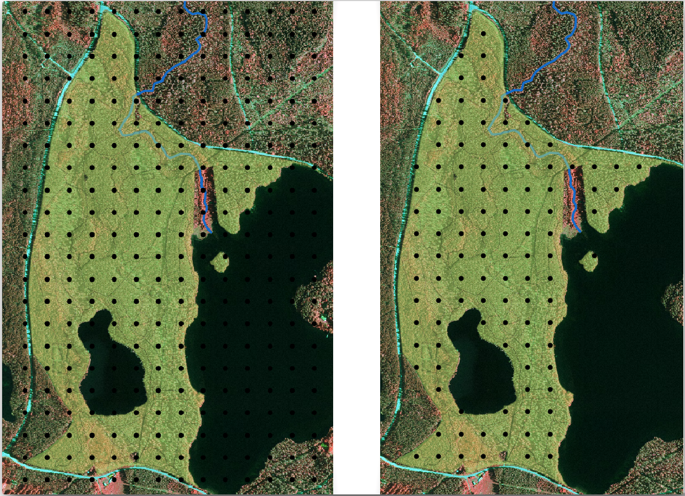
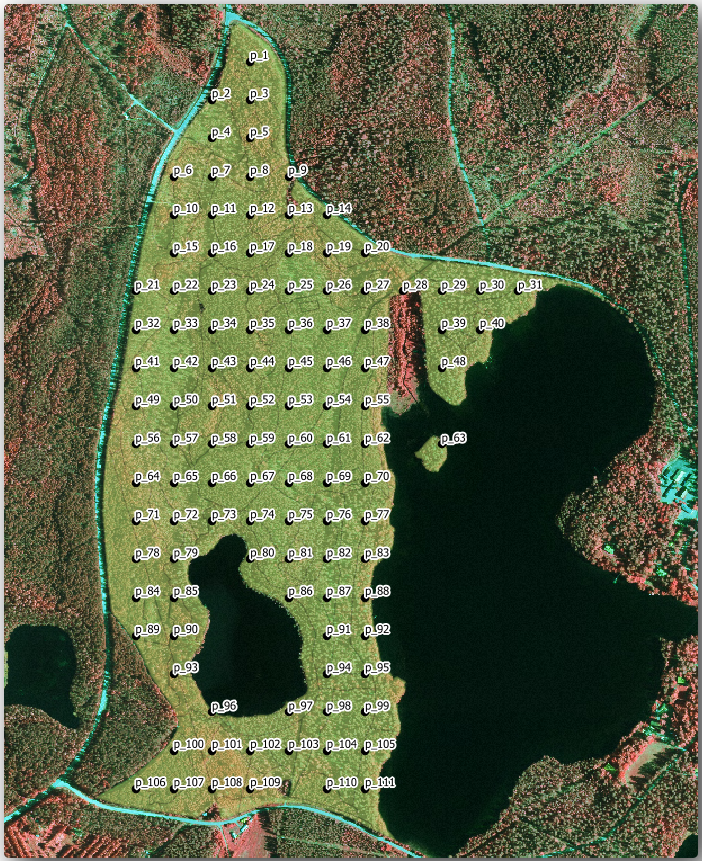

Lesson: Systematic Sampling Design
===============================================================================

You have already digitized a set of polygons that represent the forest stands,
but you don't have information about the forest just yet. For that purpose you
can design a survey to inventory the whole forest area and then estimate its
parameters. In this lesson you will create a systematic set of sampling plots.

When you start planning your forest inventory it is important to clearly define
the objectives, the types of sample plots that will be used, and the data that
will be collected to achieve the objectives. For each individual case, those will
depend on the type of forest and the management purpose; and should be carefully
planned by someone with forestry knowledge. In this lesson, you will implement
a theoretical inventory based on a systematic sampling plot design.

**The goal for this lesson:** To create a systematic sampling plot design to
survey the forest area.

Inventorying the Forest
-------------------------------------------------------------------------------

There are several methods to inventory forests, each of them suiting different
purposes and conditions. For example, one very accurate way to inventory a
forest (if you consider only tree species) would be to visit the forest and
make a list of every tree and their characteristics. As you can imagine this is
not commonly applicable except for some small areas or some special situations.

The most common way to find out about a forest is by sampling it, that is,
taking measurements in different locations at the forest and generalizing that
information to the whole forest. These measurements are often made in *sample
plots* that are smaller forest areas that can be easily measured. The sample
plots can be of any size (for ex. 50 m2, 0.5 ha) and form (for ex. circular,
rectangular, variable size), and can be located in the forest in different ways
(for ex. randomly, systematically, along lines). The size, form and location of
the sample plots are usually decided following statistical, economical and
practical considerations. If you have no forestry knowledge, you might be
interested in reading `this Wikipedia article <https://en.wikipedia.org/wiki/Forest_inventory>`_.

:abbr:`★☆☆ (Basic level)` Follow Along: Implementing a Systematic Sampling Plot Design
---------------------------------------------------------------------------------------

For the forest you are working with, the manager has decided that a systematic
sampling design is the most appropriate for this forest and has decided that a
fixed distance of 80 meters between the sample plots and sampling lines will
yield reliable results (for this case, +- 5% average error at a probability
of 68%). Variable size plots has been decided to be the most effective method
for this inventory, for growing and mature stands, but a 4 meters fixed radius
plots will be used for seedling stands.

In practice, you simply need to represented the sample plots as points that
will be used by the field teams later:

#. Open your :file:`digitizing_2012.qgs` project from the previous lesson.
#. Remove all the layers except for :guilabel:`forest_stands_2012`.
#. Save your project now as :file:`forest_inventory.qgs`

Now you need to create a rectangular grid of points separated 80 meters from each other:

#. Open :menuselection:`Vector --> Research Tools` |regularPoints| :guilabel:`Regular points`.
#. Press the drop-down button next to the :guilabel:`Input extent` field
   and from the :guilabel:`Calculate from Layer` menu, select :guilabel:`forest_stands_2012`.
#. In the :guilabel:`Point spacing/count` settings, enter ``80`` ``meters``.
#. Check the :guilabel:`Use point spacing` box to indicate that the value
   represents the distance between the points.
#. Under :guilabel:`Regular points`, save the output as :file:`systematic_plots.shp`
   in the :file:`forestry\\sampling\\` folder.
#. Check :guilabel:`Open output file after running algorithm`.
#. Press :guilabel:`Run`.

.. note:: The suggested :guilabel:`Regular points` creates the systematic
  points starting in the upper-left corner of the extent of the selected
  polygon layer. If you want to add some randomness to this regular points, you
  could use a randomly calculated number between 0 and 80 (80 is the distance
  between our points), and then write it as the :guilabel:`Initial inset from
  corner (LH side)` parameter in the tool's dialog.

You notice that the tool has used the whole extent of your stands layer to
generate a rectangular grid of points. But you are only interested on those
points that are actually inside your forest area (see the images below):

#. From the Processing toolbox, open |gdal| :menuselection:`GDAL --> Vector
   geoprocessing --> Clip vector by mask layer`.
#. Select :guilabel:`systematic_plots` as the :guilabel:`Input layer`.
#. Set :guilabel:`forest_stands_2012` as the :guilabel:`Mask layer`.
#. Save the :guilabel:`Clipped (mask)` result as :file:`systematic_plots_clip.shp`
   in the :file:`forestry\\sampling\\` folder.
#. Check :guilabel:`Open output file after running algorithm`.
#. Press :guilabel:`Run`.

You have now the points that the field teams will use to navigate to the designed
sample plots locations. You can still prepare these points so that they are more
useful for the field work. At the least you will have to add meaningful names
for the points and export them to a format that can be used in their GPS devices.

Let's start with the naming of the sample plots. If you check the
:guilabel:`Attribute table` for the plots inside the forest area, you can see
that you have the default :guilabel:`id` field automatically generated by the
:guilabel:`Regular points` tool. Label the points to see them in the map and
consider if you could use those numbers as part of your sample plot naming:

#. Open the :menuselection:`Layer Properties -->` |labelingSingle| :guilabel:`Labels`
   for the ``systematic_plots_clip`` layer.
#. Turn the top menu into |labelingSingle| :guilabel:`Single Labels`.
#. For the :guilabel:`Value` entry, select the field ``id``.
#. Go to the |labelbuffer| :guilabel:`Buffer` tab, check the
   :guilabel:`Draw text buffer` and set the buffer :guilabel:`Size` to ``1``.
#. Click :guilabel:`OK`.

Now look at the labels on your map. You can see that the points have been
created and numbered first West to East and then North to South. If you look
at the attribute table again, you will notice that the order in the table is
following also that pattern. Unless you would have a reason to name the sample
plots in a different way, naming them in a West-East/North-South fashion follows
a logical order and is a good option. 

Nevertheless, the number values in the ``id`` field are not so good.
It would be better if the naming would be something like ``p_1, p_2...``.
You can create a new column for the ``systematic_plots_clip`` layer:

#. Go to the :guilabel:`Attribute table` for ``systematic_plots_clip``.
#. Enable the |toggleEditing| edit mode.
#. Open the |calculateField| :sup:`Field calculator`:

   #. Check :guilabel:`Create a new field`
   #. Enter ``Plot_id`` as :guilabel:`Output field name`
   #. Set the :guilabel:`Output field type` to :guilabel:`Text (string)`.
   #. In the :guilabel:`Expression` field, write, copy or construct this formula
      ``concat('P_', @rownum )``. Remember that you can also double click on the
      elements inside the :guilabel:`Function list`. The ``concat`` function can
      be found under :guilabel:`String` and ``@rownum`` is under the :guilabel:`Variables
      and values` group.
#. Click :guilabel:`OK`.
#. Disable the edit mode and save your changes.

Now you have a new column with plot names that are meaningful to you. For the
``systematic_plots_clip`` layer, change the field used for labeling to your
new ``Plot_id`` field.

:abbr:`★☆☆ (Basic level)` Follow Along: Exporting Sample Plots as GPX format
-------------------------------------------------------------------------------

The field teams will be probably using a GPS device to locate the sample plots
you planned. The next step is to export the points you created to a format that
your GPS can read. QGIS allows you to save your point and line vector data in
`GPS eXchange Format (GPX) <https://en.wikipedia.org/wiki/GPS_Exchange_Format>`_,
which is an standard GPS data format that can be read by most of the
specialized software. You need to be careful with selecting the CRS when you
save your data:

#. Right-click ``systematic_plots_clip`` layer and select :menuselection:`Export -->
   Save features as...`.

   .. figure:: img/gpx_creation.png
      :align: center

#. In :guilabel:`Format` select :guilabel:`GPS eXchange Format [GPX]`.
#. Save the output :guilabel:`File name` as :file:`plots_wgs84.gpx` in the
   :file:`forestry\\sampling\\` folder.
#. In :guilabel:`CRS` select :guilabel:`Selected CRS`.
#. Browse for :guilabel:`EPSG:4326 - WGS 84`.

   .. note:: The `GPX <https://gdal.org/drivers/vector/gpx.html>`_ format
    accepts only this CRS, if you select
    a different one, QGIS will give no error but you will get an empty file.

#. Click :guilabel:`OK`.
#. In the dialog that opens, select only the ``waypoints`` layer (the rest of
   the layers are empty).

The inventory sample plots are now in a standard format that can be managed by
most of the GPS software. The field teams can now upload the locations of the
sample plots to their devices. That would be done by using the specific devices
own software and the :file:`plots_wgs84.gpx` file you just saved. Other option
would be to use the :guilabel:`GPS Tools` plugin but it would most likely
involve setting the tool to work with your specific GPS device. If you are
working with your own data and want to see how the tool works you can find out
information about it in the section :ref:`working_gps` in the **QGIS User Manual**.

Save your QGIS project now.

In Conclusion
-------------------------------------------------------------------------------

You just saw how easily you can create a systematic sampling design to be used
in a forest inventory. Creating other types of sampling designs will involve
the use of different tools within QGIS, spreadsheets or scripting to calculate
the coordinates of the sample plots, but the general idea remains the same.

What's Next?
-------------------------------------------------------------------------------

In the next lesson you will see how to use the Atlas capabilities in QGIS to
automatically generate detailed maps that the field teams will be using to
navigate to the sample plots assigned to them.

.. Substitutions definitions - AVOID EDITING PAST THIS LINE
   This will be automatically updated by the find_set_subst.py script.
   If you need to create a new substitution manually,
   please add it also to the substitutions.txt file in the
   source folder.

.. |calculateField| image:: /static/common/mActionCalculateField.png
   :width: 1.5em
.. |gdal| image:: /static/common/gdal.png
   :width: 1.5em
.. |labelbuffer| image:: /static/common/labelbuffer.png
   :width: 1.5em
.. |labelingSingle| image:: /static/common/labelingSingle.png
   :width: 1.5em
.. |regularPoints| image:: /static/common/mAlgorithmRegularPoints.png
   :width: 1.5em
.. |toggleEditing| image:: /static/common/mActionToggleEditing.png
   :width: 1.5em
