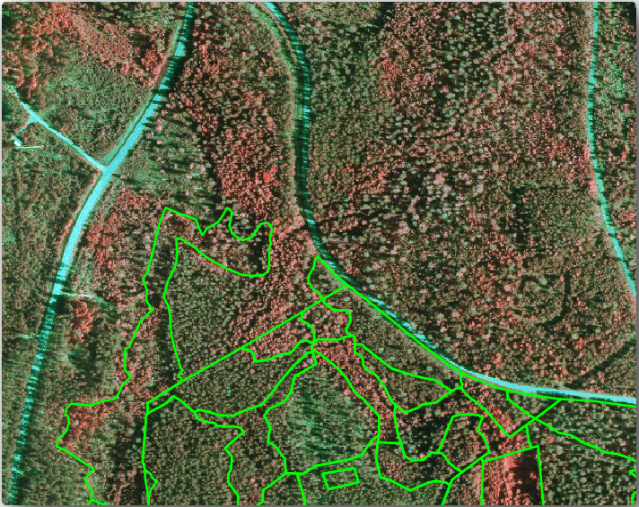
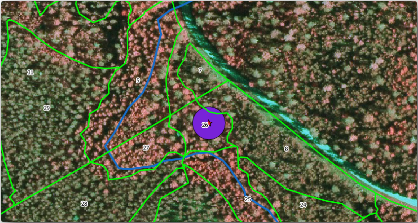

Lesson: Updating Forest Stands
===============================================================================

Now that you have digitized the information from the old inventory maps and
added the corresponding information to the forest stands, the next step is
to create the inventory of the current state of the forest.

You will digitize new forest stands using an aerial photo.
As with the previous lesson, you will use an aerial Color Infrared (CIR) photograph.
This type of imagery, where the infrared light is recorded instead of the blue light,
is widely used to study vegetated areas.

After digitizing the forest stands, you will add information such as new
constraints given by conservation regulations.

**The goal for this lesson:** To digitize a new set of forest stands from
CIR aerial photographs and add information from other datasets.

:abbr:`★☆☆ (Basic level)` Comparing the Old Forest Stands to Current Aerial Photographs
------------------------------------------------------------------------------------------

The National Land Survey of Finland has an open data policy that allows you
downloading a variety of geographical data like aerial imagery, traditional
topographic maps, DEM, LiDAR data, etc. The service can be accessed in
English `here <https://tiedostopalvelu.maanmittauslaitos.fi/tp/kartta?lang=en>`_.
The aerial image used in this exercise has been created from two orthorectified
CIR images downloaded from that service (M4134F_21062012 and M4143E_21062012).

#. Open QGIS and set the project's CRS to :guilabel:`ETRS89 / ETRS-TM35FIN` in
   :menuselection:`Project --> Properties... --> CRS`
#. Add the CIR image :file:`rautjarvi_aerial.tif` to the project:

   #. Go to the :file:`exercise_data\\forestry\\` folder using your file manager browser
   #. Drag and drop the file :file:`rautjarvi_aerial.tif` onto your project
#. Save the QGIS project as :file:`digitizing_2012.qgs`

The CIR images are from 2012.
You can compare the stands that were created in 1994 with the situation almost 20 years later.

#. Add the :file:`forest_stands_1994.shp` layer created in the previous lesson:

   #. Go to the :file:`exercise_data\\forestry\\` folder using your file manager browser
   #. Drag and drop the file :file:`forest_stands_1994.shp` onto your project
#. Set the symbology for the layer so that you can see through your polygons:

   #. Right click :guilabel:`forest_stands_1994`
   #. Select :guilabel:`Properties`
   #. Go to the |symbology| :guilabel:`Symbology` tab
   #. Set :guilabel:`Fill color` to transparent fill
   #. Set :guilabel:`Stroke color` to purple
   #. Set :guilabel:`Stroke width` to ``0.50 mm``
#. Review how the old forest stands follow (or not) what you might visually
   interpret as an homogeneous forest.
#. Zoom and pan around the area. You probably will notice that some of the old
   forest stands might be still corresponding with the image but others are not.

   This is a normal situation, as some 20 years have passed
   and different forest operations have been carried out (harvesting, thinning...).
   It is also possible that the forest stands looked homogeneous back in 1992 to the person
   who digitized them but as time has passed some forest has developed in different ways.
   It is also possible that that forest inventory priorities back then were different from those of today.

Next, you will create new forest stands for this image without using the old ones.
Later you can compare them to see the differences.

:abbr:`★☆☆ (Basic level)` Interpreting the CIR Image
-------------------------------------------------------------------------------

Let's digitize the same area that was covered by the old inventory, limited by
the roads and the lake. You don't have to digitize the whole area, as in the
previous exercise you can start with a vector file that already contains most
of the forest stands.

#. Remove the layer |polygonLayer| :guilabel:`forest_stands_1994`
#. Add the file :file:`exercise_data\\forestry\\forest_stands_2012.shp` to the project
#. Set the styling of this layer so that the polygons have no fill and the borders are visible

   #. Open :guilabel:`Properties` dialog of the ``forest_stands_2012`` layer
   #. Go to the |symbology| :guilabel:`Symbology` tab
   #. Set :guilabel:`Fill color` to transparent fill
   #. Set :guilabel:`Stroke color` to green
   #. Set :guilabel:`Stroke width` to ``0.50 mm``

   .. figure:: img/stands_2012_1.png
      :align: center

   |

You can see that the northern section of the inventory area is still missing.
Your task is to digitize the missing forest stands.

Before you start, spend some time reviewing the forest stands already
digitized and the corresponding forest in the image. Try to get an idea about
how the stands borders are decided, it helps if you have some forestry knowledge.

Some points to consider:

* Which forests have deciduous species (in Finland these are mostly birch forests) and
  which ones have conifers (in this area these are pine or spruce)?
  In CIR images, deciduous species usually show up as a bright red color
  whereas conifers show as a dark green color.
* How old is the forest? The size of the tree crowns can be identified in the imagery.
* How dense are the different forest stands? A forest stand where a
  thinning operation has recently been done would show spaces between the tree crowns
  and should be easy to differentiate from other forest stands around it.
* Blueish areas indicate barren terrain, roads and urban areas,
  crops that have not started to grow etc.
* Don't use zooms too close to the image when trying to identify forest stands.
  A scale between 1:3 000 and 1:5 000 should be enough for this imagery.
  See the image below (1:4000 scale):

:abbr:`★☆☆ (Basic level)` Try Yourself: Digitizing Forest Stands from CIR Imagery
------------------------------------------------------------------------------------

When digitizing the forest stands, you should try to get forest areas that are
as homogeneous as possible in terms of tree species, forest age, stand density...
Don't be too detailed though, or you will end up making hundreds of small forest
stands - and that would not be useful at all. You should try to get stands that are
meaningful in the context of forestry, not too small (at least 0.5 ha) but not
too big either (no more than 3 ha).

With these points in mind, you can now digitize the missing forest stands.

#. Set up the snapping and topology options:

   #. Go to :menuselection:`Project --> Snapping options...`
   #. Press |snapping| :sup:`Enable Snapping` and select :guilabel:`Advanced Configuration`
   #. Check the |checkbox| :guilabel:`forest_stands_2012` layer

      #. Set :guilabel:`Type` to :guilabel:`Vertex`
      #. Set :guilabel:`Tolerance` to ``10``
      #. Set :guilabel:`Units` to :guilabel:`pixels`
      #. Check the box under :guilabel:`Avoid Overlap`
      #. Press |topologicalEditing| :guilabel:`Topological editing`
      #. Choose |avoidIntersectionsLayers| :guilabel:`Follow Advanced Configuration`
      #. Close the pop-up

      .. figure:: img/snapping_2012.png
         :align: center

#. Select the :guilabel:`forest_stands_2012` layer on the Layers list
#. Click the |toggleEditing| :sup:`Toggle Editing` button to enable editing
#. Start digitizing using the same techniques as in the previous lesson.
   The only difference is that you don't have any point layer that you are snapping to.
   For this area you should get around 14 new forest stands.
   While digitizing, fill in the ``StandID`` field with numbers starting at ``901``.
#. When you are finished your layer should look something like:

   .. figure:: img/new_stands_ready.png
      :align: center

Now you have a new set of polygons showing the different forest stands in 2012 - as interpreted from the CIR images.
However, you are missing the forest inventory data.
For that you will need to visit the forest and get some sample data that you will use
to estimate the forest attributes for each of the forest stands.
You will see how to do that in the next lesson.

You can add some extra information about conservation regulations that need to be taken into account for this area.

:abbr:`★☆☆ (Basic level)` Follow Along: Updating Forest Stands with Conservation Information
----------------------------------------------------------------------------------------------

For the area you are working in, there are some conservation regulations
that must be taken into account when doing the forest planning:

* Two locations of a protected species of Siberian flying squirrel (Pteromys volans) have been identified.
  According to the regulation, an area of 15 meters around the spots must be left untouched.
* A riparian forest of special interest that is growing along a stream in the area must be protected.
  In a visit to the field, it was found that 20 meters to both sides of the stream must be protected.

You have a vector file containing the information about the squirrel locations
and another containing the digitized stream running from the North area towards the lake.

#. From the :file:`exercise_data\\forestry\\` folder, add the :file:`squirrel.shp`
   and :file:`stream.shp` files to the project.
#. Use the |openTable| :sup:`Open Attribute Table` tool to view the ``squirrel`` layer

   You can see that there are two locations that are defined as Siberian flying squirrel,
   and that the area to be protected is indicated by a distance of 15 meters from the locations.

Let's more accurately delimitate that area to protect.
We will create a buffer around the point locations, using the protection distance.

#. Open :menuselection:`Vector --> Geoprocessing Tools --> Buffer`.
#. Set :guilabel:`Input layer` to |pointLayer| :guilabel:`squirrel`
#. Set :guilabel:`Distance` to ``15 meters``
#. Set :guilabel:`Buffered` to :file:`exercise_data\\forestry\\squirrel_15m.shp`
#. Check |checkbox| :guilabel:`Open output file afer running algorithm`
#. Click :guilabel:`Run`
#. Once the process is completed, click :guilabel:`Close`

     .. figure:: img/squirrel_15m.png
      :align: center

If you zoom in to the location in the northern part of the area,
you will notice that the buffer area extends over two neighbouring stands.
This means that whenever a forest operation takes place in that stand,
the protected location should also be taken into account.

|

For the protection of the squirrels locations, you are going to add a new
attribute (column) to your new forest stands that will contain information
about locations that have to be protected. This information will then be
available whenever a forest operation is planned, and the field team will be
able to mark the area that has to be left untouched before the work starts.

To join the information about the squirrels to your forest stands,
you can use the :guilabel:`Join attributes by location` algorithm:

#. Open :menuselection:`Vector --> Data Management Tools --> Join attributes by location`.
#. Set :guilabel:`Join to features in` to |polygonLayer| :guilabel:`forest_stands_2012`
#. In :guilabel:`Geometric predicate`, check |checkbox| :guilabel:`intersect`
#. Set :guilabel:`By comparing to` to |polygonLayer| :guilabel:`squirrel_15m`
#. Set :guilabel:`Join type` as :guilabel:`Take attributes of the first matching feature only (one-to-one)`
#. Leave unchecked :guilabel:`Discard records which could not be joined`
#. Set :guilabel:`Joined layer` to :file:`exercise_data\\forestry\\stands_squirrel.shp`
#. Check |checkbox| :guilabel:`Open output file afer running algorithm`
#. Click :guilabel:`Run`
#. Once the process is completed, you can :guilabel:`Close` the dialog.

   .. figure:: img/joined_squirrel_buffer.png
      :align: center

Now you have a new forest stands layer, :file:`stands_squirrel.shp`
showing the protection information for the Siberian flying squirrel.

#. Open the attribute table of the ``stands_squirrel`` layer
#. Sort the table by clicking on :guilabel:`point_pr` field in the table header.

   .. figure:: img/stands_squirrel_table.png
      :align: center

   You can see that there are some forest stands that have the information
   about the protection locations.
   The information in the forest stands data will indicate to the forest manager
   that there are protection considerations to be taken into account.
   Then he or she can get the location from the :guilabel:`squirrel` dataset,
   and visit the area to mark the corresponding buffer around the location
   so that the operators in the field can avoid disturbing the squirrels environment.

.. Todo? Consider doing an intersection between the buffer and stands layers
 to actually delimitate area people should not go to?

:abbr:`★☆☆ (Basic level)` Try Yourself: Updating Forest Stands with Distance to the Stream
---------------------------------------------------------------------------------------------

Following the same approach as for the protected squirrel locations
you can now update your forest stands with protection information related to the stream.
A few points:

* Remember the buffer is ``20`` meters around the stream
* You want to have all the protection information in the same vector file,
  so use :file:`stands_squirrel.shp` as the base layer
* Name your output as :file:`forest_stands_2012_protect.shp`

Once the process is completed, open the attribute table of the output layer
and confirm that you have all the protection information for the riparian forest stands
associated with the stream.

When you are happy with the results, save your QGIS project.

In Conclusion
-------------------------------------------------------------------------------

You have seen how to interpret CIR images to digitize forest stands. Of course
it would take some practice to make more accurate stands and usually using other
information like soil maps would give better results, but you know now the basis
for this type of task. And adding information from other datasets resulted to
be quite a trivial task.

What's Next?
-------------------------------------------------------------------------------

The forest stands you digitized will be used for planning forestry operations
in the future, but you still need to get more information about the forest.
In the next lesson, you will see how to plan a set of sampling plots to
inventory the forest area you just digitized, and get the overall estimate
of forest parameters.

.. Substitutions definitions - AVOID EDITING PAST THIS LINE
   This will be automatically updated by the find_set_subst.py script.
   If you need to create a new substitution manually,
   please add it also to the substitutions.txt file in the
   source folder.

.. |avoidIntersectionsLayers| image:: /static/common/mActionAvoidIntersectionsLayers.png
   :width: 1.5em
.. |checkbox| image:: /static/common/checkbox.png
   :width: 1.3em
.. |openTable| image:: /static/common/mActionOpenTable.png
   :width: 1.5em
.. |pointLayer| image:: /static/common/mIconPointLayer.png
   :width: 1.5em
.. |polygonLayer| image:: /static/common/mIconPolygonLayer.png
   :width: 1.5em
.. |snapping| image:: /static/common/mIconSnapping.png
   :width: 1.5em
.. |symbology| image:: /static/common/symbology.png
   :width: 2em
.. |toggleEditing| image:: /static/common/mActionToggleEditing.png
   :width: 1.5em
.. |topologicalEditing| image:: /static/common/mIconTopologicalEditing.png
   :width: 1.5em
